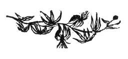

  
[Intangible Textual Heritage](../../index)  [Legends and
Sagas](../index)  [Index](index)  [Previous](rft12)  [Next](rft14) 

------------------------------------------------------------------------

[Buy this Book on
Kindle](https://www.amazon.com/exec/obidos/ASIN/B002IKKI4I/internetsacredte)

------------------------------------------------------------------------

  
*Roumanian Fairy Tales and Legends*, by E.B. Mawr, \[1881\], at
Intangible Textual Heritage

------------------------------------------------------------------------

p. 112

# THE GENTLE SHEPHERD.

ON the edge of a mountain, lovely as the entrance to paradise, see,
coming along, and descending toward the valley, three flocks of young
lambs, driven by three young shepherds; one is an inhabitant of the
plains of Moldau, the other is Hungarian, the third is from the Vrantcha
Mountain. The Hungarian and the Vranchian have held counsel together,
and have resolved that at sunset they will kill their companion, on
account of his riches, for he owns more horned sheep than they do, his
horses are better trained than theirs, and his dogs more vigorous. Yet,
for three days past, there is in his flock a fair young sheep, with
white silky wool, who will no longer eat the tender grass of the
prairie, and moans all day long.

"My poor little sheep, you who were so fat and well! how is it that for
three days you have done nothing but groan and moan? don't you like the
prairie grass, or are you ill, my dear little lamb?"

"Oh, my beloved shepherd, lead thy flock to that thicket, there will be
grass for us, and shade for thee; master, dear master! call near you
without

p. 113

delay, one of your best and strongest dogs, for the Hungarian and the
Vranchian have resolved to kill you at sunset!"

"Dear little sheep of the mountains, if thou art a prophetess, if it is
written that I am to die in the bosom of these pastures, thou wilt tell
the Hungarian and the Vranchian to bury me near this spot, not far from
this enclosure, so that I may always be near you, my beloved
lambs,--either here, or behind the shepherd's hut, so that I may always
hear the voice of my faithful dogs. Thou wilt tell them this, and thou
wilt place at the foot of nay grave a little flute of elm wood, with its
accents of love; another of bone, with its harmonious sounds; another of
reeds, with its passionate notes; and when the wind blows across their
pipes bringing out plaintive music, then my flock will assemble round my
tomb, and weep for me, tears of blood."

"Take care thou dost not tell them of my murder! tell them I have
married a beautiful Queen, that at the moment of our union, a star fell,
that the sun and moon together held the crown over my head, that I exist
no longer for them. But if ever thou meetest, if ever thou comest near,
a poor old mother, running across the fields, weeping and asking, 'who
amongst you have seen a young shepherd, with face

p. 114

as fair as milk, with moustache yellow as ripe corn, with waist so
slight that it would pass through a ring, with raven hair, and eyes like
mulberries?'--then my little sheep, take pity on her, and tell her that
I have married a daughter of the King who lives at the entrance of
paradise, but say nothing to her of the falling star!" Here ends the
fragment.

 

 

------------------------------------------------------------------------

[Next: Death of Constantin II. Brancovan](rft14)
