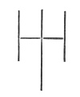
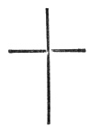
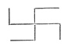

  
[Intangible Textual Heritage](../../../index.md) 
[Legends/Sagas](../../index)  [Roma](../index)  [Index](index.md) 
[Previous](egl02)  [Next](egl04.md) 

------------------------------------------------------------------------

[Buy this Book at
Amazon.com](https://www.amazon.com/exec/obidos/ASIN/1428056998/internetsacredte.md)

------------------------------------------------------------------------

*English Gipsies and Their Language*, by Charles G. Leland, \[1874\], at
Intangible Textual Heritage

------------------------------------------------------------------------

## CHAPTER II. A GIPSY COTTAGE.

The Old Fortune-Teller and her Brother.—The Patteran, or Gipsies’
Road-Mark .—The Christian Cross, named by Continental Gipsies Trushul,
after the Trident of Siva.—Curious English-Gipsy term for the
Cross.—Ashwood Fires on Christmas Day.—Our Saviour regarded with
affection by the Rommany because he was like themselves and
poor.—Strange ideas of the Bible.—The Oak.—Lizards renew their
lives.—Snails.—Slugs.—Tobacco Pipes as old as the world.

“Duveleste; Avo. Mandy’s kaired my patteran adusta chairuses where a
drum jals atut the waver,” which means in English—“God bless you, yes.
Many a time I have marked my sign where the roads cross.”

I was seated in the cottage of an old Gipsy mother, one of the most
noted fortune-tellers in England, when I heard this from her brother,
himself an ancient wanderer, who loves far better to hear the lark sing
than the mouse cheep when he wakes of a morning.

It was a very small but clean cottage, of the kind quite peculiar to the
English labourer, and therefore attractive to every one who has felt the
true spirit of the most original poetry and art which this country has
produced. For look high or low, dear reader, you will find that nothing
has ever been better done in England than the pictures of rural life,
and over nothing have its gifted minds cast a deeper charm.

There were the little rough porcelain figures of which the English
peasantry are so fond, and which, cheap as they are, indicate that the
taste of your friends Lady --- for Worcester “porcelain,” or the Duchess
of --- for Majolica, has its roots among far humbler folk. In fact there
were perhaps twenty things which no English reader would have supposed
were peculiar, yet which were something more than peculiar to me. The
master of the house was an Anglo-Saxon—a Gorgio—and his wife, by some
magic or other, the oracle before-mentioned.

And I, answering said—

“So you all call it *patteran*?”  [24](egl13.htm#xref_24.md)

“No; very few of us know that name. We do it without calling it
anything.”

Then I took my stick and marked on the floor the following sign—

 

“There,” I said, “is the oldest patteran—first of all—which the Gipsies
use to-day in foreign lands. In Germany, when one band of Gipsies goes
by a cross road, they draw that deep in the dust, with the end of the
longest line pointing in the direction in which they have gone. Then,
the next who come by see the mark, and, if they choose, follow it.”

“We make it differently,” said the Gipsy. “This is our sign—the *trin
bongo drums*, or cross.” And he drew his patteran thus—

 

“The long end points the way,” he added; “just as in your sign.”

“You call a cross,” I remarked, “*trin bongo drums*, or the three
crooked roads. Do you know any such word as *trúshul* for it?”

“No; *trushilo* is thirsty, and *trushni* means a faggot, and also a
basket.”

“I shouldn’t wonder if a faggot once got the old Rommany word for
cross,” I said, “because in it every stick is crossed by the wooden
*withy* which binds it; and in a basket, every wooden strip crosses the
other.”

I did not, however, think it worth while to explain to the Gipsies that
when their ancestors, centuries ago, left India, it was with the memory
that Shiva, the Destroyer, bore a trident, the tri-çûla in Sanscrit, the
*trisūl* of Mahadeva in Hindustani, and that in coming to Europe the
resemblance of its shape to that of the Cross impressed them, so that
they gave to the Christian symbol the name of the sacred triple spear.
 [26](egl13.htm#xref_26.md) For if you turn up a little the two arms of a
cross, you change the emblem of suffering and innocence at once into one
of murder—just as ever so little a deviation from goodness will lead
you, my dear boy, into any amount of devilry.

And that the unfailing lucid flash of humour may not be wanting, there
lightens on my mind the memory of *The Mysterious Pitchfork*—a German
satirical play which made a sensation in its time—and Herlossohn in his
romance of *Der Letzte Taborit* (which helped George Sand amazingly in
Consuelo), makes a Gipsy chieftain appear in a wonderfully puzzling
light by brandishing, in fierce midnight dignity, this agricultural
parody on Neptune’s weapon, which brings me nicely around to my Gipsies
again.

If I said nothing to the inmates of the cottage of all that the
*trushul* or cross trident suggested, still less did I vex their souls
with the mystic possible meaning of the antique *patteran* or sign which
I had drawn. For it has, I opine, a deep meaning, which as one who knew
Creuzer of old, I have a right to set forth. Briefly, then, and without
encumbering my book with masses of authority, let me state that in all
early lore, the *road* is a symbol of life; Christ himself having used
it in this sense. Cross roads were peculiarly meaning-full as indicating
the meet-of life with life, of good with evil, a faith of which abundant
traces are preserved in the fact that until the present generation
suicides were buried at them, and magical rites and diabolic
incantations are supposed to be most successful when practised in such
places. The English *path*, the Gipsy patteran, the Rommany-Hindu *pat*,
a foot, and the Hindu *panth*, a road, all meet in the Sanscrit *path*,
which was the original parting of the ways. Now the *patteran* which I
have drawn, like the Koua of the Chinese or the mystical *Swastika* of
the Buddhists, embraces the long line of life, or of the infinite and
the short, or broken lines of the finite, and, therefore, as an ancient
magical Eastern sign, would be most appropriately inscribed as a
*sikker-paskero dromescro*—or hand post—to show the wandering Rommany
how to proceed on their way of life.

 

That the ordinary Christian Cross should be called by the English
Gipsies a *trin bongo drum*—or the three cross roads—is not remarkable
when we consider that their only association with it is that of a
“wayshower,” as Germans would call it. To you, reader, it may be that it
points the way of eternal life; to the benighted Rommany-English-Hindoo,
it indicates nothing more than the same old weary track of daily travel;
of wayfare and warfare with the world, seeking food and too often
finding none; living for petty joys and driven by dire need; lying down
with poverty and rising with hunger, ignorant in his very wretchedness
of a thousand things which he *ought* to want, and not knowing enough to
miss them.

Just as the reader a thousand, or perhaps only a hundred, years
hence—should a copy of this work be then extant—may pity the writer of
these lines for his ignorance of the charming comforts, as yet unborn,
which will render *his* physical condition so delightful. To thee, oh,
future reader, I am what the Gipsy is to me! Wait, my dear boy of the
Future—wait—till *you* get to heaven!

Which is a long way off from the Gipsies. Let us return. We had spoken
*of patteran*, or of crosses by the way-side, and this led naturally
enough to speaking of Him who died on the Cross, and of wandering. And I
must confess that it was with great interest I learned that the Gipsies,
from a very singular and Rommany point of view, respect, and even pay
him, in common with the peasantry in some parts of England, a peculiar
honour. For this reason I bade the Gipsy carefully repeat his words, and
wrote them down accurately. I give them in the original, with a
translation. Let me first state that my informant was not quite clear in
his mind as to whether the Boro Divvus, or Great Day, was Christmas or
New Year’s, nor was he by any means certain on which Christ was born.
But he knew very well that when it came, the Gipsies took great pains to
burn an ash-wood fire.

“Āvali—adusta cheirus I’ve had to jāl dui or trin mees of a Boro Divvus
sig’ in the sāla, to lel ash-wood for the yāg. That was when I was a
bitti chavo, for my dádas always would keravit.

“An’ we kairs it because foki pens our Saviour, the tikno Duvel was born
apré the Boro Divvus, ’pré the puv, avree in the temm, like we Rommanis,
and he was brought ’pré pash an ash yāg—(*Why you can dick dovo adrée
the Scriptures*!).

“The ivy and holly an’ pine rukks never pookered a lav when our Saviour
was gaverin’ of his kokero, an’ so they tools their jivaben saw (sār)
the wen, and dicks selno saw the besh; but the ash, like the surrelo
rukk, pukkered atut him, where he was gaverin, so they have to hatch
mullo adrée the wen. And so we Rommany chāls always hatchers an ash yāg
saw the Boro Divvuses. For the tickno duvel was chivved à wadras ’pré
the puvius like a Rommany chal, and kistered apré a myla like a Rommany,
an’ jālled pāle the tem a māngin his moro like a Rom. An’ he was always
a pauveri choro mush, like we, till he was nashered by the Gorgios.

“An’ he kistered apré a myla? Āvali. Yeckorus he putchered the pash-grai
if he might kister her, but she pookered him *kek*. So because the
pash-grai wouldn’t rikker him, she was sovahalled againsus never to be a
dye or lel tiknos. So she never lelled kek, nor any cross either.

“Then he putchered the myla to rikker him, and she penned: ‘Āvali!’ so
he pet a cross apré lāki’s dumo. And to the divvus the myla has a trin
bongo drum and latchers tiknos, but the pash-grai has kek. So the mylas
’longs of the Rommanis.”

(TRANSLATION.)—“Yes—many a time I’ve had to go two or three miles of a
Great Day (Christmas), early in the morning, to get ash-wood for the
fire. That was when I was a small boy, for my father always would do it.

“And we do it because people say our Saviour, the small God, was born on
the Great Day, in the field, out in the country, like we Rommanis, and
he was brought up by an ash-fire.”

Here a sudden sensation of doubt or astonishment at my ignorance seemed
to occur to my informant, for he said,—

“Why, you can see that in the Scriptures!”

To which I answered, “But the Gipsies have Scripture stories different
from those of the Gorgios, and different ideas about religion. Go on
with your story. Why do you burn ash-wood?”

“The ivy, and holly, and pine trees, never told a word where our Saviour
was hiding himself, and so they keep alive all the winter, and look
green all the year. But the ash, like the oak (*lit*. strong tree), told
of him (*lit*. across, against him), where he was hiding, so they have
to remain dead through the winter. And so we Gipsies always burn an
ash-fire every Great Day. For the Saviour was born in the open field
like a Gipsy, and rode on an ass like one, and went round the land a
begging his bread like a Rom. And he was always a poor wretched man like
us, till he was destroyed by the Gentiles.

“And He rode on an ass? Yes. Once he asked the mule if he might ride
her, but she told him no. So because the mule would not carry him, she
was cursed never to be a mother or have children. So she never had any,
nor any cross either.

“Then he asked the ass to carry him, and she said ‘Yes;’ so he put a
cross upon her back. And to this day the ass has a cross and bears
young, but the mule has none. So the asses belong to (are peculiar to)
the Gipsies.”

There was a pause, when I remarked—

“That is a *fino gudlo*—a fine story; and all of it about an ash tree.
Can you tell me anything about the *súrrelo rukk*—the strong tree—the
oak?”

“Only what I’ve often heard our people say about its life.”

“And what is that?”

“Dui hundred besh a hatchin, dui hundred besh nasherin his chuckko, dui
hundred besh ’pré he mullers, and then he nashers sār his ratt and he’s
kekoomi kushto.”  [30](egl13.htm#xref_30.md)

“That is good, too. There are a great many men who would like to live as
long.”

“*Tacho*, true. But an old coat can hold out better than a man. If a man
gets a hole in him he dies, but his *chukko* (coat) can be *toofered*
and *sivved apré* (mended and sewed up) for ever. So, unless a man could
get a new life every year, as they say the *hepputs*, the little lizards
do, he needn’t hope to live like an oak.”

“Do the lizards get a new life every year?”

“*Āvali*. A *hepput* only lives one year, and then he begins life over
again.”

“Do snails live as long as lizards?”

“Not when I find ’em rya—if I am hungry. Snails are good eating.
 [32](egl13.htm#xref_32.md) You can find plenty on the hedges. When they’re
going about in the fields or (are found) under wood, they are not good
eating. The best are those which are kept, or live through (literally
*sleep*) the winter. Take ’em and wash ’em and throw ’em into the
kettle, with water and a little salt. The broth’s good for the yellow
jaundice.”

“So you call a snail”—

“A bawris,” said the old fortune-teller.

“Bawris! The Hungarian Gipsies call it a *bouro*. But in Germany the
Rommanis say stārgōli. I wonder why a snail should be a stārgōli.”

“I know,” cried the brother, eagerly. “When you put a snail on the fire
it cries out and squeaks just like a little child. Stārgōli means ‘four
cries.’”

I had my doubts as to the accuracy of this startling derivation, but
said nothing. The same Gipsy on a subsequent occasion, being asked what
he would call a *roan* horse in Rommany, replied promptly—

“A matchno grai”—a fish-horse.

“Why a matchno grai?”

“Because a fish has a roan (*i.e*., roe), hasn’t it? Leastways I can’t
come no nearer to it, if it ain’t that.”

But he did better when I was puzzling my brain, as the learned Pott and
Zippel had done before me, over the possible origin of churro or
tchurro, “a ball, or anything round,” when he suggested—

“Ryá—I should say that as a *churro* is round, and a *curro* or cup is
round, and they both sound alike and look alike, it must be all werry
much the same thing.”  [33](egl13.htm#xref_33.md)

“Can you tell me anything more about snails?” I asked, reverting to a
topic which, by the way, I have observed is like that of the hedgehog, a
favourite one with Gipsies.

“Yes; you can cure warts with the big black kind that have no shells.”

“You mean slugs. I never knew they were fit to cure anything.”

“Why, that’s one of the things that everybody knows. When you get a wart
on your hands, you go on to the road or into the field till you find a
slug, one of the large kind with no shell (literally, with no house upon
him), and stick it on the thorn of a blackthorn in a hedge, and as the
snail dies, one day after the other, for four or five days, the wart
will die away. Many a time I’ve told that to Gorgios, and Gorgios have
done it, and the warts have gone away (literally, cleaned away) from
their hands.”  [34](egl13.htm#xref_34.md)

Here the Gipsy began to inquire very politely if smoking were offensive
to me; and as I assured him that it was not, he took out his pipe. And
knowing by experience that nothing is more conducive to sociability, be
it among Chippeways or Gipsies, than that smoking which is among our
Indians, literally a burnt-offering,  [35](egl13.htm#xref_35.md) I produced
a small clay pipe of the time of Charles the Second, given to me by a
gentleman who has the amiable taste to collect such curiosities, and
give them to his friends under the express condition that they shall be
smoked, and not laid away as relics of the past. If you move in
*etching* circles, dear readers, you will at once know to whom I refer.

The quick eye of the Gipsy at once observed my pipe.

“That is a *crow-swägler*—a crow-pipe,” he remarked.

“Why a crow-pipe?”

“I don’t know. Some Gipsies call ’em *mullos’ swäglers*, or dead men’s
pipes, because those who made ’em were dead long ago. There are places
in England where you can find ’em by dozens in the fields. I never
dicked (saw) one with so long a stem to it as yours. And they’re old,
very old. What is it you call it before everything” (here he seemed
puzzled for a word) “when the world was a-making?”

“The Creation.”

“Āvali—that’s it, the Creation. Well, them crow-swäglers was kaired at
the same time; they’re hundreds—ávali—thousands of beshes (years) old.
And sometimes we call the beng (devil) a swägler, or we calls a swägler
the beng.”

“Why?”

“Because the devil lives in smoke.”

------------------------------------------------------------------------

[Next: Chapter III. The Gipsy Tinker](egl04.md)
