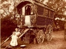

  
[Intangible Textual Heritage](../../../index) 
[Legends/Sagas](../../index)  [Roma](../index)  [Index](index) 
[Previous](gft091)  [Next](gft093) 

------------------------------------------------------------------------

[Buy this Book at
Amazon.com](https://www.amazon.com/exec/obidos/ASIN/B002BH3G88/internetsacredte)

------------------------------------------------------------------------

  
*Gypsy Folk Tales*, by Francis Hindes Groome, \[1899\], at Intangible
Textual Heritage

------------------------------------------------------------------------

### No. 32.--The Enchanted City

There was a poor lad, and he served seven years, and could not earn
anything. And he went into the world, and went into a city, and spent
the night there, and lay down under a wall, and slept. In that wall
there was a hole, and he awoke, and looked through the hole, and saw a
candle. And he crept through the hole, and went into a palace. There was
a great city, and there was an emperor in the city; and the emperor was
dead, and also the empress was dead. And the emperor had a daughter, and
she commanded the army. And that city was excommunicated, and the people
were turned into stone. So the lad went into the palace of the emperor,
and there in the palace all were turned into stone. And he marvelled
what this might be, that the men were like men, but yet were all turned
into stone.

A cat came, and set food on the table. He sat down to table, and ate. At
night came the cat, and brought him food, and brought. him cards, and
said to him, 'There will come a lord, and will say, "Play at cards," and
do you play; and he will spit on you, and do you bear it, but look at
the clock. When it strikes ten, then give him a slap.'

Then there came devils as many as the blades of grass; and they beat him
and tormented him till twelve o'clock; and the cocks crowed, and they
fled. He lay down in the bed and slept. In the morning the cat brought
him food,

p. 118

and he ate. At nightfall she again brought him food, said to him, 'He
will come again for you to play with him, and do you play till ten
o'clock, and give him a slap; and they will come to you as many as all
the blades of grass, and will beat you and torment you, and do you bear
it till twelve o'clock.'

The lord came to him. 'Hah! let us play cards.'

And they played till ten o'clock. He gave him, the devil, a slap. They
came as many as all the blades of grass, and they beat him and tormented
him till twelve o'clock, and they fled. He lay down in the bed and
slept. In the morning he heard the folks talking in the city. In the
morning the cat brought him food, and brought him royal clothes. He ate,
and put on the clothes, and went into twelve chambers. There was the
emperor's daughter in her bed. One half was alive, and she said, 'You
are my emperor, and I am your empress, but come no more to me.'

Again at night the cat brought him food, and said to him, He will come
again to-night to play cards till ten o'clock. At ten o'clock give him a
slap again, and they will come to you as many as all the blades of
grass, and they will beat you and torment you, but bear it.'

That lord came to him. 'Hah! let us play cards.'

And they played till ten o'clock. He gave him a slap, and they came as
many as all the blades of grass, and they beat him and tormented him,
and he bore it till twelve o'clock. At twelve o'clock they fled. He lay
down on the bed and slept. In the morning the band began to play, they
held a review. [1](#fn_87) 'For we have a new
emperor.' The ministers came to him, and raised him shoulder-high. 'We
have a new emperor.'

And he is in a hurry to go to his empress, and said, 'Stay here, I will
be back immediately.'

And he went to her. There she stood with her head to the roof, and a
vapour went forth from her mouth; and he opened the door, and she just
made a sign to him with her hand, and fell back on the bed, and became
stone up to the waist. And she called him to her. 'Leave me; I want you
not. Why did you not wait to come to me, till I should

p. 119

obtain remission of my sins? Take you my father's horse and his sword,
and take a purse; as much money as you want, it shall not fail.'

He set out, and journeyed, and departed into another kingdom. There two
emperors were fighting, because one would not give his daughter to the
other's son. 'Set yourself to battle with me, since you refuse your
daughter.' They fought seven years. So he [1](#fn_88) came into that city, and came to an inn,
to a certain Armenian. And there was a great famine; the soldiers were
dying of hunger. So he asked the Armenian, 'What's the news here?'

'No good. They have been waging a great war seven years here for a girl,
and the soldiers are dying of hunger.' And he said, 'Go and call them to
me.'

The soldiers came, and he bought bread and brandy, and they drank and
ate; and he said to the Armenian, 'I, if I choose, I will cut that army
to pieces.'

The Armenian went to the emperor. 'Emperor, a king's son is come, and
has boasted that he by himself will cut that army to pieces.'

'Call him to me.'

'What is this you've been boasting? will you cut that army to pieces?'

'I will.'

'If you do, I will give you my daughter, and give you one half of my
kingdom.'

And he, when he went to battle, waved to the right hand, and slew one
half of the army, and he waved to the left hand, and slew the other
half. And he came home, and the emperor gave him his daughter, and made
a marriage.

'Ask him what strength is his, that he slew so great an army.' [2](#fn_89)

And he said, 'My sword slays.'

And she sent back a letter, 'The sword alone slays; send me another
sword, and I will send this one to you.'

She sent him the sword, and he then said, 'Set yourself now to battle
with me.'

And he went in hope. But the emperor slew him, and

p. 120

cut him all in pieces, and put him in the saddle-bags, and placed him on
his horse, and said, 'Whence thou didst bear him living, bear him
dead.' [1](#fn_90)

The horse carried him home, thither to that lady who was of stone. She
cried, 'Bring him to me.' She laid him on a table, and put him all
together; and she sprinkled him with dead water, and he became whole;
and she sprinkled him with living water, and he arose. [2](#fn_91)

Go back; take you this purse, you have but to wish and you will find it
full of money. And go to that Armenian, and give him whatever he wants,
and tell him you will turn yourself into a horse. Take a hair from my
tail, [3](#fn_92) and bind it round you like a
girdle, and fling a somersault.' [4](#fn_93)

So he turned himself into a horse; and the Armenian took him, and led
him into the city. The emperor bought him, and mounted him. He dashed
him to the earth, and he died. The horse took the sword in his mouth,
and went to the Armenian. The Armenian' loosened the hair, and he became
a man again. He made the Armenian king; and he departed home to his
mistress, the first one, and wedded her. And he became emperor.

A mere ruin of a folk-tale, but what a fine ruin.
The cat reminds one of Grimm's No. 106, 'The Poor Miller's Boy and the
Cat' (ii. 78, 406), where the cat takes the hero into an enchanted
castle, and gives him to eat and to drink. But Grimm's No. 92, 'The King
of the Golden Mountain' (ii. 28, 390), comes much closer to our Gypsy
story. There the hero has three nights running to let himself be
tortured in a bewitched castle by twelve black men till twelve o'clock,
so to set free an enchanted maiden. Grimm's No. 121, 'The King's Son who
feared Nothing' (ii. 134, 419), should also be compared, and our
Welsh-Gypsy story, 'Ashypelt' ([No. 57](gft117.htm#an_57)). The latter
half of 'The Enchanted City' is identical with Krauss's No. 47 (i. 224),
a Slovenian story. For the magic sword *cf*. *infra*, [p.
160](gft105.htm#page_160); Clouston's notes to *Lane's Continuation of
Chaucer's* '*Squire's Tale*' (Chaucer Soc. 1888, pp. 372-381);
Wratislaw's Polish story, 'The Spirit of a buried Man,' No. 18, p. 122;
and F. A. Steel's *Wide-awake Stories*, p. 62. Playing cards with the
devil or a monster occurs also in our [No. 63](gft123.htm#an_63) ([p.
256](gft122.htm#page_256)), and in folk-tales from Russia, Germany,
French Flanders, Lorraine, and Brittany (*cf*. Ralston, p. 375; Grimm,
No. 4, i. 16, 346; and Cosquin, i. 28; ii. 254, 259, 260).

------------------------------------------------------------------------

### Footnotes

[118:1](gft092.htm#fr_87) It should be
remembered that Austro-Hungarian Gypsies have all to serve in the army.

[119:1](gft092.htm#fr_88) The text runs, 'So he,
the king's son,' etc., but this makes nonsense.

[119:2](gft092.htm#fr_89) This inquiry as to the
secret of the hero's strength should by rights be made, not by the
emperor, but by a former lover.

[120:1](gft092.htm#fr_90) *Cf. supra*, pp.
[28](gft068.htm#page_28), [33](gft069.htm#page_33),
[35](gft069.htm#page_35).

[120:2](gft092.htm#fr_91) *Cf. supra*, pp.
[28](gft068.htm#page_28), [33](gft069.htm#page_33).

[120:3](gft092.htm#fr_92) This suggests that the
cat and the princess really were one. *Cf*. footnote on [No.
46](gft106.htm#an_46).

[120:4](gft092.htm#fr_93) *Cf*. footnote
[2](gft065.htm#fn_43), [p. 16](gft065.htm#page_16).

------------------------------------------------------------------------

[Next: No. 33.--The Jealous Husband](gft093)
