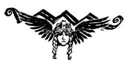
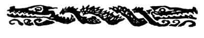

[Intangible Textual Heritage](../../index.md)  [Legends and
Sagas](../index)  [Index](index)  [Previous](ron01)  [Next](ron03.md) 

------------------------------------------------------------------------

p. vii

 

# SIEGFRIED

 

### CHARACTERS

SIEGFRIED

MIME

THE WANDERER

ALBERICH

FAFNER

ERDA

BRÜNNHILDE

### SCENES OF ACTION

ACT I. A CAVE IN A WOOD

ACT II. DEPTHS OF THE WOOD

ACT III. WILD REGION AT THE FOOT OF A ROCKY MOUNTAIN

AFTERWARDS: SUMMIT OF "BRÜNNHILDE'S ROCK"

 

------------------------------------------------------------------------

[Next: The First Act](ron03.md)
