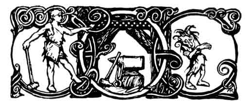
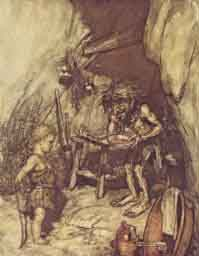
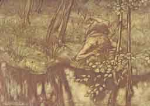
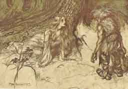
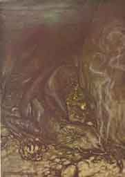
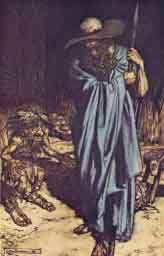
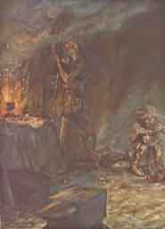
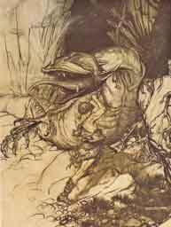

[Intangible Textual Heritage](../../index.md)  [Legends and
Sagas](../index)  [Index](index)  [Previous](ron02)  [Next](ron04.md) 

------------------------------------------------------------------------

p. 3

 

# THE FIRST ACT

\[*A rocky cavern in a wood, in which stands a naturally formed smith's
forge, with big bellows. Mime sits in front of the anvil, busily
hammering at a sword*.\]

Mime

\[*Who has been hammering with a small hammer, stops working.*\]

Slavery! worry!  
Labour all lost!  
The strongest sword  
That ever I forged,  
That the hands of giants  
Fitly might wield,  
This insolent urchin  
For whom it is fashioned  
Can snap in two at one stroke,  
As if the thing were a toy!

\[*Mime throws the sword on the anvil ill-humouredly, and with his arms
akimbo gazes thoughtfully on the ground*.\]

There is one sword  
That he could not shatter  
Nothung's splinters  
Would baffle his strength,  
Could I but forge  
Those doughty fragments  
That all my skill  
Cannot weld anew.  
Could I but forge the weapon,  
Shame and toil would win their reward!

\[*He sinks further back, his head bowed in thought*.\]

p. 4

Fafner, the dragon grim,  
Dwells in the gloomy wood;  
With his gruesome and grisly bulk  
The Nibelung hoard  
Yonder he guards.  
Siegfried, lusty and young,  
Would slay him without ado;  
The Nibelung's ring  
Would then become mine.  
The only sword for the deed  
Were Nothung, if it were swung  
By Siegfried's conquering arm  
And I cannot fashion  
Nothung, the sword!

\[*He lays the sword in position again, and goes on hammering in deep
dejection*.\]

Slavery! worry!  
Labour all lost!  
The strongest sword  
That ever I forged  
Will never serve  
For that difficult deed.  
I beat and I hammer  
Only to humour the boy;  
He snaps in two what I make,  
And scolds if I cease from work.

\[*He drops his hammer*.\]

Siegfried

\[*In rough forester's dress, with a silver horn hung by a chain, bursts
in boisterously from the wood. He is leading a big bear by a rope of
bast, and urges him towards Mime in wanton fun*.\]

Hoiho! Hoiho!

\[*Entering*.\]

Come on Come on!  
Tear him! Tear him!  
The silly smith!

\[Mime drops the sword in terror, and takes refuge behind the forge;
while Siegfried, shouting with laughter, keeps driving the bear after
him.\]

 [  
Click to enlarge](img/00400.jpg.md)

Mime at the anvil

 

p. 5

Mime

Hence with the beast!  
I want not the bear!

Siegfried

I come thus paired  
The better to pinch thee  
Bruin, ask for the sword!

Mime

Hey! Let him go!  
There lies the weapon;  
It was finished to-day.

Siegfried

Then thou art safe for to-day!

\[*He lets the bear loose and strikes him on the back with the rope*.\]

Off, Bruin!  
I need thee no more.

\[*The bear runs back into the wood*.\]

Mime

\[*Comes trembling from behind the forge*.\]

Slay all the bears  
Thou canst, and welcome  
But why thus bring the beasts  
Home alive?

Siegfried

\[*Sits down to recover from his laughter*.\]

For better companions seeking  
Than the one who sits at home,  
I blew my horn in the wood,  
Till the forest glades resounded.  
What I asked with the note  
Was if some good friend  
My glad companion would be.  
From the covert came a bear  
Who listened to me with growls,  
And I liked him better than thee,  
Though better friends I shall find.  
With a trusty rope  
I bridled the beast,  
To ask thee, rogue, for the weapon.

\[*He jumps up and goes towards the anvil*.\]

p. 6

Mime

\[*Takes up the sword to hand it to Siegfried*.\]

I made the sword keen-edged;  
In its sharpness thou wilt rejoice.

\[*He holds the sword anxiously in his hand; Siegfried snatches it from
him*.\]

Siegfried

What matters an edge keen sharpened,  
Unless hard and true the steel?

\[*Testing the sword*.\]

Hei! What an idle,  
Foolish toy!  
Wouldst have this pin  
Pass for a sword?

\[*He strikes it on the anvil, so that the splinters fly about. Mime
shrinks back in terror*.\]

There, take back the pieces,  
Pitiful bungler!  
'Tis on thy skull  
It should have been broken!  
Shall such a braggart  
Still go on boasting,  
Telling of giants  
And prowess in battle,  
Of deeds of valour,  
And dauntless defence?--  
A sword true and trusty  
Try to forge me,  
Praising the skill  
He does not possess?  
When I take hold  
Of what he has hammered,  
The rubbish crumbles  
At a mere touch!  
Were not the wretch  
Too mean for my wrath,  
I would break him in bits  
As well as his work--

 [  
Click to enlarge](img/00600.jpg.md)

Mime and the infant Siegfried  
See [p. 8](#page_8.md)

 

p. 7

The doting fool of a gnome!  
And end the annoyance at once!

\[*Siegfried throws himself on to a stone seat in a rage. Mime all the
time has been cautiously keeping out of his way*.\]

Mime

Again thou ravest like mad,  
Ungrateful and perverse.  
If what for him I forge  
Is not perfect on the spot,  
Too soon the boy forgets  
The good things I have made!  
Wilt never learn the lesson  
Of gratitude, I wonder?  
Thou shouldst be glad to obey him  
Who always treated thee well.

\[*Siegfried turns his back on Mime in a bad temper, and sits with his
face to the wall*.\]

Thou dost not like to be told that!

\[*He stands perplexed, then goes to the hearth in the kitchen*.\]

But thou wouldst fain be fed.  
Wilt eat the meat I have roasted,  
Or wouldst thou prefer the broth?  
'Twas boiled solely for thee.

\[*He brings food to Siegfried, who, without turning round, knocks both
bowl and meat out of his hand*.\]

Siegfried

Meat I roast for myself  
Sup thy filthy broth alone!

Mime

\[*In a wailing voice, as if hurt*.\]

This is the reward  
Of all my love!  
All my care  
Is paid for with scorn.

p. 8

When thou wert a babe  
I was thy nurse,  
Made the mite clothing  
To keep him warm,  
Brought thee thy food,  
Gave thee to drink,  
Kept thee as safe  
As I keep my skin  
And when thou wert grown  
I waited on thee,  
And made a bed  
For thy slumber soft.  
I fashioned thee toys  
And a sounding horn,  
Grudging no pains,  
Wert thou but pleased.  
With counsel wise  
I guided thee well,  
With mellow wisdom  
Training thy mind.  
Sitting at home,  
I toil and moil;  
To heart's desire  
Wander thy feet.  
Through thee alone worried,  
And working for thee,  
I wear myself out,  
A poor old dwarf!

\[*Sobbing*.\]

And for my trouble  
The sole reward is  
By a hot-tempered boy

\[*Sobbing*.\]

To be hated and plagued!

 [  
Click to enlarge](img/00800.jpg.md)

"And there I learned  
What love was like"  
         See [p. 11](#page_11.md)

p. 9

Siegfried

\[*Has turned round again and has quietly watched Mime's face, while the
latter, meeting the look tries timidly to hide his own*.\]

Thou hast taught me much, Mime,  
And many things I have learned;  
But what thou most gladly hadst taught me  
A lesson too hard has proved--  
How to endure thy sight.  
When with my food  
Or drink thou dost come,  
I sup off loathing alone;  
When thou dost softly  
Make me a bed,  
My sleep is broken and bad;  
When thou wouldst teach me  
How to be wise,  
Fain were I deaf and dumb.  
If my eyes happen,  
To fall on thee,  
I find all thou doest  
Amiss and ill-done;  
When thou dost stand,  
Waddle and walk,  
Shamble and shuffle,  
With thine eyelids blinking,  
By the neck I want  
To take the nodder,  
And choke the life  
From the hateful twitcher.  
So much, O Mime, I love thee!  
Hast thou such wisdom,  
Explain, I pray thee,  
A thing I have wondered at  
Though I go roaming  
just to avoid thee,  
Why do I always return?  
Though I love the beasts  
All better than thee--

p. 10

Tree and bird  
And the fish in the brook,  
One and all  
They are dearer than thou--  
How is it I always return?  
Of thy wisdom tell me that.

Mime

\[*Tries to approach him affectionately*.\]

My child, that ought to show thee  
That Mime is dear to thy heart.

Siegfried

I said I could not bear thee  
Forget not that so soon.

Mime

\[*Recoils, and sits down again apart, opposite Siegfried*.\]

The wildness that thou shouldst tame  
Is the cause, bad boy, of that.  
Young ones are always longing  
After their parents' nest;  
What we love we all long for,  
And so thou dost yearn for me  
'Tis plain thou lovest thy Mime,  
And always must love him.  
What the old bird is to the young one,  
Feeding it in its nest  
Ere the fledgling can flutter,  
That is what careful, clever Mime  
To thy young life is,  
And always must be.

Siegfried

Well, Mime, being so clever,  
This one thing more also tell me

\[*Simply*.\]

The birds sang together  
So gaily in spring,

\[*Tenderly*.\]

The one alluring the other  
And thou didst say,  
When I asked thee why,  
That they were wives with their husbands.

 [  
Click to enlarge](img/01000.jpg.md)

Siegfried sees himself in the stream  
                        See [p. 12](#page_12.md)

p. 11

They chattered so sweetly,  
Were never apart;  
They builded a nest  
In which they might brood;  
The fluttering young ones  
Came flying out,  
And both took care of the young.  
The roes in the woods, too,  
Rested in pairs,  
The wild wolves even, and foxes.  
Food was found and brought  
By the father,  
The mother suckled the young ones.  
And there I learned  
What love was like;  
A whelp from its mother  
I never took.  
But where hast thou, Mime,  
A wife dear and loving,  
That I may call her mother?

Mime

\[*Angrily*.\]

What dost thou mean?  
Fool, thou art mad!  
Art thou then a bird or a fox?

Siegfried

When I was a babe  
Thou wert my nurse,  
Made the mite clothing  
To keep him warm;  
But tell me, whence  
Did the tiny mite come?  
Could babe without mother  
Be born to thee?

Mime

\[*Greatly embarrassed*.\]

Thou must always  
Trust what I tell thee.  
I am thy father  
And mother in one.

p. 12

Siegfried

Thou liest, filthy old fright!  
The resemblance 'twixt child and parent  
I often have seen for myself.  
I came to the limpid brook,  
And the beasts and the trees  
I saw reflected;  
Sun and clouds too,  
just as they are,  
Were mirrored quite plain in the stream.  
I also could spy  
This face of mine,  
And quite unlike thine  
Seemed it to me;  
As little alike  
As a fish to a toad:  
And when had fish toad for its father?

Mime

\[*Very angrily*.\]

How canst thou talk  
Such terrible stuff?

Siegfried

\[*With increasing animation*.\]

Listen! At last  
I understand  
What in vain I pondered so long:  
Why I roam the woods  
And run to escape thee,  
Yet return home in the end.

\[*He springs up*.\]

I cannot go till thou tell me  
What father and mother were mine.

Mime

What father? What mother?  
Meaningless questions!

Siegfried

\[*Springs upon Mime, and seizes him by the throat*.\]

To answer a question  
Thou must be caught first;  
Willingly  
Thou never wilt speak;

 [  
Click to enlarge](img/01200.jpg.md)

Mime finds the mother of Siegfried in the forest  
                                      See [p. 13](#page_13.md)

p. 13

Thou givest nothing  
Unless forced to.  
How to talk  
I hardly had learned  
Had it not by force  
Been wrung from the wretch.  
Come, out with it,  
Mangy old scamp!  
Who are my father and mother?

Mime

\[*After making signs with his head and hands, is released by
Siegfried*.\]

Dost want to kill me outright!  
Hands off, and the facts thou shalt bear,  
As far as known to myself.  
O ungrateful  
And graceless child,  
Now learn the cause of thy hatred!  
Neither thy father  
Nor kinsman I,  
And yet thou dost owe me thy life!  
To me, thy one friend,  
A stranger wert thou;  
It was pity alone  
Sheltered thee here;  
And this is all my reward.  
And I hoped for thanks like a fool!

A woman once I found  
Who wept in the forest wild;  
I helped her here to the cave,  
That by the fire I might warm her.  
The woman bore a child here;  
Sadly she gave it birth.  
She writhed about in pain;  
I helped her as I could.  
Bitter her plight; she died.  
But Siegfried lived and throve.

p. 14

Siegfried

\[*Slowly*.\]

My poor mother died, then, through me?

Mime

To my care she commended thee;  
'Twas willingly bestowed.  
The trouble Mime would take!  
The worry kind Mime endured!  
"When thou wert a babe  
I was thy nurse " . . .

Siegfried

That story I often have heard.  
Now say, whence came the name  
Siegfried?

Mime

'Twas thus that thy mother  
Told me to name thee,  
That thou mightst grow  
To be strong and fair.  
"I made the mite clothing  
To keep it warm " . . .

Siegfried

Now tell me, what name was my mother's?

Mime

In truth I hardly know.  
"Brought thee thy food,  
Gave thee to drink " . . .

Siegfried

My mother's name thou must tell me.

Mime

Her name I forget. Yet wait!  
Sieglinde, that was the name borne  
By her who gave thee to me.  
"I kept thee as safe  
As I keep my skin" . . .

Siegfried

\[*With increasing urgency*.\]

Next tell me, who was my father?

Mime

\[*Roughly*.\]

Him I have never seen.

p. 15

Siegfried

But my mother told it thee, surely.

Mime

He fell in combat  
Was all that she said.  
She left the fatherless  
Babe to my care.  
"And when thou wert grown  
I waited on thee,  
And made a bed  
For thy slumber soft" . . .

Siegfried

Still, with thy tiresome  
Starling song!  
That I may trust thy story,  
Convinced thou art not lying,  
Thou must produce some proof.

Mime

But what proof will convince thee?

Siegfried

I trust thee not with my ears,  
I trust thee but with mine eyes:  
What witness speaks for thee?

Mime

\[*After some thought takes from the place where they are concealed the
two, pieces of a broken sword*.\]

I got this from thy mother:  
For trouble, food, and service  
This was my sole reward.  
Behold, 'tis a splintered sword!  
She said 'twas borne by thy father  
In the fatal fight when he fell.

Siegfried

\[*Enthusiastically*.\]

And thou shalt forge  
These fragments together,  
And furnish my rightful sword!  
Up! Tarry not, Mime;  
Quick to thy task!  
If thou hast skill,  
Thy cunning display.

p. 16

Cheat me no more  
With worthless trash  
These fragments alone  
Henceforth I trust.  
Lounge o'er thy work,  
Weld it not true,  
Trickily patching  
The goodly steel,  
And thou shalt learn on thy limbs  
How metal best should be beat!  
I swear that this day  
The sword shall be mine  
My weapon to-day I shall win!

Mime

\[*Alarmed*.\]

What wouldst thou to-day with the sword?

Siegfried

Leave the forest  
For the wide world,  
Never more to return.  
Ah, how fair  
A thing is freedom  
Nothing holds me or binds!  
No father have I here,  
And afar shall be my home  
Thy hearth is not my house,  
Nor my covering thy roof.  
Like the fish  
Glad in the water,  
Like the finch  
Free in the heavens,  
Off I will float,  
Forth I will fly,  
Like the wind o'er the wood  
Wafted away,  
Thee, Mime, beholding no more!

\[*He runs into the forest*.\]

p. 17

Mime

\[*Greatly Alarmed*.\]

Stop, boy! Stop, boy!  
Whither away?  
Hey! Siegfried!  
Siegfried! Hey!

\[*He looks after the retreating figure for some time in astonishment;
then he goes back to the smithy and sits down behind the anvil*.\]

He storms away!  
And I sit here:  
To crown my cares  
Comes still this new one;  
My plight is piteous indeed!  
How help myself now?  
How hold the boy here?  
How lead the young madcap  
To Fafner's lair?  
And how weld the splinters  
Of obstinate steel?  
In no furnace fire  
Can they be melted,  
Nor can Mime's hammer  
Cope with their hardness.

\[*Shrilly*.\]

The Nibelung's hate,  
Need and sweat  
Cannot make Nothung whole,  
Never will weld it anew.

\[*Sobbing, he sinks in despair on to a stool behind the anvil*.\]

Wanderer (Wotan)

\[*Enters from the wood by the door at the back of the cave. He wears
along dark blue cloak, and, for staff, carries a spear. On his head is a
round, broad-brimmed slouched hat*.\]

All hail, cunning smith!  
A seat by thy hearth  
Kindly grant  
The wayworn guest.

p. 18

Mime

\[*Starting up in alarm*.\]

Who seeks for me here  
In desolate woods,  
Finds my home in the forest wild?

Wanderer

\[*Approaching very slowly step by step*.\]

Wanderer names me the world, smith.  
From far I have come;  
On the earth's back ranging,  
Much I have roamed.

Mime

If Wanderer named,  
Pray wander from here  
Without halting for rest.

Wanderer

Good men grudge me not welcome;  
Many gifts I have received.  
By bad hearts only  
Is evil feared.

Mime

Ill fate always  
Dwelt by my side;  
Thou wouldst not add to it, surely!

Wanderer

\[*Slowly coming nearer and nearer*.\]

Always searching,  
Much have I seen;  
Things of weight  
Have told to many;  
Oft have rid men  
Of their troubles,  
Gnawing and carking cares.

Mime

Though thou hast searched,  
And though much thou hast found,  
I need neither seeker nor finder.  
Lonely am I,  
And lone would be;  
Idlers I harbour not here.

p. 19

Wanderer

\[*Again coming a little nearer*.\]

There were many  
Thought they were wise,  
Yet what they needed  
Knew not at all;  
Useful lore was  
Theirs for the asking,  
Wisdom was their reward.

Mime

\[*More and more anxious as he sees the Wanderer approach*.\]

Idle knowledge  
Some may covet;  
I know enough for my needs.

\[*The Wanderer reaches the hearth*.\]

My own wits suffice,  
I want no more,  
So, wise one, keep on thy way.

Wanderer

\[*Sitting down at the hearth*.\]

Nay, here at thy hearth  
I vow by my head  
To answer all thou shalt ask.  
My head is thine,  
'Tis forfeit to thee,  
Unless I can give  
Answers good,  
Deftly redeeming the pledge.

Mime

\[*Who has been staring at the Wanderer open mouthed, now shrinks back;
aside, dejectedly*.\]

Now how to get rid of the spy?  
The questions asked must be artful.

\[*He summons up courage for an assumption of sternness; aloud*.\]

Thy head for thy  
Lodging pays:  
'Tis pawned; now seek to redeem it.  
Three the questions  
Thou shalt be asked.

Wanderer

Thrice then I must answer.

p. 20

Mime

\[*Pulls himself together and reflects*.\]

Since, far on the back  
Of the wide earth roving,  
Thy feet have ranged o'er the world,  
Come, answer me this:  
Tell me what race  
Dwells in the earth's deep gorges.

Wanderer

In the depths of earth  
The Nibelungs have their home;  
Nibelheim is their land.  
Black elves they all are;  
Black Alberich  
Once was their ruler and lord.  
He subdued the busy  
Folk by a ring  
Gifted with magical might;  
And they piled up  
Shimmering gold,  
Precious, fine-wrought,  
To win him the world and its glory.

Proceed with thy questions, dwarf.

Mime

\[*Sinks into deeper and deeper meditation*.\]

Thou knowest much,  
Wanderer,  
Of the hidden depths of earth.  
Now, answer me this:  
Tell me what race  
Breathes on earth's back and moves there.

Wanderer

On the earth's broad back  
The race of the giants arose;  
Riesenheim is their land.  
Fasolt and Fafner,  
The rude folk's rulers,  
Envied the Nibelung's might.

p. 21

So his wonderful hoard  
They won for themselves,  
And with it gained the ring too.  
The brothers quarrelled  
About the ring,  
And slain was Fasolt.  
In dragon's form  
Fafner now watches the hoard.

One question threatens me still.

Mime

\[*Quite lost in thought*.\]

Much, Wanderer,  
Thou dost know  
Of the earth's back rude and rugged.  
Now answer aright:  
Tell me what race  
Dwells above in the clouds.

Wanderer

Above in the clouds  
Dwell the Immortals;  
Walhall is their home.  
They are light-spirits;  
Light-Alberich,  
Wotan, rules as their lord.  
From the world-ash-tree's  
Holiest bough once  
Wotan made him a shaft.  
Though the stem rot,  
The spear shall endure,  
And with that spear-point  
Wotan rules the world.  
Trustworthy runes  
Of holy treaties  
Deep in the shaft he cut.  
Who wields the spear  
Carried by Wotan

p. 22

The haft of the world  
Holds in his hand.  
Before him kneels  
The Nibelung host;  
The giants, tamed,  
Bow to his will.  
All must obey, and for ever,  
The spear's eternal lord.

\[*He strikes the ground with the spear as by accident, and a low growl
of thunder is heard, by which Mime is violently alarmed*.\]

Confess now, cunning dwarf,  
Are not my answers right,  
And is not my head redeemed?

Mime

\[*After attentively watching the Wanderer with the spear, becomes very
frightened, seeks in a confused manner for his tools, and looks timidly
aside*.\]

Both thou hast won,  
Wager and head;  
Thy way now, Wanderer, go.

Wanderer

Knowledge useful to thee  
Thou wert to ask for;  
Forfeit my head if I failed.  
Forfeit be thine,  
Knowest thou not  
The thing it would serve thee to know.  
Greeting thou  
Gavest me not;  
My head into thy hand  
I gave  
That I might rest by thy hearth.  
By wager fair  
Forfeit thy head,  
Canst thou not answer  
Three things when asked  
So sharpen well, Mime, thy wits!

p. 23

Mime

\[*Very much frightened, and after much hesitation, at last composes
himself with timid submission*.\]

Long it is  
Since I left my land;  
Long it seems to me  
Since I was born.  
I saw here the eye of Wotan  
Shine, peering into my cave;  
His glance dazes  
My mother-wit.  
But well were it now to be wise.  
Come then, Wanderer, ask.  
Perhaps fortune will favour  
The dwarf, and redeem his head.

Wanderer

\[*Comfortably sitting down again*.\]

Then first, honest dwarf,  
Answer this question:  
Tell the name of the race  
That Wotan treats most harshly,

\[*Very softly, but audibly*.\]

And yet loves beyond all the rest.

Mime

\[*With more cheerfulness*.\]

Though unlearnèd  
In heroes' kinship,  
This question I answer with ease.  
The Wälsungs are Wotan's  
Chosen stock,  
By him begotten  
And loved with passion,  
Though they are shown no grace.  
Siegmund and Sieglinde  
Born were to Wälse,  
A wild and desperate  
Twin-born pair;  
Siegfried had they as son,  
The strongest shoot from the tree.  
My head, say, is it  
Still, Wanderer, mine?

p. 24

Wanderer

\[*Pleasantly*.\]

How well thou knowest  
And namest the race!  
Rogue, I see thou art clever.  
The foremost question  
Thou hast solved;  
The second answer me, dwarf.  
A crafty Niblung  
Shelters Siegfried,  
Hoping he will slay Fafner,  
That the dwarf may be lord of the hoard,  
The ring being his.  
Say, what sword,  
If Fafner to fall is,  
Must be by Siegfried swung?

Mime

\[*Forgetting his present situation more and more, rubs his hands
joyfully*.\]

Nothung is  
The name of the sword;  
Into an ash-tree's stem  
Wotan struck it;  
One only might bear it:  
He who could draw it forth.  
The strongest heroes  
Tried it and failed;  
Only by Siegmund  
Was it done;  
Well he fought with the sword  
Till on Wotan's spear it was split.  
By a crafty smith  
Are the fragments kept,  
For he knows that alone  
With the Wotan sword  
A brave and foolish boy,  
Siegfried, can slay the foe.

\[*Much pleased*.\]

A second time  
My head have I saved?

p. 25

Wanderer

\[*Laughing*.\]

The wisest of wise ones  
Thou must be, surely;  
Who else could so clever be!  
But wouldst thou by craft  
Employ the boy-hero  
As instrument of thy purpose,  
With one question more  
I threaten thee.  
Tell me, thou artful  
Armourer,  
Whose skill from the doughty splinters  
Nothung the sword shall fashion.

Mime

\[*Starts up in great terror*.\]

The splinters! The sword!  
Alas! my head reels!  
What shall I do?  
What can I say?  
Accursèd sword!  
I was mad to steal it!  
A perilous pass  
It has brought me to.  
Always too hard  
To yield to my hammer!  
Rivet, solder--  
Useless are both.

\[*He throws his tools about as if he had gone crazy, and breaks out in
utter despair*.\]

The cleverest smith  
Living has failed;  
And, that being so,  
Who shall succeed?  
How rede aright such a riddle?

Wanderer

\[*Has risen quietly from the hearth*.\]

Three things thou wert to ask me;  
Thrice was I to reply.  
Thy questions were  
Of far-off things,

p. 26

But what stood here at thy hand--  
Needed much--that was forgot  
Now that I guess it,  
Thou goest crazed,  
And won by me  
Is the cunning one's head.  
Now, Fafner's dauntless subduer,  
Hear, thou death-doomed dwarf.  
By him who knows not  
How to fear  
Nothung shall be forged.

\[*Mime stares at him; he turns to go*.\]

So ward thy head  
Well from to-day.  
I leave it forfeit to him  
Who has never learned to fear.

\[*He turns away smiling, and disappears quickly in the wood. Mime has
sunk on to the bench overwhelmed*.\]

Mime

\[*Stares before him into the sunlit wood, and begins to tremble more
and more violently*.\]

Accursèd light!  
The air is on fire!  
What flickers and flashes?  
What buzzes and whirs?  
What sways there and swings  
And circles about?  
What glitters and gleams  
In the sun's hot glow?  
What rustles and hums  
And rings so loud?  
With roll and roar  
It crashes this way!  
It bursts through the wood,  
Making for me!

\[*He rises up in terror*.\]

Its jaws are wide open,

p. 27

Eager for prey;  
The dragon will catch me!  
Fafner! Fafner!

\[*He sinks shrieking behind the anvil*.\]

Siegfried

\[*Behind the scenes, is heard breaking from the thicket*.\]

Ho there! Thou idler!  
Is the work finished?

\[*He enters the cave*.\]

Quick, come show me the sword.

\[*He pauses in surprise*.\]

Where hides the smith?  
Has he made off?  
Hey, there! Mime, thou coward!  
Where art thou? Where hidest thou?

Mime

\[*In a small voice, from behind the anvil*.\]

'Tis thou then, child?  
Art thou alone?

Siegfried

\[*Laughing*.\]

Under the anvil?  
Why, what doest thou there?  
Wert thou grinding the sword?

Mime

\[*Comes forward, greatly upset and confused*.\]

The sword? The sword?  
How could I weld it?

\[*Half aside*.\]

By him who knows not  
How to fear  
Nothung shall be forged.  
Too wise am I  
To attempt such work.

Siegfried

\[*Violently*.\]

Wilt thou speak plainly  
Or must I help thee?

p. 28

Mime

\[*As before*.\]

Where shall I turn in my need?  
My wily head  
Wagered and lost is,

\[*Staring before him*.\]

And forfeit to him it will fall  
Who has never learned to fear.

Siegfried

\[*Vehemently*.\]

Dost thou by shuffling  
Seek to escape?

Mime

\[*Gradually recovering himself*.\]

Small need to fly  
Him who knows fear!  
But that lesson was one never taught thee.  
A fool, I forgot  
The one great thing;  
What thou wert taught  
Was to love me,  
And alas I the task proved hard.  
Now how shall I teach thee to fear?

Siegfried

\[*Seizes him*.\]

Hey! Must I help thee?  
What work hast thou done?

Mime

Concerned for thy good,  
In thought I was sitting:  
Something of weight I would teach thee.

Siegfried

\[*Laughing*.\]

'Twas under the seat  
That thou wert sitting;  
What weighty thing foundest thou there?

Mime

\[*Recovering himself more and more*.\]

Down there I learned how to fear,  
That I might teach thee, dullard.

Siegfried

\[*With quiet wonder*.\]

This fear then, what is it?

Mime

Thou knowest not that,  
Yet wouldst from the forest  
Forth to the world?

 [  
Click to enlarge](img/02800.jpg.md)

"In dragon's form  
Fafner now watches the hoard"  
                  See [p. 21](#page_21.md)

p. 29

What help in the trustiest sword,  
Hadst thou not learned to fear?

Siegfried

\[*Impatiently*.\]

What absurd  
Invention is this?

Mime

\[*Approaching Siegfried with more and more confidence*.\]

'Tis thy mother's wish  
Speaking through me.  
I must fulfil  
The promise I gave her:  
That the world and its wiles  
Thou shouldst not encounter  
Until thou hadst learned how to fear.

Siegfried

\[*Vehemently*.\]

Is it an art?  
Why was I not taught?  
Explain: this fearing, what is it?

Mime

In the dark wood  
Hast thou not felt,  
When shades of dusk  
Fall dim and drear,  
When mournful whispers  
Sigh afar,  
And fierce growling  
Sounds at hand,  
When strange flashes  
Dart and flicker,  
And the buzzing  
And clamour grow--

\[*Trembling*.\]

Hast thou not felt grim horror--  
Hold every sense in its clutches?--

\[*Quaking*.\]

When the limbs shiver,  
Shaken with terror,

\[*With a quivering voice*.\]

p. 30

And the heart, filled with dismay,  
Hammers, bursting the breast--  
Hast thou not yet felt that,  
A stranger art thou to fear.

Siegfried

\[*Musing*.\]

Wonderful truly  
That must be.  
Steadfast, strong  
Beats my heart in my breast.  
The shiver and shudder,  
The fever and horror,  
Burning and fainting,  
Beating and trembling  
Ah, how glad I would feel them,

\[*Tenderly*.\]

Could I but learn this delight!  
But how, Mime,  
Can it be mine?  
How, coward, could it be taught me?

Mime

Following me,  
The way thou shalt find  
I have thought it all out.  
I know of a dragon grim  
That slays and swallows men:  
Fear thou wilt learn from Fafner,  
When I lead to where he lies.

Siegfried

Where has he his lair?

Mime

Neidhöhl'  
Named, it lies east  
Towards the end of the wood.

Siegfried

It lies not far from the world?

Mime

The world is quite close to the cave.

 [  
Click to enlarge](img/03000.jpg.md)

Mime and the Wanderer  
                  See [p. 17](#page_17.md)

 

p. 31

Siegfried

That I may learn what this fear is,  
Lead me there straightway;  
Then forth to the world!  
Make haste! Forge me the sword.  
In the world fain I would swing it.

Mime

The sword? Woe's me!

Siegfried

Quick to the smithy!  
Show me thy work!

Mime

Accursèd steel!  
Unequal my skill to the task;  
The potent magic  
Surpasses the poor dwarf's strength.  
'Twere more easily done  
By one who never felt fear.

Siegfried

Artful tricks  
The idler would play me;  
He is a bungler;  
He should confess,  
And not seek to lie his way out.  
Here with the splinters!  
Off with the bungler!

\[*Coming to the hearth*.\]

His father's sword  
Siegfried will weld:  
By him shall it be forged.

\[*Flinging Mime's tools about, he sets himself impetuously to work*.\]

Mime

If thou hadst practised  
Thy craft with care,  
Thou wouldst have profited now;  
But thou wert far  
Too lazy to learn,  
And now at need canst do nothing.

p. 32

Siegfried

Where the master has failed  
What hope for the scholar,  
Had he obeyed him in all?

\[*He makes a contemptuous grimace at him*.\]

Be off with thee  
Meddle no more,  
In case with the steel I melt thee.

\[*He has heaped a large quantity of charcoal on the hearth, and keeps
blowing the fire, while he screws up the pieces of the sword in a vice
and files them to shavings*.\]

Mime

\[*Who has sat down a little way off, watches Siegfried at work*.\]

Why file it to bits?  
There is the solder  
All fused, ready to hand.

Siegfried

Off with the pap,  
I need it not;  
With paste I fashion no sword!

Mime

Now the file is ruined,  
The rasp is useless;  
Why grind thus the steel to splinters?

Siegfried

It must be shivered  
And ground into shreds;  
Only so can splinters be patched.

\[*He goes on filing with great energy*.\]

Mime

\[*Aside*.\]

I see a craftsman  
Is useless here;  
By his own folly the fool is best served.  
Look how he toils  
With lusty strokes;  
The steel disappears,  
And still he keeps cool.

\[*Siegfried has blown the fire to a bright flame*.\]

 [  
Click to enlarge](img/03200.jpg.md)

The forging of Nothung  
                 See [p. 34](#page_34.md)

 

p. 33

Though I am as old  
As cave and wood,  
The like I never yet saw!

\[*While Siegfried continues to file the piece of the sword impetuously,
Mime seats himself a little further off*.\]

He will forge the sword--  
I see it plain--  
Boldly weld it anew.  
The Wanderer was right.  
Where shall I hide  
My luckless head?  
If nothing teaches him fear,  
Forfeit it falls to the boy.

\[*Springing up and bending down in growing agitation*.\]

But woe to Mime!  
If Siegfried learn fear,  
The dragon will never be slain;  
And, if so, how gain the ring?  
Accurst dilemma!  
Would I escape,  
I must find out some way  
Of subduing the boy for myself.

Siegfried

\[*Has now filed down the pieces, and puts the filings in a crucible,
which he places on the fire*.\]

Hey, Mime! The name!--  
Quick, name the sword  
That I have pounded to pieces.

Mime

\[*Starts and turns towards Siegfried*.\]

Nothung, that is  
The name of the sword;  
'Twas thy mother told me the tale.

p. 34

Siegfried

\[*During the following song keeps blowing the fire with the bellows*.\]

Nothung! Nothung!  
Conquering sword!  
What blow, I wonder, broke thee.  
Thy keen-edged glory  
I chopped to chaff;  
The splinters now I am melting.  
Hoho! Hoho!  
Hohei! Hohei! Hoho!  
Bellows blow!  
Brighten the flame!  
In the woods  
A tree grew wild;  
It fell, by my hand hewn down.  
The brown-stemmed ash  
To charcoal I burned;  
Now it lies heaped high on the hearth.  
Hoho! Hoho!  
Hohei! Hohei! Hoho!  
Bellows blow!  
Brighten the flame!  
How bravely, brightly  
The charcoal burns!  
How clear and fair its fire!  
With showering sparks  
It leaps and glows,--  
Hohei! Hoho! Hohei!--  
Dissolving the splintered steel!  
Hoho! Hoho!  
Hohei! Hohei! Hoho!  
Bellows, blow!  
Brighten the flame!  
Hoho! Hoho!  
Hoho, hohei! Hohei!  
Nothung! Nothung!  
Conquering sword!

 [  
Click to enlarge](img/03400.jpg.md)

Siegfried kills Fafner  
See [p. 56](ron04.htm#page_56.md)

 

p. 35

Thy steel chopped to chaff is fused;  
In thine own sweat  
Thou swimmest now,

\[*He pours the glowing contents of the crucible into a mould, which he
holds up*.\]

But soon my sword thou shalt be!

Mime

\[*During the pauses in Siegfried's song, still aside, sitting at a
distance*.\]

The sword he will forge  
And vanquish Fafner,  
So much I can clearly foresee;  
Hoard and ring  
The victor will have;  
How to win them both for myself!  
By wit and wiles  
They shall be captured,  
And safe shall be my head.

\[*In the foreground, still aside*.\]

After the fight, when athirst,  
For a cooling draught he will crave;  
Of fragrant juices  
Gathered from herbs  
The draught I will brew for him.  
Let him drink but a drop,  
And in slumber  
Softly lapped he shall lie:  
With the very sword  
That he fashioned to serve him  
He shall be cleared from my way,  
And treasure and ring made mine.

\[*He rubs his hands with satisfaction*.\]

Ha! dull didst hold me,  
Wanderer wise!  
Does my subtle scheming  
Please thee now?

p. 36

Have I found  
A path to peace?

\[*He springs up joyfully, fetches several vessels, shakes spices and
herbs from them into a pot, and tries to put it on the hearth*.\]

Siegfried

\[*Has plunged the mould into a pail of water. Steam and laud hissing
ensue as it cools*.\]

In the water flowed  
A flood of fire;  
Furious with hate,  
Grimly it hissed;  
Though scorching it ran,  
In the cooling flood  
No more it flows;  
Stiff, stark it became,  
Hard is the stubborn steel;  
Yet warm blood  
Shall flow thereby!  
Now sweat once again,  
That swift I may weld thee,  
Nothung, conquering sword!

\[*He thrusts the steel into the fire, and blows the bellows violently,
While doing so he watches Mime, who, from the other side of the hearth,
carefully puts his pot on the fire*.\]

What does the booby  
Make in his pot?  
While I melt steel,  
What art thou brewing?

Mime

A smith is put to shame,  
And learns from the lad he taught;  
All the master's lore is useless now;  
He serves the boy as cook.  
Steel thou dost brew into broth;  
Old Mime boils thee  
Eggs for thy meal.

\[*He goes on with his cooking*.\]

p. 37

Siegfried

Mime, the craftsman,  
Learns to cook now,  
And cares no longer to forge;  
I have broken  
All the swords that he made me;  
What he cooks my lips shall not touch.

\[*During the following he takes the mould from the fire, breaks it, and
lays the glowing steel on the anvil*.\]

To find out what fear is  
Forth he will guide me;  
A far-off teacher shall teach me;  
Even what he does best  
He cannot do well;  
In everything Mime must bungle!

\[*During the forging*.\]

Hoho! Hoho! Hohei!  
Forge me, my hammer,  
A trusty sword.  
Hoho! Hahei!  
Hoho! Hahei!  
Blood-stained was once  
Thy steely blue,  
The crimson trickle  
Reddened thy blade.  
How cold was thy laugh!  
The warm blood cooled at thy touch!  
Heiaho! Haha!  
Haheiaha!  
Now red thou comest  
From the fire,  
And thy softened steel  
To the hammer yields.  
Angry sparks thou dost shower  
On me who humbled thy pride.

p. 38

Heiaho! Heiaho!  
Heiahohohohoho!  
Hahei! Hahei! Hahei!  
Hoho! Hoho! Hohei!  
Forge me, my hammer,  
A trusty sword!  
Hoho! Hahei!  
Hoho! Hahei!  
How I rejoice  
In the merry sparks!  
The bold look best  
When by anger stirred!  
Gay thou laughest to me,  
Grimly though thou dost pretend!  
Heiaho, haha, haheiaha!  
Both heat and hammer  
Served me well;  
With sturdy strokes  
I stretched thee straight;  
Now banish thy modest blush,  
Be as cold and hard as thou canst.  
Heiho! Heiaho!  
Heiahohohohoho! Heiah!

\[*He swings the blade, plunges it into the pail of water, and laughs
aloud at the hissing*.\]

Mime

\[*While Siegfried is fixing the blade in the hilt, moves about in the
foreground with the bottle into which he has poured the contents of the
pot. Aside*.\]

He forges a sharp-edged sword:  
Fafner, the foe  
Of the dwarf, is doomed;  
I brewed a deadly draught:  
Siegfried must perish  
When Fafner falls.  
By guile the goal must be reached;  
Soon shall smile my reward!  
For the shining ring  
My brother once made,

p. 39

And which with a potent  
Spell he endowed,  
The gleaming gold  
That gives boundless might--  
That ring I have won now,  
I am its lord.

\[*He trots briskly about with increasing satisfaction*.\]

Alberich even,  
Whom I served,  
Shall be the slave  
Of Mime the dwarf.  
As Nibelheim's prince  
I shall descend there,  
And all the host  
Shall do my will;  
None so honoured as he,  
The dwarf once despised!  
To the hoard will come thronging  
Gods and men;

\[*With increasing liveliness*.\]

The world shall cower,  
Cowed by my nod,  
And at my frown  
Shall tremble and fall!  
No more shall Mime  
Labour and toil,  
When others win him  
Unending wealth.  
Mime, the valiant,  
Mime is monarch,  
Prince and ruler,  
Lord of the world!  
Hei, Mime! Great luck has been thine!  
Had any one dreamed of this!

p. 40

Siegfried

\[*During the pauses in Mime's song has been filing and sharpening the
sword and hammering it with the small hammer. He flattens the rivets of
the hilt with the last strokes, and now grasps the sword*.\]

Nothung! Nothung!  
Conquering sword!  
Once more art thou firm in thy hilt.  
Severed wert thou;  
I shaped thee anew,  
No second blow thy blade shall shatter.  
The strong steel was splintered,  
My father fell;  
The son who now lives  
Shaped it anew.  
Bright-gleaming to him it laughs,  
And for him its edge shall be keen.

\[*Swinging the sword before him*.\]

Nothung! Nothung!  
Conquering sword!  
Once more to life I have waked thee.  
Dead wert thou,  
In fragments hewn,  
Now shining defiant and fair.  
Woe to all robbers!  
Show them thy sheen!  
Strike at the traitor,  
Cut down the rogue!  
See, Mime, thou smith;  
Thus sunders Siegfried's sword!

\[*He strikes the anvil and splits it in two from top to bottom, so that
it falls asunder with a great noise. Mime, who has mounted a stool in
great delight, falls in terror to a sitting position on the ground.
Siegfried holds the sword exultantly on high. The curtain falls*.\]

 

------------------------------------------------------------------------

[Next: The Second Act](ron04.md)
