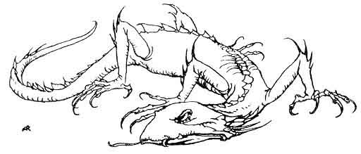
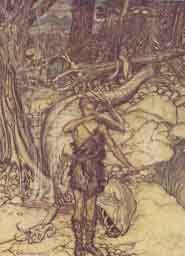
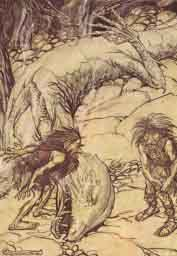
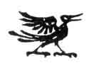

[Intangible Textual Heritage](../../index.md)  [Legends and
Sagas](../index)  [Index](index)  [Previous](ron03)  [Next](ron05.md) 

------------------------------------------------------------------------

p. 41

 

# THE SECOND ACT

A deep forest

\[*Quite in the background the entrance to a cave. The ground rises
towards a flat knoll in the middle of the stage, and slopes down again
towards the back, so that only the upper part of the entrance to the
cave is visible to the audience. To the left a fissured cliff is seen
through the trees. It is night, the darkness being deepest at the back,
where at first the eye can distinguish nothing at all*.\]

Alberich

\[*Lying by the cliff, gloomily brooding*.\]

In night-drear woods  
By Neidhöhl' I keep watch,  
With ear alert,  
Keen and anxious eye.  
Timid day,  
Tremblest thou forth?  
Pale art thou dawning  
Athwart the dark?

\[*A storm arises in the wood on the right, and from the same quarter
there shines down a bluish light*.\]

What comes yonder, gleaming bright?  
Nearer shimmers  
A radiant form;  
It runs like a horse and it shines;  
Breaks through the wood,  
Rushing this way.

p. 42

Is it the dragon's slayer?  
Can it mean Fafner's death?

\[*The wind subsides; the light vanishes*.\]

The glow has gone,  
It has faded and died;  
All is darkness.  
Who comes there, shining in shadow?

Wanderer

\[*Enters from the wood, and stops opposite Alberich*.\]

To Neidhöhl'  
By night I have come;  
In the dark who is hiding there?

\[*As from a sudden rent in the clouds moonlight streams forth and
lights up the Wanderer's figure*.\]

Alberich

\[*Recognises the Wanderer and shrinks back at first in alarm, but
immediately after breaks out in violent fury*.\]

'Tis thou who comest thus?  
What wilt thou here?  
Go, get thee hence!  
Begone, thou insolent thief!

Wanderer

\[*Quietly*.\]

Schwarz-Alberich  
Wanders here?  
Guardest thou Fafner's house?

Alberich

Art thou intent  
On mischief again?  
Linger not here!  
Off with thee straightway!  
Has grief enough  
Not deluged the earth through thy guile?  
Spare it further  
Sorrow, thou wretch!

Wanderer

I come as watcher,  
Not as worker.  
The Wanderer's way who bars?

p. 43

Alberich

Thou arch, pestilent plotter!  
Were I still the blind,  
Silly fool that I was,  
When I was bound thy captive,  
How easy were it  
To steal the ring again from me!  
Beware! For thy cunning  
I know well,

\[*Mockingly*.\]

And of thy weakness  
I am fully aware too.  
Thy debts were cancelled,  
Paid with my treasure;  
My ring guerdoned  
The giants' toil,  
Who raised thy citadel high.  
Still on the mighty  
Haft of thy spear there  
The runes are written plain  
Of the compact made with the churls;  
And of that  
Which by labour they won  
Thou dost not dare to despoil them:  
Thy spear's strong shaft  
Thou thyself wouldst split;  
The staff that makes thee  
Master of all  
Would crumble to dust in thy hand.

Wanderer

By the steadfast runes of treaties  
Thou hast not,  
Base one, been bound;  
On thee my spear may spend its strength,  
So keen I keep it for war.

p. 44

Alberich

How dire thy threats!  
How bold thy defiance!  
And yet full of fear is thy heart!  
Foredoomed to death  
Through my curse is he  
Who now guards the treasure.  
What heir will succeed him?  
Will the hoard all desire  
Belong as before to the Niblung?--  
That gnaws thee with ceaseless torment.  
For once I have got it  
Safe in my grasp,  
Better than foolish giants  
Will I employ its spell.  
The God who guards heroes  
Truly may tremble!  
I will storm  
Proud Walhall with Hella's hosts,  
And rule, lord of the world!

Wanderer

\[*Quietly*.\]

Thy design I know well,  
But little I care:  
Who wins the ring  
Will rule by its might.

Alberich

Thou speakest darkly,  
But to me all is plain.  
Thy heart is bold  
Because of a boy,

\[*Mockingly*.\]

A hero begot of thy blood.  
Hast thou not fostered a stripling  
To pluck the fruit thou durst not

\[*With growing violence*.\]

Pluck frankly for thyself?

p. 45

Wanderer

\[*Lightly*.\]

With me  
'Tis useless to wrangle;  
But Mime thou shouldst beware;  
For thy brother brings here a boy  
To compass the giant's doom.  
He knows not of me;  
He works for Mime alone.  
And so I say to thee,  
Do as seems to thee best.

\[*Alberich makes a movement expressive of violent curiosity*.\]

Take my advice,  
Be on thy guard:  
The boy will hear of the ring  
When Mime tells him the tale.

Alberich

\[*Violently*.\]

Wilt thou hold thy hand from the hoard?

Wanderer

Whom I love  
Must fight for himself unaided;  
The lord of his fate,  
He stands or falls:  
All my hope hangs upon heroes.

Alberich

Does none but Mime  
Dispute me the ring?

Wanderer

Only thou and Mime  
Covet the gold.

Alberich

And yet it is not to be mine?

Wanderer

\[*Quietly coming nearer*.\]

A hero comes  
To set the hoard free;  
Two Nibelungs yearn for the gold.  
Fafner falls,  
He who guards the ring;  
Then a hand, seizing, shall hold it.

p. 46

More wouldst thou learn,  
There Fafner lies,  
Who, if warned of his death,  
Gladly would give up the toy.  
Come, I will wake him for thee.

\[*He goes towards the cave, and, standing on the rising ground in front
of it, calls towards it*.\]

Fafner! Fafner!  
Wake, dragon! Wake!

Alberich

\[*With anxious amazement, aside*.\]

Does the madman mean it?  
Am I to have it?

Fafner's voice

Who troubles my sleep?

Wanderer

\[*Facing the cave*.\]

A well-wisher comes  
To warn thee of danger;  
Thy doom can he averted,  
If thou wilt pay the price  
With the treasure that thou guardest.

\[*He leans his ear towards the cave, listening*.\]

Fafner's voice

What would he?

Alberich

\[*Has come to the Wanderer and calls into the cave*.\]

Waken, Fafner!  
Dragon, awake!  
A doughty hero comes  
To try his strength against thine.

Fafner's voice

I want a meal.

Wanderer

Bold is the boy and strong;  
Sharp-edged is his sword.

Alberich

The ring he seeks,  
Nothing besides.

p. 47

Give me the ring, and so  
The strife shall be stayed.  
Still guarding the hoard,  
In peace shalt thou live long!

Fafner

\[*Yawning*.\]

I have and I hold:--  
Let me slumber!

Wanderer

\[*Laughs aloud and then turns again to Alberich*.\]

Well, Alberich! That ruse failed,  
But call me rogue no more.  
This one thing thou shouldst  
Never forget:  
Each according to his kind must act;  
Nothing can change him.  
I leave thee the field now;  
Show a bold front,  
And try thy luck with thy brother;  
Thou knowest his kind perhaps better.  
And things unknown  
Thou also shalt learn!

\[*He turns away, and disappears quickly in the wood. A storm arises and
a bright light breaks forth; then both quickly cease*.\]

Alberich

\[*Looks after the Wanderer as he gallops off*.\]

Away on his shining  
Horse he rides,  
And leaves me to care and scorn!  
Laugh on! Laugh on,  
Ye light-minded  
And high-spirited  
Race of immortals!  
One day ye shall perish  
And pass!  
Until the gold  
Has ceased to gleam,

p. 48

Will wise Alberich watch,  
And his hate shall prevail.

\[*He slips into the chasm at the side. The stage remains empty.
Dawn*.\]

As the day dawns Siegfried and Mime enter. Siegfried carries his sword
in a sword-belt of rope. Mime examines the place carefully. At last he
looks towards the background, which remains in deep shadow, whist the
rising ground in the middle becomes, after a time, more and more
brightly illuminated by the sun.

Mime

Our journey ends here;  
Here we halt.

Siegfried

\[*Sits down under the lime-tree and looks about him*.\]

So here I shall learn what fear is?  
A far way thou hast led me;  
We have wandered lone together  
A whole night long in the woods.  
This is the last  
Of thee, Mime!  
Can I not master  
My lesson here,  
Alone I will push forward  
And never see thee again.

Mime

Lad, believe me,  
If thou canst not  
Learn it here and now,  
No other place,  
No other time  
Ever will teach thee fear.  
Dost thou see  
That cavern yawning dark?  
Yonder dwells  
A dragon dread and grim,  
Horribly fierce,

p. 49

Enormous in size,  
With terrible jaws  
That threaten and gape;  
With skin and hair,  
All at a gulp,  
The brute could swallow thee whole.

Siegfried

\[*Still sitting under the lime tree*.\]

'Twere well to close up his gullet;  
His fangs I will therefore avoid.

Mime

Poison pours  
From his venomous mouth;  
Were he to spue out  
Spittle on thee,  
Thy body and bones would decay.

Siegfried

That the poison may not consume me,  
I will keep out of its reach.

Mime

A serpent's tail  
Sweeping he swings;  
Were that about thee wound  
And folded close,  
Thy limbs would be broken like glass.

Siegfried

That his swinging tail may not touch me,  
Warily then I must watch.  
But answer me this:  
Has the brute a heart?

Mime

A pitiless, cruel heart.

Siegfried

It lies, however,  
Where all hearts lie,  
Brute and human alike?

Mime

Of course! There, boy,  
The dragon's lies too.  
At last thou beginnest to fear?

p. 50

Siegfried

\[*Who till now has been lying indolently stretched out, sits up
suddenly*.\]

Nothung into  
His heart I will thrust!  
Is that what is meant by fearing?  
Hey, old dotard!  
Canst thou teach me  
Nothing but this  
With all thy craft,  
Linger no longer by me:  
No fear is here to be learnt.

Mime

Wait awhile yet!  
What I have told thee  
Seems to thee empty sound;  
When thou hast heard  
And seen him thyself,  
Thy senses will swoon, overwhelmed?  
When thine eyes grow dim,  
And when the ground rocks,  
When in thy breast  
Thy heart beats loud,

\[*Very friendly*.\]

Thou wilt remember who brought thee,  
And think of me and my love.

Siegfried

Thy love is not wanted!  
Hast thou not heard?  
Out of my sight with thee;  
Let me alone!  
Begin again talking of love,  
And on the instant I go!  
The horrible winking,  
The nods and blinking  
When shall I see  
The last of them,  
And rid be at length of the fool?

p. 51

Mime

Well, I will off,  
And rest there by the spring.  
Thou must stay here,  
And as the sun scales the sky  
Watch for the foe:  
From his cave  
He lumbers this way,  
Winds and twists  
Past this spot,  
To water at the fountain.

Siegfried

\[*Laughs*.\]

Liest thou by the spring,  
Unchecked thither the brute shall go;  
He shall swallow thee  
Down with the water,  
Ere with my sword  
To the heart I stab him!  
So heed well what I say:  
Rest not beside the spring.  
Seek somewhere else  
A far-off spot,  
And nevermore return.

Mime

Thou wilt not refuse  
Cooling refreshment  
When the fierce fight is over?

\[*Siegfried motions him angrily away*.\]

Call on me too  
Shouldst thou need counsel,

\[*Siegfried repeats the gesture with more violence*.\]

Or if felled on a sudden by fear.

\[*Siegfried rises and drives him away with furious gestures*.\]

Mime

\[*Aside, as he goes away*.\]

Fafner and Siegfried--  
Siegfried and Fafner--  
Might each the other but slay!

\[*He disappears in the wood on the right*.\]

p. 52

Siegfried

\[*Stretches himself at his ease under the lime-tree, and looks after
Mime as he departs*.\]

He is no father of mine!  
How merry of heart I feel!  
Never before  
Seemed the forest fair;  
Never day  
Wore as lovely a smile,  
For the loathed one has gone at last,  
To be looked on by me no more.

\[*He meditates in silence*.\]

My father--what was he like?--  
Ha! like me, without doubt.  
Had Mime by chance had a son,  
He would have been  
Mime's image:  
Quite as disgusting,  
Filthy and grey,  
Small and bent,  
Hunchbacked and halting,  
With ears long and hanging,  
Rheumy eyes running--  
Off with the fright!  
To see him makes me sick!

\[*He leans further back and looks up through the branches of the tree.
Deep silence. Woodland murmurs*.\]

What could my mother,  
I wonder, be like;  
That is not  
So easy to picture.

\[*Very tenderly*.\]

Her clear shining eyes  
Must have been soft,  
And gentle like the roe-deer's,  
Only far fairer.

\[Very softly.\]

In fear and woe she bore me,

 [  
Click to enlarge](img/05200.jpg.md)

The hot blood burns like fire!  
                     See [p. 58](#page_58.md)

 

p. 53

But why did she die through me?  
Must then all human mothers  
Thus die on giving  
Birth to a son?  
That would truly be sad!  
Ah, if I only  
Could see my mother!--  
See my mother,  
A woman once!

\[*He sighs softly, and leans still further back. Deep silence. Louder
murmuring of the wood. His attention is at last caught by the song of
the birds. He listens with growing interest to one singing in the
branches above him*.\]

O lovely warbler,  
I know not thy note;  
Hast thou thy home in this wood?  
If I could but understand him,  
His sweet song might say much--  
Perhaps of my mother tell me.  
A surly old dwarf  
Said to me once  
That men might learn  
To follow the sense  
Of birds when they were singing;  
Could it indeed be done?  
Ha! I will sing  
After him,  
On the reed follow him sweetly.  
Though wanting the words,  
Repeating his measure--  
Singing what is his language-  
Perhaps I shall know what he says.

\[*He runs to the neighbouring spring, cuts a reed of with his sword,
and quickly makes himself a pipe out of it. He listens again*.\]

p. 54

He stops to hear,  
So now for my song!

\[*He blows into the pipe, breaks of, and cuts it again to improve it.
He resumes his blowing, shakes his head, and cuts the pipe once more.
After another attempt he gets angry, presses the pipe with his hand, and
tries again. He ceases playing and smiles*.\]

That rings not right;  
For the lovely tune  
The reed is not suited at all.  
I fear, sweet bird,  
I am too dull;  
Thy song cannot I learn.

\[*He hears the bird again and looks up to him*.\]

He listens so roguishly  
There that he shames me;

\[*Very tenderly*.\]

He waits, and nothing rewards him.  
Heida! Come hearken  
Now to my horn;

\[*He flings the pipe away*.\]

All I do sounds wrong  
on the stupid reed;  
To a song of the woods  
That I know,  
A merry song, listen now rather.  
I hoped it would bring  
Some comrade to me,  
But wolves and bears  
Were the best that came.  
Now I will see

 [  
Click to enlarge](img/05400.jpg.md)

The dwarfs quarrelling over the body of Fafner  
                                       See [p. 59](#page_59.md)

 

p. 55

Who answers its note:  
What comrade will come to its call.

\[*He takes the silver hunting-horn and blows on it. During the
long-sustained notes he keeps his eyes expectantly on the bird. A
movement in the background. Fafner, in the form of a monstrous
lizard-like dragon, has risen from his lair in the cave. He breaks
through the underwood and drags himself up to the higher ground, so that
the front part of his body rests on it, while he utters a loud sound, as
if yawning*.\]

Siegfried

\[*Looks round and gazes at Fafner in astonishment. He laughs*.\]

My horn with its note  
Has allured something lovely;  
A jolly companion wert thou.

Fafner

\[*At the sight of Siegfried has paused on the high ground, and remains
there*.\]

What is that?

Siegfried

If thou art a beast  
Who can use its tongue,  
Perchance thou couldst teach me something.  
Here stands one  
Who would learn to fear  
Say, wilt thou be his teacher?

Fafner

Is this insolence?

Siegfried

Courage or insolence,  
What matter?  
With my sword I will slay thee,  
Wilt thou not teach me to fear.

Fafner

\[*Makes a laughing sound*.\]

Drink I came for;  
Now food I find too

\[He opens his jaws and shows his teeth.\]

p. 56

Siegfried

What a fine set of teeth  
Thou showest me there!  
Sweetly they smile  
In thy dainty mouth!  
'Twere well if I closed up thy gullet  
Thy jaws are gaping too wide!

Fafner

They were not made  
For idle talk,  
But they will serve  
To swallow thee.

Siegfried

Hoho! Ferocious,  
Merciless churl!  
I have no fancy  
To be eaten.  
Better it seems to me  
That without delay thou shouldst die!

Fafner

\[*Roaring*.\]

Pruh! Come,  
Boy, with thy boasts!

Siegfried

\[*Draws his sword*.\]

Beware, growler!  
The boaster comes!

\[*He springs towards Fafner and remains defiantly confronting him.
Fafner drags himself further up the knoll and spits at Siegfried from
his nostrils. Siegfried a voids the poison, springs nearer, and stands
on one side. Fafner tries to reach him with his tail. Siegfried, who is
nearly caught, springs over Fafner with one bound, and wounds him in the
tail. Fafner roars, pulls his tail angrily away, and raises the front
part of his body so that he may throw its full weight on Siegfried, thus
offering his breast to the stroke. Siegfried quickly looks to see where
his heart is, and thrusts his sword into it up to the hilt. Fafner
raises himself still higher in his pain, and, when Siegfried has let go
his sword and sprung aside, he sinks on the wound*.\]

p. 57

Siegfried

Lie there, envious brute!  
Nothung's point home has speeded!

Fafner

\[*In a weaker voice*.\]

Who art thou, boy bold-hearted,  
That hast pierced my breast?  
Who stirred up thy childish soul  
To the murderous deed?  
Thy brain schemed not the harm  
Wrought by thy hand.

Siegfried

Not much have I learned,  
Not even who I am;  
Thou thyself with thy taunting  
Stirred me to fight and to slay.

Fafner

O boy bright-eyed,  
Who knowest not yet who thou art,  
Whom thou hast murdered  
Hear from me.  
Two mighty giants there were,  
Fasolt and Fafner;  
The brothers now are both fallen.  
For the cursèd gold  
We got from the Gods  
I did Fasolt to death.  
He who now guards  
The hoard as dragon,  
Fafner, the last remaining,  
Falls, by a rosy boy slain.  
Boy in thy bloom,  
Watch and be wary:  
He who stirred thee blind to this deed  
Takes thought how to compass thy death.

\[*Dying*.\]

Mark the ending!  
Think on me!

p. 58

Siegfried

Who was my father?  
Tell, if thou canst.  
Dying, thou showest,  
Wild one, much wisdom.  
Siegfried my name is; haply  
That may help thee to guess.

Fafner

Siegfried! . . .

\[*He raises himself and dies*.\]

Siegfried

The dead can tell no tidings.  
My living sword, lead!  
Lead onward, my sword!

\[*Fafner has rolled to the side in dying. Siegfried now draws the sword
from his breast. In doing so his hand gets sprinkled with the blood; he
draws it back quickly*.\]

The hot blood burns like fire!

\[*Involuntarily he raises his fingers to his mouth to suck the blood
from them. As he looks musingly before him his attention becomes more
and more attracted by the singing of the birds*.\]

I almost seem  
To hear the birds speaking to me.  
Is there a spell,  
Perhaps, in the blood?  
The curious bird up there--  
Hark! he sings to me.

Voice of the Wood-bird

\[*From the branches of the lime-tree above Siegfried*.\]

Hei! Siegfried now owns  
All the Nibelung hoard!  
Oh! could he the hoard  
In the cave but find!  
Tarnhelm, if he could but win it,  
Would help him to deeds of renown;  
And could he discover the ring,  
It would make him the lord of the world!

p. 59

Siegfried

\[*Has listened holding his breath and beaming with delight*.\]

Thanks, bonnie bird,  
For the counsel good  
I follow the call!

\[*He turns towards the back and descends to the cave, where he at once
disappears*.\]

Mime steals up, looking about him timidly to assure himself of Fafner's
death. At the same time Alberich comes out of the cleft on the opposite
site. He observes Mime, rushes on him and bars his way, as the latter
turns towards the cave.

Alberich

On what errand  
Furtive and sly,  
Knave, dost thou slink?

Mime

Accursèd brother,  
That thou shouldst come!  
What brings thee here?

Alberich

Rogue, has my gold  
Provoked thy greed?  
Dost covet my goods?

Mime

Get thee gone quickly!  
This corner is mine;  
What huntest thou here?

Alberich

Have I disturbed thee,  
Thief, at thy work,  
Secret and sly?

Mime

What I have slaved  
And toiled to win  
Shall not escape me.

Alberich

Who was it robbed  
The Rhine of gold for the ring?  
And whose cunning wrought  
The spell of magical might?

p. 60

Mime

Who made the Tarnhelm,  
Changing its wearer's form?  
Though thou didst want it,  
Was it designed by thee?

Alberich

And what of thyself  
Couldst aright have fashioned, thou bungler?  
The magic ring  
Forced thee to master thy craft.

Mime

And where is the ring?  
'Twas reft from thy clutch by the giants.  
What thou hast lost  
I will gain and keep by my guile.

Alberich

What the boy has won  
Would the niggard deny him?  
'Tis not thine; the hero  
Who won it is now its lord.

Mime

I brought him up;  
For my pains now he shall pay;  
For its reward  
My trouble has waited too long.

Alberich

Just for rearing him,  
The old niggardly,  
Beggarly knave,  
Bold as brass,  
A king now would become?  
The ring would befit  
Better a dog  
Than bumpkin like thee.  
Never to thee  
The magical ring shall fall!

p. 61

Mime

\[*Scratches his head*.\]

Well, keep it, then,  
And guard with care  
The gleaming gold;  
Be thou lord,  
But treat me as a brother;  
Give me against it  
Tarnhelm for toy,  
Fairly exchanged;  
Divided thus,  
There will be booty for both.

\[*He rubs his hands confidingly*.\]

Alberich

\[*With a mocking laugh*.\]

Share it with thee?  
And the Tarnhelm too!  
How sly thou art!  
I could never  
Sleep for a moment safely.

Mime

\[*Beside himself*.\]

What I not even  
Strike a bargain!  
I must go bare,  
Beggared of gain!  
Thou wouldst leave me with nothing!

\[*Shrieking*.\]

Alberich

Nothing, not so  
Much as a nail,  
Shall fall to thy portion.

Mime

\[*In a fury*.\]

Neither ring nor Tarnhelm  
Shall thy hand touch, then;  
'Tis I will not share!  
I will call on Siegfried,  
Summon the aid  
Of his keen-edged sword;  
The lad will make  
Short work, dear brother, of thee!

p. 62

Alberich

\[*Siegfried having appeared in the background*.\]

Turn and look there!  
From the cavern hither he comes.

Mime

He will have chosen  
Trivial toys.

Alberich

He bears the Tarnhelm!

Mime

Also the ring!

Alberich

Curst luck! The ring!

Mime

\[*Laughing maliciously*.\]

Get him to give thee the ring now!  
'Tis I, not thou, who shall win it.

Alberich

And yet to its lord  
Must it at last be surrendered!

\[*He disappears in the cleft*.\]

\[*During the foregoing Siegfried, with Tarnhelm and ring, has come
slowly and meditatively from the cave; he regards his booty
thoughtfully, and stops on the knoll in the middle of the stage*.\]

Siegfried

I do not know  
Of what use  
Ye are; I chose you  
From out the heaped-up hoard  
Because of friendly advice.  
Meanwhile, of this day  
Be ye worn as witness,  
Recalling to mind  
How with fallen Fafner I fought,  
And yet could not learn how to fear.

\[*He hangs the Tarnhelm on his girdle and puts the ring on his finger.
Silence. His notice is involuntarily drawn to the bird again, and he
listens to him with breathless attention*.\]

p. 63

The Wood-bird's voice

Hei! Siegfried now owns  
Both the helm and the ring!  
Oh! let him not listen  
To Mime, the false!  
He were wise to be wary of  
Mime's treacherous tongue.  
He will understand  
Mime's secret intent,  
Because he has tasted the blood.

\[*Siegfried's mien and gestures show that he has understood the bird's
song. He sees Mime approaching, and remains without moving, leaning on
his sword, observant and self-contained, in his place on the knoll till
the close of the following scene*.\]

Mime

\[*Steals forward and observes Siegfried from the foreground*.\]

He weighs in his mind  
The booty's worth;  
Can there by chance  
Have come this way  
A Wanderer wise  
Who talked to the child,  
And taught him crafty runes?  
Doubly sly  
Be then the dwarf;  
My snares must be cunning,  
Cleverly set,  
That with cajoling  
And wily falsehoods  
The insolent boy I may fool.

\[*He goes nearer to Siegfried and welcomes him with flattering
gestures*.\]

Ha! Welcome, Siegfried!  
Say, bold fighter,  
Hast thou been taught how to fear?

Siegfried

A teacher still is to find.

p. 64

Mime

But the dragon grim  
Has fallen before thee?  
A fell and fierce monster was he.

Siegfried

Though grim and spiteful the brute,  
I grieve over his death,  
While there live still, unpunished,  
Blacker scoundrels than he was!  
The one who bade me slay  
I hate far more than the slain.

Mime

\[*Very friendly*.\]

Have patience! Thou wilt not  
Look on me long.

\[*Sweetly*.\]

In endless sleep  
Soon thine eyelids will be sealed.  
Thy uses are over,

\[*As if praising him*.\]

Done is the deed;  
The only task left  
For me is to win the booty.  
Methinks that task will not tax me;  
Thou wert always easy to fool.

Siegfried

To me thou art plotting harm, then?

Mime

\[*Astonished*.\]

What makes thee think that?

\[*Continuing tenderly*.\]

Siegfried, listen, my own one!  
I have always loathed  
Thee and all that are like thee.  
It was not from love  
That I reared thee with care:  
The gold hid in Fafner's cave  
I worked for as my reward.

\[*As if he were promising him something nice*.\]

p. 65

If thou wilt not yield  
It up to me,

\[*As if he were ready to lay down his life for him*.\]

Siegfried, my son,  
Thou plainly must see

\[*As if in friendly jest*.\]

I have no choice but to slay thee!

Siegfried

That I am hated  
Pleases me;  
But must I lose my life for thy pleasure?

Mime

\[*Angrily*.\]

I never said that;  
Thou hast made a mistake.  
See, thou art weary  
From stress of strife,  
Burning with fever and thirst;  
Mime, the kind one,  
To cool thy thirst  
Brought a quickening draught.  
While thy blade thou didst melt  
I brewed thee the drink;  
Touch it, and straight  
Thy sword shall be mine,  
And mine the hoard and Tarnhelm too.

\[*Tittering*.\]

Siegfried

So thou of my sword  
And all it has won me--  
Ring and booty--wouldst rob me?

Mime

\[*Violently*.\]

Why wilt mistake so my words!  
Do I drivel or dote?  
I use the utmost  
Pains with my speech,  
That what in my heart  
I mean may be hidden;

p. 66

And the stupid boy  
Misunderstands what I say!  
Open thy ears, boy,  
And attend to me!  
Hear, now, what Mime means.  
Take this: the drink will refresh thee  
As my drinks oft have done.  
Many a time  
When fretful and bad,  
Though loth enough,  
The draughts I brought thou hast swallowed.

Siegfried

Of a cooling drink  
I were glad;  
Say, how has this one been brewed?

Mime

\[*Jesting merrily, as if describing to him a pleasant state of
intoxication which the liquor is to bring about*.\]

Hei! just drink it!  
Trust to my skill.  
In mist and darkness  
Soon shall thy senses be sunk;  
None to watch or ward them,  
Stark-stretched shall thy limbs be.  
Thou lying thus,  
'Twere not hard  
To take the booty and hide it;  
But wert thou to awake,  
Nevermore would  
Mime be safe,  
Even owning the ring.  
So with the sword  
He has made so sharp

\[*With a gesture of extravagant joy*.\]

First I will hack  
The child's head off!  
Then I shall have both rest and the ring!

\[*Tittering*.\]

p. 67

Siegfried

Thou wouldst, then, slay me when sleeping?

Mime

\[*Furiously*.\]

Do what, child? Did I say that?

\[*He takes pains to assume the utmost tenderness. Carefully and
distinctly*.\]

I only mean  
To chop off thy head!

\[*With the appearance of heartfelt solicitude for Siegfried's
health*.\]

For even if I  
Had loathed thee less,  
And had not thy scoffs  
And my drudgery shameful  
So loudly urged to vengeance,

\[*Gently*.\]

I should never dare to pause  
Till from my path I thrust thee:

\[*Jestingly again*.\]

How else could I come by the booty,  
Which Alberich covets as well?

\[*He pours the liquid into the drinking-horn, and offers it to
Siegfried with pressing gestures*.\]

Now, my Wälsung,  
Wolf-begot,  
Drink the draught and be choked,  
And never drink again!

\[*Tittering*.\]

Siegfried

\[*Threatens him with his sword*.\]

Taste thou my sword,  
Loathsome babbler!

\[*As if seized by violent loathing, he gives Mime a sharp stroke with
his sword. Instantly Mime falls dead to the ground. Alberich's voice in
mocking laughter from the cleft*.\]

p. 68

Siegfried

\[*Looking at Mime on the ground, quietly hangs his sword again on his
belt*.\]

Envy's wage  
Pays Nothung;  
'Twas for this that I forged him.

\[*He picks up Mime's body, carries it to the knoll, and throws it into
the cave*.\]

In the cavern, there,  
Lie on the hoard;  
With steadfast guile  
The gold thou hast gained:  
Now let it belong to its master!  
And a watchman good  
I give thee, that thieves  
Never may enter and steal.

\[*With a great effort he pushes the body of the dragon in front of the
entrance to the cave, which it completely stops up*.\]

There lie thou too,  
Dragon grim;  
Along with thy foe  
Greedy of gain  
Thou shalt guard the glittering gold:  
So both at last shall rest in peace.

\[*He looks down thoughtfully into the cave for a time, and then turns
slowly to the front of the stage as if tired. He passes his hand over
his brow*.\]

Hot I feel  
From the heavy toil;  
Fast and furious  
Flows my blood,  
My hand burns on my head.  
High stands the sun in heaven;  
From azure heights  
Falls his gaze  
Through a cloudless sky on my crown.

p. 69

Pleasant shadows will cool me under the linden.

\[*He stretches himself out under the lime-tree, and again looks up
through the boughs*.\]

If only, pretty warbler,  
So long and so  
Rudely disturbed,  
I could once more hear thee singing!  
On a branch I see thee  
Merrily swaying;  
Chirping and chattering,  
Brothers and sisters  
Are happily hovering round.

But I--I am alone,  
Without brother or sister;  
My mother died,  
My father fell,  
Unseen by their son!  
The one soul I knew  
Was a loathsome old dwarf;

\[*Warmly*.\]

Love he festered not  
By kindness;  
Many a cunning  
Snare did he set me;  
At last I was forced to slay him.

\[*He looks sorrowfully up at the branches*.\]

Bird sweet and friendly,  
I ask thee a boon:  
Wilt thou find for me  
A comrade true?--  
Wilt thou choose for me the right one?  
So oft I have called,  
And yet no one has come!

p. 70

Thou, my friend,  
Wilt manage it better,  
So wise thy counsel has been.

\[*Softly*.\]

Now sing! I hearken to thy song.

The Wood-bird's voice

Hei! Siegfried has slain  
The deceitful dwarf!  
I know for him now  
A glorious bride.  
She sleeps where rugged rocks soar;  
Ringed is her chamber by fire.  
Who battles the flames,  
Wakens the bride,  
Brünnhilde, wins as reward.

Siegfried

\[*Starts up impetuously from his seat*.\]

O lovely song,  
Flower-sweet breath!  
Thy yearning music  
Burns in my breast!  
Like leaping flame  
It kindles my heart.  
What races so swift  
Through soul and senses?  
Sweetest of friends, O say!

\[*He listens*.\]

The Wood-bird's voice

Grieving yet glad,  
Love I am singing;  
Blissful, from woe  
Weaving my song:  
They only who yearn understand.

Siegfried

Forth, forth then,  
Swift and rejoicing!  
Forth from the wood to the fell!  
just one thing more  
I would learn, sweet singer:

p. 71

Say, shall I break through the fire?  
Can I awaken the bride?

\[*He listens again*.\]

The Wood-bird's voice.

No coward wins  
Brünnhild' for bride,  
Or wakes the maid:  
Only a heart without fear.

Siegfried

\[*Shouting with joy*.\]

The foolish boy  
Who has never learned fear,  
Dear bird, that dullard am I!  
To-day I took endless  
Trouble in vain,  
To find out what fear was from Fafner.  
With longing I burn  
Now from Brünnhild' to learn it.  
What path soonest leads to the fell?

\[*The bird flutters up, circles over Siegfried, and flies hesitatingly
before him*.\]

The bird to my goal will guide me.  
Fly where thou wilt,  
I follow thy flight!

\[*He runs after the bird, who for a time flies uncertainly hither and
thither to tease him; at last he follows him, when, taking a definite
direction towards the back, the bird flies away*.\]

 

------------------------------------------------------------------------

[Next: The Third Act](ron05.md)
