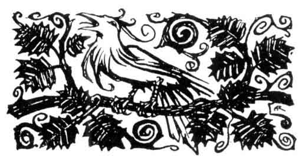
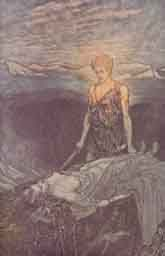
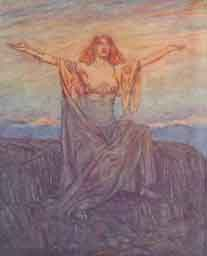
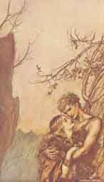
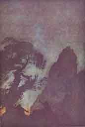
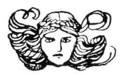

[Intangible Textual Heritage](../../index)  [Legends and
Sagas](../index)  [Index](index)  [Previous](ron04)  [Next](ron06) 

------------------------------------------------------------------------

p. 72

 

# THE THIRD ACT

A wild spot at the foot of a rocky mountain which rises precipitously at
the back on the left. Night, storm, lightning and violent thunder. The
latter ceases shortly, but the lightning continues to flash from the
clouds for some time. The Wanderer enters and walks resolutely towards a
cavernous opening in a rock in the foreground, and takes up his position
there, leaning on his spear, while he calls the following towards the
entrance to the cave.

Wanderer

Waken, Wala!  
Wala! Awake!  
From thy long sleep,  
Slumberer, wake at my call!  
I summon thee forth:  
Arise! Arise!  
From cloud-covered caves  
In earth's dim abysses, arise!  
Erda! Erda,  
Old as the world!  
From depths dark and hidden  
Rise to the day!  
With song I call thee,  
I sing to wake thee,  
From deep dreams of wisdom  
Bid thee arise.  
All-knowing one!  
Fount of knowledge!  
Erda! Erda,

p. 73

Old as the world!  
Waken! Awaken, thou Vala! Awaken!

\[*A dim bluish light begins to dawn in the cavern. In this light Erda,
during the following, rises very gradually from below. She appears to be
covered with hoar-frost, which glitters on her hair and garments*.\]

Erda

Loud is the call;  
Strong the spell that summons;  
I have been roused  
From dark and wise dreams:  
Who wakes me from my sleep?

Wanderer

'Tis I who awake thee  
With song of magic,  
That what in slumber  
Was folded fast may rise.  
The wide earth ranging,  
Far I have roamed,  
Seeking for knowledge,  
Wisdom at fountains primeval.  
No one that lives  
Is wiser than thou;  
Thou knowest all  
In the hidden depths,  
What moves on hill,  
Dale, in water and air.  
Where life is found,  
There thou art breathing;  
And where brains ponder,  
There is thy thought.  
Men say that all  
Knowledge is thine.  
That I might ask of thee counsels  
I have called thee from sleep.

p. 74

Erda

My sleep is dreaming,  
My dreaming brooding,  
My brooding wisdom's calm working.  
But while I sleep  
The Norns are wakeful:  
They twine the rope,  
And deftly weave what I know.  
The Norns thou shouldst have questioned.

Wanderer

In thrall to the world  
Sit the Norris weaving;  
They cannot alter  
What ordained is.  
But I would fain  
Be taught of thy wisdom  
How a wheel on the roll can be stayed.

Erda

Dark and troubled  
My mind grows through men's deeds.  
A God once subdued  
The Wala's self to his will.  
A wish-maiden  
I bore to Wotan;  
From fields of battle  
She brought him slain heroes;  
Bold is she  
And wise to boot:  
Why waken me?  
Why seek not counsel  
From Erda's and Wotan's child?

Wanderer

The Valkyrie, Brünnhild'?  
Meanest thou her?  
She flouted the storm-controller,  
When, sorely urged, himself he controlled.  
What the swayer and lord  
Of battles longed for,

p. 75

What he refrained from  
Against his desire,  
Brünnhilde, bold,  
Rash, over-confident,  
When the fight was at fiercest,  
Strove for herself to perform.  
War-father  
Punished the maid:  
He pressed slumber into her eyes,  
On the flame-girt rock she sleeps.  
The hallowed maid  
Will waken alone,  
That she may love and wed with a man.  
Small hope of answer from her.

Erda

Dazed have I felt  
Since I woke;  
Wild, confused  
Seems the world!  
The Valkyrie,  
The Wala's child,  
Bound lay, fettered by sleep,  
While her all-knowing mother slept!  
Does revolt's teacher  
Chide revolt?  
Does the deed he urged to  
Anger him, done?  
He who guards the right,  
To whom vows are sacred,  
Hinders the right?--  
Reigns through falsehood?  
Let me down to the dark,  
That my wisdom may slumber!

Wanderer

I will not let thee descend,  
For a potent magic I wield.

p. 76

All-wise one,  
Planted by thee  
The sting of care was  
In Wotan's dauntless heart;  
For, through thy wisdom,  
Downfall and shameful  
Doom were foretold him;  
My mind was fettered by fear.  
Now let the world's  
Wisest of women  
Answer and say  
How a God may conquer his care.

Erda

Thou art not  
What thou hast said.  
Why art thou come, wild and wayward,  
To trouble the Wala's sleep?

Wanderer

Thou art not  
What thou hast dreamed.  
Thy end draws near,  
Mother of wisdom;  
Thy wisdom at war  
With me shall perish.  
Knowest thou Wotan's will?

\[*A long silence*.\]

I tell thee  
That thou mayest sleep  
For evermore unvexed by care.  
That the Gods are doomed,  
No longer dismays me,  
Since I will it so.  
What, with myself at war, in anguish,  
Despairing, once I resolved,  
Gaily, gladly,  
With delight I now do.

p. 77

Mad with disgust I decreed once  
The world to the Nibelung's hate,  
But now to the valiant Wälsung  
I leave it with joy.  
One who never knew me,  
Though chosen by me,  
A boy bold and fearless,  
Helped not by Wotan,  
Has won the Nibelung's ring.  
Blest in love,  
Void of all envy,  
On him shall fall harmless  
Alberich's curse,  
For no fear does he know.  
Soon thy child and mine,  
Brünnhild',  
Shall be waked by him;  
And when waked  
Our child shall achieve  
A deed to redeem the world.  
So slumber again,  
Closing thine eyelids  
Dreaming behold my downfall!  
Whatever comes after,  
The God rejoicing  
Yields to youth ever young.  
Descend, then, Erda,  
Mother of fear!  
World-sorrow!  
Descend! Descend!  
And sleep for aye!

\[*Erda, whose eyes are already closed, and who has gradually been
sinking deeper, disappears entirely. The cavern has become quite dark
again*.\]

p. 78

Dawn lights up the stage; the storm has ceased. The Wanderer has gone
close to the cave, and leans with his back again against it, facing the
wings.

Wanderer

Lo! Yonder Siegfried comes.

\[*He remains where he is without changing his position. Siegfried's
wood-bird flutters towards the foreground. Suddenly the bird stops in
his direct flight, flutters to and fro in alarm, and disappears quietly
towards the back*.\]

Siegfried

\[*Enters and stops*.\]

My bird has vanished from sight!  
With fluttering wings  
And lovely song  
Blithely he showed me the way,  
And then forsook me and fled!  
I must discover  
The rock for myself:  
The path I followed so far  
'Twere best still to pursue.

\[*He goes towards the back*.\]

Wanderer

\[*Still in the same position*.\]

Boy, pray tell me,  
Whither away?

Siegfried

\[*Halts and turns round*.\]

Did some one speak?  
Perhaps he knows the road.

\[*He goes nearer to the Wanderer*.\]

I would find a rock  
That by flaming fire is surrounded:  
There sleeps a maid  
Whom I would awake.

Wanderer

Who bade thee seek  
This rock flame-circled?--  
Taught thee to yearn for the woman?

p. 79

Siegfried

It was a singing  
Woodland bird;  
He gave me welcome tidings.

Wanderer

A wood-bird chatters idly  
What no man understands;  
How then couldst thou tell  
The song's true meaning?

Siegfried

Because of the blood  
Of a dragon grim  
That fell before me at Neidhöhl'--  
The burning blood  
Had scarce touched my tongue  
When the sense of the singer grew plain.

Wanderer

Who was it urged thee on  
To try thy strength,  
And slay this dragon so dread?

Siegfried

My guide was Mime,  
A faithless dwarf:  
What fear is fain he had taught me.  
But 'twas the dragon  
Roused me himself,  
Wrathful, to strike the blow;  
For he threatened me with his jaws.

Wanderer

Who forged the sword  
So hard and keen  
That it slew the daunting foe?

Siegfried

I forged it myself  
When the smith was beaten;  
Swordless else I should have been still.

Wanderer

But who made  
The mighty splinters  
From which the sword was welded strong?

p. 80

Siegfried

What know I of that?  
I only know  
That the splintered steel was useless  
Were not the sword forged anew.

Wanderer

\[*Bursts out laughing with gleeful good-humor*.\]

I fully agree.

Siegfried

\[*Surprised*.\]

At what dost thou laugh?  
Prying greybeard!  
Prithee have done;  
Keep me no longer here talking.  
Speak if thou knowest  
Whither my way lies;  
And hold thy tongue  
Unless thou canst tell.

Wanderer

Good boy, have patience!  
If I seem old,  
More need to show me due honour.

Siegfried

What an odd notion!  
My whole life long  
A hateful old man  
Has blocked my pathway;  
Him I at last swept aside.  
Standest thou longer  
Trying here to stay me,  
I warn thee frankly

\[*With a significant gesture*.\]

That thou like Mime shalt fare.

\[*He goes still nearer to the Wanderer*.\]

But what art thou like?  
Why wearest thou  
Such a monstrous hat,  
And why hangs it so over thy face?

p. 81

Wanderer

\[*Still without altering his position*.\]

That is the way I wear it  
When against the wind I go.

Siegfried

\[*Inspecting him still more closely*.\]

But an eye beneath it is wanting.  
Perchance by some one  
Whose way thou didst  
Too boldly bar  
It has been struck out.  
Take thyself off,  
Or else very soon  
The other thou shalt lose also!

Wanderer

I see, my son,  
Where thou art blind,  
And hence thy jaunty assurance.  
With the eye that is  
Amissing in me  
Thou lookest now on the other  
That still is left me for sight.

Siegfried

\[*Who has been listening thoughtfully, now bursts involuntarily into
hearty laughter*.\]

Thy foolish talk sets me laughing!  
But come, this nonsense must finish.  
At once show me my way;  
Then proceed thou too on thine own;  
For me further  
Use thou hast none:  
So speak, or off thou shalt pack!

Wanderer

\[*Gently*.\]

Child, didst thou know  
Who I am,  
Thy scoffs I had been spared!  
From one so dear,  
Insult hard to endure is.  
Long have I loved  
Thy radiant race,  
Though from my fury  
In terror it shrank.

p. 82

Thou whom I love so,  
All too fair one,  
Rouse my wrath not to-day;  
It would ruin both thee and me.

Siegfried

Still art thou dumb,  
Stubborn old man?  
Stand to one side, then  
That pathway, I know,  
Leads to the slumbering maid;  
For thither the wood-bird  
Was guiding when he flew off.

\[*It suddenly becomes dark again*.\]

Wanderer

\[*Breaking out in anger and assuming a commanding attitude*.\]

In fear of its life it fled.  
It knew that here  
Was the ravens' lord;  
Dire his plight were he caught!  
The way that it guided  
Thou shalt not go!

Siegfried

\[*Amazed, falls back and assumes a defiant attitude*.\]

Hoho! Interferer!  
Who then art thou  
That wilt not let me pass?

Wanderer

Fear thou the rock's defender!  
My might it is  
Holds the maiden fettered by sleep.  
He who would wake her,  
He who would win her,  
Impotent makes me for ever.

A burning sea  
Encircles the maid,  
Fires fiercely glowing  
Surround the rock;

p. 83

He who craves the bride  
The flames must boldly defy.

\[*He points with his spear towards the rocky heights*.\]

Look up above!  
That light dost thou see?  
The surging heat,  
The splendour, grows;  
Clouds of fire rolling,  
Tongues of flame writhing,  
Roaring and raging,  
Come ravening down.  
Thy head now  
Is flooded with light;

\[*A flickering glow, increasing in brightness, appears on the summit of
the rock*.\]

The fire will seize thee,  
Seize and devour thee.--  
Back, back, there, foolhardy boy!

Siegfried

Stand back, old babb'er, thyself!  
For where the fire is burning,  
To Brünnhilde yonder I go!

\[He advances; the Wanderer bars his way.\]

Wanderer

Hast thou no fear of the fire,  
Then barred by my spear be thy path!  
I still hold the haft  
That conquers all;  
The sword thou dost wield  
It shivered long ago:  
Upon my spear eternal  
Break it once more.

\[*He stretches out his spear*.\]

Siegfried

\[*Drawing his sword*.\]

'Tis my father's foe,  
Found here at last!  
Now, then, for vengeance!

p. 84

In luck am I!  
Brandish thy spear:  
My sword will hew it in twain!

\[*With one stroke he hews the Wanderer's spear in two pieces. Lightning
flashes from the spear up towards the rocks, where the light, until now
dim, begins to flame brighter and brighter. A violent thunder clap,
which quickly dies away, accompanies the stroke*.\]

Wanderer

\[*Quietly picking up the pieces of the spear which have fallen at his
feet*.\]

Fare on! I cannot prevent thee!

\[*He suddenly disappears in utter darkness*.\]

Siegfried

With his spear in splinters  
Vanished the coward!

\[*The growing brightness of the clouds of fire, which keep sinking down
lower and lower, attracts Siegfried's eye*.\]

Ha! Rapturous fire!  
Glorious light!  
Shining my pathway  
Opens before me.  
In fiery flames plunging,  
Through fire I will win to the bride!  
Hoho! Hahei!  
To summon a comrade I call!

\[*He sets his horn to his lips and plunges into the fiery billows,
which, flowing down from the heights, now spread over the foreground.
Siegfried, who is soon lost to view, seems, from the sound of his horn,
to be ascending the mountain. The flames begin to fade, and change
gradually into a dissolving cloud lit by the glow of dawn*.\]

p. 83

The thin cloud has resolved itself into a fine rose-coloured veil of
mist, which so  
divides that the upper part rises and disappears, disclosing the
bright  
blue sky of day; whilst on the edge of the rocky height, now becoming  
visible (exactly the same scene as in the third Act of "The  
Valkyrie"), a veil of mist reddened by the dawn remains hanging,  
which suggests the magic fire still flaming below. The arrangement  
of the scene is exactly the same as at the end of "The Valkyrie."  
In the foreground, under a wide-spreading fir-tree, lies Brünnhilde  
in full shining armour, her helmet on her head, and her long shield  
covering her, in deep sleep.

Siegfried

\[*Coming from the back, reaches the rocky edge of the summit, and at
first shows only the upper part of his body. He looks round him for a
long time in amaze. Softly*.\]

Solitude blissful  
On sun-caressed height!

\[*He climbs to the summit, and standing on a rock at the edge of the
precipice at the back, gazes at the scene in astonishment. He looks into
the wood at the side and comes forward a little*.\]

What lies in shadow,  
Asleep in the wood?  
A charger  
Resting in slumber deep.

\[*Approaching slowly he stops in surprise when, still at some little
distance from her, he sees Brünnhilde*.\]

What radiant thing lies yonder?  
The steel, how it gleams and glints!  
Is it the glare  
That dazzles me still?  
Shining armour?  
Shall it be mine?

\[*He lifts up the shield and sees Brünnhilde's form; her face, however,
is for the most part hidden by her helmet*.\]

Ha! It covers a man!  
The sight stirs thoughts sweet and strange!  
The helm must lie

p. 86

Hard on his head  
Lighter lay he  
Were it unloosed.

\[*He loosens the helmet carefully and removes it from the head of the
sleeper. Long curling hair breaks forth. Tenderly*.\]

Ah! how fair!

\[*He stands lost in contemplation*.\]

Clouds gleaming softly  
Fringe with their fleeces  
This lake of heaven bright;  
Laughing, the glorious  
Face of the sun  
Shines through the billowy clouds!

\[*He bends lower over the sleeper*.\]

His bosom is heaving,  
Stirred by his breath;  
Ought I to loosen the breastplate?

\[*He tries to loosen the breastplate*.\]

Come, my sword,  
Cleave thou the iron!

\[*He draws his sword and gently and carefully cuts through the rings on
both fides of the breastplate; he then lifts this off along with the
greaves, so that Brünnhilde now lies before him in a soft woman's robe.
He draws back startled and amazed*.\]

That is no man!

\[*He stares at the sleeper, greatly excited*.\]

Magical rapture  
Pierces my heart;  
Fixed is my gaze,  
Burning with terror;  
I reel, my heart faints and fails!

\[*He is seized with sudden terror*.\]

On whom shall I call,

p. 87

For aid imploring?  
Mother! Mother!  
Remember me!

\[*He sinks as if fainting on to Brünnhilde's bosom; then he starts up
sighing*.\]

How waken the maid,  
Causing her eyelids to open?

\[*Tenderly*.\]

Her eyelids to open?  
What if her gaze strike me blind!  
How shall I dare  
To look on their light?  
All rocks and sways  
And swirls and revolves;  
Uttermost longing  
Burns and consumes me;  
My hand on my heart,  
It trembles and shakes!  
What ails thee, coward?  
Is this what fear means?  
O mother I Mother!  
Thy dauntless child!

\[*Very tenderly*.\]

A woman lying asleep  
Has taught him what fear is at last!  
How conquer my fear?  
How brace my heart?  
That, myself, I waken,  
I must waken the sleeper!

\[*As he approaches the sleeping figure again he is overcome by tenderer
emotions at the  
sight. He bends down lower; sweetly*.\]

Softly quivers  
Her flower-sweet mouth!  
Its lovely trembling

p. 88

Has charmed my despair!  
Ah! And the fragrant,  
Blissful warmth of her breath!

\[*Is if in despair*.\]

Awaken! Awaken,  
Maiden divine!

\[*He gazes at her*.\]

She hears me not.  
New life from the sweetest  
Of lips I will suck, then,  
Even though kissing I die!

\[*He sinks, as if dying, on to the sleeping figure, and, closing his
eyes, fastens his lips on Brünnhilde's. Brünnhilde opens her eyes.
Siegfried starts up, and remains standing before her*.\]

Brünnhilde

\[*Rises slowly to a sitting posture. Raising her arms, she greets earth
and sky with solemn gestures on her return to consciousness*.\]

Sun, I hail thee!  
Hail, O light!  
Hail, O glorious day!  
Long I have slept;  
I am awake.  
What hero broke  
Brünnhilde's sleep?

Siegfried

\[*Awed and entranced by her look and her voice, stands as if
spellbound*.\]

Through the fierce fires flaming  
Round this rock I burst;  
I unloosened thy helmet strong:  
I awoke thee;  
Siegfried am I.

Brünnhilde

\[*Sitting upright*.\]

Gods, I hail you!  
Hail, O World!  
Hail, O Earth, in thy glory!  
My sleep is over now,  
My eyes open.  
It is Siegfried  
Who bids me wake!

 [  
Click to enlarge](img/08800.jpg)

"Magical rapture  
Pierces my heart  
Fixed is my gaze,  
Burning with terror;  
I reel, my heart faints and fails!"  
      See [p. 86](#page_86)

 

p. 89

Siegfried

\[*Breaking forth in rapturous exaltation*.\]

I hail thee, mother  
Who gave me birth!  
Hail, O Earth,  
That nourished my life  
So that I see those eyes  
Beam on me, blest among men!

Brünnhilde

I hail the mother  
Who gave thee birth!  
Hail, O Earth,  
That nourished thy life!  
No eye dared see me but thine;  
To thee alone might I wake!

\[*Both remain full of beaming ecstasy, lost in mutual contemplation*.\]

Brünnhilde

O Siegfried! Siegfried!  
Hero most blest!  
Of life the awaker,  
Conquering light!  
O joy of the world, couldst know  
How thou wert always loved!  
Thou wert my gladness,  
My care wert thou!  
Thy life I sheltered  
Before it was thine;  
My shield was thy shelter  
Ere thou wert born:  
So long loved wert thou, Siegfried!

Siegfried

\[*Softly and timidly*.\]

My mother did not die, then?  
Did the dear one but sleep?

Brünnhilde

\[*Smiles and stretches her hand out kindly towards him*.\]

Adorable child!  
Nevermore thy mother will greet thee!  
Thyself am I,  
If I be blest with thy love.

p. 90

All things I know  
Known not to thee;  
Yet only of my love  
Born is my wisdom.

O Siegfried! Siegfried  
Conquering light!  
I loved thee always,  
For I alone  
Divined the thought hid by Wotan;  
Hidden thought I dared not  
So much as utter;  
Thought that I thought not,  
Feeling it only;  
For which I worked,  
Battled and strove,  
Defying even  
Him who conceived it;  
For which in penance  
Prisoned I lay,  
Because thought it was not,  
But felt alone!  
For what the thought was--  
Say, canst thou guess it?--  
Was love of thee, nothing but that!

Siegfried

How wondrous sounds  
Thy rapturous song!  
But dark the meaning to me.

\[*Tenderly*.\]

Of thine eyes the splendour  
I see plain,  
I can feel thee breathing  
Soft and warm,  
Sweet can hear  
The singing of thy voice,

 [  
Click to enlarge](img/09000.jpg)

"Sun, I hail thee  
Hail, O light!  
Hail, O glorious day!"  
       See [p. 88](#page_88)

 

p. 91

But what thou sayest I strive  
Vainly to understand.  
I cannot grasp clearly  
Things so far distant;  
Needed is every sense  
To feel and behold thee!  
By laming fear  
Fettered am I,  
For how to fear  
Thou hast taught me at last;  
Thou who hast bound me  
In bonds of such power,  
Give me my courage again!

\[*He remains in great excitement with his yearning gaze fixed on
her*.\]

Brünnhilde

\[*Turns her head gently aside and looks towards the wood*.\]

I see there Grane,  
My sacred horse;  
In gladness he grazes  
Who slept with me!  
He too has by Siegfried been waked.

Siegfried

\[*Without changing his position*.\]

My gaze on a mouth  
Most lovely is feasting;  
My lips are afire  
With passionate yearning  
For the pasture sweet that I look on!

Brünnhilde

\[*Points to her armour, which she now perceives*.\]

I see there the shield  
That sheltered heroes;  
And there is the helmet  
That hid my head:  
It shields, it hides me no more!

Siegfried

\[*With fire*.\]

By a glorious maid  
My heart has been hurt

p. 92

Wounds in my head  
A woman has struck:  
I came without shield or helm!

Brünnhilde

\[*With increased sadness*.\]

I see there the breastplate's  
Glittering steel;  
A keen-edged sword  
Sundered the rings,  
From the form of the maiden  
Loosened the mail:  
Nor shelter nor shield is left  
To the weak and sorrowful maid!

Siegfried

\[*With heat*.\]

Through billows of fire  
I battled to thee,  
No buckler or breastplate  
Sheltered or screened;  
The flames have won  
Their way to my heart;  
My blood hot-surging  
Rushes and leaps;  
A ravening fire  
Is kindled within me:  
The flames that shone  
Round Brünnhilde's rock  
Are burning now in my breast!  
O maid, extinguish the fire!  
Calm the commotion and rage!

\[*He has embraced her passionately*.\]

Brünnhilde

\[*Springs up, resists him with the utmost strength of terror, and flies
to the other side of the stage*.\]

No God's touch have I known!  
With awe the heroes  
Greeted the maiden:  
Holy came she from Walhall.  
Woe's me! Woe's me!  
Woe the affront,  
The bitter disgrace!

 [  
Click to enlarge](img/09200.jpg)

Brünnhilde throws herself into Siegfried's arms  
    See p. 99

 

p. 93

He wounds me sore  
Who waked me from sleep!  
He has broken breastplate and helm;  
Now I am Brünnhild' no more.

Siegfried

Thou art to me  
The dreaming maid still;  
Brünnhilde lies  
Lapped still in sleep.  
Awake, be a woman to me!

Brünnhilde

\[*Bewildered*.\]

Confused are my senses,  
My mind is blank:  
Wisdom, dost thou forsake me?

Siegfried

Said not thy song  
Thy wisdom drew  
Its light from thy love of me?

Brünnhilde

\[*Staring before her*.\]

Shadows drear-falling  
Darken my gaze;  
Mine eyes see dimly,  
The light dies out,  
Deep is the dark.  
From dread-haunted mists  
Fear in a frenzy  
Comes writhing forth;  
Terror stalks me  
And grows with each stride!

\[*She hides her eyes with her hands in violent terror*.\]

Siegfried

\[*Gently removing her hands from her eyes*.\]

Dread lies dark  
On eyelids bound;  
With the fetters vanish  
The fear and gloom;  
Rise from the dark and behold  
Bright as the sun is the day.

p. 94

Brünnhilde

\[*Much agitated*.\]

Flaunting my shame,  
Bright as the sun shines the day!  
O Siegfried! Siegfried!  
Pity my woe!  
I have always  
Lived and shall live--  
Always in sweet,  
Rapturous yearning,  
And always to make thee blest!

O Siegfried! Glorious  
Wealth of the world!  
Laughing hero!  
Life of the earth!  
Ah, forbear!  
Leave me in peace!  
Touch me not,  
Mad with delirious frenzy!  
Break me not,  
Bring me not under thy yoke,  
Undo not the loved one so dear!

Hast thou rejoiced  
Thyself to see  
Reflected clear in the stream?  
If into wavelets  
The water were stirred,  
And ruffled the limpid  
Calm of the brook,  
Thy face would not be there,  
Only water's rippling unrest.  
So untouched let me stay,  
Trouble me not,  
And thy face  
Mirrored bright in me  
Will smile to thee always,  
Gay and merry and glad!

p. 94

O Siegfried,  
Radiant child,  
Love thyself  
And leave me in peace;  
O bring not thine own to naught!

Siegfried

I love thee;  
Didst thou but love me!  
Myself I have lost;  
Ah, would thou wert won!  
A fair-flowing flood  
Before me rolls;  
With all my senses  
Nothing I see  
But buoyant, beautiful billows.  
If it refuse  
To mirror my face,  
Just as I am,  
To assuage my fever,  
Myself I will plunge  
Straight in the stream:--  
If only the billows  
Would blissfully drown me,  
My yearning lost in the flood!  
Awaken, Brünnhilde!  
Waken, O maid!  
Laughing and living,  
Sweetest delight,  
Be mine! Be mine! Be mine!

Brünnhilde

\[*With deep feeling*.\]

Thine, Siegfried!  
I was from of old!

Siegfried

\[*With fire*.\]

What thou hast been  
That be thou still!

p. 96

Brünnhilde

Thine I will  
Always be!

Siegfried

What thou wilt be  
Be thou to-day!  
Clasped in my arms  
And closely embraced,  
Heart upon heart  
Beating in rapture,  
Glances aglow,  
And breath mingled hungrily,  
Eye in eye and  
Mouth on mouth!  
All that thou wert  
And wilt be, be thou it now!  
The fear and the fever would vanish  
Were Brünnhild' now mine!

Brünnhilde

Were I now thine?

Heavenly calm  
Is tossing and raging;  
Light that was pure  
Flames into passion;  
Wisdom divine  
Forsakes me and flies;  
Jubilant love  
Has scared it away!

If I be thine?  
Siegfried! Siegfried!  
Canst thou not see?  
By the blaze of my eyes  
Thou art not struck blind?  
In my arms' embrace  
Thou surely must burn!

p. 97

As my blood like a torrent  
Surges and leaps,  
The fire fierce-flaming  
Dost thou not feel?  
Fearest thou, Siegfried?  
Fearest thou not  
The wild, love-frenzied maid?

Siegfried

\[*With a shock of joy*.\]

Ha!  
As the blood swift-surging is kindled,  
As our eyes devour one another,  
As our arms cling close in their rapture,  
Dauntless again  
My courage swells,  
And the fear I failed  
For so long to learn,  
The fear that I scarcely  
Learned from thee--  
The stupid boy fears  
That fear is completely forgot!

\[*With the last words he has involuntarily let Brünnhilde go*.\]

Brünnhilde

\[*Laughing wildly with joy*.\]

Oh, valorous boy!  
Oh, glorious hero!  
Unwitting source  
Of wonderful deeds!  
Laughing, laughing I love thee;  
Laughing welcome my blindness;  
Laughing let us go doomwards,  
Laughing go down to death!

Farewell Walhall's  
Radiant world,  
Its stately halls  
In the dust laid low!

 [  
Click to enlarge](img/09700.jpg)

The three Norns  
        See p. 103

 

p. 98

Farewell, glittering  
Pomp divine!  
End in bliss,  
O immortal race!  
Norns, rend in sunder  
Your rope of runes!  
Dusk steal darkly  
Over the Gods!  
Night of their downfall  
Dimly descend!  
Now Siegfried's star  
Is rising for me;  
He is for ever  
And for aye,  
My wealth, my world,  
My all in all:  
Love ever radiant,  
Laughing death!

Siegfried

\[*While Brünnhilde repeats the foregoing, beginning at "Farewell
Walhall's Radiant world"*.\]

Laughing thou wakest,  
Thou my delight!  
Brünnhilde lives,  
Brünnhilde laughs!  
Hail, O day  
In glory arisen!  
Hail, O Sun  
That shines from on high!  
Hail, O light  
From the darkness sprung!  
Hail, O world  
Where Brünnhilde dwells!  
She wakes! She lives!  
She greets me with laughter!  
Splendour streams  
From Brünnhilde's star!

p. 99

She is for ever  
And for aye  
My wealth, my world,  
My all in all,  
Love ever radiant,  
Laughing death!

\[*Brünnhilde throws herself into Siegfried's arms. The curtain
falls*.\]

 

------------------------------------------------------------------------

[Next: Characters](ron06)
