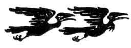

[Intangible Textual Heritage](../../index.md)  [Legends and
Sagas](../index)  [Index](index)  [Previous](ron05)  [Next](ron07.md) 

------------------------------------------------------------------------

p. 101

 

# TWILIGHT OF THE GODS

 

### CHARACTERS

SIEGFRIED

GUNTHER

HAGEN

ALBERICH

BRÜNNHILDE

GUTRUNE

WALTRAUTE

THE THREE NORNS

THE RHINE-MAIDENS

VASSALS

WOMEN

### SCENES OF ACTION

PRELUDE: ON THE VALKYRIES' ROCK

ACT I. THE HALL OF GUNTHER'S DWELLING ON THE RHINE.

THE VALKYRIES' ROCK

ACT II. IN FRONT OF GUNTHER'S HALL

ACT III. A WOODED REGION ON THE RHINE. GUNTHER'S HALL

 

------------------------------------------------------------------------

[Next: Prelude](ron07.md)
