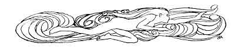
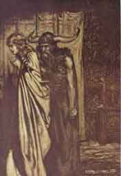
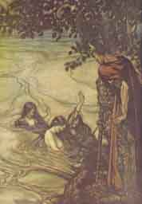
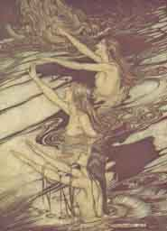
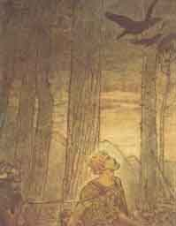
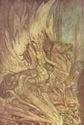
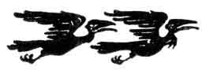
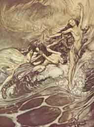

[Intangible Textual Heritage](../../index.md)  [Legends and
Sagas](../index)  [Index](index)  [Previous](ron09.md) 

------------------------------------------------------------------------

p. 160

 

# THE THIRD ACT

A wild wooded and rocky valley on the Rhine, which flows past a steep
cliff in the background. The three Rhine-Maidens, Woglinde, Wellgunde,
and Flosshilde, rise to the surface and swim and circle as if dancing.

The Three Rhine-Maidens

\[*Swimming slower*.\]

The sun  
Sends hither rays of glory;  
In the depths is darkness.  
Once there was light,  
When clear and fair  
Our father's gold shone on the billows.  
Rhinegold!  
Gleaming gold!  
How bright was once thy radiance,  
Lovely star of the waters!

\[*They sing and again start swimming and circling about. They pause and
then, then merrily splash the waters*.\]

O sun,  
The hero quickly send us  
Who again our gold shall give us!  
If it were ours,  
We should no longer  
Envy thine eye for its splendour.  
Rhinegold!  
Gleaming gold!  
How glad was thy radiance,  
Glorious star of the waters!

\[A horn is heard.\]

Woglinde

Hark! That is his horn!

 [  
Click to enlarge](img/16000.jpg.md)

"O wife betrayed,  
I will avenge  
Thy trust deceived"  
           See [p. 154](ron09.htm#page_154.md)

 

p. 161

Wellgunde

The hero comes.

Flosshilde

Let us take counsel.

\[*They all dive down quickly*.\]

Siegfried

\[*Appears on the cliff fully armed*.\]

Some elf has led me astray  
And lured my feet from the path.  
Hey, rogue! Behind what hill  
Hast suddenly hidden my game?

The Three Rhine-Maidens

Siegfried!

\[*Rise to the surface again and swim and circle as in a dance*.\]

Flosshilde

What art thou scolding about?

Wellgunde

With what elf art thou so wroth?

Woglinde

Hast thou been tricked by some sprite?

All Three

Tell us, Siegfried; let us hear!

Siegfried

\[*Regarding them with a smile*.\]

Have ye, then, hither charmed  
The shaggy-hided fellow  
Whom I have lost?  
Frolicsome maids,  
Ye are welcome to him,  
If he is your love.

\[*The maidens laugh*.\]

Woglinde

What would our guerdon be,  
Siegfried, if we restored him?

Siegfried

I have caught nothing yet,  
So ask of me what you will.

Wellgunde

A golden ring  
Gleams on thy finger.

The Three Rhine-Maidens

Wilt grant it?

p. 162

Siegfried

From a dragon grim  
I won the ring in fight;  
And think ye for a worthless bear-skin  
I would exchange the gold?

Woglinde

Art thou so mean?

Wellgunde

In bargains so hard?

Flosshilde

Free-handed  
Thou with women shouldst be.

Siegfried

On you did I waste my goods,  
My wife would have cause to scold.

Flosshilde

Is she a shrew?

Wellgunde

And beats thee sore?

Woglinde

Has the hero felt her hand?

\[*They laugh immoderately*.\]

Siegfried

Though gaily ye may laugh,  
In grief ye shall be left,  
For, mocking maids, this ring  
Ye ask shall never be yours.

\[*The Rhine-Maidens have again join hands for dancing*.\]

Flosshilde

So fair!

Wellgunde

So strong!

Woglinde

So worthy love!

The Three

How sad he should a miser be!

\[*They laugh and dive down*.\]

Siegfried

\[*Comes down nearer to the river*.\]

Why should I stand  
Their taunts and blame?  
Why endure their scorn?  
Did they return

 [  
Click to enlarge](img/16200.jpg.md)

"Though gaily ye may laugh,  
In grief ye shall be left,  
For, mocking maids, this ring  
Ye ask shall never be yours"  
                    See [p. 162](#page_162.md)

 

p. 163

To the bank again,  
The ring gladly I'd give them.

\[*Calling loudly*.\]

Hey, hey! ye merry  
Water-maidens,  
Come back; the ring shall be yours.

\[*He holds up the ring, which he has taken from his finger*.\]

The Three Rhine-Maidens

\[*Rise to the surface again. They appear grave and solemn*.\]

Nay, hero, keep  
And ward it well,  
Until the harm thou hast felt  
That in the ring lies hid.  
Then wouldst thou fain  
Be freed by us from its curse.

Siegfried

Sing something that ye know!

\[*Calmly puts the ring on his finger again*.\]

The Three Rhine-Maidens

Siegfried! Siegfried! Siegfried!  
Dark our knowledge for thee!  
The ring thou keepest  
To thy own scathe!  
From the gleaming gold  
Of the Rhine 'twas wrought;  
He who cunningly forged it,  
And lost it in shame,  
Laid a curse on it  
Which, for all time,  
The owner thereof  
Dooms to his death.  
As the dragon fell  
So shalt thou too fall,  
And that to-day;  
Thy fate is foretold,  
Wilt thou not give to the Rhine  
The ring to hide in its waters.

p. 164

Its waves alone  
Can loose the curse.

Siegfried

Enough, O ye women  
Full of wiles!  
Was I firm when ye flattered,  
I am firmer now when ye threaten!

The Three Rhine-Maidens

Siegfried! Siegfried!  
Our warning is true:  
Flee, oh, flee from the curse!  
The Norns who weave  
By night have entwined it  
In the rope  
Of Fate's decrees!

Siegfried

My sword once shattered a spear;  
And if the Norns  
Have woven a curse  
Into the strands  
Of destiny's rope,  
Nothung will cleave it asunder.  
A dragon once warned me  
Of this dread curse,  
But he could not teach me to fear.

\[*He contemplates the ring*.\]

The world's wealth  
Has bestowed on me a ring.  
For the grace of love  
Had it been yours,  
And still for love might it be got,  
But by threats to my life and my limbs--  
Had it not even  
A finger's worth--  
The ring ye never shall gain.  
My limbs and my life--

 [  
Click to enlarge](img/16400.jpg.md)

"Siegfried! Siegfried!  
Our warning is true:  
Flee, oh, flee from the curse!"  
                     See [p. 164](#page_164.md)

 

p. 165

Look!--thus  
Freely I fling away!

\[*He lifts a clod of earth from the ground, holds it over his head, and
with the last words throws it behind him*.\]

The Three Rhine-Maidens

Come, sisters!  
Fly from the madman!  
Though dauntless and wise  
He seems to himself,  
He is blind and in fetters bound fast.

\[*Wildly excited, they swim in wide circles close to the shore*.\]

Oaths he swore,  
And was false to his word;

\[*Moving quickly again*.\]

Runes he knows  
That he cannot rede.  
A glorious gift  
Fell to his lot;  
He flung it from him  
Unawares;  
And the ring that deals doom and death  
Alone he will not surrender!

Farewell, Siegfried!  
A woman proud  
Ere night falls thy wealth shall inherit.  
our cry by her will be heard.  
To her! To her! To her!

\[*They turn quickly to their dance, and gradually swim away to the back
singing*.\]

Siegfried

\[*Looks after them smiling, one foot on a piece of rock and his chin
resting on his hand*.\]

Alike on land and water  
I have studied women's ways:  
Still those who mistrust their smiles  
They seek with threats to frighten,  
And, are their threats despised,

p. 166

At once they begin to scold.  
And yet--  
Held I not Gutrun' dear,  
Of these alluring maidens  
One had surely been mine.

\[*He looks calmly after the Rhine-Maidens, who have disappeared, and
whose voices gradually die away. Horn-calls are then heard. Siegfried
starts from a reverie and sounds his horn in answer*.\]

Hagen's voice

\[*Far off*.\]

Hoiho!

Vassals' voices

Hoiho! Hoiho! Hoiho!

Siegfried

\[*Having answered the call with his horn*.\]

Hoiho! Hoihe!

Hagen

\[*Appears on the height, followed by Gunther. He sees Siegfried*.\]

So we have found thee  
Where thou wert hidden!

Hagen

Come down all! Here 'tis fresh and cool.

\[*The vassals now appear on the height, and come down with Hagen and
Gunther*.\]

Hagen

Here let us rest  
And see to the meal.

\[*They lay the game in a heap*.\]

Lay down the booty  
And hand round the wine-skins.

\[*Wine-skins and drinking-horns are produced. All lie down*.\]

Hagen

Now be the wonders told us  
Of Siegfried and his hunting  
That chased the game from us.

 [  
Click to enlarge](img/16600.jpg.md)

Siegfried's death  
      See p. 172

 

p. 167

Siegfried

No meal at all is mine;  
I beg of you  
To share with me your spoil.

Hagen

No luck at all?

Siegfried

I sought for forest-game,  
But water-fowl only I found;  
Furnished with the right equipment,  
A brood of three wild water-birds  
I had caught and brought you.  
Down there on the Rhine they told me  
That slain to-day I should fall.

\[*Gunther starts and looks darkly at Hagen. Siegfried lies down between
Gunther and Hagen*.\]

Hagen

A sorry chase were that  
If the luckless hunter fell  
A victim to the quarry!

Siegfried

Thirst plagues me!

Hagen

\[*Whilst he orders a drinking-horn to be filled for Siegfried, and
hands it to him*.\]

It has been rumoured, Siegfried,  
That thou canst tell the meaning  
Of what the birds sing:  
Does rumour speak true?

Siegfried

I have not listened  
For long to their song.

\[*He takes the drinking-horn and turns with it to Gunther, to whom he
offers it after he has drunk from it*.\]

Drink, Gunther, drink!  
Thy brother hands the draught!

Gunther

\[*Looks into the horn with horror. Moodily*.\]

A pale draught thou hast poured!

\[*More gloomily*.\]

Thy blood alone is there.

p. 168

Siegfried

\[*Laughing*.\]

With thine, then, be it mingled!

\[*He pours from Gunther's horn into his own so that it runs over*.\]

Thus mixed the wine flows over  
To Mother Earth  
May it prove a cordial kind!

Gunther

\[*With a deep sigh*.\]

Thou over-joyous man!

Siegfried

\[*Low, to Hagen*.\]

His cheer Brünnhild' has marred.

Hagen

\[*Low, to Siegfried*.\]

She speaks less plain to him  
Than speak the birds to thee!

Siegfried

Since I have heard women singing,  
The birds I have clean forgot.

Hagen

But thou didst hear them once?

Siegfried

\[*Turning with animation to Gunther*.\]

Hei! Gunther!  
Moody-faced man!  
Come, I will tell thee  
Tales of my boyhood,  
If thou wouldst care to hear them.

Gunther

'Twould please me much.

\[*They lie down close to Siegfried, who alone fits upright*.\]

Hagen

Sing, hero, sing!

Siegfried

Mime was  
A surly old dwarf  
Who because of greed  
Reared me with care,  
That when the child  
Grew sturdy and bold  
He might slay a dragon grim  
That guarded treasure in the wood.

p. 169

He taught me to forge  
And the art of fusing,  
But what the craftsman  
Could not achieve  
The scholar did  
By skill and by daring--  
Out of the splinters of a weapon  
Fashioned featly a sword.  
My father's blade  
Forged was afresh;  
Strong and true  
Nothung was tempered,  
Deemed by the dwarf  
Fit for the fight.  
The wood then we sought, and there  
The dragon Fafner I slew.

Listen and heed  
Well to my tale;  
I have marvels to tell you.  
From the dragon's blood  
My fingers were burning,  
And these I raised to my lips;  
And barely touched  
Was the blood by my tongue,  
When what a bird was saying  
Above me I could hear.  
On a bough it sat there and sang  
"Hei! Siegfried now owns  
All the Nibelung hoard!  
Oh! could he the hoard  
In the cave but find!  
Tarnhelm, if he could but win it,  
Would help him to deeds of renown;  
And could he discover the ring,  
It would make him the lord of the world!'

p. 170

Hagen

Didst thou take  
The Tarnhelm and ring?

A Vassal

Was that the end of the singing?

Siegfried

Having taken  
Tarnhelm and ring,  
Once more I listened  
And heard the sweet warbler;  
He sat above me and sang:--  
"Hei! Siegfried now owns  
Both the helm and the ring!  
Oh I let him not listen  
To Mime, the false,  
For Mime, too, covets the treasure,  
And cunningly watches and spies!  
He is bent on murdering Siegfried  
Be Siegfried wary of Mime!"

Hagen

'Twas well that he warned?

The Vassals

Got Mime due payment?

Siegfried

A deadly-brewed draught  
He brought me to drink  
But, fear-stricken,  
His tongue stammered truly:  
Nothung stretched him out dead!

Hagen

\[*With a strident laugh*.\]

The steel that he forged not  
Mime soon tasted!

\[*He has another drinking-horn filled, and drops the juice of a herb
into it*.\]

The Vassals

What further did the bird tell thee?

Hagen

From my horn  
Drink, hero, first  
A magical draught is this;

p. 171

It will mind thee of things long forgotten,  
And bring old days to remembrance.

\[*He offers the horn to Siegfried, who looks into it thoughtfully and
then drinks slowly*.\]

Siegfried

In sorrow I listened,  
Grieving looked up;  
He sat there still and sang.  
"Hei! Siegfried has slain  
The deceitful dwarf!  
I know for him now  
A glorious bride.  
She sleeps where rugged rocks soar  
Ringed is her chamber by fire.  
Who battles the flames  
Wakens the bride,  
Brünnhilde wins as reward!"

Hagen

The wood-bird's counsel  
Didst thou follow?

Siegfried

Straight without pause  
I rose and I ran

\[*Gunther listens with increasing astonishment*.\]

Till I came to the fire-ringed rock.  
I passed through the flames,  
And for prize I found,

\[*More and more ecstatic*.\]

Sleeping, and clad in bright mail,  
A woman lovely and dear.  
The hard helmet  
I loosened with care,  
And waked the maid with my kiss.  
Ah, then the burning, sweet embrace  
Of Brünnhild's rapturous arms!

p. 172

Gunther

\[*Springing up in greatest consternation*.\]

What says he?

\[*Two ravens fly up out of a bush, circle above Siegfried, and then fly
away towards the Rhine*.\]

Hagen

Didst understand  
What the ravens there said?

\[*Siegfried starts up suddenly, and, turning his back to Hagen, looks
after the ravens. Hagen thrusts his spear into Siegfried's back*.\]

Hagen

Vengeance--that was the word!

\[*Gunther and the vassals rush towards Hagen. Siegfried swings his
shield on high with both hands in order to throw it on Hagen; his
strength fails him; the shield drops from his grasp backwards, and he
falls down upon it*.\]

Gunther and the Vassals

Hagen, what dost thou?

\[*Who have tried to hold Hagen back in vain*.\]

Hagen

Death to traitors!

\[*He turns calmly away, and is seen in the gathering twilight
disappearing slowly over the height. Gunther bends over Siegfried in
great grief. The vassals stand round the dying man full of sympathy*.\]

Siegfried

\[*Supported by two vassals in a sitting posture, opens radiant eyes*.\]

Brünnhilde,  
Heaven-born bride,  
Awake! Open thine eyelids!  
Who again  
Has locked thee in sleep  
And bound thee in slumber so fast?  
Lo! he that came  
And kissed thee awake

p. 173

Again breaks the bonds  
Holding thee fettered  
And looks on Brünnhild's delight.  
Ah I those dear eyes  
Now open for ever!  
Ah I the soft fragrance  
Borne on her breathing!  
Death, thou art welcome--  
Sweet are thy terrors--  
Brünnhild' greets me, my bride!

\[*He sinks back and dies. The rest stand round him motionless and
sorrowing. Night has fallen. At a silent command from Gunther the
vassals raise Siegfried's body and bear it away slowly in a solemn
procession over the height. The moon breaks through the clouds, and
lights up the funeral procession with increasing clearness as it reaches
the top of the hill. A mist has risen from the Rhine which gradually
fills the whole stage, on which the funeral procession has become
invisible. After a musical interlude the mist divides again, until at
length the hall of the Gibichungs, as in Act I., appears with increasing
distinctness*.\]

It is night. The moonlight is mirrored in the Rhine. Gutrune comes out
of her chamber into the hall.

Gutrune

Was that his horn?  
\[She listens.\]

No!--he  
Has not returned.  
Troubled was my sleep  
By evil dreams!  
Then wildly neighed his horse;

p. 174

Brünnhild' laughed,  
And I woke up afraid.  
What woman was it  
I saw go down to the shore?  
I fear this Brünnhild'  
Is she within?  
\[*She listens at the door at the right and calls*.\]

Brünnhild'! Brünnhild'!  
Art awake?

\[*She opens the door timidly and looks into the inner room*.\]

No one is there!  
So it was she  
I saw go downwards to the Rhine.

\[*A distant horn sounds*.\]

Was that his horn?  
No!  
All silent!

\[*She looks out anxiously*.\]

Would but Siegfried return!

\[*Hagen's voice is heard outside coming nearer. When Gutrune hears it
she stands for a time transfixed with terror*.\]

Hoiho! Hoiho!  
Awake! Awake!  
Lights! Ho! lights here!  
Burning torches!  
Home bring we  
Spoils of the chase.  
Hoiho! Hoiho!

\[*Increasing light from the torches is seen without. Hagen enters the
hall*.\]

Up! Gutrun'!  
Give Siegfried greeting,

p. 175

For home to thee  
Thy hero comes.

Gutrune

\[*In great fear*.\]

What is wrong, Hagen?  
I heard not his horn.

\[*Men and women with lights and firebrands accompany, in great
confusion, the procession returning with Siegfried's body*.\]

Hagen

The hero pale  
Will blow it no more;  
No more will he ride  
To battle or chase  
Or gaily go wooing fair women.

Gutrune

\[*With growing terror*.\]

What bring they here?

\[*The procession reaches the middle of the hall, and the vassals set
down the body on a hastily improvised platform*.\]

Hagen

'Tis a wild boar's spoil they bring thee:  
Siegfried, thy husband slain.

\[*Gutrune shrieks and falls upon the corpse, General emotion and
mourning*.\]

Gunther

\[*Bends over the fainting Gutrune*.\]

Gutrun', gentle sister!  
Open thine eyelids!  
Look up and speak!

Gutrune

\[*Recovering consciousness*.\]

Siegfried--they have slain Siegfried!

\[*She pushes Gunther back violently*\].

Hence! false-hearted brother,  
Thou slayer of my husband!  
Oh, who will help me!  
Woe's me! Woe's me!  
These men have murdered my Siegfried!

Gunther

Cast not the blame on me;  
'Tis Hagen who must bear it:

p. 176

He is the accursèd wild boar  
That did the hero to death.

Hagen

With me art wroth for that?

Gunther

Woe and grief  
For aye be thy portion!

Hagen

\[*Stepping forward with terrible defiance*.\]

Yes, then, 'tis true that I slew him.  
I--Hagen--  
Did him to death!  
By my spear he falsely swore,  
So by my spear he fell.  
I have the sacred right  
Now to demand my booty,  
And what I claim is this ring.

Gunther

Away! Thou shalt not have  
What forfeit falls to me.

Hagen

Ye vassals, judge of my right!

Gunther

Thou wouldst seize Gutrune's dower,  
Insolent Niblung son?

Hagen

\[*Draws his sword*.\]

'Tis thus  
The Niblung son demands his own.

\[*He rushes on Gunther, who defends himself; they fight. The vassals
throw themselves between. Gunther falls slain by a stroke from Hagen*.\]

Hagen

Mine the ring!

\[*He makes a grasp at Siegfried's hand, which raises itself in menace.
All stand transfixed with horror*.\]

p. 177

Brünnhilde

\[*Advances firmly and solemnly from the background to the front. Still
at the back*.\]

Silence! Your sorrow  
Clamour less loud!  
Now for vengeance his wife comes,  
The woman all have betrayed.

\[*As she comes quietly forward*.\]

I have heard you whining  
As whine children  
When milk is spilt by their mother;  
But lamentation  
Meet for a hero unmatched  
I have not heard.

Gutrune

\[*Raising herself suddenly from the floor*.\]

Brünnhilde, spite-envenomed!  
Thou art the cause of our woe!  
For, urged by thee, the men have slain him;  
Cursèd hour that brought thee here!

Brünnhilde

Peace, hapless wretch!  
Thou never wert wife of his;  
His leman wert thou,  
Only that.  
But I am his lawful bride;  
To me was the binding oath sworn,  
Before thy face he beheld.

Gutrune

\[*Breaking out in sudden despair*.\]

Accursèd Hagen,  
Why didst thou give the poison  
That stole her husband away?  
O sorrow!  
Mine eyes are opened:  
Brünnhild' was the true love  
Whom through the draught he forgot.

\[*She turns from Siegfried in shame and fear, and, dying, bends over
Gunther's body; remaining motionless in this position until the end.
Hagen stands defiantly leaning on his spear and shield, sunk in gloomy
thought, on the opposite side. Brünnhilde stands alone in the middle.
After long and absorbed contemplation of Siegfried she turns with solemn
exaltation to the men and women*.\]

p. 178

Let great logs  
Be borne to the shore  
And high by the Rhine be heaped;  
Fierce and far  
Let the flames mount  
That consume to ashes  
Him who was first among men!  
His horse lead to me here,  
That with me his lord he may follow.  
For my body longs  
To have part in his glory  
And share his honour in death.  
Obey Brünnhild's behest.

\[*The young men, during the following, raise a great pyre of logs
before the hall, near the bank of the Rhine; women decorate this with
rugs, on which they strew plants and flowers*.\]

Brünnhilde

\[*Absorbed anew in contemplation of Siegfried's dead face. Her
expression brightens and softens as she proceeds*.\]

Sheer golden sunshine  
Streams from his face;  
None was so pure  
As he who betrayed.  
To wife forsworn,  
To friend too faithful,  
From his own true love--  
His only belovèd--  
Barred he lay by his sword.  
Never did man  
Swear oaths more honest,  
No one was ever  
Truer to treaties;  
Never was love  
Purer than Siegfried's;

p. 179

Yet oaths the most sacred,  
Bonds the most binding,  
And true love were never  
So grossly betrayed!

Know ye why that was?

\[*Looking upward*.\]

Ye Gods who guard  
All vows that are uttered,  
Look down on me  
In my terrible grief,  
Your guilt never-ending behold!  
Hear my voice accusing,  
Mighty God!  
Through his most valiant deed--  
Deed by thee so desired--  
Thou didst condemn him  
To the doom  
That else upon thee had fallen.  
He, truest of all,  
Must betray me,  
That wise a woman might grow!

Know I all thou wouldst learn?

All things! All things!  
All I know now:  
All stands plainly revealed.  
Round me I hear  
Thy ravens flapping.  
By them I send thee back  
The tidings awaited in fear.  
Rest in peace now, O God!

\[*She signs to the vassals to bear Siegfried's body on to the pyre, at
the same time she draws the ring of Siegfried's finger, and regards it
musingly*.\]

p. 180

I claim as mine  
What he has left me.  
O gold accurst!  
Terrible ring!  
I now grasp thee  
And give thee away.  
O sisters wise,  
Ye have my thanks  
For your counsel good, ye who dwell  
In the waters deep of the Rhine.  
What ye desire  
I gladly give;  
From out my ashes  
Take ye your treasure;  
The fire by which I am burnt  
Cleanses the ring of its curse.  
Down in the waves  
Wash it away,  
And guard ever pure  
The shining gold  
That stolen was to your grief!

\[*She has put the ring on her finger, and now turns to the pile of logs
on which Siegfried's body lies stretched. Taking a great firebrand from
one of the men, she waves it and points to the background*.\]

Fly home, ye ravens,  
Tell your lord the tidings  
That ye have heard by the Rhine.  
But fly, as ye go,  
By Brünnhild's rock;  
Still Loge flames there;  
Bid him follow to Walhall;  
For the Gods are drawing  
Near to their doom.

p. 181

Thus--thrown be the brand  
On Walhall's glittering halls!

\[*She hurls the brand on to the pile of wood, which quickly breaks into
flame. Two ravens fly up from the rock by the shore and vanish in the
background. Brünnhilde perceives her horse, which has Just been led in
by two men*.\]

Grane, my horse,  
Be greeted fair!

\[*She springs towards him, and, catching hold of him, removes his
bridle and bends to wards him affectionately*.\]

Knowest thou, my friend,  
To whom we are going?  
Thy lord lies radiant  
There in the fire,  
Siegfried, my hero blest!  
Thou neighest with joy  
To think thou shalt join him?  
Laughing, the flames  
Allure thee to follow?  
Feel thou my bosom,  
Feel how it burns;  
Flames of fire  
Have laid hold on my heart.  
Ah, to embrace him,  
By him be embraced,  
United for ever  
In love without end!  
Heiajoho! Grane!  
Give thy lord greeting!

\[*She has swung herself on to the horse, and urges it forward*.\]

 [  
Click to enlarge](img/18100.jpg.md)

Brünnhilde on Grane leaps on to the funeral pyre of Siegfried  
                                                      See [p.
182](#page_182.md)

 

p. 182

Siegfried! Siegfried!  
See! Brünnhild' greets thee, thy bride!

\[*She urges her horse with one leap into the burning pile of logs. The
flames immediately blaze up, so that they fill the whole space in front
of the hall and seem to catch hold of the building itself. The terrified
men and women press as far to the front as possible. When the whole
stage appears to be filled with fire the glow gradually fades, so that
there is soon nothing left but a cloud of smoke, which drifts towards
the back and hangs there as a dark bank of cloud. At the same time the
Rhine overflows and the flood rolls up over the fire. The three
Rhine-Maidens swim forward on the waves, and now appear over the spot
where the fire was. Hagen, who since the incident of the ring has been
watching Brünnhilde's behaviour with growing anxiety, is much alarmed by
the sight of the Rhine-Maidens. He throws away his spear, shield, and
helmet, and dashes into the flood as if mad, crying out, "Back from the
ring!" Woglinde and Wellgunde fling their arms round his neck and,
swimming away, draw him down with them into the depths.. Flosshilde,
swimming ahead of the others towards the back, joyously holds up the
recovered ring. Through the bank of cloud on the horizon a red glow of
increasing brightness breaks forth, and, illumined by this light, the
Rhine-Maidens are seen merrily circling about and playing with the ring
on the calmer waters of the Rhine, which has gradually retired to its
natural bed. From the ruins of the fallen hall the men and. women watch
in great agitation the growing gleam of fire in the heavens. When this
is at its brightest the hall of Walhall is seen, in which the Gods and
heroes sit assembled, as described by Waltraute in the first Act. Bright
flames seem to seize on the hall of the Gods. When the Gods are
completely hidden by the flames the curtain falls*.\]

 

 [  
Click to enlarge](img/18200.jpg.md)

The Rhine-Maidens obtain possession of the ring and bear it off in
triumph  
                                                            See [p.
182](#page_182.md)

 

 
