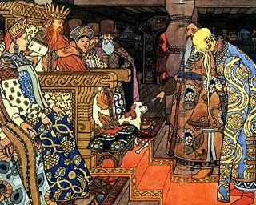

  
[Intangible Textual Heritage](../../index)  [Legends and
Sagas](../index) 

------------------------------------------------------------------------

[Buy this Book at
Amazon.com](https://www.amazon.com/exec/obidos/ASIN/B00260GTCA/internetsacredte)

------------------------------------------------------------------------

<table width="75%">
<colgroup>
<col style="width: 50%" />
<col style="width: 50%" />
</colgroup>
<tbody>
<tr class="odd">
<td width="50%" data-valign="TOP"></td>
<td width="50%" data-valign="CENTER"><h1 id="sixty-folk-tales" data-align="CENTER">Sixty Folk-Tales</h1>
from Exclusively Slavonic Sources
<h2 id="by-a.-h.-wratislaw" data-align="CENTER">by A. H. Wratislaw</h2>
<h4 id="section" data-align="CENTER">[1890]</h4></td>
</tr>
</tbody>
</table>

------------------------------------------------------------------------

[Contents](#contents)    [Start Reading](sfs00)    [Page
Index](pageidx)    [Text \[Zipped\]](sfs.txt.gz)

------------------------------------------------------------------------

|                                                                                                                           |
|---------------------------------------------------------------------------------------------------------------------------|
|  |

This collection of Slavic folktales at first glance appears to have all
of the usual suspects of European Märchen. Evil stepmothers: check;
plucky youths overcome impossible odds to marry kings' daughter: check;
dimwitted peasants given magical gifts: check.

What makes this book special are some tales and motifs that hint at even
older lore. Number [27](sfs37) is for all intents and purposes identical
to the Native American 'Earth Diver' creation myth. In [47](sfs63), man
is created from a drop of God's sweat. There are two tales of a global
flood in [48](sfs64) and [49](sfs65). In [36](sfs49) there is a very
dark 'Abraham and Isaac' story which goes a bit further than the Bible.
In [51](sfs67), there is a story of a hundred-leaved rose bush which
resembles images from the Kabbalah and Yogic lore. And number
[59](sfs77) is the tale of St. Patrick in a Balkan setting. All in all,
a great anthology of eastern European folklore.

------------------------------------------------------------------------

[Title Page](sfs00)  
[Preface](sfs01)  
[Contents](sfs02)  

### WESTERN SLAVONIANS

### Bohemian Stories

[Introduction](sfs03)  
[I. Long, Broad, and Sharpsight](sfs04)  
[II. 'The Three Golden Hairs of Grandfather Allknow'](sfs05)  
[III. Goldenhair](sfs06)  
[IV. Intelligence and Luck](sfs07)  
[V. The Jezinkas](sfs08)  
[VI. The Wood-Lady](sfs09)  
[VII. George with the Goat](sfs10)  

### Moravian Stories

[Introduction](sfs11)  
[VIII. Godmother Death](sfs12)  
[IX. The Four Brothers](sfs13)  

### Hungarian-Slovenish Stories

[Introduction](sfs14)  
[X. The Three Lemons](sfs15)  
[XI. The Sun-Horse](sfs16)  
[XII. The Golden Spinster](sfs17)  
[XIII. Are You Angry?](sfs18)  

### Upper and Lower Lusatian Stories

[Introduction](sfs19)  
[XIV. Right Always Remains Right](sfs20)  
[XV. Little Red Hood](sfs21)  

### Kashubian Story

[Introduction](sfs22)  
[XVI. Cudgel, Bestir Yourself!](sfs23)  

### Polish Stories

[Introduction](sfs24)  
[XVII. Prince Unexpected](sfs25)  
[XVIII. The Spirit of a Buried Man](sfs26)  
[XIX. The Pale Maiden](sfs27)  
[XX. The Plague-Swarm](sfs28)  

### EASTERN SLAVONIANS

### White Russian Stories

[Introduction](sfs29)  
[XXI. The Frost, The Sun, and the Wind](sfs30)  
[XII. Little Rolling-Pea](sfs31)  
[XXIII. The Wonderful Boys](sfs32)  

### Little Russian Stories (from Galicia.)

[Introduction](sfs33)  
[XXIV. God Knows How to Punish Man](sfs34)  
[XXV. The Good Children](sfs35)  
[XXVI. The Devil and the Gipsy](sfs36)  
[XXVII. God and the Devil](sfs37)  

### Little Russian Stories (from South Russia)

[Introduction](sfs38)  
[XXVIII. The Beautiful Damsel and the Wicked Old Woman](sfs39)  
[XXIX. The Snake and the Princess](sfs40)  
[XXX. Transformation into a Nightingale and a Cuckoo](sfs41)  
[XXXI. Transmigration of the Soul](sfs42)  
[XXXII. The Wizard](sfs43)  

### Great Russian Stories

[Introduction](sfs44)  
[XXXIII. The Lime-Tree](sfs45)  
[XXXIV. Ilya of Murom and Nightingale the Robber](sfs46)  

### SOUTHERN SLAVONIANS

### Bulgarian Stories

[Introduction](sfs47)  
[XXXV. The Lord God as an Old Man](sfs48)  
[XXXVI. Bulgarian Hospitality](sfs49)  
[XXXVII. Cinderella](sfs50)  
[XXXVIII. The Golden Apples and the Nine Peahens](sfs51)  
[XXXIX. The Language of Animals](sfs52)  

### Serbian Stories

[Introduction](sfs53)  
[XL. The Lame Fox](sfs54)  
[XLI. The Sons' Oath to Their Dying Father](sfs55)  
[XLII. The Wonderful Hair](sfs56)  
[XLIII. The Dragon and the Prince](sfs57)  
[XLIV. Fate](sfs58)  

### Serbian Stories From Bosnia

[Introduction](sfs59)  
[XLV. The Birdcatcher](sfs60)  
[XLVI. The Two Brothers](sfs61)  

### Serbian Stories From Carniola

[Introduction](sfs62)  
[XLVII. The Origin of Man](sfs63)  
[XLVIII. God's Cock](sfs64)  
[XLIX. Kurent The Preserver](sfs65)  
[L. Kurent and Man](sfs66)  
[LI. The Hundred-Leaved Rose](sfs67)  

### Croatian Stories

[Introduction](sfs68)  
[LII. Kraljevitch Marko](sfs69)  
[LIII. The Daughter of the King of the Vilas](sfs70)  
[LIV. The Wonder-Working Lock](sfs71)  
[LV. The She-Wolf](sfs72)  
[LVI. Milutin](sfs73)  

### Illyrian-Slovenish Stories

[Introduction](sfs74)  
[LVII. The Friendship of a Vila and of the Months](sfs75)  
[LVIII. The Fisherman's Son](sfs76)  
[LIX. The White Snake](sfs77)  
[LX. The Vila](sfs78)  
