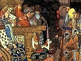

  
[Intangible Textual Heritage](../../index.md)  [Legends and
Sagas](../index)  [Index](index)  [Previous](sfs43)  [Next](sfs45.md) 

------------------------------------------------------------------------

[Buy this Book at
Amazon.com](https://www.amazon.com/exec/obidos/ASIN/B00260GTCA/internetsacredte.md)

------------------------------------------------------------------------

  
*Sixty Folk-Tales from Exclusively Slavonic Sources*, by A.H. Wratislaw,
\[1890\], at Intangible Textual Heritage

------------------------------------------------------------------------

p. 164

# GREAT RUSSIAN STORIES.

HERE I have but little to remark that has not already been noticed by
Mr. Ralston. In [No. 33](sfs45.htm#an_33.md) I have given a pretty variant
of Grimm's 'Fisherman's Wife.' In this story, which is from the
Government of Moscow, there is a curious confusion between 'king'
(*korol*), and 'emperor' (*tzar*). The peasant asks to be made *korol*
'king,' but is answered that an 'emperor' (*tzar*) is chosen by God. The
King of Poland was formerly the mighty potentate west of Moscow, which
emerged from Tartar bondage under a grand-duke, or grand-prince. This
confusion may possibly imply that the story was crystallized in its
present form not long after the assumption of the imperial dignity by
the ruler of Muscovy.

As to [No. 34](sfs46.htm#an_34.md), Mr. Ralston, in his 'Songs of the
Russian People,' gives an account of the manner in which Ilya of Murom
obtained a vast accession of strength from the still mightier hero
Svyatozor (pp. 58-63). By his exploits, however, in the story which I
have given, Ilya appears to have already possessed strength enough for
most purposes.

------------------------------------------------------------------------

[Next: XXXIII. The Lime-Tree](sfs45.md)
