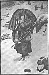

  
[Intangible Textual Heritage](../../index)  [Legends & Sagas](../index.md) 
[Index](index)  [Previous](srf03)  [Next](srf05.md) 

------------------------------------------------------------------------

p. 29

# THE TEST OF WAR

Leo Lermontov was scarcely twenty, but looked older. He stood over six
feet in height, and had broad shoulders and great muscles. His face was
tinged with the sadness that sometimes survives from early hardships.
Two deep lines crossed his forehead, and his eyebrows sloped sideways
over his deep grey eyes, which one of his friends compared to
"watch-dogs peering from their kennels". He was a ship carpenter by
trade, and not only skilled and conscientious, but of exceedingly
regular habits. His employer regarded him as an exemplary workman. He
never took strong liquors, remembering with bitterness that his father,
who had been a schoolmaster, became a beggar through vodka drinking, and
had gone to an early grave. At the end of each week he deposited a sum
of money in a savings bank with unfailing regularity. Because he always
shaved clean he was nicknamed "the Englishman" by his fellow-workmen.

"Why don't you allow your beard to grow?" he was asked one day. "Are you
ashamed of being a man?"

p. 30

"A clean face is honourable; even a goat has a beard," Leo answered,
quoting an old saying.

Since his mother's death the young man had lodged with Simon Glinka, the
hardware merchant, in a three-storied house on the outskirts of
Petrograd. This Glinka was a widower, and had two sons, who presented a
sharp contrast one to another. Maksim, the eldest, was a lawyer's clerk.
He had a crafty face, with shifty grey eyes speckled with white, a
tilted nose with wide nostrils, and a mouth that wore a sneer even when
he smiled; he kept his dark-brown moustache closely cropped, and
inclined to dress showily. His younger brother, Nikolay, had been a
student until his health broke down. He was a slim, consumptive lad of
eighteen, with yellow curly hair, soft blue eyes, a thin long nose, and
a sensitive mouth like a girl's. His father adored him, because he was
the image of his dead mother, and loved to satisfy his every whim.
Nikolay's ambition was to be a great poet like the immortal Pushkin, the
Byron of Russian literature. He was an impulsive lad of many moods.
Some-times he was fretful and depressed for days on end and spoke
little, and sometimes he was boisterous and cheerful, and darted about
the house, insisting on helping old Ulinka, the house-keeper, who was
very stout, asthmatic, and half-deaf. When Nikolay's shrill laugh rang
from the kitchen, his father's face always brightened

p. 31

and his step seemed lighter as he entered the little living-room of an
evening. Leo, who admired the lad because he had great learning, was
also affected by his moods.

It was otherwise with Maksim. He jeered at his brother, whether he was
sad or merry. "You are a bookworm," he declared one evening. "You feed
on idle fancies, and live in a world of imps and ghosts. One day you
sulk like a child over a broken toy because some heroine of romance is
in trouble; another day you trip about like a dancing girl because she
has been rescued by a gallant knight. No wonder you make yourself ill.
You should live like me in a real world, and meet real people and see
real things happening. Poets and novelists write chiefly for women. Busy
men of the world have little need for them. No man ever made money by
following the teachings of these miserable bookmakers."

"What about our ideals?" Nikolay protested. "Is the purpose of life
merely to make money?"

"Partly that," sneered Maksim, "and partly to spend it."

"Men who write books often make great fortunes," Leo remarked. "Some day
Nikolay may write so well that he will grow rich."

Maksim laughed dryly. "He's not like you, Leo; he despises money-making.
He would rather be famous than wealthy."

"Yes, much rather," Nikolay agreed promptly. "Why not be both?" smiled
Leo. "You deserve

p. 32

to be well paid for your work. Every day you write a great deal, and I
think your poetry is quite as good as Pushkin's."

"Good or bad, it's not worth a kopeck in the market," Maksim sneered.
"He wastes his time all to no purpose."

Nikolay's face quivered. Tears stood in his eyes, and without attempting
to answer his brother he left the room abruptly.

"How unsympathetic you are!" exclaimed Leo, turning a hard face on the
law clerk. "What pleasure does it give you to hurt your brother's
feelings so?"

"Don't get angry, Leo," Maksim said mockingly. "This is not a matter to
fight about."

"I am not thinking about fighting."

"You always look as if you were. . . . Let us have something to eat.
Good food puts one in a good temper."

Maksim had a great contempt for Leo, because he was poorly educated and
possessed money which he refused to spend.

"Why do you hoard up your savings like a miser?" he once asked the ship
carpenter. "Money was made to be spent."

"Yes," Leo answered slowly; "but it can be spent wisely."

"What do you know about spending?" jeered the clerk. "You have no
experience in that art. If you could only realize the pleasure that is
got out of life by tossing coins about, you would

p. 33

wonder at yourself. I could spend more than I manage to earn."

"That's nothing to boast about. Any fool can spend. It takes a wise man
to save."

"Some day I shall have luck. I almost made a fortune at betting last
week."

"But you didn't; you lost everything."

"Well, one must take risks. Some day my chance will come. When I meet
with good luck I shall become rich at a bound."

Leo rubbed his chin with the palm of his right hand. "I never forget the
old proverb," he remarked quietly, "which says, 'Good luck vanishes like
our curls; bad luck lasts like our finger-nails'."

"You certainly never forget these old wives' proverbs," exclaimed the
clerk impatiently. "What's the good of them? They were invented by
ignorant people of another age. No wonder you lead such a miserable
existence, always toiling away and never enjoying life."

"Black may be toil, but white is its price," answered Leo, with a faint
smile, quoting another favourite saying.

While they were arguing in this manner Simon Glinka, the hardware
merchant, opened the door softly. He stood for a few seconds, framed in
the doorway, gazing pensively at the young men over his spectacles, a
newspaper dangling from his right hand. Although of medium height, he
looked smaller because he inclined to stoutness, and his shoulders had
grown so round that his

p. 34

head seemed to be thrust too far forward; his brown beard was turning
white at the sides, and his face was covered with numerous small
wrinkles that ran this way and that like creases in crushed clothing;
his bushy eyebrows cast a shadow over his pondering grey eyes.

"Here's an end to all argument meantime," he said at length in a low,
tremulous voice, as he walked into the centre of the room, raising the
newspaper before his face. "We are on the very brink of war. Only a
miracle can avert it now."

"If the Tsar shows a stern front," Maksim declared, "Germany will
sheathe the sword."

"Germany seems rather to be only too eager to fight," sighed his father.
"What a terrible war it will be, too! Almost every nation will be forced
to take one side or another. Thousands and thousands will be killed and
thousands will be ruined."

"Give me the paper," Maksim said impatiently. "You always look on the
dark side of things. Let me see. . . ."

He glanced down a column, and suddenly his face grew very pale.

"So," he muttered, "the prospect is black indeed. I'll be called up with
the second-class reserves, of course. Just my luck. You, Leo, will be
called up also."

Leo nodded his head gravely. "War is a brutal thing," he said softly;
"but we must obey the will of God and the Tsar's decree."

p. 35

"The poor will suffer terribly," moaned Glinka, "and those who sell to
the poor, as I do, must suffer also."

"He who sweats in the field and prays to God at home will never starve,"
Leo said, repeating an old saying.

Maksim threw down the paper. "I must get out-of-doors," he declared,
"and hear what people are saying of this."

"Do not be late to-night," urged his father; "we shall be anxious to
learn any fresh news."

Maksim hurried through the streets towards the centre of the city, his
mind greatly agitated. Knots of people were gathered at every corner
discussing the prospects of war. Wild rumours were already on foot. "The
Germans have crossed the frontier and are marching on Warsaw," some
declared.

"The holy Russian land is large," Maksim overheard one man exclaim; "God
has chosen a portion of it to be the graveyard of our enemies."

Many seemed eager to fight, and expressed fears lest the Tsar should
yield to blustering Germany at the last moment. But Maksim dreaded war.
He thought of the pleasures he would have to give up and the hardships
that confronted him. Indeed, all his thoughts were concentrated in
himself. What cared he for Russia or the public good? If he had money at
his disposal, he told himself, he would leave Petrograd that evening and
escape to a foreign country. And

p. 36

he thought it his misfortune to be possessed of hardly a rouble. If he
found no comfort in the crowded streets, he found less at the clubs he
was in the habit of frequenting. Everyone seemed convinced that war was
inevitable. Before he returned homeward he heard that mobilization had
already begun.

At a street corner he met Michael Poroshin, a sharp-faced little man who
was employed in a savings bank.

"You are going home early to-night, Michael," he said.

"And so are you, Maksim," retorted his friend. "And no wonder.
Everything is upset with this clamour about war. I have just come from
the office and feel tired. We have been very busy this evening."

"You surprise me, Michael. I should have thought people would forget
about hoarding money at such a time."

"They are not hoarding it, but drawing it. Such a crowd we had in front
of the counters. Some wanted to withdraw every kopeck they possessed."

"Ah," exclaimed Maksim, "would I had a few roubles to my credit! But I
am poorer than usual."

Michael laughed dryly. "You should take a lesson from Leo," he said,
"he's an example to all of us."

Maksim halted, laying his hand on his friend's

p. 37

shoulder. "Have you seen Leo this evening?" he whispered.

Michael nodded with a sly smile. "I am not supposed to answer such
questions, of course."

"Did he draw much--a hundred roubles, say?" "Much more," muttered the
other with a shrug. "Two hundred--three hundred?"

Michael glanced round about apprehensively. Then he whispered slowly,
"Five hundred roubles--not a kopeck less. What he wants to do with all
that money I can't even guess."

"Five hundred roubles--five hundred roubles!" Maksim repeated hoarsely,
staring blankly in his friend's face.

They resumed their walk in silence, conversing in low tones.

"I wonder what he intends doing," Michael remarked.

"Perhaps he's going abroad to escape mobilization."

"If that were his intention he would have drawn more," the bank clerk
said.

"Has he really so much saved?" Maksim asked abruptly.

"I'm not sure of the exact sum," answered Michael cautiously, "but I
know he has not drawn everything--not nearly all he possesses. So he
can't be going away."

The conversation then turned to the prospects of war, and after a time
the friends separated. Maksim did not go home at once. He walked

p. 38

down a side street towards an open space to think matters over. He
wanted money, and was tempted by Leo's hoard. So he resolved, if the
opportunity offered, to steal it and depart speedily to a foreign
country. Little did he care what would be thought about him once he got
clear of Russia. Like all cowards he was extremely selfish and thought
of himself alone. What cared he what became of others?

Now when Leo returned from the bank he went straight to his little attic
and placed his money in his clothes-box, turning the key in the lock.
Then he hastened downstairs to chat with Nikolay, who had been out
walking by the river-side, all alone, as was his wont. He found the lad
crouched up in the window-place, reading his favourite Pushkin--the
master poet of his native land.

"How can you sit reading poetry at such a time, Nikolay?" Leo asked with
a smile.

The dreamy lad looked up with bright eyes. "Ah!" he exclaimed with
rapture, "Aleksandr Sergyeevich Pushkin voices every mood of the people
whether in time of war or peace. Listen to this:

Rise, one and all, O rise!  
Russia's heroes with fearless eyes,  
In countless numbers like the ocean's waves,  
    In battle frenzy ’gainst the foemen sweep;  
    Room will be found on Russia's plains to sleep,  
    And none will e’er forget their brethren's graves.

p. 39

"Yes, many must fall asleep ere victory will be won," Leo said softly.

"It troubles me," Nikolay sighed, "that I cannot go to battle. It is
glorious to be a victor: it is glorious to die a hero's death, fighting
for one's native land. If war breaks out, I must sit here and dream
while others lay down their lives. What a poor creature I am, Leo!"

"You will play your part too, Nikolay. You shall sing songs about
Russia's heroes so that generations unborn may be moved to imitate them
as we try to imitate our forefathers."

"Ah! I know what you are thinking about now, Leo. You remember
Zhukovski's 'Minstrel in the Russian Camp' which I read to you the other
evening?"

"Read it again, Nikolay. I'll understand it better now," urged the
carpenter.

The lad leapt to his feet and began to pace the room with a book in his
left hand, which he glanced at only occasionally, and half-recited,
half-chanted, the stirring poem:

Now to the warriors of old time,  
  The strong in fight and glory!  
These warriors and their deeds sublime  
  Are lost in distant story!  
The grave hath gathered up their dust,  
  Their homes--the storm hath razed them;  
Their helmets are devoured by rust,  
  And silent those that praised them:  
But in their children live their fires,  
  We tread the land that bore them, p. 40  
And see the shadows of their sires  
  With all their triumphs o'er them.

Verse after verse rolled off his tongue with relish. Leo sat fascinated,
looking and listening. He never could understand poetry except when it
came from Nikolay's lips. Then it stirred him strangely.

"Read on," he urged the lad when he had finished the poem and sank into
a corner. "But do not read more about war. Let us forget all about war
to-night. I would rather hear a tale from Pushkin. I like to hear you
read the 'Fountain' poem."

Nikolay lit the lamp. He was in the mood that evening to recite great
verse. The war excitement had roused his imagination. So he opened a
thick volume and began to roll off the full-throated measures of the
master poet in a voice that rose and fell like the night wind in a
forest. Sometimes he sprawled in a chair; sometimes he paced the room,
declaiming like an actor on the stage.

Maksim entered the house noiselessly as his brother thus engaged
himself, after peering through a rent in the window-blind. He knew
Nikolay would continue reading for some time longer, and was certain
that Leo, who liked to humour the young poet, must sooner or later fall
asleep. He had often found the carpenter snoozing peacefully while the
young poet read to him.

p. 41

"Now is my opportunity," Maksim told himself in the depths of his wicked
heart, thinking of Leo's roubles. He glanced towards the kitchen to
ascertain if Ulinka was still at work. It pleased him mightily that the
old woman dozed in a chair, breathing heavily. He knew his father would
not return for another hour.

Removing his boots, he crept upstairs towards Leo's attic, as
noiselessly as a cat stalking a mouse. He knew the exact place where the
clothes-box lay and went towards it. Grasping the lid, he found it
locked. Then he ran his fingers towards the keyhole until he touched a
bunch of keys, which jingled slightly; in another second he had opened
the box and begun to search it, without seeing aught, like a blind man.
His hand closed on a bag of gold; he thrust it into his pocket; then he
found another and another. His heart was beating loud and fast with
excitement.

Closing down the lid of the box, he turned the key in the lock; the
sharp, metallic click seemed to resound through the house. He tiptoed to
the stairhead and there stood trembling and listening in the growing
dusk. None of the inmates had been disturbed. Nikolay's voice continued
its droning sound in the little sitting-room below, like a monk at his
prayers. A clock ticked loudly in the kitchen where old Ulinka snored
wheezily in her sleep. . . . Maksim began to descend slowly, step by
step, fearing to be discovered

p. 42

every moment. Once a board creaked beneath him and he shuddered
convulsively, a cold sweat breaking out on his forehead; his heart
knocked loudly against his ribs as if his conscience sought to give the
alarm. He paused on the first landing. . . . Nikolay's voice had struck
a higher note and he declaimed more rapidly.

"Curse him! he will wake Leo," Maksim muttered inwardly. In desperation
the clerk forced himself onward and downward until at length he reached
the front door. He let himself out softly and ran down the street, nor
did he pause to put on his boots until he had turned a corner. Not a
living soul was in sight. He had entered and left the house unobserved,
and now possessed a goodly sum of money.

Choosing a roundabout way to avoid meeting his father he sped towards
the centre of the city. "I shall never return home again," he told
himself. But the thought gave him no pleasure. Instead, it filled his
heart with despair. An icy blankness seemed to have suddenly enveloped
his life.

"You will be caught and sent to prison," his conscience whispered. "You
have robbed a friend and dishonoured your father's house. Your crime
will break the old man's heart. You are now a criminal and an outcast."

Tortured by his thoughts, he entered a low vodka shop and thrust himself
through a noisy crowd towards the counter. He thought vodka

p. 43

would give him the courage of which he was in sore need.

In less than an hour later his father reached home. Nikolay had ceased
reading and sat conversing with his friend about the war once again.

"I shall miss you very much, Leo, if you are called up to serve," the
young poet declared.

"I shall certainly be called up," answered the other slowly and
deliberately. "Perhaps I may never return, who knows? Many must die. The
destined sheep cannot escape the wolf."

Glinka entered as he was speaking and sat down with a sigh.

"Have you heard any further news?" Leo asked him.

"There are many rumours," said Glinka. "One hardly knows what to believe
and what not to believe. But it seems certain that war is not far off. .
. . Where is Maksim?"

"He has not yet returned," Nikolay answered.

"Let us have supper," said the merchant wearily. "Go and rouse up
Ulinka, my son."

Nikolay sprang to his feet. "I shall make the coffee myself. It is time
poor old Ulinka was in bed." He left the room, closing the door behind
him.

Leo drew his chair towards Glinka, and raising his face began to speak.
"We may not have many more evenings together. Wide is the gate leading
to the battlefield, but narrow is the way out of it. Who knows whether
one will return

p. 44

again after bidding farewell. Listen to me. I have something to tell
you, Simon Glinka. To-night I drew the bulk of my savings from the bank,
and they are in my box upstairs. I wish to do something for Nikolay. He
is not so robust as the rest of us, and if war brings suffering he may
be in sore straits. Last winter he seemed almost unable to endure the
cold weather. With this money--there are five hundred roubles in all--he
can be sent to the south, or to some foreign country where the winter is
mild and open."

Glinka was struck dumb with heartfelt gratitude. Tears welled to his
eyes. He hung his head.

If five hundred roubles are not enough I can give another hundred--all I
possess." He rose up and crossed the room. "To-morrow we can make
arrangements. The doctor will give us good advice. . . . You will allow
me to do this for Nikolay, won't you, Simon Glinka? For his sake you
dare not refuse."

"God will bless you, Leo. He will reward you. Your heart has ears," the
old man said at length, his voice trembling with emotion. The thought of
the coming winter had kept him in constant dread. He feared Nikolay
would never survive another illness.

"Do not say a word to the lad about this," Leo went on. "Wait until I
have gone. Just say I helped a little. He is so proud: he might refuse
my money."

p. 45

"I will pay you back some day, Leo Lermontov," muttered Glinka faintly.
"I would fain decline your offer, but cannot for Nikolay's sake. May God
reward you with his protection on the battlefield!"

"Hush! Nikolay is coming," Leo whispered. "Say no more about this matter
meantime."

The young lad entered carrying the coffee-pot, which he laid on the
table. "I thought I would never wake up Ulinka," he exclaimed
laughingly. "When at length she opened her eyes she thought it was
morning, and asked: 'Why have you risen so early? The sun is not yet up.
Has the war begun so suddenly?"

After supper Leo and Nikolay rose to go to bed, but the merchant lit his
pipe and said he would wait for Maksim. "I have something to say to
him," he told the others.

A friend had told the merchant that. his eldest son had been overheard
declaring in a vodka shop he would rather flee from Russia than fight
for the Tsar. This troubled Simon Glinka greatly. He dreaded such wild
words might bring disgrace and perhaps ruin to him at a time when all
good Russians had need to stand shoulder to shoulder like true brothers.
Besides, he regarded with apprehension his son's growing habit of
frequenting vodka shops, and intended to admonish him severely on that
account.

His heart was heavy as he sat there pondering over his sons. The one was
wayward, and growing

p. 46

dissolute; the other, so dear to his heart, seemed to be slipping away
from him.

Suddenly he heard a noise on the stairs. In another minute Leo entered
the room. His face was pale and hard. He closed the door, and advancing
towards the old man said, in a low hoarse voice:

"Maksim has been here and is gone."

Glinka rose to his feet. "What do you mean, Leo?" he gasped.

"The five hundred roubles I drew for Nikolay have been taken from my
box," Leo answered. "I found Maksim's handkerchief lying on the attic
floor."

As he spoke he threw a scented handkerchief on the table.

Glinka swayed like a man suddenly wounded in battle, and would have
fallen had not Leo grasped him in his strong arms.

Maksim found it impossible to leave Petrograd by train. The ordinary
railway traffic had been suspended to permit the free and rapid movement
of troops. For three days and nights he concealed himself in a gambling
den and there lost three hundred roubles at cards. Then he bribed the
skipper of a trading schooner to be allowed to travel as a stowaway to
Stockholm, with two of his evil companions. But ere the vessel had left
the Gulf of Finland it was held up by one of the Tsar's cruisers. An
officer with half a dozen men came on board, and the skipper was
informed

p. 47

that war had been declared. A search was made for stowaways of military
age, and Maksim and his companions were discovered and arrested. The
schooner was then allowed to proceed.

In due course Maksim appeared before a court martial, which inflicted a
punishment. He was afterwards sent southward with a draft to join his
regiment.

 

Several months went past, and Maksim took part in much hard fighting.
The discipline of service and the perils and sufferings of warfare
wrought a wondrous change in him. Indeed, he became a new man, and
fought so bravely and well that he was twice promoted. The thought of
his crime, however, ever remained a constant source of pain to him. He
prayed fervently for forgiveness, and vowed that when war was over he
would do his utmost to repay to Leo the money he had stolen.

Winter came on, and still the fighting waxed fiercely as ever. Would it
never come to an end so that he might begin a new life at home and
secure his father's forgiveness and blessing?

He was wounded while fighting in Poland, and after recovering in
hospital, received orders to join a new regiment which had been sent to
operate in Galicia.

Thus it came about that he took part in the campaign against the
Austrian forces on the eastern slopes of the Carpathian Mountains.

p. 48

\[paragraph continues\] Russia was once again knocking at the "doors" of
Hungary.

In the Dukla Pass the Tsar's brave soldiers made fearless and persistent
attacks through the snow against the enemy, who occupied trenches on
steep inclines, which were protected by confused and snow-concealed
mazes of barbed wire.

Desperate deeds of valour were performed in that desolate region. Many
Austrian positions, deemed impregnable by the defenders, were assaulted
and won. And although the sacrifice of human lives was heavy, the
Russian soldiers were not a whit dismayed. Companies followed companies
of brave men up the snowy slopes and were mowed down by machine-gun and
rifle fire. But they were followed by others until the defence was
overwhelmed step by step and from height to height. Never before had
such battles been fought in the world as were waged on those wintry
hill-sides. The white wastes of snow were broken and torn by unwearied
feet and stained with human blood.

One evening Maksim advanced with a force up a slippery gully towards a
strongly-held Austrian trench. Bullets swept downwards like great
hail-stones, and brave men fell constantly and silently in the snow. At
length only a remnant remained, and all the officers had been killed or
wounded. The wearied survivors crept and huddled under the shelter of an
overhanging rock like sheep seeking shelter from a snowstorm. They
seemed

 

[  
Click to enlarge](img/04900.jpg.md)  
MAKSIM FELT HIMSELF BEING LIFTED AND CARRIED AWAY  

 

p. 49

resolved to wait until darkness came so as to effect a safe retreat.

Then Maksim assumed command. He rallied the men with brave words and
urged them to follow him and press onwards, so that they might complete
the task they had begun. They were glad to follow him. It was better to
die fighting than to die in retreat. So with high hearts and renewed
vigour they attacked and pressed home until the position was won. The
thin line of desperate men had broken through the entanglements and
carried the last trench that lay before them. Maksim fell wounded in his
hour of triumph, and rolling down a steep incline, lay half-buried in
the snow behind a great boulder. Consciousness immediately deserted him.

Reinforcements had been rushed forward, and ere long they were resisting
a fierce counter-attack higher up the hill-side. The wounded lay moaning
and bleeding on the snowy slopes.

How long Maksim remained unconscious he could never tell. When he awoke
he felt himself being lifted and carried away, while he endured terrible
agony from a wound in his right thigh. Darkness came on as he was borne
down the hill-side, and he again lapsed into unconsciousness.

When he next opened his eyes he was lying on a stretcher in a
dimly-lighted wooden house, surrounded by many other wounded soldiers.
His thigh had been placed in splinters and tightly bandaged. Someone was
bending over him and

p. 50

holding a flask to his lips. He drank and felt refreshed. Then he looked
in the face of the man and whispered, "Leo."

It was indeed Leo Lermontov, who had found him lying in the snow and had
carried him on his shoulders to a place of safety.

"Leo, Leo," he muttered huskily, "I have need of your forgiveness. I
stole your roubles and ran away, and now you have saved my life."

"They were not my roubles," answered Leo slowly; "I gave them to
Nikolay, and you cannot ask his forgiveness now, because he is dead."

Maksim wept, and Leo went out into the darkness.

------------------------------------------------------------------------

[Next: The Lady of Moscow](srf05.md)
