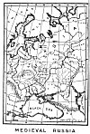
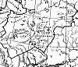
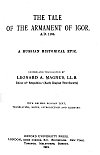

  
[Intangible Textual Heritage](../../index)  [Legends/Sagas](../index.md) 
[Index](index)  [Next](tai01.md) 

------------------------------------------------------------------------

[Buy this Book at
Amazon.com](https://www.amazon.com/exec/obidos/ASIN/087501061X/internetsacredte.md)

------------------------------------------------------------------------

[  
Click to enlarge](img/map.jpg.md)  
MEDIEVAL RUSSIA  

(*228 Kb*)

[  
Click to enlarge](img/mapdet.jpg.md)  
Map Detail (Full Size)  

(*192 Kb*)

# THE TALE

# OF THE ARMAMENT OF IGOR.

##### A.D. 1185.

##### A RUSSIAN HISTORICAL EPIC.

###### EDITED AND TRANSLATED BY

## LEONARD A. MAGNUS, LL.B.

##### Editor of 'Respublica' (Early English Text Society)

###### WITH REVISED RUSSIAN TEXT,

###### TRANSLATION, NOTES, INTRODUCTION AND GLOSSARY.

#### OXFORD UNIVERSITY PRESS.

#### LONDON, AMEN CORNER, E.C. EDINBURGH. NEW YORK.

#### TORONTO. MELBOURNE. BOMBAY.

#### \[1915\]

###### PUBLICATIONS OF THE PHILOLOGICAL SOCIETY.

###### DEDICATED TO MY FATHER.

[  
Click to enlarge](img/title.jpg.md)  
Title Page  

NOTICE OF ATTRIBUTION  
Scanned at Intangible Textual Heritage, May 2006. Proofed and formatted
by John Bruno Hare. This text is in the public domain in the United
States because it was published prior to January 1st, 1923. These files
may be used for any non-commercial purpose provided this notice of
attribution is left intact.

------------------------------------------------------------------------

[Next: Preface](tai01.md)
