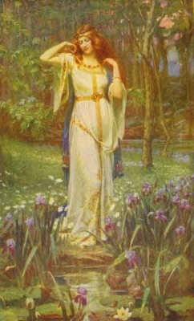

  
[Intangible Textual Heritage](../../index)  [Legends and
Sagas](../index) 

------------------------------------------------------------------------

[Buy this Book at
Amazon.com](https://www.amazon.com/exec/obidos/ASIN/B002DYIXO6/internetsacredte)

------------------------------------------------------------------------

<table width="75%">
<colgroup>
<col style="width: 50%" />
<col style="width: 50%" />
</colgroup>
<tbody>
<tr class="odd">
<td width="50%" data-valign="TOP"> 
Freyja [Public domain image]</td>
<td width="50%" data-valign="CENTER"><h1 id="teutonic-myth-and-legend" data-align="CENTER">TEUTONIC MYTH AND LEGEND</h1>
<h2 id="by-donald-a.-mackenzie" data-align="CENTER">by Donald A. Mackenzie</h2>
<h5 id="an-introduction-to-the-eddas-sagas-beowulf-the-nibelungenlied-etc." data-align="CENTER">An Introduction to the Eddas &amp; Sagas, Beowulf, The Nibelungenlied, etc.</h5>
<h4 id="section" data-align="CENTER">[1912?]</h4></td>
</tr>
</tbody>
</table>

------------------------------------------------------------------------

[Contents](#contents)    [Start Reading](tml00)    [Page
Index](pageidx)    [Text \[Zipped\]](tml.txt.gz)

------------------------------------------------------------------------

|                                                                                                                           |
|---------------------------------------------------------------------------------------------------------------------------|
|  |

This is Donald Mackenzie's able retelling of the Northern mythological
cycle. He weaves a coherent narrative from the Eddas, the Niebelunglied,
the Volsung Saga, Beowulf, the primordial Hamlet myths, and Medieval
German tales of chivalry. MacKenzie also wrote [Egyptian Myth and
Legend](../../egy/eml/index) and [Myths of Crete and Pre-Hellenic
Europe](../../cla/moc/index).

------------------------------------------------------------------------

 [Title Page](tml00)  
[Preface](tml01)  
[Contents](tml02)  
[Plates In Color](tml03)  
[Plates In Monochrome](tml04)  
[Introduction](tml05)  
[Chapter I. Story of Creation](tml06)  
[Chapter II. The Nine Worlds](tml07)  
[Chapter III. The Deeds of Odin](tml08)  
[Chapter IV. How Evil entered Asgard](tml09)  
[Chapter V. The Winter War](tml10)  
[Chapter VI. Triumph of Love](tml11)  
[Chapter VII. The Lost Sword of Victory](tml12)  
[Chapter VIII. Fall of Asgard](tml13)  
[Chapter IX. The Gods Reconciled](tml14)  
[Chapter X. Loke's Evil Progeny](tml15)  
[Chapter XI. Thor's Great Fishing](tml16)  
[Chapter XII. The City of Enchantments](tml17)  
[Chapter XIII. Thor in Peril](tml18)  
[Chapter XIV. The Great Stone Giant](tml19)  
[Chapter XV. Balder the Beautiful](tml20)  
[Chapter XVI. The Binding of Loke](tml21)  
[Chapter XVII. The Dusk of the Gods](tml22)  
[Chapter XVIII. The Coming of Beowulf](tml23)  
[Chapter XIX. Conflict with Demons](tml24)  
[Chapter XX. Beowulf and the Dragon](tml25)  
[Chapter XXI. Hother and Balder](tml26)  
[Chapter XXII. The Traditional Hamlet](tml27)  
[Chapter XXIII. Hamlet's Storm-mill](tml28)  
[Chapter XXIV. Land of the Not-dead and many Marvels](tml29)  
[Chapter XXV. The Doom of the Volsungs](tml30)  
[Chapter XXVI. How Sigmund was Avenged](tml31)  
[Chapter XXVII. Helgi Hundingsbane](tml32)  
[Chapter XXVIII. Sigurd the Dragon Slayer](tml33)  
[Chapter XXIX Brynhild and Gudrun](tml34)  
[Chapter XXX. The Last of the Volsungs](tml35)  
[Chapter XXXI. Gudrun's Vengeance](tml36)  
[Chapter XXXII. Siegfried and the Nibelungs](tml37)  
[Chapter XXXIII. The Promise of Kriemhild](tml38)  
[Chapter XXXIV. How Brunhild and Kriemhild were won](tml39)  
[Chapter XXXV. The Betrayal of Siegfried](tml40)  
[Chapter XXXVI. The Nibelungen Tragedy](tml41)  
[Chapter XXXVII. Dietrich of Bern](tml42)  
[Chapter XXXVIII. The Land of Giants](tml43)  
[Chapter XXXIX. The Wonderful Rose Garden](tml44)  
[Chapter XL. Virginal, Queen of the Mountains](tml45)  
[Chapter XLI. Dietrich in Exile](tml46)  
[Chapter XLII. The King's Homecoming](tml47)  
