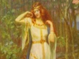

  
[Intangible Textual Heritage](../../index.md)  [Legends and
Sagas](../index)  [Index](index)  [Previous](tml43)  [Next](tml45.md) 

------------------------------------------------------------------------

[Buy this Book at
Amazon.com](https://www.amazon.com/exec/obidos/ASIN/B002DYIXO6/internetsacredte.md)

------------------------------------------------------------------------

  
*Teutonic Myth and Legend*, by Donald A. Mackenzie, \[1912\], at
Intangible Textual Heritage

------------------------------------------------------------------------

p. 424

### CHAPTER XXXIX

# The Wonderful Rose Garden

Dietleib the Dane--How he became a Knight--Kunhild stolen by the Dwarf
King--Knights to the Rescue--The Garden laid waste--Laurin's
Vengeance--Witege overcome--Combat with Prince--The Invisible
Combatant--Laurin is spared--Visit to Mountain Dwelling--The
Banquet--Knights made Prisoners--Dietrich's Fiery Breath--Battle with
Dwarfs and Giants--The End of Strife.

FIRST be it told of the lady Kunhild's brother, Dietleib the Dane. He
had fame in his own land for strength and prowess, and great and
glorious were the deeds of his sire, the brave Yarl Biterolf. It chanced
that when the three journeyed towards Bern they were set upon by Heime
and his robber band in the midst of a forest. Boldly fought the Danes,
and the robbers were all killed, save Heime alone, whom Dietleib, with
his sword Welsung, wounded on the forehead and put to flight.

Thereafter the young Dane became a servant unto Dietrich, making
pretence that his name was Ilmenrik. It chanced that the prince paid
visit to the Court of Ermenrich, and there was his Danish servant
taunted by Walter of Wasgenstein. Dietleib was wroth, and he challenged
the arrogant knight, wagering life against life, to prevail against him
in performing feats of strength. All the Court assembled to behold the
sport, and the knight was boastful and proud. But great was the might of
Dietleib the Dane. He could putt the stone

p. 425

and throw the hammer so that men marvelled to behold, nor could Walter
of Wasgenstein prevail against him.

Then did King Ermenrich pay life ransom in money for the boastful
knight, and the Dane gave a great feast to which his master did invite
many valorous war men.

Proud was Dietrich of his servant, and he made him a knight. Heime, who
had returned, was present at the feast, and Dietleib sat beside him, and
ere long he spake, saying:

"On thy forehead is an evil scar, Heime. How came thou by it?"

Heime made answer: "I shall tell thee in secret, Ilmenrik. Wounded was I
in combat with Dietleib the Dane. I shall rest not until my shame be
wiped out with his life blood."

"Know then," the new knight whispered, "that I am he whom thou didst
attack with thy robber band. Look in my face. . . . I am no other than
Dietleib. Fast was thy horse, else thou hadst not escaped me. But I seek
not now to denounce thee before Dietrich. Let this secret be kept
between us."

It chanced upon a day thereafter that fair Kunhild, Dietleib's sister,
danced with her maids upon a green meadow. She went towards a linden
tree; then suddenly she vanished from sight. The King of Dwarfs, whose
name was Laurin, had long loved her for her beauty, and desired to have
her for his bride. So he came secretly towards the maiden, and below the
linden tree he cast over her his Cloak of Obscurity; then did he carry
fair Kunhild away towards his castle among the Tyrolese mountains.

The heart of Dietleib was filled with sorrow, because that he loved his
sister very dearly. He hastened unto

p. 426

\[paragraph continues\] Hildebrand, who
dwelt in his castle at Garda, and besought his aid, saying:

"The castle of Laurin is in the midst of a Tyrol mountain, and in front
of it he hath a wondrous Rose garden."

Many a life may be lost ere Kunhild is rescued,

Hildebrand said; "but let us unto Dietrich and his knights, so that we
may take counsel with them."

When that the knights came to know that Kunhild was taken away by the
dwarf king, Wolfhart spake boldly, as was his wont, and said:

"Alone shall I ride forth and rescue this fair maid."

Dietrich heard the boast, nor made answer. He spake to wise old
Hildebrand, saying: "Knowest thou aught of Laurin's Rose garden?"

"'Tis told," Hildebrand said, "that it hath four gates of gold. But no
wall shields it. Round the Rose garden is drawn a silken thread, and he
who breaks it shall have his right hand and left foot cut off. Laurin,
King of Dwarfs, ever keeps watch o'er his wondrous garden, which is of
exceeding great beauty."

Witege spake: "Laurin can punish not an offender who entereth his garden
until he doth prevail against him in single combat."

"Then shall we fare forth," Dietrich said. "We seek but Kunhild, and
need not despoil the Rose garden."

So the Prince rode towards the Tyrol mountain in which Laurin, King of
Dwarfs, had his dwelling. With him went Hildebrand, Heribrand's son;
Witege, Wieland's son; Dietleib the Dane, and Wolfhart, Hildebrand's
kinsman.

Dietrich and Witege rode in front, because that Hildebrand had taunted
the prince, as was his wont,

p. 427

for he had been his master. "Were I not with thee," he said, "thou
couldst not overcome the dwarf."

So it fell that Dietrich and Wieland's son were first to reach the
wondrous Rose garden. Witege broke to pieces a golden gate, and they
entered together. Fair were the roses, and of sweet and refreshing
fragrance; their beauty gladdened Dietrich's eyes, and he was loath to
despoil them. But Witege sought to defy the dwarf, and he rode through
the blossoming shrubs, trampling them ruthlessly underfoot. Soon was the
fair garden made desolate as a wilderness.

Wroth was Laurin, King of the Dwarfs. He rode forth on his steed, clad
in full armour; his spear was in his hand. But three spans high was he,
yet had he wondrous strength and skill in conflict.

"What evil have I done thee that thou shouldst thus destroy my roses?"
he cried bitterly. "Thy right hand and thy left foot I now demand, and
must needs obtain."

Witege defied the dwarf with laughter and scorn. He deemed not that he
was endowed with magical power. Diamonds sparkled upon Laurin's armour;
these made it swordproof and spearproof. He also wore a girdle which
gave him the strength of twelve men. On his head was a shining crown,
and therein was his weakness. Golden birds sang forth from it as if they
were alive.

Witege lowered his spear. Laurin charged fiercely, and at the first
thrust swept him from the saddle. In great peril was Wieland's son, for
the dwarf bound him; but Dietrich made offer of gold to atone the evil
he had done.

"Thy roses," he told Laurin, "will bloom again in May."

p. 428

The dwarf made answer that he possessed already gold in abundance, but
that his roses could not be restored unto him.

Witege taunted Dietrich. "Fearest thou to tilt with him?" he said; "must
I die because thou dost shrink from Laurin?"

The prince was wroth, and he challenged the dwarf king forthwith to
single combat, taking upon himself the blame for the evil which his
knight had accomplished.

'Twas well for Dietrich that old Hildebrand then rode up with Wolfhart,
his kinsman, and Dietleib the Dane. The old warrior counselled the
prince to tilt not with the dwarf. "Rather shouldst thou fight him on
foot with sword against sword," he said. "His armour thou canst not
pierce, for by reason of the diamonds it is charmed against all weapons.
Smite thou him upon the head."

As Hildebrand counselled, so did Dietrich do. He leapt from the saddle
and challenged Laurin to combat with swords. Fierce was the conflict.
The prince smote upon the dwarf's head blow after blow, so that he was
made faint. But Laurin drew round him his Cloak of Obscurity and fought
then unbeholden by the Prince of Bern.

Many wounds did Dietrich receive; but he waxed in battle fury and
suddenly took the unseen dwarf in his arms and wrestled with him. From
the prince's mouth issued forth flames of fire, but without avail; he
could not injure Laurin.

"Snatch off his waist girdle," Hildebrand cried.

Ere long Dietrich possessed himself of the magic girdle, which gave to
the dwarf his great strength. Then the prince had him in his power. He
cast the

p. 429

little king on the ground and tore off the Cloak of Obscurity.

Laurin feared that he would be put to death, so he called upon Dietleib,
Kunhild's brother, who pleaded for his life, for the young Dane desired
most of all to discover where his fair sister was held in captivity.
Thus did the dwarf king escape the vengeance of Dietrich. He gave thanks
unto Dietleib, and when he had sworn oaths of brotherhood with him, he
invited the prince and all his knights into his mountain castle.

They went together over a pleasant plain, and through a fair forest. A
great linden tree was there, and many fruit trees whose odours were
sweet. Birds sang merrily in the branches, and Dietrich was glad of
heart. He began to make answer to the birds; but old Hildebrand warned
him not to whistle until he had left the wood. All the knights were
lighthearted save Witege. He had bitter memory of how the dwarf had
prevailed against him, and suspected treachery. Wolfhart taunted him,
but Wieland's son rode in front. He was first to reach the castle
entrance. He saw there a bright golden horn suspended on a chain. He
blew a loud blast upon it. When he did that the door opened wide and
they all went within. An iron door was opened; it closed behind them.
Then through a door of shining gold they went; it was shut fast like to
the other.

Soon Dietrich and his knights found themselves in a bright and spacious
hall. Hundreds of dwarfs were there. They made merry; they danced and
they held tournaments. Delicious wine was given unto the strangers, and
even Witege forgot to be suspicious, and made merry with the others.
Then did Laurin begin to work his evil designs. He cast a spell upon
Dietrich and his knights, so that they could behold not one

p. 430

another. They saw but the merry dwarfs and the glories of the mountain
dwelling.

At length fair Kunhild appeared. She had been made Laurin's queen, and
wore a gleaming crown. Many maidens came with her, but she was fairest
of them all. Dwarfs playing harps, and dancing and performing strange
feats, skipped before her and around. In her crown shone a bright jewel.
It dispelled the magic mist, and the warriors beheld one another again.

Then was a great feast held. Kunhild sat with Laurin, and Dietleib, whom
she embraced tenderly, she took beside her. They spoke in low voices one
to another. Great was her desire to leave all the splendour and wealth
that was there, and return once again to her own kin.

The dwarf persuaded all the knights to lay down their arms. So merry
were they that they did so without fear.

Evening came on, and Laurin led Dietleib to a chamber apart, where he
made offer to him of rich treasure if he would desert Dietrich and his
knights. But the young Dane refused resolutely to be a traitor, whereat
the dwarf vanished and the door was locked securely. Dietleib was made
blind.

Then were the strangers given wine, which caused them all to fall into a
deep sleep. The vengeful king Laurin thus had them in his power. He
caused them to be bound, and they were all cast together into a deep
dungeon, so that vengeance might be wreaked upon them, because that the
Rose garden had been despoiled. There they lay helpless and blind.

Kunhild wept for them. When the dwarfs were all asleep she stole in
secret to her brother's chamber and gave to him a golden ring which
dispelled his magic

p. 431

blindness. Then did the young Dane secure possession of his weapons and
those of his fellow knights.

Meanwhile Dietrich woke up. Wroth was he when he found that he was
fettered. The dwarf's girdle restored his sight, and flames issued from
his mouth, which melted his bonds of iron, so that he rose up. He went
towards each of his companions and set them free one by one.

Dietleib then came with all their weapons, and with the prince he fought
fiercely against the dwarfs. At length Dietrich wrenched from one of
them a golden ring. He gave it unto Hildebrand, and his sight was
restored. Then did the old warrior enter the conflict. The dwarfs fell
fast before them. Thousands were put to death, for there was none in
Laurin's castle who could prevail against the three great warriors.

At length Laurin rushed without. He blew a great blast upon his horn,
and five giants armed with clubs came to his aid.

Wolfhart and Witege were still blind, but they could rest not while the
clamour of battle raged about them, so they rushed into the fray and
fought bravely. Then gave Kunhild unto them jewelled rings, and their
blindness was dispelled.

The five giants fought against the five knights, and long and terrible
was the struggle which ensued; but one by one the monsters were slain,
and Dietrich and his knights were [triumphant](errata.htm#5.md). The heroes
waded knee deep in blood, so great was the slaughter which they
accomplished in the kingdom of Laurin.

Then was the dwarf king made prisoner and Kunhild set free. Dietrich and
his knights possessed themselves of much treasure, and they returned
unto Bern, taking with them Laurin and Dietleib's fair sister.

p. 432

Laurin was laughed at and put to shame, and he brooded over his evil
lot, desiring greatly to be avenged upon Dietrich and his victorious
knights. So he sent a secret message unto his uncle, Walberan, who was
king over the giants and dwarfs in the eastern Caucasus, and besought
him to come to his rescue.

He spoke secretly thereanent unto Kunhild, whereat she made promise that
if he swore oaths of friendship with Dietrich, she would return with him
to his mountain dwelling and be his queen once again.

So she prevailed upon Laurin to do her will. "My Rose garden", he said,
"I shall plant again that the roses may bloom fair and fragrant in the
sunshine of May."

The dwarf king drank wine with the prince of Bern and made peace, vowing
to be his lifelong comrade and helper.

As they sat together at the feast, a message was borne unto Dietrich
from King Walberan, demanding all the treasure and all the weapons that
were in Bern, and the right hand and left foot of every knight who had
wrought destruction in the Rose garden. Defiantly did the prince make
answer and prepared for battle.

Dietrich and Walberan challenged each other to single combat, and they
fought with great fierceness. Numerous were their wounds, nor could one
prevail over the other. It seemed as if they would both be slain.

Then did Laurin ride forth, and, embracing his uncle, he prevailed upon
him to make peace. Hildebrand pleaded likewise with Dietrich, and the
combat was brought to an end. Together they then sat down to feast and
drink wine, and they vowed oaths of friendship, so that there might be
lasting peace between them.

Kunhild returned with Laurin unto his mountain

p. 433

dwelling. The Rose garden was planted once again, and it bloomed fair in
the sunshine of May.

Herdsmen among the hills, and huntsmen who wend thither, have been wont
to tell that they could behold on moonlight nights Laurin and fair
Kunhild dancing together in the green forests and in the valleys below
the Tyrolese mountains. Dietleib's sister hath still her dwelling in the
bright castle as in other days. She is Queen of the Dwarfs and can never
die.

The Rose garden blooms ever fair, but unbeholden by men, in the sunshine
of May, and many have sought to find it in vain.

------------------------------------------------------------------------

[Next: Chapter XL. Virginal, Queen of the Mountains](tml45.md)
