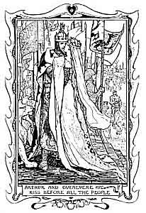

[Intangible Textual Heritage](../../index)  [Legends & Sagas](../index.md) 

------------------------------------------------------------------------

<table width="75%">
<colgroup>
<col style="width: 50%" />
<col style="width: 50%" />
</colgroup>
<tbody>
<tr class="odd">
<td width="50%" data-valign="TOP"> 
</td>
<td width="50%" data-valign="TOP"><h1 id="king-arthur" data-align="CENTER">King Arthur</h1>
<h3 id="tales-of-the-round-table" data-align="CENTER">Tales of the Round Table</h3>
<h3 id="edited-by-andrew-lang" data-align="CENTER">Edited by Andrew Lang</h3>
<h4 id="illustrated-by-h.-j.-ford" data-align="CENTER">Illustrated by H. J. Ford</h4>
<h4 id="section" data-align="CENTER">[1902]</h4></td>
</tr>
</tbody>
</table>

------------------------------------------------------------------------

[Title Page](trt00.md)  
[Contents](trt01.md)  
[Illustrations](trt02.md)  
[The Drawing of the Sword](trt03.md)  
[The Questing Beast](trt04.md)  
[The Sword Excalibur](trt05.md)  
[The Story of Sir Balin](trt06.md)  
[How the Round Table Began](trt07.md)  
[The Passing of Merlin](trt08.md)  
[How Morgan le Fay Tried to Kill King Arthur](trt09.md)  
[What Beaumains Asked of the King](trt10.md)  

### The Quest of the Holy Graal

[The Quest of the Holy Graal](trt11.md)  
[I: How The King Went on Pilgrimage, and his Squire was Slain in a
Dream](trt12.md)  
[II: The Coming of the Holy Graal](trt13.md)  
[The Adventure of Sir Galahad](trt14.md)  
[IV: How Sir Lancelot Saw a Vision, and Repented of His Sins](trt15.md)  
[V: The Adventure Of Sir Percivale](trt16.md)  
[VI: An Adventure of Sir Lancelot](trt17.md)  
[VII: An Adventure of Sir Gawaine](trt18.md)  
[VIII: The Adventure of Sir Bors](trt19.md)  
[IX: Adventure of Sir Galahad](trt20.md)  
[X: Sir Lancelot Meets Sir Galahad, and They Part For Ever](trt21.md)  
[XI: How Sir Galahad Found The Graal And Died Of That Finding](trt22.md)  

### The Evil Days of Arthur

[The Fight for the Queen](trt23.md)  
[The Fair Maid of Astolat](trt24.md)  
[Lancelot and Guenevere](trt25.md)  
[The End of it All](trt26.md)  
