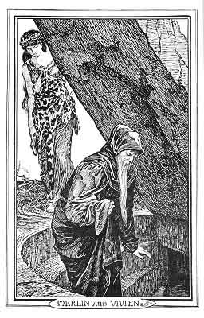

[Intangible Textual Heritage](../../index)  [Legends & Sagas](../index) 
[Index](index)  [Previous](trt07)  [Next](trt09) 

------------------------------------------------------------------------

p. 30

 

p. 31

# THE PASSING OF MERLIN

SIR TOR proved before long by his gallant deeds that he was worthy to
sit in one of the two empty seats of the Round Table. Many of the other
Knights went out also in search of adventures, and one of them, Sir
Pellinore, brought a damsel of the lake to Arthur's Court, and when
Merlin saw her he fell in love with her, so that he desired to be always
in her company. The damsel laughed in secret at Merlin, but made use of
him to tell her all she would know, and the wizard had no strength to
say her nay, though he knew what would come of it. For he told King
Arthur that before long he should be put into the earth alive, for all
his cunning. He likewise told the King many things that should befall
him, and warned him always to keep the scabbard as well as the sword
Excalibur, and foretold that both sword and scabbard should be stolen
from him by a woman whom he most trusted. 'You will miss my counsel
sorely,' added Merlin, 'and would give all your lands to have me back
again.' 'But since you know what will happen,' said the King, 'you may
surely guard against it.' 'No,' answered Merlin, 'that will not be.' So
he departed from the King, and the maiden followed him whom some call
Nimue and others Vivien, and wherever she went Merlin went also.

They journeyed together to many places, both at home and across the
seas, and the damsel was wearied of him, and sought by every means to be
rid of him, but he would not be shaken off. At last these two wandered
back to

p. 32

\[paragraph continues\] Cornwall, and one day Merlin showed Vivien a
rock under which he said great marvels were hidden. Then Vivien put
forth all her Powers, and told Merlin how she longed to see the wonders
beneath the stone, and, in spite of all his wisdom, Merlin listened to
her and crept under the rock to bring forth the strange things that lay
there. And when he was under the stone she used the magic he had taught
her, and the rock rolled over him, and buried him alive, as he had told
King Arthur. But the damsel departed with joy, and thought no more of
him: now that she knew all the magic he could teach her.

------------------------------------------------------------------------

[Next: How Morgan le Fay Tried to Kill King Arthur](trt09)
