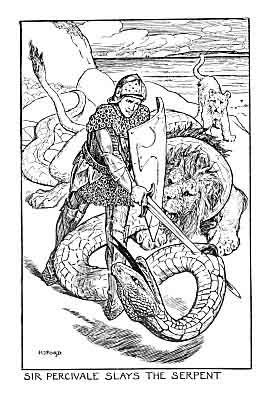

[Intangible Textual Heritage](../../index)  [Legends & Sagas](../index) 
[Index](index)  [Previous](trt15)  [Next](trt17) 

------------------------------------------------------------------------

p. 80

### V

### THE ADVENTURE OF SIR PERCIVALE

All this while Sir Percivale had pursued adventures of his own, and came
nigh unto losing his life, but he was saved from his enemies by the good
Knight, Sir Galahad, whom he did not know, although he was seeking him,
for Sir Galahad now bore a red shield, and not a white one. And at last
the foes fled deep into the forest, and Sir Galahad followed; but Sir
Percivale had no horse and was forced to stay behind. Then his eyes were
opened, and he knew it was Sir Galahad who had come to his help, and he
sat down under a tree and grieved sore.

While he was sitting there a Knight passed by riding a black horse, and
when he was out of sight a yeoman came pricking after as fast as he
might, and, seeing Sir Percivale, asked if he had seen a Knight mounted
on a black horse. 'Yes, Sir, forsooth,' answered Sir Percivale, 'why do
you want to know?' 'Ah, Sir, that is my steed which he has taken from
me, and wherever my lord shall find me, he is sure to slay me.' 'Well,'
said Sir Percivale, 'thou seest that I am on foot, but had I a good
horse I would soon come up with him.' 'Take my hackney,' said the
yeoman, 'and do the best you can, and I shall follow you on foot to
watch how you speed.' So Sir Percivale rode as fast as he might, and at
last he saw that Knight, and he hailed him. The Knight turned and set
his spear against Sir Percivale, and smote the hackney in the breast, so
that he fell dead to the earth, and Sir Percivale fell with him; then
the Knight rode away. But Sir Percivale was mad with wrath, and cried to
the Knight to return and fight with him on foot,

 

p. 81

and the Knight answered not and went on his way. When Sir Percivale saw
that he would not turn, he threw himself on the ground, and cast away
his helm and sword, and bemoaned himself for the most unhappy of all
Knights; and there he abode the whole day, and, being faint and weary,
slept till it was midnight. And at midnight he waked and saw before him
a woman, who said to him right fiercely, 'Sir Percivale, what doest thou
here?' 'Neither good nor great ill,' answered he. 'If thou wilt promise
to do my will when I call upon you,' said she, 'I will lend you my own
horse, and he shall bear thee whither thou shalt choose.' This Sir
Percivale promised gladly, and the woman went and returned with a black
horse, so large and well-apparelled that Sir Percivale marvelled. But he
mounted him gladly, and drove in his spurs, and within an hour and less
the horse bare him four days' journey hence, and would have borne him
into a rough water that roared, had not Sir Percivale pulled at his
bridle. The Knight stood doubting, for the water made a great noise, and
he feared lest his horse could not get through it. Still, wishing
greatly to pass over, he made himself ready, and signed the sign of the
cross upon his forehead.

At that the fiend which had taken the shape of a horse shook off Sir
Percivale and dashed into the water, crying and making great sorrow; and
it seemed to him that the water burned. Then Sir Percivale knew that it
was not a horse but a fiend, which would have brought him to perdition,
and he gave thanks and prayed all that night long. As soon as it was day
he looked about him, and saw he was in a wild mountain, girt round with
the sea and filled with wild beasts. Then he rose and went into a
valley, and there he saw a young serpent bring a young lion by the neck,
and after that there passed a great lion, crying and roaring after the
serpent, and a fierce battle began between them. Sir Percivale thought
to help the lion, as he was the more

p. 84

natural beast of the twain, and he drew his sword and set his shield
before him, and gave the serpent a deadly buffet. When the lion saw
that, he made him all the cheer that a beast might make a man, and
fawned about him like a spaniel, and stroked him with his paws. And
about noon the lion took his little whelp, and placed him on his back,
and bare him home again, and Sir Percivale, being left alone, prayed
till he was comforted. But at eventide the lion returned, and couched
down at his feet, and all night long he and the lion slept together.

------------------------------------------------------------------------

[Next: VI: An Adventure of Sir Lancelot](trt17)
