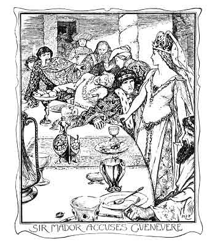
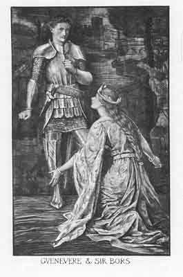
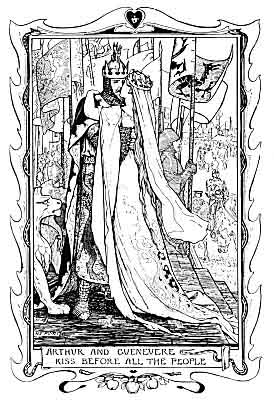

[Intangible Textual Heritage](../../index)  [Legends & Sagas](../index.md) 
[Index](index)  [Previous](trt22)  [Next](trt24.md) 

------------------------------------------------------------------------

p. 102

# THE FIGHT FOR THE QUEEN

So the quest of the Holy Graal had been fulfilled, and the few Knights
that had been left alive returned to the Round Table, and there was
great joy in the Court. To do them honour the Queen made them a dinner;
and there were four and twenty Knights present, and among them Sir
Patrise of Ireland, and Sir Gawaine and his brethren, the King's
nephews, which were Sir Agrawaine, Sir Gaheris, Sir Gareth, and Sir
Mordred. Now it was the custom of Sir Gawaine daily at dinner and supper
to eat all manner of fruit, and especially pears and apples, and this
the Queen knew, and set fruit of all sorts before him. And there was
present at the dinner one Sir Pinel le Savage, who hated Sir Gawaine
because he and his brethren had slain Sir Lamorak du Galis, cousin to
Sir Pinel; so he put poison into some of the apples, hoping that Sir
Gawaine would eat one and die. But by ill fortune it befell that the
good Knight Sir Patrise took a poisoned apple, and in a few moments he
lay dead and stark in his seat. At this sight all the Knights leapt to
their feet, but said nothing, for they bethought them that Queen
Guenevere had made them the dinner, and feared that she had poisoned the
fruit.

'My lady, the Queen,' said Sir Gawaine, who was the first to speak,
'this fruit was brought for me, for all know how well I love it;
therefore, Madam, the shame of this ill deed is yours.' The Queen stood
still, pale and trembling, but kept silence, and next spoke Sir Mador de
la Porte.

p. 103

'This shall not be ended so,' said he, 'for I have lost a noble Knight
of my blood, and I will be avenged of the person who has wrought this
evil.' And he turned to the Queen and said, 'Madam, it is you who have
brought about the death of my cousin, Sir Patrise!' The Knights round
listened in silence, for they too thought Sir Mador spake truth. And the
Queen still said nothing, but fell to weeping bitterly, till King Arthur
heard and came to look into the matter. And when they told him of their
trouble his heart was heavy within him.

'Fair lords,' said the King at last, 'I grieve for this ill deed; but I
cannot meddle therein, or do battle for my wife, for I have to judge
justly. Sure I am that this deed is none of hers, therefore many a good
Knight will stand her champion that she be not burned to death in a
wrong quarrel. And, Sir Mador, hold not your head so high, but fix the
day of battle, when you shall find a Knight to answer you, or else it
were great shame to all my Court.'

'My gracious lord,' said Sir Mador, 'you must hold me excused. But
though you are a King you are also a Knight, and must obey the laws of
knighthood. Therefore I beseech your forgiveness if I declare that none
of the four and twenty Knights here present will fight that battle. What
say you, my lords?' Then the Knights answered that they could not hold
the Queen guiltless, for as the dinner was made by her either she or her
servants must have done this thing.

'Alas!' said the Queen, no evil was in my heart when I prepared this
feast, for never have I done such foul deeds.'

'My lord the King,' cried Sir Mador, 'I require of you, as you are a
just King, to fix a day that I may get ready for the fight!'

'Well,' answered the King, 'on the fifteenth day from this come on
horseback to the meadow that is by Westminster. And if it happens that
there be a Knight to

p. 104

fight with you, strike as hard as you will, God will speed the right.
But if no Knight is there, Then must my Queen he burned, and a fire
shall be made in the meadow.'

 

'I am answered,' said Sir Mador, and he and the rest of the Knights
departed.

When the King and Queen were left alone he asked

p. 105

her what had brought all this about. 'God help me, that I know not,'
said the Queen, 'nor how it was done.'

'Where is Sir Lancelot?' said King Arthur, looking round. 'If he were
here, he would not grudge to do battle for you.'

'Sir,' replied the Queen, 'I know not where he is, but his brother and
his kinsmen think he is not in this realm.'

'I grieve for that,' said the King, 'for he would soon stop this strife.
But I counsel you, ask Sir Bors, and he will not refuse you. For well I
see that none of the four and twenty Knights who were with you at dinner
will be your champion, and none will say well of you, but men will speak
evil of you at the Court.'

'Alas!' sighed the Queen, 'I do indeed miss Sir Lancelot, for he would
soon ease my heart.'

'What ails you?' asked the King, 'that you cannot keep Sir Lancelot at
your side, for well you know that he who Sir Lancelot fights for has the
best Knight in the world for his champion. Now go your way, and command
Sir Bors to do battle with you for Sir Lancelot's sake.' So the Queen
departed from the King, and sent for Sir Bors into her chamber, and when
he came she besought his help.

'Madam,' said he, 'what can I do? for I may not meddle in this matter
lest the Knights who were at the dinner have me in suspicion, for I was
there also. It is now, Madam, that you miss Sir Lancelot, whom you have
driven away, as he would have done battle for you were you right or
wrong, and I wonder how for shame's sake you can ask me, knowing how I
love and honour him.'

'Alas,' said the Queen, 'I throw myself on your grace,' and she went
down on her knees and besought Sir Bors to have mercy on her, I else I
shall have a shameful death, and one I have never deserved.' At that
King Arthur came in, and found her kneeling before Sir Bors.

p. 106

\[paragraph continues\] 'Madam! you do me great dishonour,' said Sir
Bors, raising her up.

'Ah, gentle Knight,' cried the King, 'have mercy on my Queen, for I am
sure that they speak falsely. And I require by the love of Sir Lancelot
that you do battle for her instead of him.'

'My lord,' answered Sir Bors, 'you require of me the hardest thing that
ever anyone asked of me, for well you know that if I fight for the Queen
I shall anger all my companions of the Round Table; but I will not say
nay, my lord, for Sir Lancelot's sake and for your sake! On that day I
will be the Queen's champion, unless a better Knight is found to do
battle for her.'

'Will you promise me this?' asked the King.

'Yes,' answered Sir Bors, 'I will not fail you nor her unless there
should come a better Knight than I, then he shall have the battle.' Then
the King and Queen rejoiced greatly, and thanked Sir Bors with all their
hearts.

So Sir Bors departed and rode unto Sir Lancelot, who was with the hermit
Sir Brasias, and told him of this adventure. 'Ah,' said Sir Lancelot,
'this has befallen as I would have it, and therefore I pray you make
ready to do battle, but delay the fight as long as you can that I may
appear. For I am sure that Sir Mador is a hot Knight, and the longer he
waits the more impatient he will be for the combat.'

'Sir,' answered Sir Bors, 'let me deal with him. Doubt not you shall
have all your will.' And he rode away, and came again to the Court.

It was soon noised about that Sir Bors would be the Queen's champion,
and many Knights were displeased with him; but there were a few who held
the Queen to be innocent. Sir Bors spoke unto them all, and said, 'It
were shameful, my fair lords, if we suffered the most noble Queen in the
world to be disgraced openly, not only for her sake, but for the
King's.' But they answered

 

p. 107

him: 'As for our lord King Arthur, we love him and honour him as much as
you; but as for Queen Guenevere, we love her not, for she is the
destroyer of good Knights.'

'Fair lords,' said Sir Bors, 'you shall not speak such words, for never
yet have. I heard that she was the destroyer of good Knights. But at all
times, as far as I ever knew, she maintained them and gave them many
gifts. And therefore it were a shame to us all if we suffered our noble
King's wife to be put to death, and I will not suffer it. So much I will
say, that the Queen is not guilty of Sir Patrise's death; for she owed
him no ill will, and bade him and us to the dinner for no evil purpose,
which will be proved hereafter. And in any case there was foul dealing
among us.'

'We may believe your words,' said some of the Knights, but others held
that he spoke falsely.

The days passed quickly by until the evening before the battle, when the
Queen sent for Sir Bors and asked him if he was ready to keep his
promise.

'Truly, Madam,' answered he, 'I shall not fail you, unless a better
Knight than I am come to do battle for you. Then, Madam, I am discharged
of my promise.'

'Shall I tell this to my lord Arthur?' said the Queen.

'If it pleases you, Madam,' answered Sir Bors. So the Queen went to the
King, and told him what Sir Bors had said, and the King bade her to be
comforted, as Sir Bors was one of the best Knights of the Round Table.

The next morning the King and Queen, and all manner of Knights, rode
into the meadow of Westminster, where the battle was to be; and the
Queen was put into the Guard of the High Constable, and a stout iron
stake was planted, and a great fire made about it, at which the Queen
should be burned if Sir Mador de la Porte won the fight. For it was the
custom in those days that neither fear nor favour, love nor kinship,
should hinder right judgment. Then came Sir Mador de la Porte, and

p. 108

made oath before the King that the Queen had done to death his cousin
Sir Patrise, and he would prove it on her Knight's body, let who would
say the contrary. Sir Bors likewise made answer that Queen Guenevere had
done no wrong, and that he would make good with his two hands. 'Then get
you ready,' said Sir Mador. 'Sir Mador,' answered Sir Bors, 'I know you
for a good Knight, but I trust to be able to withstand your malice; and
I have promised King Arthur and my lady the Queen that I will do battle
for her to the uttermost, unless there come forth a better Knight than I
am.'

'Is that all?' asked Sir Mador; 'but you must either fight now or own
that you are beaten.'

'Take your horse,' said Sir Bors, 'for I shall not tarry long,' and Sir
Mador forthwith rode into the field with his shield on his shoulder, and
his spear in his hand, and he went up and down crying unto King Arthur,
'Bid your champion come forth if he dare.' At that Sir Bors was ashamed,
and took his horse, and rode to the end of the lists. But from a wood
hard by appeared a Knight riding fast on a white horse, bearing a shield
full of strange devices. When he reached Sir Bors he drew rein and said,
'Fair Knight, be not displeased, but this battle must be to a better
Knight than you. For I have come a great journey to fight this fight, as
I promised when I spoke with you last, and I thank you heartily for your
goodwill.' So Sir Bors went to King Arthur and told him that a Knight
had come who wished to do battle for the Queen. 'What Knight is he?'
asked the King.

'That I know not,' said Sir Bors; 'but he made a covenant with me to be
here this day, and now I am discharged,' said Sir Bors.

Then the King called to that Knight and asked him if he would fight for
the Queen. 'For that purpose I came hither,' replied he, 'and therefore,
Sir King, delay me no longer, for as soon as I have ended this battle I

 

p. 111

must go hence, as I have many matters elsewhere. And I would have you
know that it is a dishonour to all the Knights of the Round Table to let
so noble a lady and so courteous a Queen as Queen Guenevere be shamed
amongst you.'

The Knights who were standing round looked at each other at these words,
and wondered much what man this was who took the battle upon him, for
none knew him save Sir Bors.

'Sir,' said Sir Mador de la Porte unto the King, 'let me know the name
of him with whom I have to do.' But the King answered nothing, and made
a sign for the fight to begin. They rode to the end of the lists, and
couched their spears and rushed together with all their force, and Sir
Mador's spear broke in pieces. But the other Knight's spear held firm,
and he pressed on Sir Mador's horse till it fell backward with a great
fall. Sir Mador sprang from his horse, and, placing his shield before
him, drew his sword, and bade his foe dismount from his horse also, and
do battle with him on foot, which the unknown Knight did. For an hour
they fought thus, as Sir Mador was a strong man, and had proved himself
the victor in many combats. At last the Knight smote Sir Mador
grovelling to his knees, and the Knight stepped forward to have struck
him flat upon the ground. Therewith Sir Mador suddenly rose, and smote
the Knight upon the thigh, so that the blood rain out fiercely. But,
when the Knight felt himself wounded, and saw his blood, he let Sir
Mador rise to his feet, and then he gave him such a buffet on the helm
that this time Sir Mador fell his length on the earth, and the Knight
sprang to him, to unloose his helm. At this Sir Mador prayed for his
life, acknowledging that he was overcome, and confessed that the Queen's
innocence had been proved. 'I will only grant you your life,' said the
Knight, 'if you will proclaim publicly that you have foully slandered
the Queen, and that you make no

p. 112

mention, on the tomb of Sir Patrise, that ever Queen Guenevere consented
to his murder.' 'All that will I do,' said Sir Mador, and some Knights
took him up, and carried him away to heal his wounds. And the other
Knight went straight to the foot of the steps where sat King Arthur, and
there the Queen had just come, and the King and the Queen kissed each
other before all the people. When King Arthur saw the Knight standing
there he stooped down to him and thanked him, and so likewise did the
Queen; and they prayed him to put off his helmet, and commanded wine to
be brought, and when he unlaced his helmet to drink they knew him to be
Sir Lancelot du Lake. Then Arthur took the Queen's hand and led her to
Sir Lancelot and said, 'Sir, I give you the most heartfelt thanks of the
great deed you have done this day for me and my Queen.'

'My lord,' answered Sir Lancelot, 'you know well that I ought of right
ever to fight your battles, and those of my lady the Queen. For it was
you who gave me the high honour of knighthood, and that same day my lady
the Queen did me a great service, else I should have been put to shame
before all men. Because in my hastiness I lost my sword, and my lady the
Queen found it and gave it to me when I had sore need of it. And
therefore, my lord Arthur, I promised her that day that I would be her
Knight in right or in wrong.'

'I owe you great thanks,' said the King, 'and some time I hope to repay
you.' The Queen, beholding Sir Lancelot, wept tears of joy for her
deliverance, and felt bowed to the ground with sorrow at the thought of
what he had done for her, when she had sent him away with unkind words.
Then all the Knights of the Round Table and his kinsmen drew near to him
and welcomed him, and there was great mirth in the Court.

------------------------------------------------------------------------

[Next: The Fair Maid of Astolat](trt24.md)
