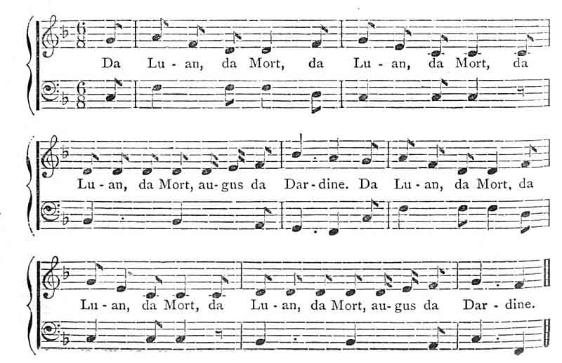

  
[Intangible Textual Heritage](../../../index.md)  [Sagas and
Legends](../../index)  [Yeats](../index)  [Celtic](../../celt/index.md) 
[Index](index)  [Previous](fip81)  [Next](fip83.md) 

------------------------------------------------------------------------

### LEGEND OF KNOCKGRAFTON.--Page [40](fip12.htm#page_40.md).

Moat does not mean a place with water, but a tumulus or barrow. The
words *Da Luan Da Mort augus Da Dardeen* are Gaelic for "Monday,
Tuesday, and Wednesday too". Da Hena is Thursday. Story-tellers, in
telling this tale, says Croker, sing these words to the following
music-according to Croker, music of very ancient kind:--

 

 

 

p. 321

Mr. Douglas Hyde has heard the story in Connaught, with the song of the
fairy as "Peean Peean daw feean, Peean go leh agus leffin" \[*pighin,
pighin, dà phighin, pighin go ieith agus leith phighin*\], which in
English means, "a penny, a penny, twopence, a penny and a half, and a
halfpenny".

------------------------------------------------------------------------

[Next: Stolen Child](fip83.md)
