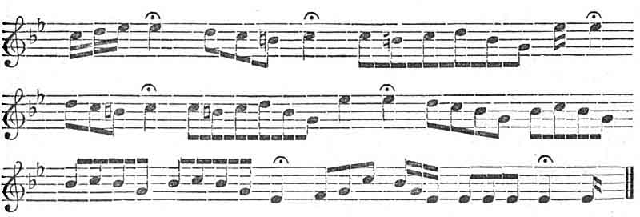

  
[Intangible Textual Heritage](../../../index)  [Sagas and
Legends](../../index)  [Yeats](../index)  [Celtic](../../celt/index) 
[Index](index)  [Previous](fip84)  [Next](fip86) 

------------------------------------------------------------------------

### BANSHEE'S CRY.--Page [108](fip31.htm#page_108).

Mr. and Mrs. S. C. Hall give the following notation of the cry:--

 

 

 

------------------------------------------------------------------------

[Next: Omens](fip86)
