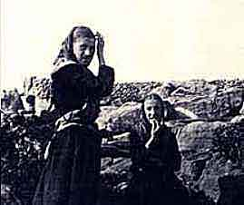

  
[Intangible Textual Heritage](../../../index.md)  [Sagas and
Legends](../../index)  [Yeats](../index)  [Celtic](../../celt/index.md) 

------------------------------------------------------------------------

<table width="75%">
<colgroup>
<col style="width: 50%" />
<col style="width: 50%" />
</colgroup>
<tbody>
<tr class="odd">
<td data-valign="VCENTER" width="50%"></td>
<td data-valign="VCENTER" width="50%"><h1 id="fairy-and-folk-tales-of-the-irish-peasantry" data-align="CENTER">Fairy and Folk Tales of the Irish Peasantry</h1>
<h2 id="edited-and-selected-by-w.-b.-yeats" data-align="CENTER">Edited and Selected by W. B. Yeats</h2>
<h4 id="section" data-align="CENTER">[1888]</h4></td>
</tr>
</tbody>
</table>

------------------------------------------------------------------------

This is an anthology of Irish folklore, edited by W. B. Yeats. Many of
these stories are from books which are archived at this site; some are
from books which have yet to be converted to etext or now-rare source
material. He selected many of the best (and often funniest) tales from
other writers such as Lady Wilde, Croker, Lover, Hyde, and Carelton.
Yeats wrote introductory material and notes to many of these stories.

------------------------------------------------------------------------

[Title Page](fip00.md)  
[Contents](fip01.md)  
[Introduction](fip02.md)  

### The Trooping Fairies

[The Trooping Fairies](fip03.md)  
[The Fairies, by William Allingham](fip04.md)  
[Frank Martin and the Fairies, by William Carleton](fip05.md)  
[The Priest's Supper, by T. Crofton Croker](fip06.md)  
[The Fairy Well Of Lagnanay, By Samuel Ferguson](fip07.md)  
[Teig O'Kane (Tadhg O Cáthán) and the Corpse, tr. by Douglas
Hyde](fip08.md)  
[Paddy Corcoran's Wife, by William Carleton](fip09.md)  
[Cusheen Loo, tr. by J. J. Callanan](fip10.md)  
[The White Trout; A Legend of Cong, by S. Lover](fip11.md)  
[The Fairy Thorn, An Ulster Ballad, by Sir Samuel Ferguson](fip12.md)  
[The Legend of Knockgrafton, by T. Crofton Croker](fip13.md)  
[A Donegal Fairy, by Letitia Maclintock](fip14.md)  

### Changelings

[Changelings](fip15.md)  
[The Brewery of Egg-Shells, by T. Crofton Croker](fip16.md)  
[The Fairy Nurse, by Edward Walsh](fip17.md)  
[Jamie Freel and the Young Lady, A Donegal Tale, by Miss Letitia
Maclintock](fip18.md)  
[The Stolen Child, by W. B. Yeats](fip19.md)  

### The Merrow

[The Merrow](fip20.md)  
[The Soul Cages, by T. Crofton Croker](fip21.md)  
[Flory Cantillon's Funeral, by T. Crofton Croker](fip22.md)  

### The Solitary Fairies

[Lepracaun. Cluricaun. Far Darrig.](fip23.md)  
[The Lepracaun; Or Fairy Shoemaker by William Allingham](fip24.md)  
[Master and Man, by T. Crofton Croker](fip25.md)  
[Far Darrig in Donegal, by Letitia Maclintock](fip26.md)  

### The Pooka

[The Pooka](fip27.md)  
[The Piper and the Puca, by Douglas Hyde](fip28.md)  
[Daniel O'Rourke, by T. Crofton Croker](fip29.md)  
[The Kildare Pooka, by Patrick Kennedy](fip30.md)  

### The Banshee

[The Banshee](fip31.md)  
[How Thomas Connolly Met the Banshee, by J. Todhunter](fip32.md)  
[A Lamentation for the Death of Sir Maurice Fitzgerald, tr. by Clarence
Mangan](fip33.md)  
[The Banshee of the Mac Carthys, by T. Crofton Croker](fip34.md)  

### Ghosts

[Ghosts](fip35.md)  
[A Dream, by William Allingham](fip36.md)  
[Grace Connor, by Letitia Maclintock](fip37.md)  
[A Legend of Tyrone, by Ellen O'Leary](fip38.md)  
[The Black Lamb, by Lady Wilde](fip39.md)  
[Song of the Ghost, by Alfred Percival Graves](fip40.md)  
[The Radiant Boy, by Mrs. Crow](fip41.md)  
[The Fate Of Frank M'Kenna, by William Carleton](fip42.md)  

### Witches, Fairy Doctors

[Witches, Fairy Doctors](fip43.md)  
[Bewitched Butter (Donegal), by Letitia Maclintock](fip44.md)  
[A Queen's County Witch](fip45.md)  
[The Witch Hare, by Mr. and Mrs. S. C. Hall](fip46.md)  
[Bewitched Butter (Queen's County)](fip47.md)  
[The Horned Women, by Lady Wilde](fip48.md)  
[The Witches' Excursion, by Patrick Kennedy](fip49.md)  
[The Confessions of Tom Bourke, by T. Crofton Croker](fip50.md)  
[The Pudding Bewitched, by William Carleton](fip51.md)  

### Tír-na-n-Og.

[Tír-na-n-Og](fip52.md)  
[The Legend Of O'Donoghue by T. Crofton Croker](fip53.md)  
[Rent-day](fip54.md)  
[Loughleagh (Lake Of Healing)](fip55.md)  
[Hy-Brasail--The Isle of the Blest by Gerald Griffin](fip56.md)  
[The Phantom Isle, by Giraldus Cambrensis](fip57.md)  

### Saints, Priests

[Saints, Priests](fip58.md)  
[The Priest's Soul, by Lady Wilde](fip59.md)  
[The Priest of Coloony](fip60.md)  
[The Story of the Little Bird, by T. Crofton Croker](fip61.md)  
[Conversion Of King Laoghair's Daughters](fip62.md)  
[King O'Toole And His Goose, by S. Lover](fip63.md)  

### The Devil

[The Demon Cat, by Lady Wilde](fip64.md)  
[The Long Spoon, by Patrick Kennedy](fip65.md)  
[The Countess Kathleen O'Shea](fip66.md)  
[The Three Wishes, by W. Carleton](fip67.md)  

### Giants

[Giants](fip68.md)  
[The Giant's Stairs, by T. Crofton Croker](fip69.md)  
[A Legend of Knockmany, by William Carleton](fip70.md)  

### Kings, Queens, Princesses, Earls, Robbers

[The Twelve Wild Geese, by Patrick Kennedy](fip71.md)  
[The Lazy Beauty and Her Aunts, by Patrick Kennedy](fip72.md)  
[The Haughty Princess, by Patrick Kennedy](fip73.md)  
[The Enchantment of Gearoidh Iarla, by Patrick Kennedy](fip74.md)  
[Munachar and Manachar, tr. by Douglas Hyde](fip75.md)  
[Donald and his Neighbours](fip76.md)  
[The Jackdaw](fip77.md)  
[The Story of Conn-eda, or the Golden Apples of Lough Erne, by Abraham
M'Coy, tr. by Nicholas O'Kearney](fip78.md)  

### Notes

[Gods of the Earth](fip79.md)  
[Sir Samuel Ferguson](fip80.md)  
[Cusheen Loo](fip81.md)  
[Legend of Knockgrafton](fip82.md)  
[Stolen Child](fip83.md)  
[Solitary Fairies](fip84.md)  
[Banshee's Cry](fip85.md)  
[Omens](fip86.md)  
[A Witch Trial](fip87.md)  
[T'yeer-na-n-Oge](fip88.md)  
[The Ganconer or Gancanagh](fip89.md)  
[Father John O'Hart](fip90.md)  
[Shoneen and Sleiveen](fip91.md)  
[Demon Cat](fip92.md)  
[A Legend of Knockmany](fip93.md)  
[Some Authorities On Irish Folk-Lore](fip94.md)  
