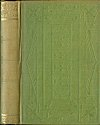
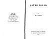
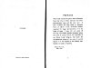

  
[Intangible Textual Heritage](../../../index) 
[Legends/Sagas](../../index)  [Yeats](../index) 
[Celtic](../../celt/index)  [Index](index)  [Next](lpy001) 

------------------------------------------------------------------------

# LATER POEMS

###### BY

## W. B. YEATS

#### MACMILLAN AND CO., LIMITED

#### ST. MARTIN'S STREET, LONDON

#### 1922

**NOTICE OF ATTRIBUTION**  
Scanned at Intangible Textual Heritage, April 2005. John Bruno Hare,
redactor. This text is in the public domain in the United States because
it was published prior to 1923. It is not in the public domain in most
other countries, including the EU and UK. These files may be used for
any non-commercial purpose provided this notice of attribution is left
intact in all copies.

[  
Click to enlarge](img/cover.jpg)  
Front Cover and Spine  

[  
Click to enlarge](img/title.jpg)  
Title Page  

[  
Click to enlarge](img/verso.jpg)  
Verso  

------------------------------------------------------------------------

[Next: Preface](lpy001)
