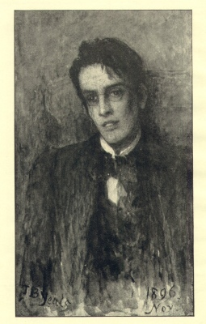

  
[Intangible Textual Heritage](../../../index)  [Legends and
Sagas](../../index)  [Yeats](../index)  [Celtic](../../celt/index) 

------------------------------------------------------------------------

[Buy this Book at
Amazon.com](https://www.amazon.com/exec/obidos/ASIN/B0025VL14G/internetsacredte)

------------------------------------------------------------------------

<table width="75%">
<colgroup>
<col style="width: 50%" />
<col style="width: 50%" />
</colgroup>
<tbody>
<tr class="odd">
<td width="50%" data-valign="TOP"></td>
<td width="50%" data-valign="CENTER"><h1 id="the-celtic-twilight">The Celtic Twilight</h1>
<h2 id="william-butler-yeats">William Butler Yeats</h2>
<h3 id="section">[1893, 1902]</h3></td>
</tr>
</tbody>
</table>

------------------------------------------------------------------------

[Contents](#contents)    [Start Reading](twi00)    [Page
Index](pageidx)    [Text \[Zipped\]](twi.txt.gz)

------------------------------------------------------------------------

|                                                                                                                           |
|---------------------------------------------------------------------------------------------------------------------------|
|  |

This etext corresponds to the second (1902) expanded edition of the
*Celtic Twilight*. This is one of the best-known collections of Yeats'
prose; in it he explores the longstanding connection between the people
of Ireland and the inhabitants of the land of Fairy. Yeats, who had
profound mystic and visionary beliefs, writes with conviction of the
reality of Fairies, both in his own experience, and in the everyday life
of the Irish. This relatively short work serves as a way for readers to
discover Yeats' powerful wordcraft and get an overview of celtic Fairy
lore.

This etext, created at Intangible Textual Heritage in 2001, was revised
in January 2004 from an original copy of the 1902 edition, to include
page numbers and correspond more closely to the formatting of the
original, and to correct a few transcription errors. It was reformatted
in 2009. The Project Gutenberg version of *Celtic Twilight* is based on
the sacred-texts version.

------------------------------------------------------------------------

 [Title Page](twi00)  
[The Hosting Of The Sidhe](twi01)  
[Contents](twitoc)  
[This Book](twi02)  
[A Teller Of Tales](twi03)  
[Belief And Unbelief](twi04)  
[Mortal Help](twi05)  
[A Visionary](twi06)  
[Village Ghosts](twi07)  
['Dust Hath Closed Helen's Eye'](twi08)  
[A Knight Of The Sheep](twi09)  
[An Enduring Heart](twi10)  
[The Sorcerers](twi11)  
[The Devil](twi12)  
[Happy And Unhappy Theologians](twi13)  
[The Last Gleeman](twi14)  
[Regina, Regina Pigmeorum, Veni](twi15)  
['And Fair, Fierce Women'](twi16)  
[Enchanted Woods](twi17)  
[Miraculous Creatures](twi18)  
[Aristotle Of The Books](twi19)  
[The Swine Of The Gods](twi20)  
[A Voice](twi21)  
[Kidnappers](twi22)  
[The Untiring Ones](twi23)  
[Earth, Fire And Water](twi24)  
[The Old Town](twi25)  
[The Man And His Boots](twi26)  
[A Coward](twi27)  
[The Three O'Byrnes And The Evil Faeries](twi28)  
[Drumcliff And Rosses](twi29)  
[The Thick Skull Of The Fortunate](twi30)  
[The Religion Of A Sailor](twi31)  
[Concerning The Nearness Together Of Heaven, Earth, And
Purgatory](twi32)  
[The Eaters Of Precious Stones](twi33)  
[Our Lady Of The Hills](twi34)  
[The Golden Age](twi35)  
[A Remonstrance with Scotsmen for Having Soured the Disposition of Their
Ghosts and Faeries](twi36)  
[War](twi37)  
[The Queen And The Fool](twi38)  
[The Friends Of The People Of Faery](twi39)  
[Dreams That Have No Moral](twi40)  
[By The Roadside](twi41)  
[Into The Twilight](twi42)  
