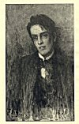

  
[Intangible Textual Heritage](../../../index.md)  [Legends and
Sagas](../../index)  [Yeats](../index)  [Celtic](../../celt/index.md) 
[Index](index)  [Next](twi01.md) 

------------------------------------------------------------------------

[Buy this Book at
Amazon.com](https://www.amazon.com/exec/obidos/ASIN/B0025VL14G/internetsacredte.md)

------------------------------------------------------------------------

  
*The Celtic Twilight*, by William Butler Yeats, \[1893, 1902\], at
Intangible Textual Heritage

------------------------------------------------------------------------

p. ii

BY THE SAME WRITER--

THE SECRET ROSE  
POEMS  
THE WIND AMONG THE REEDS  
THE SHADOWY WATERS

p. iii

# THE CELTIC TWILIGHT

p. iv

*Printed* 1893

Reprinted with additions 1902

p. v

 
[  
Click to enlarge](img/front.jpg.md)  
Frontispiece  

# The Celtic Twilight

## by W. B. YEATS

#### A. H. BULLEN, 18 Cecil Court

#### St. Martin's Lane, London, W.C.

#### MCMII

###### Scanned, proofed and formattted at Intangible Textual Heritage, July 2001 by J. Lelievre. Additional formatting and proofing, January, 2004. This text is in the public domain in the United States because it was published prior to 1923.

p. vi

Time drops in decay  
Like a candle burnt out.  
And the mountains and woods  
Have their day, have their day;  
But, kindly old rout  
Of the fire-born moods,  
You pass not away. 

------------------------------------------------------------------------

[Next: The Hosting Of The Sidhe](twi01.md)
