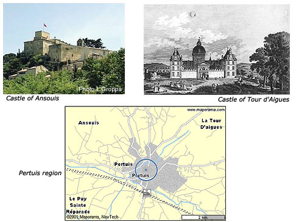

[Intangible Textual Heritage](../index)  [Nostradamus Index](index) 
[WTC Nostradamus page](091101) 

------------------------------------------------------------------------

Here is Mr. Fortin's analysis of the Nostradamus quatrain XII 52. It
represents his opinions only, however he has a much better understanding
of the cultural and linguistic background of Nostradamus than I
do.*--jbh*

  
In the English version there is mention of Aiguesmorte, the fortified
city in the Camargues, region of Provence, south of France. But the
original French version mention Tour D'Aigues which is a different
place. The Château de la Tour D'Aigues is up north near Pertuis also in
Provence.

1.Deux corps, vn chef. champs diuiƒez en deux  
2.Et puis reƒpondre à quatre non ouys.  
3.Petis pour Grands. à Pertuis mal pour eux.  
4.Tour D'Aigues foudre. pire pour Enƒƒouis.

1\. "Deux corps" is two armies as in "corps d'armée" (army corp). "vn
chef" (one chief, leader). "champs diuiƒez en deux", fields divided in
two. In the medieval period, some fields were divided by stone walls to
delimitate kingdoms. It could be a vision of these two armies advancing
on fields seperated by such wall or a natural element (river, cliff
etc..).

2\. "Et puis reƒpondre à quatre non ouys" (And then respond to four non
heard). Four "non ouys" could be four semaphores or flag signs. Messages
seen from a distance but unheard. Interpretation : "Then responding to
four signals"

3\. "Petis pour Grands, à Pertuis mal pour eux". Petis pour Grands
(Smalls for Talls) could be as simple as Children and Adults ("Les
petits et les grands" is a common expression in french). Pertuis\* is an
old town 6 km south of Tour D'Aigues. "Mal" is used as misfortune,
grief, pain (not evil). Interpretation : Children and Adults , in
Pertuis grief for them.

4\. "Tour D'Aigues foudre". Tour D'Aigues is the 16th century castle as
mentioned ealier."Foudre" (thunder) in french can be used in a
figurative sens (in english as well) for retaliation or being attacked.
As in "S'attirer les foudres de l'ennemis" (to provoque the ennemy's
thunder). Enƒƒouis in "Pire pour Enƒƒouis" would be Ansouis\*
(pronounced the same), another medieval castle 7 km east of Tour
D'Aigues. Interpretation : Tour D'Aigues attacked, worst for Ansouis.

Review :  
Two armies, one leader, advancing on divided fields  
Then responding to four signals  
Children and Adults , in Pertuis grief for them  
Tour D'Aigues attacked, worst for Ansouis

My conclusion: This quatrain is about an invasion by an unidentified
party in a specific area in Provence, France. It doesn't seem that this
prophecy occured and it haven't been retained by Nostradamus exegetists
in previous studies. Needless to say, nothing sounds familiar with
09/11/01.

\- Daniel Fortin

\*See images above

Daniel Fortin
