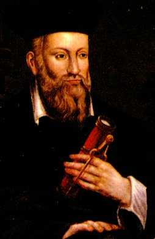

|                                                                  |                                              |
|------------------------------------------------------------------|----------------------------------------------|
|  | Nostradamus |

------------------------------------------------------------------------

[The Prophecies](#prophecies)    [Texts](#texts)    [Biography](#bio.md)   

------------------------------------------------------------------------

#### The Prophecies of Nostradamus

<table data-border="0" width="75%">
<colgroup>
<col style="width: 50%" />
<col style="width: 50%" />
</colgroup>
<tbody>
<tr class="odd">
<td data-valign="top">English text 
<a href="preface">Preface</a> 
<a href="cen1eng">Century I</a> 
<a href="cen2eng">Century II</a> 
<a href="cen3eng">Century III</a> 
<a href="cen4eng">Century IV</a> 
<a href="cen5eng">Century V</a> 
<a href="cen6eng">Century VI</a> 
<a href="cen7eng">Century VII</a> 
<a href="epistle">Epistle to Henry II</a> 
<a href="cen8eng">Century VIII</a> 
<a href="cen9eng">Century IX</a> 
<a href="cen10eng">Century X</a> 
<a href="almanac1">Almanacs: 1555-1563</a> 
<a href="almanac2">Almanacs: 1564-1567</a> 
</td>
<td data-valign="top"><a href="mrg/index">English and French text</a> 
<a href="mrg/nosmrg01">Century I</a> 
<a href="mrg/nosmrg02">Century II</a> 
<a href="mrg/nosmrg03">Century III</a> 
<a href="mrg/nosmrg04">Century IV</a> 
<a href="mrg/nosmrg05">Century V</a> 
<a href="mrg/nosmrg06">Century VI</a> 
<a href="mrg/nosmrg07">Century VII</a> 
<a href="mrg/nosmrg08">Century VIII</a> 
<a href="mrg/nosmrg09">Century IX</a> 
<a href="mrg/nosmrg10">Century X</a> 
<a href="mrg/nosmrg11">Century XI</a> 
<a href="mrg/nosmrg12">Century XII</a> 
</td>
</tr>
</tbody>
</table>

------------------------------------------------------------------------

#### Texts

 [Nostradamus: The Man Who Saw
Through Time](mst/index.md)   by Lee McCann
\[1941\].   A biography and
historical novel of Nostradamus, with many interpreted quatrains,
written during World War II. 

 [The Oracles of
Nostradamus](oon/index.md)   by Charles A.
Ward \[1891\].   The
complete text of one of the best books about Nostradamus ever
written. 

 [Did Nostradamus predict the WTC
disaster?](091101.md)   by John Bruno Hare
\[2001\]   You be the
judge.... 

------------------------------------------------------------------------

#### Biography of Nostradamus

The renowned prophet Nostradamus (Michel de Nostradame) was born on
December 14, 1503 in St. Remy, Provence, France. Nostradamus came from a
long line of Jewish doctors and scholars. His family had converted from
Judaism to Christianity in 1502, as a result of persecution on the
ascension of Louis the XII. After a classical education he studied
medicine, herbalism and astrology.

During Nostradamus' lifetime the Black Death (today known as the bubonic
plague) wiped out over a quarter of Europe. It is no wonder that a sense
of apocalyptic terror fills Nostradamus' quatrains.

Nostradamus can indisputably be said to have been ahead of his time, at
least in terms of medical practice. His treatment of the Black Death
involved removal of the infected corpses, fresh air and unpolluted water
for the healthy, a herbal preparation rich in Vitamin C, and (in
contravention of contemporary medical practise) not bleeding his
patients.

Nostradamus was successful in lessening the impact of the Black Death in
the capital of Provence, Aix. The grateful citizens gave him a stipend
for life.

Nostradamus began to write his prophetic verses in the city of Salon, in
1554. They are divided into ten sections called Centuries (which refers
to the number of verses in each section, not to a unit of 100 years).
The Centuries were published in 1555 and 1558, and have been in print
continuously ever since.

Nostradamus had the visions which he later recorded in verse while
staring into water or flame late at night, sometimes aided by herbal
stimulants, while sitting on a brass tripod. The resulting quatrains
(four line verses) are oblique and elliptical, and use puns, anagrams
and allegorical imagery. Most of the quatrains are open to multiple
interpretations, and some make no sense whatsoever. Some of them are
chilling, literal descriptions of events, giving specific or
near-specific names, geographic locations, astrological configurations,
and sometimes actual dates. It is this quality of both vagueness and
specificity which allows each new generation to reinterpret Nostradamus.

Nostradamus is said to have predicted his own death. When his assistant
wished him goodnight on July 1, 1566, Nostradamus reputedly pronounced,
"You will not find me alive at sunrise." He was found dead on July 2,
1566.

Nostradamus was interred standing upright in the Church of the
Cordeliers of Salon. However, his story does not end there; he was
disinterred twice, once on purpose and once maliciously.

In 1700, his body was moved by the city to a more prominent crypt. When
a necklace was found on his skeleton bearing the date '1700', his body
was hurriedly reinterred.

During the French Revolution, in 1791, some drunken soldiers broke into
his tomb. The mayor quickly placated the mob by describing how
Nostradamus had predicted the revolution, and they replaced the bones in
the crypt.

However, Nostradamus had the last laugh. In Century 9, Quatrain 7, he
had written:

The man who opens the tomb when it is found  
And who does not close it immediately,  
Evil will come to him  
That no one will be able to prove.  

Reputedly, the soldiers who desecrated his tomb for the final time were
ambushed on their way back to base and killed to the last man.

------------------------------------------------------------------------

 Stricly speaking, the copyright status of
the content in the 'Prophecies of Nostradamus' section is unknown
(particularly the English version). The files used to create this
section have appeared at several other sites on the Internet. The
copyright for the text on this page and the arragement of this material
is governed by the copyright message which can be found by following the
link at the start of this paragraph.

The Charles Ward and Lee McCann books are in the public domain in the
US.
