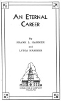
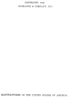

  
[Intangible Textual Heritage](../../index)  [New Thought](../index.md) 
[Index](index)  [Next](aec01.md) 

------------------------------------------------------------------------

*An Eternal Career*, by Frank and Lydia Hammer, \[1947\], at Intangible
Textual Heritage

------------------------------------------------------------------------

p. i

# AN ETERNAL

# CAREER

###### By

#### FRANK L. HAMMER

###### and

#### LYDIA HAMMER

#### Dorrance & Company, Philadelphia

#### \[1947\]

Scanned at Intangible Textual Heritage, June 2007. Proofed and formatted
by John Bruno Hare. This text is in the public domain in the United
States because its copyright was not renewed in a timely fashion as
required by law at the time. These files may be used for any
non-commercial purpose, provided this notice of attribution is left
intact in all copies.

[  
Click to enlarge](img/title.jpg.md)  
Title Page  

[  
Click to enlarge](img/verso.jpg.md)  
Verso  

------------------------------------------------------------------------

[Next: Author's Dedication and Front Matter](aec01.md)
