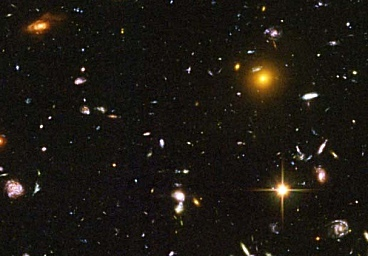

  
[Intangible Textual Heritage](../../index)  [New Thought](../index.md) 

------------------------------------------------------------------------

<table width="75%">
<colgroup>
<col style="width: 50%" />
<col style="width: 50%" />
</colgroup>
<tbody>
<tr class="odd">
<td width="50%" data-valign="TOP"></td>
<td width="50%" data-valign="CENTER"><h1 id="an-eternal-career" data-align="CENTER">An Eternal Career</h1>
<h2 id="by-frank-l.-hammer-and-lydia-hammer" data-align="CENTER">by Frank L. Hammer 
and 
Lydia Hammer</h2>
<h4 id="section" data-align="CENTER">[1947]</h4></td>
</tr>
</tbody>
</table>

------------------------------------------------------------------------

[Contents](#contents)    [Start Reading](aec00.md)

------------------------------------------------------------------------

This is the companion book to [Life and Its Mysteries](../lam/index.md).

------------------------------------------------------------------------

 [Title Page](aec00.md)  
[Author's Dedication and Front Matter](aec01.md)  
[Preface](aec02.md)  
[Contents](aec03.md)  
[I. What Is Life?](aec04.md)  
[II. What Is Human Nature?](aec05.md)  
[III. What Is Man?](aec06.md)  
[IV. Unity](aec07.md)  
[V. The Mystery of Suffering](aec08.md)  
[VI. Love](aec09.md)  
[VII. Religion](aec10.md)  
[VIII. Where Is God?](aec11.md)  
[IX. Accidents](aec12.md)  
[X. Unfinished Business](aec13.md)  
[XI. Supply and Demand](aec14.md)  
[XII. Preparation](aec15.md)  
[XIII. The Mystery of Death](aec16.md)  
[Jacket and Flaps](aec17.md)  
