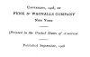

  
[Intangible Textual Heritage](../../index)  [New Thought](../index.md) 
[Index](index)  [Next](cvmc01.md) 

------------------------------------------------------------------------

*A Common-Sense View of the Mind Cure*, by Laura M. Westall, \[1908\],
at Intangible Textual Heritage

------------------------------------------------------------------------

p. 1

# A Common-Sense View

##### of

# The Mind-Cure

###### BY

## LAURA M. WESTALL

#### FUNK & WAGNALLS COMPANY

#### NEW YORK AND LONDON

#### \[1908\]

Scanned at Intangible Textual Heritage, October, 2006. Proofed and
formatted by John Bruno Hare. This text is in the public domain in the
United States because it was published prior to January 1st, 1923. These
files may be used for any non-commercial purpose provided this notice of
attribution is left intact in all copies.

[  
Click to enlarge](img/title.jpg.md)  
Title Page  

p. 2

[  
Click to enlarge](img/verso.jpg.md)  
Verso  

------------------------------------------------------------------------

[Next: Contents](cvmc01.md)
