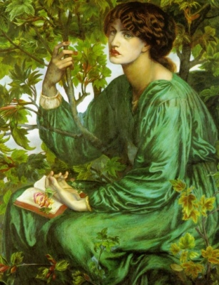

  
[Intangible Textual Heritage](../../index)  [New Thought](../index) 

------------------------------------------------------------------------

<table width="75%">
<colgroup>
<col style="width: 50%" />
<col style="width: 50%" />
</colgroup>
<tbody>
<tr class="odd">
<td width="50%" data-valign="TOP"></td>
<td width="50%" data-valign="CENTER"><h1 id="the-dore-lectures-on-mental-science" data-align="CENTER">The Dore Lectures on Mental Science</h1>
<h2 id="by-thomas-troward" data-align="CENTER">by Thomas Troward</h2>
<h4 id="section" data-align="CENTER">[1909]</h4></td>
</tr>
</tbody>
</table>

------------------------------------------------------------------------

[Contents](#contents)    [Start Reading](dlms00)    [Text
\[Zipped\]](dlms.txt.gz)

------------------------------------------------------------------------

 [Title Page](dlms00)  
[Contents](dlms01)  
[Foreword](dlms02)  
[Entering Into the Spirit of It](dlms03)  
[Individuality](dlms04)  
[The New Thought and the New Order](dlms05)  
[The Life of the Spirit](dlms06)  
[Alpha and Omega](dlms07)  
[The Creative Power of Thought](dlms08)  
[The Great Affirmative](dlms09)  
[Christ the Fulfilling of the Law](dlms10)  
[The Story of Eden](dlms11)  
[The Worship of Ishi](dlms12)  
[The Shepherd and the Stone](dlms13)  
[Salvation is of the Jews](dlms14)  
