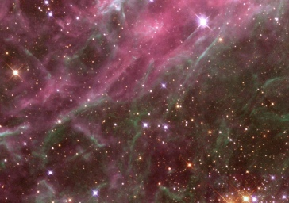

  
[Intangible Textual Heritage](../../index)  [New Thought](../index.md) 

------------------------------------------------------------------------

<table width="75%">
<colgroup>
<col style="width: 50%" />
<col style="width: 50%" />
</colgroup>
<tbody>
<tr class="odd">
<td width="50%" data-valign="TOP"></td>
<td width="50%" data-valign="CENTER"><h1 id="life-and-its-mysteries" data-align="CENTER">Life and Its Mysteries</h1>
<h2 id="by-frank-l.-hammer" data-align="CENTER">by Frank L. Hammer</h2>
<h4 id="section" data-align="CENTER">[1945]</h4></td>
</tr>
</tbody>
</table>

------------------------------------------------------------------------

[Contents](#contents)    [Start Reading](lam00.md)

------------------------------------------------------------------------

This is a short collection of articles by a WWII-era US author who
appears to have been influenced by New Thought, and to a lesser extent,
[Theosophy](../../the/index.md). He offers plain answers, without any
metaphysical jargon, to the 'big' questions, including "[Where do
animals go when they die?](lam15.md)". So far not much seems to available
online about Frank L. Hammer, particularly biographical: perhaps a
reader can supply some information. All of his books have been out of
print for years, although there seem to be plenty of used copies
available. Hammer wrote another book, [An Eternal Career](../aec/index.md),
\[1947\] also available online at this site.

------------------------------------------------------------------------

 [Title Page](lam00.md)  
[Preface](lam01.md)  
[Contents](lam02.md)  
[I. Birth](lam03.md)  
[II. Mind](lam04.md)  
[III. Thought](lam05.md)  
[IV. Telepathy](lam06.md)  
[V. Truth](lam07.md)  
[VI. Free Will](lam08.md)  
[VII. Miracles](lam09.md)  
[VIII. Equality](lam10.md)  
[IX. Affinity](lam11.md)  
[X. Individuality](lam12.md)  
[XI. Reality](lam13.md)  
[XI. Immortality](lam14.md)  
[XIII. Future Life of Animals](lam15.md)  
[XIV. Questions and Answers](lam16.md)  
[Dust Jacket copy](lam17.md)  
