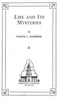

  
[Intangible Textual Heritage](../../index)  [New Thought](../index) 
[Index](index)  [Next](lam01) 

------------------------------------------------------------------------

*Life and Its Mysteries*, by Frank L. Hammer, \[1945\], at Intangible
Textual Heritage

------------------------------------------------------------------------

# LIFE AND ITS MYSTERIES

###### By

## FRANK L. HAMMER

#### DORRANCE & COMPANY

#### PHILADELPHIA

#### \[1945\]

[  
Click to enlarge](img/title.jpg)  
Title Page  

[  
Click to enlarge](img/verso.jpg)  
Verso  

Scanned at Intangible Textual Heritage, May 2007. Proofed and Formatted
by John Bruno Hare. This text is in the public domain in the United
States because the copyright was not renewed in a timely fashion as
required by law at the time. These files may be used for any
non-commercial purpose, provided this notice of attribution is left
intact in all copies.

p. iii

To

OUR BELOVED TEACHER

With

AFFECTION AND GRATITUDE FOR HAVING  
SHOWN US THE WAY

p. iv

<table data-border="0">
<colgroup>
<col style="width: 100%" />
</colgroup>
<tbody>
<tr class="odd">
<td data-valign="top">
O that ‘twere possible 
After long grief and pain 
To find the arms of my true love 
Round me once again. 
A shadow flits before me 
Not thou, but like to thee. 
Ah, Christ, that it were possible 
For one short hour to see 
The souls we loved, that they might tell us 
What and where they be!—<em>Tennyson</em>.
</td>
</tr>
</tbody>
</table>

 

------------------------------------------------------------------------

[Next: Preface](lam01)
