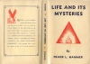
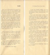

  
[Intangible Textual Heritage](../../index)  [New Thought](../index) 
[Index](index)  [Previous](lam16) 

------------------------------------------------------------------------

*Life and Its Mysteries*, by Frank L. Hammer, \[1945\], at Intangible
Textual Heritage

------------------------------------------------------------------------

[  
Click to enlarge](img/jacket.jpg)  
Dust Jacket cover  

[  
Click to enlarge](img/flaps.jpg)  
Dust Jacket flaps  

*Dust Jacket flap text:*

LIFE AND ITS MYSTERIES first appeared in serial form in *The New Age*
magazine, and in response to numerous requests the articles are herewith
published in one volume.

This book attempts to explain in a clear and logical manner some of
life's mysteries. Mystery, of course is only absence of knowledge, for
when we understand a thing it ceases to be a mystery. But since we never
will know all, there will always be mysteries.

Some of the views expressed may not appeal to the orthodox or to the
materialist, but they will prove acceptable to those who are seeking
light regarding the deeper things of life—and to those who have in their
home a chair forevermore vacant.

 

A few excerpts from letters by those who read Life and its Mysteries in
serial form.

"I have read your articles in *The New Age* and can say they are
masterpieces. I want to congratulate you on a fine piece of writing and
find out if you have them in book form."

"Your excellent articles with their direct and lucid style, coupled with
profundity of thought tower head over shoulders above anything any
magazine can offer."

(*Continued on back flap*)

(*Continued from front flap*)

"I have just finished reading your most wonderful article for the fifth
time, each time gaining a clearer understanding of life eternal."

"Your book will answer a great need. People all over the world are
turning to Truth which has been so deeply buried under centuries of
purely materialistic thinking and worship."

"I have received more comfort and encouragement from your articles than
all the sermons I have ever heard. You confine yourself to science and
to reason."

"I have been following your articles for some time, and have simply
devoured and enjoyed every word."

"You have covered more ground with fewer words than any article which I
have ever read. I would like at least six copies."

"Your articles are most helpful and inspirational; and I thank you for
the interest and pleasure they have given me."

"I have read your articles for which I wish to thank you. You have
explained my religion in a more beautiful form and I am truly grateful."

"You have given me faith that I shall see my son again."

 

|                                                  |
|--------------------------------------------------|
|  |

*Back Jacket Text:*  
WHEN you have finished reading this book, do not just place it on a
shelf. Put it to work for victory! Send it (or any other books you can
spare) today. Mail it to someone you know, to the U.S.O. office nearest
you, or address it to: COMMANDING GENERAL, 4th CORPS AREA HEADQUARTERS,
ATLANTA, GA., marked "FOR ARMY LIBRARIES." Book postage rate is only 4¢
a pound in the U. S. and its possessions.
