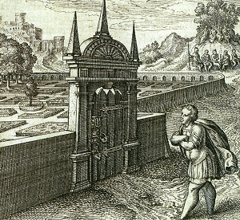

  
[Intangible Textual Heritage](../../index)  [New Thought](../index) 

------------------------------------------------------------------------

[Buy this Book at
Amazon.com](https://www.amazon.com/exec/obidos/ASIN/B001VEI7V8/internetsacredte)

------------------------------------------------------------------------

<table width="75%">
<colgroup>
<col style="width: 50%" />
<col style="width: 50%" />
</colgroup>
<tbody>
<tr class="odd">
<td width="50%" data-valign="TOP"></td>
<td width="50%" data-valign="CENTER"><h1 id="the-master-key-system" data-align="CENTER">The Master Key System</h1>
<h2 id="by-charles-f.-haanel" data-align="CENTER">by Charles F. Haanel</h2>
<h4 id="section" data-align="CENTER">[1919]</h4></td>
</tr>
</tbody>
</table>

------------------------------------------------------------------------

[Contents](#contents)    [Start Reading](mks00)    [Page
Index](pageidx)    [Text \[Zipped\]](mks.txt.gz)

------------------------------------------------------------------------

|                                                                                                                           |
|---------------------------------------------------------------------------------------------------------------------------|
|  |

"Spirituality" is quite "practical," very
"practical," intensely "practical." It teaches that Spirit is the Real
Thing, the Whole Thing, and that Matter is but plastic stuff, which
Spirit is able to create, mould, manipulate, and fashion to its will.
Spirituality is the most "practical" thing in the world--the only really
and absolutely "practical" thing that there is!--p. 304, para.
21.

Is there a secret behind the Secret? If so, this might be it. Haanel, a
somewhat mysterious figure who was what we would today call a business
development consultant, wrote this series of lessons shortly after World
War I. This turbulent time was made even more miserable by a flu
pandemic which killed millions. Many were searching for a royal road to
prosperity, health and inner peace, and Haanel's book held out this
promise.

For years, urban legends have swirled around this book: that it was
banned by some religious groups, and central to the success of a certain
well-known software tycoon. I was unable to confirm or disprove any of
these rumors. However, the Master Key System has had a huge influence on
successive New Thought writers, particularly those preaching 'Prosperity
Consciousness.' [Think and Grow Rich](../tgr/index) bears more than a
passing resemblance to the Master Key System. The 'Law of Attraction' at
the heart of Haanel's system has been acknowledged as one of the primary
sources for The Secret.

------------------------------------------------------------------------

 [Title Page](mks00)  
[Contents](mks01)  
[Introduction](mks02)  
[The Master Key Psychological Chart](mks03)  
[Part One](mks04)  
[Part Two](mks05)  
[Part Three](mks06)  
[Part Four](mks07)  
[Part Five](mks08)  
[Part Six](mks09)  
[Part Seven](mks10)  
[Part Eight](mks11)  
[Part Nine](mks12)  
[Part Ten](mks13)  
[Part Eleven](mks14)  
[Part Twelve](mks15)  
[Part Thirteen](mks16)  
[Part Fourteen](mks17)  
[Part Fifteen](mks18)  
[Part Sixteen](mks19)  
[Part Seventeen](mks20)  
[Part Eighteen](mks21)  
[Part Nineteen](mks22)  
[Part Twenty](mks23)  
[Part Twenty-One](mks24)  
[Part Twenty-Two](mks25)  
[Part Twenty-Three](mks26)  
[Part Twenty-Four](mks27)  
[Glossary](mks28)  
[Questions and Answers](mks29)  
[Index](mks30)  
