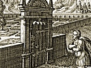

  
[Intangible Textual Heritage](../../index)  [New Thought](../index) 
[Index](index)  [Previous](mks25)  [Next](mks27) 

------------------------------------------------------------------------

[Buy this Book at
Amazon.com](https://www.amazon.com/exec/obidos/ASIN/B001VEI7V8/internetsacredte)

------------------------------------------------------------------------

  
*The Master Key System*, by Charles F. Haanel, \[1919\], at Intangible
Textual Heritage

------------------------------------------------------------------------

p. 294 p. 295

### PART TWENTY-THREE

THIS Part tells of the money consciousness and the power which sets the
current in motion which produces the attractive force which opens the
doors to the arteries of commerce. It tells how the current is stopped
or completely reversed and turned away from us. It tells how money is
woven into the outer fabric of our existence. Why it engages the best
thought of the best minds. How we make money. How to recognize
opportunity. How to make a money magnet of yourself. How to get the
necessary insight to perceive and utilize opportunities. How to
recognize values. It tells how to convert an idea into an income, how to
make a direct connection with the Universal Mind, how to secure
practical results; in fact, it s tell what the only really practical
thing is.

p. 296

#### INTRODUCTION. PART TWENTY-THREE

In this Part you will find that money weaves itself into the entire
fabric of our very existence; that the law of success is service; that
we get what we give, and for this reason we should consider it a great
privilege to be able to give.

We have found that thought is the creative activity behind every
constructive enterprise. We can therefore give nothing of more practical
value than our thought.

Creative thought requires attention, and the power of attention is, as
we have found, the weapon of the Super-man. Attention develops
concentration, and concentration develops Spiritual Power, and Spiritual
Power is the mightiest force in existence.

This is the science which embraces all sciences. It is the art which,
above all arts, is relevant to human life. In the mastery of this
science and this art there is opportunity for unending progression.
Perfection in this is not acquired in six days, or in six weeks, or in
six months. It is the labour of a life. Not to go forward is to go
backward.

It is inevitable that the entertainment of positive, constructive and
unselfish thoughts should have a far-reaching effect for good.
Compensation is the key-note of the universe. Nature is constantly
seeking to strike an equilibrium. Where something is sent out, something
must be received; lest there should be a vacuum formed. By observance of
this rule you cannot fail to profit in such measure as amply to justify
your effort along this line.

p. 297

#### PART TWENTY-THREE

XXIII, 11.
The money consciousness is an attitude of mind; it is the open door to
the arteries of commerce. It is the receptive attitude. Desire is the
attractive force which sets the current in motion and fear is the great
obstacle by which the current is stopped or completely reversed—turned
away from us.

XXIII, 22.
Fear is just the opposite from money consciousness; it is poverty
consciousness, and as the law is unchangeable we get exactly what we
give; if we fear we get what we feared. Money weaves itself into the
entire fabric of our very existence; it engages the best thought of the
best minds.

XXIII, 33. We
make money by making friends, and we enlarge our circle of friends by
making money for them, by helping them, by being of service to them. The
first law of success then is service, and this in turn is built on
integrity and justice. The man who at least is not fair in his intention
is simply ignorant; he has missed the fundamental law of all exchange;
he is impossible; he will lose surely and certainly; he may not know it;
he may think he is winning, but he is doomed to certain defeat. He
cannot cheat the Infinite. The law of compensation will demand of him an
eye for an eye and a tooth for a tooth.

XXIII, 44.
The forces of life are volatile; they are composed of our thoughts and
ideals and these in turn are moulded into form; our problem is to keep
an open mind, to constantly reach out

p. 298

for the new, to recognize opportunity, to be interested in the race
rather than the goal, for the pleasure is in the pursuit rather than the
possession.

XXIII, 55.
You can make a money magnet of yourself, but to do so you must first
consider how you can make money for other people. If you have the
necessary insight to perceive and utilize opportunities and propitious
conditions and recognize values, you can put yourself in position to
take advantage of them, but your greatest success will come as you are
enabled to assist others. What benefits one must benefit all.

XXIII, 66. A
generous thought is filled with strength and vitality, a selfish thought
contains the germs of dissolution; it will disintegrate and pass away.
Great financiers like Morgan, Rothschild and others are simply channels
for the distribution of wealth; enormous amounts come and go, but it
would be as dangerous to stop the outgo as the income; both ends must
remain open; and so our greatest success will come as we recognize that
it is just as essential to give as to get.

XXIII, 77. If
we recognize the Omnipotent power that is the source of all supply we
will adjust our consciousness to this supply in such a way that it will
constantly attract all that is necessary to itself and we shall find
that the more we give the more we get. Giving in this sense implies

p. 299

service. The banker gives his money, the merchant his goods, the author
gives his thought, the workman gives his skill; all have something to
give, but the more they can give, the more they get, and the more they
get the more they are enabled to give.

XXIII, 88.
The financier gets much because he gives much; he thinks; he is seldom a
man that lets any one else do his thinking for him; he wants to know how
results are to be secured; you must show him; when you can do this he
will furnish the means by which hundreds nr thousands may profit, and in
proportion as they are successful will he be successful. Morgan,
Rockefeller, Carnegie, Rothschild and others did not get rich because
they lost money for other people; on the contrary, it is because they
made money for other people that they became the wealthiest men in the
wealthiest countries on the globe.

XXIII, 99.
The average person is entirely innocent of any deep thinking; he accepts
the ideas of others, and repeats them, in very much the same way as a
parrot; this is readily seen when we understand the method which is used
to form public opinion, and this docile attitude on the part of a large
majority who seem perfectly willing to let a few persons do all their
thinking for them is what enables a few men in a great many countries to
usurp all the avenues of power

p. 300

and hold the millions in subjection. Creative thinking requires
attention.

XXIII, 1010.
The power of attention is called concentration; this power is directed
by the will; for this reason we must refuse to concentrate or think of
anything except the things we desire. Many are constantly concentrating
upon sorrow, loss and discord of every kind; as thought is creative it
necessarily follows that this concentration inevitably leads to more
loss, more sorrow and more discord. How could it be otherwise? On the
other hand, when we meet with success, gain, or any other desirable
condition, we naturally concentrate upon the effects of these things and
thereby create more, and so it follows that much leads to more.

XXIII, 1111.
How an understanding of this principle can be utilized in the business
world is well told by Mr. Atkinson in "Advanced Thought." He says:

XXIII, 1212.
"Spirit, whatever else it may or may not be, must be considered as the
Essence of Consciousness, the Substance of Mind, the reality underlying
Thought. And as all Ideas are phases of the activity of Consciousness,
Mind or Thought, it follows that in Spirit, and in it alone, is to be
found the Ultimate Fact, the Real Thing, or Idea."

XXIII, 1313.
This being admitted, does it not seem reasonable to hold that a true
understanding of

p. 301

\[paragraph continues\] Spirit, and its
laws of manifestation, would be about the most "practical" thing that a
"practical" person can hope to find? Does it not seem certain that if
the "practical" men of the world could but realize this fact, they would
"fall all over themselves" in getting to the place in which they might
obtain such knowledge of spiritual things and laws? These men are not
fools; they need only to grasp this fundamental fact in order to move in
the direction of that which is the essence of all achievement.

XXIII, 1414.
Let me give you a concrete example. I know a man whom I had always
considered to be quite materialistic. He had made several successes in
life; and also several failures. The last time I had a talk with him he
was practically "down and out," as compared with his former business
condition. It looked as if he had indeed reached "the end of his rope,"
for he was well advanced into the stage of middle-age and new ideas came
more slowly, and less frequently to him than in former years.

XXIII, 1515.
He said to me, in substance: "I know that all things that 'work out' in
business are the result of Thought; any fool knows that. Just now, I
seem to be short of thoughts and good ideas. But if this 'All-Mind'
teaching is correct, there should be possible to the individual the
attainment of 'direct connection' with Infinite Mind; and in Infinite
Mind there must be the possibility of all kinds of good ideas

p. 302

which a man of my courage and experience could put to practical use in
the business world, and make a big success of. It looks good to me; and
I am going to look into it."

XXIII, 1616.
This was about two years ago. The other day I heard of this man again.
Talking to a friend, I said: "What has become of our old friend X? Has
he ever got on his feet again?" The friend looked at me in amazement.
"Why," said he, "don't you know about X's great success? He is the Big
Man in the '—— Company'." He named a concern which has made a phenomenal
success during the last eighteen months and is now well known, by reason
of its advertisements, from one end of the country to another, and also
abroad.) "He is the man who supplied the BIG IDEA for that concern. Why,
he is about a half-million to the good and is moving rapidly toward the
million mark; all in the space of eighteen months." I had not connected
this man with the enterprise mentioned; although I knew of the wonderful
success of the company in question. Investigation has shown that the
story is true, and that the above stated facts are not exaggerated in
the slightest.

XXIII, 1717.
Now, what do you think of that? To me, it means that this man actually
made the "direct connection" with Infinite Mind Spirit—and, having found
it, he set it to work for him. He "used it in his business."

p. 303

XXIII, 1818.
Does this sound sacrilegious or blasphemous? I hope not; I do not mean
it to be so. Take away the implication of Personality, or Magnified
Human Nature, from the conception of "The Infinite," and you have left
the conception of an Infinite Presence-Power, the Quintessence of which
is Consciousness—in fact, at the last, Spirit. As this man, also at the
last, must be considered as a manifestation of Spirit; there is nothing
sacrilegious in the idea that he, being Spirit, should so harmonize
himself with his Origin and Source that he would be able to manifest at
least a minor degree of its Power. All of us do this, more or less, when
we use our minds in the direction of Creative Thought. This man. did
more, he went about it in an intensely "practical" manner.

XXIII, 1919.
I have not consulted him about his method of procedure, though I intend
doing so at the first opportunity, but, he not only drew upon the
Infinite Supply for the ideas which he needed (and which formed the seed
of his success), but he also used the Creative Power of Thought in
building up for himself an Idealistic Pattern of that which he hoped to
manifest in material form, adding thereto, changing, improving its
detail, from time [to](errata.htm#5) time—proceeding from the general
outline to the finished detail. I judge this to be the facts of the
case, not alone from my recollection of the conversation two years ago,
but also because I have found the same thing to be true

p. 304

in the cases of other prominent men who have made similar manifestation
of Creative Thought.

XXIII, 2020.
Those who may shrink from this idea of employing the Infinite Power to
aid a man in his work in the material world, should remember that if the
Infinite objected in the least to such a procedure the thing could never
happen. The Infinite is quite able to take care of Itself.

XXIII, 2121.
"Spirituality" is quite "practical," very "practical," intensely
"practical." It teaches that Spirit is the Real Thing, the Whole Thing,
and that Matter is but plastic stuff, which Spirit is able to create,
mould, manipulate, and fashion to its will. Spirituality is the most
"practical" thing in the world—the only really and absolutely
"practical" thing that there is!

XXIII, 2222.
Now concentrate on the fact that man is not a body with a spirit, but a
spirit with a body, and that it is for this reason that his desires are
incapable of any permanent satisfaction in anything not spiritual. Money
is therefore of no value except to bring about the conditions which we
desire, and these conditions are necessarily harmonious. Harmonious
conditions necessitate sufficient supply, so that if there appears to be
any lack, we should realize that the idea or soul of money is service,
and as this thought takes form, channels of supply will be opened, and
you will have the satisfaction of knowing that spiritual methods are
entirely practical.

p. 305

#### PART TWENTY-THREE

221\. *What is the first law of success?*

Service.

222\. *How may we be of the most service?*

By having an open mind. By being interested in the race rather than the
goal, in the pursuit rather than possession.

223\. *What is the result of a selfish thought?*

It contains the germs of dissolution.

224\. *How will our greatest success he achieved?*

By a recognition of the fact that it is just as essential to give as to
receive.

225\. *Why do great organizers meet with great success?*

Because they do their own thinking.

226\. *Why do the great majority in every country remain the docile and
apparently willing tools of the few?*

Because they let the few do all their thinking for them.

227\. *What is the effect of concentrating upon sorrow and loss?*

More sorrow and more loss.

p. 306

228\. *What is the effect of concentrating upon gain?*

More gain.

229\. *Is this principle used in the business world?*

It is the only principle which is ever used, or ever could be used;
there is no other principle. The fact that it may be used unconsciously
does not alter or change the situation.

230\. *What is the practical result of this principle?*

Success which is an effect, not a cause. If we wish to secure any effect
we must ascertain the cause, or idea or thought by which the effect is
created.

 

 

 

We have discovered that premeditated, orderly thinking for a purpose
matures that purpose into fixed form, so that we may be absolutely sure
of the result of our dynamic experiment.—Francis Larimer Warner.

------------------------------------------------------------------------

[Next: Part Twenty-Four](mks27)
