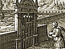

  
[Intangible Textual Heritage](../../index)  [New Thought](../index.md) 
[Index](index)  [Previous](mks26)  [Next](mks28.md) 

------------------------------------------------------------------------

[Buy this Book at
Amazon.com](https://www.amazon.com/exec/obidos/ASIN/B001VEI7V8/internetsacredte.md)

------------------------------------------------------------------------

  
*The Master Key System*, by Charles F. Haanel, \[1919\], at Intangible
Textual Heritage

------------------------------------------------------------------------

p. 307

### PART TWENTY-FOUR

THIS Part explains the entire theory and practice of every system of
Metaphysics; it tells how to express harmony, how to express health, how
to express abundance. It explains the nature of all conditions, and how
they may be changed or removed. It explains how every difficulty, no
matter what it is or where it is, can be removed or dissolved, and it
explains the only way in which this is ever done or can be done. It also
tells of a Master Key by which those who are wise enough to understand,
broad enough to weigh the evidence, firm enough to follow their own
judgment, and strong enough to make the sacrifice exacted, may enter and
partake.

p. 308

#### INTRODUCTION. PART TWENTY-FOUR

This is the final Part.

If you have practised each of the exercises a few minutes every day, as
suggested, you will have found that you can get out of life exactly what
you wish by first putting into life that which you wish, and you will
probably agree with the adept who said: "The Master Key thought is
almost overwhelming; it is so vast, so available, so definite, so
reasonable and so usable."

The fruit of this knowledge is, as it were, a gift of the Gods; it is
the "Truth" that makes men free, not only free from every lack and
limitation, but free from sorrow, worry and care. Is it not wonderful to
realize that omnipotent law is no respecter of persons; that it makes no
difference what your past habit of thought may have been, the way has
been prepared.

If you are inclined to be religious, the greatest religious teacher the
world has ever known made the way so plain that all may follow. If your
mental bias is toward physical science, the law will operate with
mathematical certainty. If you are inclined to be philosophical, Plato
or Emerson may be your teacher; but, in each case, you may, by The
Master Key, means reach degrees of power to which it is impossible to
assign any limit.

An understanding of The Master Key, I believe, is the secret for which
the ancient Alchemists vainly sought, because it explains how gold in
the mind may be transmuted into gold in the heart and in the hand.

p. 309

#### PART TWENTY-FOUR

XXIV, 11. When
the scientists first put the Sun in the centre of the Solar System and
sent the earth spinning around it, there was immense surprise and
consternation. The whole idea was self-evidently false; nothing was more
certain than the movement of the Sun across the sky, and any one could
see it descend behind the western hills and sink into the sea; scholars
raged and scientists rejected the idea as absurd, yet the evidence has
finally carried conviction in the minds of all.

XXIV, 22. We
speak of a bell as a "sounding body," yet we knew that all the bell can
do is to produce vibrations in the air. When these vibrations come at
the rate of sixteen a second they cause a sound to be heard in the mind.
It is possible for the mind to hear vibrations at the rate of 38,000 a
second. When the number increases beyond this all is silence again; so
that we know that the sound is not in the bell, it is in our own mind.

XXIV, 33. We
speak and even think of the Sun as "giving light." Yet we know it is
simply giving forth energy which produces vibrations in the ether at the
rate of four hundred trillion a second, causing what are termed light
waves, so that we know that what we call light is simply a form of
energy and that the only light there is, is the sensation caused in the
mind by the motion of the waves. When the number increases, the light
changes in colour, each change

p. 310

in colour being caused by shorter and more rapid vibrations; so that
although we speak of the rose as being red, the grass as being green, or
the sky as being blue, we know that the colours exist only in our minds,
and are the sensations experienced by us as the result of the vibrations
of light waves. When the vibrations are reduced below four hundred
trillion a second, they no longer affect us as light, but we experience
the sensation of heat. It is evident, therefore, that we cannot depend
upon the evidence of the senses for our information concerning the
realities of things; if we did we should believe that the sun moved,
that the world was flat instead of round, that the stars were bits of
light instead of vast suns.

XXIV, 44. The
whole range then of the theory and practice of any system of metaphysics
consists in knowing the Truth concerning yourself and the world in which
you live; in knowing that in order to express harmony, you must think
harmony; in order to express health you must think health; and in order
to express abundance you must think abundance; to do this you must
reverse the evidence of the senses.

XXIV, 55. When
you come to know that every form of disease, sickness, lack and
limitation are simply the result of wrong thinking, you will have come
to know "the Truth which shall make you free." You will see how
mountains may be removed. If these mountains consist

p. 311

only of doubt, fear, distrust or other forms of discouragement, they are
none the less real, and they need not only to be removed but to be "cast
into the sea."

XXIV, 66. Your
real work consists in convincing yourself of the truth of these
statements. When you have succeeded in doing this you will have no
difficulty in thinking the truth, and as has been shown, the truth
contains a vital principle and will manifest itself.

XXIV, 77.
Those who heal diseases by mental methods have come to know this truth
they demonstrate it in their lives and the lives of others daily. They
know that life, health and abundance are Omnipresent, filling all space,
and they know that those who allow disease or lack of any kind to
manifest, have as yet not come into an understanding of this great law.

XXIV, 88. As
all conditions are thought creations and therefore entirely mental,
disease and lack are simply mental conditions in which the person fails
to perceive the truth; as soon as the error is removed, the condition is
removed.

XXIV, 99. The
method for removing this error is to go into the Silence and know the
Truth; as all mind is one mind, you can do this for yourself or anyone
else. If you have learned to form mental images of the conditions
desired, this will be the easiest and quickest way to secure results; if
not, results can be accomplished

p. 312

by argument, by the process of convincing yourself absolutely of the
truth of your statement.

XXIV, 1010.
Remember, and this is one of the most difficult as well as most
wonderful statements to grasp. Remember that no matter what the
difficulty is, no matter where it is, no matter who is affected, you
have no patient but yourself; you have nothing to do but to convince
yourself of the truth which you desire to see manifested.

XXIV, 1111.
This is an exact scientific statement in accordance with every system of
Metaphysics in existence, and no permanent results are ever secured in
any other way.

XXIV, 1212.
Every form of concentration, forming Mental Images, Argument, and
Auto-Suggestion are all simply methods by which you are enabled to
realize the Truth.

XXIV, 1313.
If you desire to help some one, to destroy some form of lack, limitation
or error, the correct method is not to think of the person whom you wish
to help; the intention to help them is entirely sufficient, as this puts
you in mental touch with the person. Then drive out of your own mind any
belief of lack, limitation, disease, danger, difficulty, or whatever the
trouble might be. As soon as you have succeeded in doing this the result
will have been accomplished, and the person will be free.

p. 313

XXIV, 1414.
But remember that thought is creative and consequently every time you
allow your thought to rest on any inharmonious condition, you must
realize that such conditions are apparent only, they have no reality;
that spirit is the only reality and it can never be less than perfect.

XXIV, 1515.
All thought is a form of energy, a rate of vibration, but a thought of
the Truth is the highest rate of vibration known and consequently
destroys every form of error in exactly the same way that light destroys
darkness; no form of error can exist when the "Truth" appears, so that
your entire mental work consists in coming into an understanding of the
Truth. This will enable you to overcome every form of lack, limitation
or disease of any kind.

XXIV, 1616.
We can get no understanding of the truth from the world without; the
world without is relative only; Truth is absolute. We must therefore
find it in the "world within."

XXIV, 1717.
To train the mind to see Truth only is to express true conditions only.
Our ability to do this will be an indication of the progress we are
making.

XXIV, 1818.
The absolute truth is that the "I" is perfect and complete; the real "I"
is spiritual and can therefore never be less than perfect; it can never
have any lack, limitation, or disease. The flash of genius does not have
origin in the

p. 314

molecular motion of the brain; it is inspired by the ego, the spiritual
"I" which is one with the Universal Mind, and it is our ability to
recognize this Unity which is the cause of all inspiration, all genius.
These results are far-reaching and have effect upon generations yet to
come; they are the pillars of fire which mark the path that millions
follow.

XXIV, 1919.
Truth is not the result of logical training or of experimentation, or
even of observation; it is the product of a developed consciousness;
Truth within a Caesar, manifests in a Caesar's deportment, in his life
and his action; his influence upon social forms and progress. Your life
and your actions and your influence in the world will depend upon the
degree of truth which you are enabled to perceive, for truth will not
manifest in creeds, but in conduct.

XXIV, 2020.
Truth manifests in character, and the character of a man should be the
interpretation of his religion, or what to him is truth, and this will
in turn be evidenced in the character of his possessions. If a man
complains of the drift of his fortune he is just as unjust to himself as
if he should deny rational truth, though it stand patent and
irrefutable.

XXIV, 2121.
Our environment and the innumerable circumstances and accidents of our
lives already exist in the subconscious personality which attracts to
itself the mental and physical material which is congenial to its
nature. Thus

p. 315

is our future being determined from our present, and if there should be
apparent injustice in any feature or phase of our personal life, we must
look within for the cause, try to discover the mental fact which is
responsible for the outward manifestation.

XXIV, 2222.
It is this truth which makes you "free," and it is the conscious
knowledge of this truth which will enable you to overcome every
difficulty.

XXIV, 2323.
The conditions with which you meet in the world without are invariably
the result of the conditions obtaining in the world within; therefore it
follows with scientific accuracy that by holding the perfect ideal in
mind you can bring about ideal conditions in your environment.

XXIV, 2424.
If you see only the incomplete, the imperfect, the relative, the
limited, these conditions will manifest in your life; but if you train
your mind to see and realize the spiritual ego, the "I" which is for
ever perfect and complete, harmonious; wholesome and healthful
conditions only will be manifested.

XXIV, 2525.
As thought is creative, and the truth is the highest and most perfect
thought which anyone can think, it is self-evident that to think the
truth is to create that which is true and it is again evident that when
truth comes into being that which is false must cease to be.

p. 316

XXIV, 2626.
The Universal Mind is the totality of all mind which is in existence.
Spirit is Mind, because spirit is intelligent. The words are, therefore,
synonymous.

XXIV, 2727.
The difficulty with which you have to contend is to realize that mind is
not individual. It is omnipresent. It exists everywhere. In other words,
there is no place where it is not. It is, therefore, Universal.

XXIV, 2828.
Men have, heretofore, generally used the word "God" to indicate this
Universal, creative principle; but the word "God" does not convey the
right meaning. Most people understand this word to mean something
outside of themselves; while exactly the contrary is the fact. It is our
very life. Without it we would be dead. We would cease to exist. The
minute the spirit leaves the body, we are as nothing. Therefore, spirit
is really all there is of us.

XXIV, 2929.
Now the only activity which the spirit possesses is the power to think.
Therefore, thought must be creative, because spirit is creative. This
creative power is impersonal and your ability to think is your ability
to control it and make use of it for the benefit of yourself and others
.

XXIV, 3030.
When the truth of this statement is realized, understood, and
appreciated, you will have come into possession of the Master Key, but
remember that only those who are wise

p. 317

enough to understand, broad enough to weigh the evidence, firm enough to
follow their own judgment, and strong enough to make the sacrifice
exacted, may enter and partake.

XXIV, 3131.
Now, try to realize that this is truly a wonderful world in which we
live, that you are a wonderful being, that many are awakening to a
knowledge of the Truth, and as fast as they awake and come into a
knowledge of the "things which have been prepared for them" they, too,
realize that for them previously "Eye hath not seen, nor ear heard,
neither hath it entered into the heart of man," the splendour which
exists for those who find themselves in the Promised Land. They have
crossed the river of judgment and have arrived at the point of
discrimination between the true and the false, and have found that all
they ever willed or dreamed, was but a faint concept of the dazzling
reality.

 

Though an inheritance of acres may be bequeathed, an inheritance of
knowledge and wisdom cannot. The wealthy man may pay others for doing
his work for him, but it is impossible to get his thinking done for him
by another, or to purchase any kind of self-culture.—S. Smiles.

p. 318

#### PART TWENTY-FOUR

231\. *Upon what principle does the theory and practice of every system
of Metaphysics in existence depend?*

Upon a knowledge of the "Truth" concerning yourself and the world in
which you live.

232\. *What is the "Truth" concerning yourself?*

The real "I" or ego is spiritual and can therefore never be less than
perfect.

233\. *What is the method of destroying any form of error?*

To absolutely convince yourself of the "Truth" concerning the condition
which you wish to see manifested.

234\. *Can we do this for others?*

The Universal Mind in which "we live and move and have our being" is one
and indivisible; it is therefore just as possible to help others as to
help ourselves.

235\. *What is the Universal Mind?*

The totality of all mind in existence.

236\. *Where is the Universal Mind?*

The Universal Mind is omnipresent, it exists everywhere. There is no
place

p. 319

where it is not. It is therefore within us. It is "The World within." It
is our spirit, our life.

237\. *What is the nature of the Universal Mind?*

It is spiritual and consequently creative. It seeks to express itself in
form.

238\. *How may we act on the Universal Mind?*

Our ability to think is our ability to act on the Universal Mind and
bring it into manifestation for the benefit of ourselves or others.

239\. *What is meant by thinking?*

Clear, decisive, calm, deliberate, sustained thought with a definite end
in view.

240\. *What will be the result?*

You will also be able to say, "It is not I that doeth the works, but the
'Father' that dwelleth within me, He doeth the works." You will come to
know that the "Father" is the Universal Mind and that He does really and
truly dwell within you, in other words, you will come to know that the
wonderful promises made in the Bible are fact, not fiction, and can be
demonstrated by anyone having sufficient understanding.

------------------------------------------------------------------------

[Next: Glossary](mks28.md)
