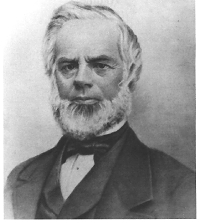

  
[Intangible Textual Heritage](../../index)  [New Thought](../index) 

------------------------------------------------------------------------

[Buy this Book at
Amazon.com](https://www.amazon.com/exec/obidos/ASIN/1602062145/internetsacredte)

------------------------------------------------------------------------

[Buy this Book on
Kindle](https://www.amazon.com/exec/obidos/ASIN/B002I630CY/internetsacredte)

------------------------------------------------------------------------

<table width="75%">
<colgroup>
<col style="width: 50%" />
<col style="width: 50%" />
</colgroup>
<tbody>
<tr class="odd">
<td width="50%" data-valign="TOP"> 
Phineas Parkhust Quimby [19th cent.] (Public Domain Image)</td>
<td width="50%" data-valign="CENTER"><h1 id="the-quimby-manuscripts" data-align="CENTER">The Quimby Manuscripts</h1>
<h2 id="by-phineas-parkhurst-quimby" data-align="CENTER">by Phineas Parkhurst Quimby</h2>
<h3 id="ed.-by-horatio-w.-dresser" data-align="CENTER">ed. by Horatio W. Dresser</h3>
<h4 id="section" data-align="CENTER">[1921]</h4></td>
</tr>
</tbody>
</table>

------------------------------------------------------------------------

[Contents](#contents)    [Start Reading](qm00)    [Page
Index](pageidx)    [Text \[Zipped\]](qm.txt.gz)

------------------------------------------------------------------------

|                                                                                                                           |
|---------------------------------------------------------------------------------------------------------------------------|
|  |

P. P. Quimby has been called the founder of 'New Thought.' There was
controversy as to whether he also originated Christian Science. This set
of documents, published in 1921 in response to a campaign to question
his early role in Christian Science, shows that Quimby indeed
anticipated many of the key ideas of both movements. Dresser, the editor
was an early follower of Quimby. He shows that not only did Quimby have
contact with Eddy, the founder of Christian Science, he probably also
coined the term 'Christian Science.'

------------------------------------------------------------------------

 [Title Page](qm00)  
[Publisher's Note](qm01)  
[Editor's Preface to the Second Edition](qm02)  
[Contents](qm03)  
[1. Biographical Sketch](qm04)  
[2. History of the Manuscripts](qm05)  
[3. Quimby's Restoration to Health](qm06)  
[4. The Mesmeric Period](qm07)  
[5. The Principles Discovered](qm08)  
[6. The Intermediate Period](qm09)  
[7. Early Writings](qm10)  
[8. Contemporary Testimony](qm11)  
[9. Letters from Patients](qm12)  
[10. Letters to Patients](qm13)  
[11. Letters to Patients and Inquirers](qm14)  
[12. Mrs. Eddy 1862-1875](qm15)  
[13. Questions and Answers](qm16)  
[14. Christ or Science](qm17)  
[15. The World of the Senses](qm18)  
[16. Disease and Healing](qm19)  
[17. God and Man](qm20)  
[18. Religious Questions](qm21)  
[19. Science, Life, Death](qm22)  

### Appendix

[List of Articles by Dr. P. P. Quimby](qm23)  
[The Quimby-Eddy Controversy](qm24)  

 

[Index](qm25)  
[Photographic Reproductions of Manuscripts](qm26)  
