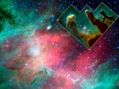

  
[Intangible Textual Heritage](../../index)  [New Thought](../index) 
[Index](index)  [Next](sotu01) 

------------------------------------------------------------------------

[Buy this Book at
Amazon.com](https://www.amazon.com/exec/obidos/ASIN/B00086EZJI/internetsacredte)

------------------------------------------------------------------------

  
*The Secret of the Universe*, by Nathan R. Wood, \[1932\], at Intangible
Textual Heritage

------------------------------------------------------------------------

# The Secret of the Universe

## "God, Man and Matter"

###### by

##### NATHAN R. WOOD

#### New York: F. H. Revel & Co.

#### \[1932\]

Scanned, proofed and formatted by John Bruno Hare at Intangible Textual
Heritage, June 2008. This text is in the public domain in the US because
it was not renewed at the US Copyright Office in a timely fashion.

------------------------------------------------------------------------

[Next: Introduction](sotu01)
