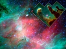

  
[Intangible Textual Heritage](../../index)  [New Thought](../index) 
[Index](index)  [Previous](sotu07)  [Next](sotu09) 

------------------------------------------------------------------------

[Buy this Book at
Amazon.com](https://www.amazon.com/exec/obidos/ASIN/B00086EZJI/internetsacredte)

------------------------------------------------------------------------

  
*The Secret of the Universe*, by Nathan R. Wood, \[1932\], at Intangible
Textual Heritage

------------------------------------------------------------------------

p. 109

### II. THE SECRET OF THE UNIVERSE, AND THE PROBLEM OF SPACE AND MATTER

Is space the source of matter?—But what is
space?—But what are dimensions?—"Real space"—How does power come to be a
physical universe?—The Reality of Space, Energy and Motion—How modern
discovery leads to this reality—How "ether" leads to it—The troubles of
"ether''—The way
out—Discontinuity—Continuity—Momentum—Magnetism—Vibrations—Quanta—Electricity—Electromagnetism—The
universal energy—The true Continuum—Particles versus Waves—Space and
Motion.

What is the relation between space, matter and time?

That question must have hovered in our minds as we have thought about
the three. It is indeed a question which is very much around us in the
air to-day. The question of the relationship, or, as people like to call
it, the relativity of space, matter and time, besets any thinking man or
woman in recent years.

What is the organic relationship of space, matter and time to each
other? They are together the structure of the physical universe. That of
course we know. They share a common vast Triunity, each of them being a
marvelous embodiment of it. That also we know. But is there any other
relation between them? Are these three triunities, which are the fabric
of the physical universe, a yet vaster triunity with each other? Does
then the Divine Triunity explain and illumine the relationships of
space, matter and time to each other? There are surely many mighty
things which depend on it.

#### *Is Space the Source of Matter?*

In the Divine Triunity the Father is the Source of the Son, and the Son
is the embodiment of the Father.

p. 110

In the triunity which we call matter, energy is the source of motion,
and motion is the embodiment of energy.

In the triunity of time, the future is the source of the present, and
the present is perpetually becoming the embodiment of the future.

In the triunity of man, the nature is the source, and the person is the
embodiment.

Is it so then with space, matter and time together? *Is space the source
of matter? And is matter the embodiment of space?* Are the relations
between space and matter those of the universal triunity?

 

We know what matter is. It is energy, motion and phenomena. Its chief
factor is motion. But what is space?

#### *But What Is Space?*

What is space? The answer is at once simple and complex. The simple
answer is self-evident. We can all agree upon it. Space is composed of
dimensions. That is certain. Space is nothing else. It consists of
dimensions.

That is the clear and obvious answer. But it is not answer enough for
genuine reality such as we now would reach. We must go further.

What then are the dimensions which we call space? What are they
dimensions of?

They are of course the dimensions of space. But that is tautological. It
moves in a circle. They are the dimensions of space. But space, on the
other hand, is composed of these dimensions. A certain building is built
of boards. You ask, "Boards of what?" The

p. 111

answer comes, "They are boards of the building." Of course they are. But
the building is composed of the boards. What are the boards composed of?
Of oak? Of pine? Of maple? So space is composed of dimensions. But what
are the dimensions composed of? What are they dimensions of?

Are they dimensions of nothingness, of absolute emptiness? That is a
strange idea. But stranger still, it is a very prevalent conception of
space! Space is often described as nothingness, and its dimensions as
dimensions of nothingness.

But can nothingness have dimensions? You may indeed think of an empty
box or chamber, and think of its emptiness as having dimensions. It
might be emptied of air, and contain only a vacuum. Then there is
nothing at all there, yet there are dimensions there. But in that case
it is not the emptiness or vacuum which has the dimensions. It is the
box or chamber which has the dimensions. How can sheer, absolute
nothingness have dimensions or anything else?

The unreality of the common idea of space as nothingness in several
dimensions is strikingly shown by the revolt against it. That revolt, as
we know, regards space as being only a form of thought in which we
conceive matter or motion. Kant of course is sponsor for the idea that
space is a form of thought in which the mind conceives matter. But if in
Kant's day it had been clearly known through the advance of science that
matter is essentially motion, and that this motion moves through
incredible distances with inconceivable rapidity, that great thinker
would probably not have held that space is purely a form of thought. For
motion would exist if minds did not exist to think about

p. 112

it. And where motion is, there must be genuine extension and dimension.
Motion needs room. Motion would create dimensions if there were none.
Space is more than our way of conceiving motion. Unless all motion is a
figment of the mind, the dimensions which we call "space" must be an
outer reality.

#### *But What Are Dimensions?*

What then are these dimensions? What is the reality of space? Are they
the dimensions or measurements of motion? Is that the ultimate reality,
the basic fact, of space?

No. For motion is not basic. Back of motion is energy, which passes into
motion.

Is energy basic, then? Is that the primary thing, so that the dimensions
of space were and are the dimensions of energy?

No. For back of energy in the universe is whatever produces energy.
Wherever energy is, there must be before it the power which produces
that energy. There must be creative, causal power outspread. Before
energy and motion were spread out in the universe, there was, there had
to be, the outspread, omnipresent power which produces energy and
motion.

The dimensions which we call space were not primarily then the
dimensions of energy. They go further back than that. They were the
dimensions of that which produces energy and motion. They were the
dimensions of outspread, universal, omnipresent Creative power, in a
universe with God in it.

Is that ultimate? Did the dimensions which we call space exist before
there was the presence of that Creative power? Was there ever a time
when Divine

p. 113

power was not outspread and omnipresent, so that the dimensions of space
were first of all the dimensions of nothingness? Are we thrown back
after all upon that contradictory idea?

There is no need of that impossible conception. For there never has been
a time when there was nothingness and not God in the universe. There was
never a time when His omnipresent power was not outspread everywhere.
There is, therefore, no need to imagine that absurdity, a vast
outstretching of nothingness in three dimensions. For there has always
been the outspread power of God. The attempt to imagine the dimensions
of space as the dimensions of nothingness is really an attempt to
imagine a time before God existed, and to picture a vast emptiness in
which His power was not yet present. *But with an eternal God, and a God
always omnipresent, and therefore with His power always present
everywhere, the dimensions of the universe, which now are visibly the
dimensions of motion, have always been primarily the dimensions of that
Divine outspread power which precedes all energy and motion*. Those are
the true and basic dimensions which compose space.

#### "*Real Space*"

These dimensions are a reality. They are real space. Space is not the
absolute unreality which some would picture,—the outspreading of primal
nothingness. Nor is space that practical unreality,—the outspreading of
the mind to perceive matter or motion. For motion must precede its
perception by the mind. And energy precedes motion. And Creative power
outspread in dimensions precedes energy.

p. 114

*Space then has always been the extension, not of the human mind, nor of
motion, nor of nothingness, but of God's power*.

Space is reality. It is not nothingness in three dimensions. It is not a
figment of the mind as it gazes upon motion. It is reality.

This is the reality which we get from the principle of Triunity as it
points to space as the source of motion.

#### *How Does Power Come to Be a Physical Universe?*

But how does the outspread Creative power whose dimensions are space
pass into a world of matter or motion? How do we get a physical
universe? God's power is surely first of all spiritual. God is a spirit.
How does Divine power become physical? How does it pass into a tangible
universe? That is one of the great questions of thought.

But the answer is clear. God's power is not only power to think but
power to move. Can spirit move in a spatial way? Surely. Your mind is
spirit, and it can leap across the sea, and pass to planets and stars.
So, surely, Creative power can move. But, as power to move, that
outspread Divine power becomes energy, which is the power of physical
motion. And this energy not only can move, but, as we know, does move.
It becomes motion, everywhere, which manifests itself in all the
phenomena of matter. It becomes a tangible universe, which we can feel,
and see, and hear.

#### *The Reality of Space, Energy and Motion*

Space then is, not in some vague way, but logically

p. 115

and truly, the basis and beginning of the actual, tangible universe. It
is not a framework, a location, of vast nothingness, in which in some
way the universe is built. It is itself truly the basis and beginning of
the physical universe. *For this real and living space, which is the
outspreading of Divine power into dimensions, is that by which such
Divine power translates itself from spirit into energy and motion, and
so into a physical universe of energy and motion*.

But people may hesitate. This is not the way in which one has always
thought about space, if one has been able to think about or conceive
space at all, either as physical nothingness or as mental unreality.

This reality of space is however far more reasonable than the contrary
and self-contradictory idea that space is nothingness, or a figment of
the mind. It gives living reality to space and to the physical universe.

And there is no reasonable objection to it.

Can Divine power, we may ask, the power of God who is a Spirit, have
dimensions? Surely. Omnipresence in a physical world must have
dimensions.

To some, too, this vision of space as the outspreading of Divine power
may seem a more religious view than they are willing to sanction. But
such a view of space is hardly unfitting in a theistic universe, a
universe with God in it, the only sane universe to a sane mind.

And it may be well to bring to mind how surprisingly this view of space
fits in with the modern view of the physical universe as a universe of
infinite activity, whose realities are not things or forms, but energy
and motion. For nothing is inactive in the universe as we now know
it—not even space!

p. 116

How Modern Discovery Leads to This Reality

For *this conception of space as the outspreading of Creative power,
which passes, through energy and motion, into a physical universe, is
remarkably confirmed* by the general view of scientists to-day that
matter is essentially one of the forms which energy assumes. Energy may
take the form of light, of heat, of sound, of electric currents, of
moving bodies, of any radiation, of strains. In all of these it is still
energy. We can make it as solid as we will. Still it is one of the forms
of energy. Solidity is an impact made by energy upon our senses. In a
very simple way we test this by experience. There before you is a body
which we call a solid. You see it as a solid. That means that light
rays, waves, energy, from it come with an impact upon the retina of your
eye. Now you touch and feel this solid object. That means that whatever
the object is composed of makes impact upon your hand as your hand makes
impact upon the object, *and what you feel is the impact. Matter is the
name which we give to the tangible, audible, visible ways in. which
energy makes impact upon the mind through what we call the senses*.
Greater solidity is simply a greater proportion of particles of energy,
of numbers of electrons in each atom, making impact upon your senses.
This is the whole tendency of "matter" as we go further in its analysis.
The further we go, the more we find matter to consist essentially of
energy. It consists, as men of science agree, of atoms. There are
millions of atoms in the smallest visible particles of matter. They are
moving at a tremendous rate of speed. The substance clearly grows less
with analysis, the motion and energy

p. 117

increase. What are atoms? They consist largely of space, but within that
space in each atom is a whirling galaxy of electrons. There are not many
electrons in each atom. They are so small that it is estimated that one
of them is not more than one hundred trillionth of the size of the atom.
But they move with inconceivable energy and speed. Their speed is
reckoned to be at least twelve thousand miles a second. They revolve, we
are told, around the nucleus at the centre of the atom a quadrillion
times a second! A particle one hundred trillionth of the atom, and
revolving in the atom a quadrillion times a second! Whether these
figures will stand or not, the broad principle is clear. It means that
the substance ceases, the energy becomes inconceivably great. We are not
surprised that the physicist says that the electron is a particle of
energy, and that it has no mass except its electric field. The electron
can indeed be weighed, by its impact against a screen. But this simply
means that its impact can be measured, for the impact of such energy,
even in such minute units, is very great,—enough, it is thought, to lift
one hundred pounds one foot in one second. At least it is an impact of
an incredibly minute particle of inconceivable energy. These electrons,
it is believed, revolve around a proton, or group of protons, at the
heart of the atom. The proton is only one-thousandth of the size of the
electrons which it holds in orbits around it. But it is of yet more
inconceivable energy—perhaps two thousand times the energy of an
electron. The particle grows immeasurably less! The power grows yet
incredibly more! The proton is a particle of positive electricity. The
electron is a particle of negative electricity. Positive

p. 118

and negative mean simply that they are reciprocal or complementary
manifestations of electricity or energy. An atom is simply a balanced
number of particles or charges of electricity or energy. It is all
energy. But now we come to yet infinitely smaller units, which all agree
are pure energy. For the electron in its inconceivable whirl about the
nucleus emits units of energy. It was said not many years ago that this
was done by oscillation of the electron. Now it is said that it happens
when an electron shifts from one orbit to another, or, which is somewhat
the same thing, that it occurs when the electron drops from one energy
level to another, or that when an electron is stopped in its motion a
unit or quantum of radiation is shaken off from it. And lastly it is
said by a great physicist [\*](#fn_0) that all
that we can be sure of is that these units of energy are emitted by some
sort of atomic shiver or shudder, and that we do not know just how it is
done. In any case, they are units of energy, in strict and constant
proportion to the frequency of the vibration in which they are
propelled. Because this proportion is a "constant," and because these
are always units, they are called quanta. They are the smallest units of
energy, which means the smallest units at all, which we now know in the
physical universe. They are units of pure energy. No one thinks of them
as anything but energy. The analysis of "matter," then, by modern
physics carries us far beyond substance into atomic regions where all is
energy and power. And we know that if the theory of protons and
electrons, which are reasoned attempts to explain the energies issuing
from the atom, should be discarded, we should still find ourselves
before a world of atoms whose inner

p. 119

secret is one of vast and primal energy. Indeed there is a tendency to
regard electrons as in no sense particles, not even of energy, but
simply as waves or impulses of energy. There are some who see atoms now
as spheroid charges of electricity or energy, units of pure power.

(Indeed, since the foregoing words were written, in 1925, based on the
logic of triunity, a large number of scientists have come to regard
matter as consisting wholly of energy or power in motion, in a universe
of impulses, of interwoven innumerable waves of power.)

At least we know that if atoms and electrons and protons remain to us,
and are analyzed into the universe of yet infinitely smaller particles
moving at yet immeasurably greater speed, of which many scientists think
that each electron, at least, may consist, we shall be yet immeasurably
further from substance, and yet immeasurably more in the presence of
pure and apparently infinite energy and power. Or if the exact forms of
atomic structure which science now pictures should be altered by further
discovery, the whole tendency of discovery leads us to be sure in that
case that we shall be yet more in the presence of immeasurable energy
passing through inconceivable motion into the field of our senses. *The
whole tendency of modern physics leads us where we see on every hand
omnipresent power and energy passing into a tangible universe of
immeasurable motion*. It is exactly as the principle of Triunity in the
physical universe presents it to us. It is omnipresent, primal,
outspread power passing through energy into physical motion which
includes both the activities and the substance of the tangible world.

p. 120

#### *How "Ether" Leads to This New Reality*

What, someone may ask, becomes of the scientific idea of "ether?" Does
not this conception of space as the outspreading of omnipresent Divine
power, which emerges through energy into a universe of physical motion,
conflict somewhat with the conception of ether as a universal substance
back of all other substances?

It is true that the whole trend of scientific thought and discovery now
conflicts with the conception of ether, to a far greater extent than
many scientists realize. But the idea of ether makes certain very
definite demands, which cannot be disregarded.

Yet the fact of space as the outspreading of Divine power, which emerges
through energy into a universe of motion, though it conflicts with the
conception of ether, is confirmed in a remarkable way by the scientific
demand for "ether."

For empty space in inconceivable. Ether, therefore, a marvelous
substance, alive with energy, is conceived. It must fill all space. It
must concentrate in protons and electrons, or whatever units of energy
we may ultimately find. It must then account for discontinuity, these
discontinuous, separate units of energy.

Ether seems needed also to provide for continuity in the physical
universe. It must provide in space between those concentrations of
energy, between atoms, between protons and electrons, a medium for the
transmission of vibrations or waves or quanta issuing from the atoms, or
for waves or impulses without atoms or electrons, if that should prove
to be the reality of things. Clearly it must provide a medium for
interaction between such concentrations of energy as protons

p. 121

and electrons may be, and between atoms, and surely between suns and
planets, and between stellar systems. By whatever name we call it, can
energy carry across absolute emptiness? A medium such as ether seems
needed both for electric attraction across atomic space and for
gravitational attraction across solar and stellar space. It seems needed
to account for all these rays, vibrations, waves or quanta of radiated
energy at the one universal speed which we know best as the speed of
light.

Even the upholders of the extreme New Science, the most earnest
disciples of Relativity, although they discard absolute motion, or
motion with reference to the ether, regard ether as still a necessity. A
leading and brilliant exponent [\*](#fn_1) of the
new theories declares, for instance,—"This does not mean that the ether
is abolished. We need an ether. The physical world is not to be analyzed
into isolated particles of matter or electricity with featureless
interspace. We postulate ether to bear the characters of the interspace
as we postulate matter or electricity to bear the characters of the
particles." "Characters such as mass and rigidity which we meet with in
matter will naturally be absent in ether; but the ether will have new
and definite characters of its own." "The ether itself is as much to the
fore as it ever was, in our present scheme of the world."

#### *The Troubles of "Ether"*

But ether meets with grave difficulties. To transmit with such
inconceivable "momentum" the vibrations coming to it, it must be a
substance of enormous density. It must, says the most careful scientific
calculation, be at least a million times as dense as lead, or platinum,

p. 122

or any substance which we know. This is difficult enough to grasp or to
believe.

But to account, as a concentrated substance, for the "weight" of
protons, ether, we are told by those who know, must be of even more
incredible density. It must be dense beyond all the power of science to
imagine.

But at the same time, to account for the vibrations passing through it,
in some rays a million vibrations per foot per second, ether must be a
substance of almost infinite elasticity or resilience. That is equally
demanded of it by scientific calculation. It must have that incredible
density, and then that immeasurable elasticity to overcome that density.
Each is beyond belief. Together, in such incredible and almost
infinitely contradictory combination, they stagger the intellect.

These are the vast and contradictory demands which science makes upon
ether as a substance. They mean insuperable difficulties.

Two things, however, are clear. The factor in ether which provides for
the activities of ether is its energy. The factor in ether which creates
all these impossibilities of density and elasticity is its substance.

Why then imagine ether as a substance? Can we not get along with energy
alone?

No. We cannot solve the problem as easily as that. If we could, ether as
a substance would never have been conceived. There are great necessities
to be met.

In the first place, there must be a continuity, a medium between the
units or concentrations of energy, to transmit energy, whether as rays,
vibrations, quanta or gravitation.

There must also be a universal reservoir of the energy which assumes all
these forms, a reservoir in which

p. 123

energy everywhere is latent and ready to leap into these activities and
to concentrate into these units.

There must also, in any living activity, whether human or Divine, be a
medium between spirit and matter.

Because of these necessities, ether is imagined as a substance, to be a
continuity, a reservoir, a medium, even with all the impossibilities
which such a substance creates.

#### *The Way Out*

What then is the way out from the difficulty created by these demands?

The answer is not impossible. Do not the very demands reveal the way out
from the difficulty? Is not the true nature of the reality which we seek
as "ether" found in the very nature of these demands?

There must indeed be a medium between spirit and matter.

But there is a medium between spirit and matter.

*Power radiating from the spirit of God or of man is always the medium
between that spirit and all matter with which it deals*.

There must be a universal reservoir of energy, the energy which
concentrates itself into protons or electrons or whatever units of
energy we may find.

*But in a universe with God in it Creative power is the everywhere
resent reservoir of energy, the source from which latent energy leaps
into activity and concentrations everywhere in the universe*.

There must also be a continuity, a medium, between units of energy.

*But such omnipresent Creative power itself, everywhere, outspread, the
source of those units of energy*,

p. 124

*is also the natural and logical medium between those units of energy
which it produces*. Power, which produces protons, electrons, atoms and
worlds, and which where there are no protons or electrons, no atoms, no
worlds, stands waiting, silent, invisible, but everywhere ready to leap
into instant energy and action and to transmit vibrations, rays, quanta,
gravitation, is the perfect basis and medium.

Careful consideration will show that such power provides all that we can
seek in the idea of ether; it provides much that we cannot seek in the
idea of ether; and it is free from all the objections to ether.

#### *Discontinuity*

For such universal power, passing into energy and motion, provides
beyond question for the discontinuity seen in protons and electrons.
They are normally and inevitably seen as concentrations of power and of
the energy into which it passes. They are essentially particles of
energy. No other qualities have been found in them. For the weight of
protons is simply the impact of their enormous energy. The mass of a
proton or electron is simply the mass of its electric field. Even if we
give these particles substance, that substance is simply a form which
their concentrated energy assumes. They are concentrations of the power
which produces that energy. And no impossible "density" is needed in
concentrated power as the stuff of which protons and electrons are made.

#### *Continuity, Transmission*

Such primal power provides equally for continuity. Self-evidently it
provides for continuity between units

p. 125

of power, of which we now see everything physical to be essentially
composed. What else but universal latent power could provide continuity
between units of power? It provides for transmission of rays,
vibrations, quanta, from these units of power. Everywhere, silent,
alert, ready in an instant to emerge into energy and action, and to
transmit resistlessly the vibrations or radiations presenting themselves
for passage through space, it provides the perfect medium.

#### *Momentum*

It provides "momentum" which theorists ask of ether as a medium for the
transmission at such inconceivable speed of the vibrations coming to it.
Tremendous momentum is needed. It is hard to find it in ether. But
primal outspread power passing into energy provides the momentum. For it
provides the perfect momentum of resistless power leaping into life at
the touch of those vibrations.

Such momentum as this could be explained, in ether, only by an
incredible density, a density so great, in order to transmit such
vibrations, as to exceed the density of lead one thousand times over.
But no such impossible and contradictory density is needed for such
momentum provided by power leaping into life.

#### *Magnetism*

Or if we call it not momentum but magnetism, as so many scientists do
to-day, yet more such universal, everywhere-present power, passing
instantly into energy, is the perfect medium for the transmission of
such electric momentum.

p. 126

It provides self-evidently, as we have said, the continuity of power
between units or bodies of power or energy, whether it is the continuity
of attraction between protons and electrons, or the continuity of
cohesion between atoms, or the continuity of gravitation between worlds.

#### *Vibrations*

Such primal power accounts too for vibrations. If resilience or
elasticity is needed to account for vibrations, such universal power
provides perfectly the infinite resilience, the instantaneous,
infinitesimal, all-powerful elasticity, of pure power, ready at once to
resist and to transmit with immeasurable energy.

#### *Quanta*

Or if quanta are seen as units of radiated energy, and as doing away
with the need of elasticity, such universal everywhere-present power
provides for transmitting quanta unchanged and unchecked, and indeed at
added speed.

#### *Electricity*

Or if electricity takes the place of elasticity, such universal
outspread power is the perfect medium for the transmission of such
electric vibrancy.

#### *Electro-magnetism*

Above all, such outspread omnipresent power, with its instant energy,
provides remarkably and perfectly for the universal interplay of
electricity and magnetism which we call electro-magnetism, and which now
begins to seem to many scientific thinkers the secret of all the

p. 127

phenomena of the physical universe. For electro-magnetism would
substitute universal energy for density and elasticity of ether. And
outspread power as the basis of the physical universe provides for that
universal electric energy.

#### *The Universal Energy*

Indeed, such basic, omnipresent power agrees most strikingly with that
equivalence of all forms of energy which more and more is being
demonstrated. Electricity and magnetism are seen, then, to be forms
which that outspread power, with its universal energy, assumes. Positive
and negative energy, in protons and electrons, are reciprocal forms
which that omnipresent power assumes. Quanta or waves are radiations or
vibrations of energy from that outspread power in the atom.
Electromagnetism is the unity, the reciprocal action, of that one
interlocking, indivisible outspread power. Attraction, cohesion,
gravitation, in no way explained by ether, are self-evidently in some
way the action of the unity of that outspread power. The universal
velocity of all rays and vibrations, the speed of light, is the standard
speed at which the omnipresent creative power of God emerges unhindered
into energy and action everywhere in the universe. Concentrated in
protons and electrons, it slows down from its free velocity, the speed
of light, not to a lesser energy, but to a less unfettered speed. That
speed of light is not the norm and basis of the physical universe, as
Relativity would have it. But it is the speed at which the outspread
power of God,—the reality of space, and the true norm and basis of the
universe,—passes everywhere into energy and action. *In that sublime
unvaried rate at* 

p. 128

*which the Divine creative power emerges throughout the universe into
unhindered action, and which we know as the speed of light, we find an
added meaning for the phrase: "God is light."*

#### *The True Medium*

That outspread power is the true medium between spirit and matter. Ether
could not be the medium between spirit and matter. No substance can be
such a medium. However tenuous, it is still substance, not spirit. The
true bridge between spirit and physical motion must belong both to the
spirit and to physical motion. There is only one such bridge. Power
alone is such a bridge. Power is of the spirit. Power can also move. The
omnipresent power of God is both power to think and power to move. It
comes from the spirit of God and it passes into physical energy and
motion. It is the medium between spirit and matter, between the spirit
of man and the physical world, between thought and motion, between
Creative Spirit and the physical universe.

#### *The Continuum*

The outspread power of God is discontinuity and continuity at once. It
is source and medium at once. It provides for electricity and magnetism
at once. It is spirit and matter at once. Is not this the true
continuum? Is it not that primal reality toward which the idea of
"ether" points? It does all that ether ought to do. It does what ether
cannot do. It is free from all the objections to ether. It does not need
"density." It has absolute elasticity. It has absolute penetrability. We
know that energy is the essential element in

p. 129

\[paragraph continues\] "ether." Substance
creates all the difficulties of ether. This universal creative power,
passing into energy, and free from the impossibilities of substance,
seems to be what ether really means. Is the remarkable idea of "ether" a
vision, from the experimental side, of this omnipresent creative power?
Witness the eloquent description of ether by a recent distinguished
writer. [\*](#fn_2) "Ether is not to be explained
in terms of matter." Ether "has been spoken of as Absolute Space!!" "An
electric charge must be composed of it." "Ether is the seat of
prodigious energies,—energies beyond anything as yet accessible to man.
All we know of energy is but the faint trace or shadow or overflow of
its mighty being!" "Hidden away in its constitution is a fundamental and
absolute speed." *These are terms applicable only to the omnipresent
power of God*. They are as though chosen expressly to describe that
outspread creative power which is indeed "*Absolute Space*," which is
"the seat of prodigious energies," and which passes into a universal
energy which is "*but the faint trace or shadow or overflow of its
mighty being*."

Why then has "ether" meant substance, with all its impossibilities of
density, elasticity, and penetrability? Because energy and activity
cannot carry across empty space. But space which is the outspreading of
power is not empty. It is full of power. That is its nature. That
omnipresent power is seen as the evident source of energy and motion, of
protons and electrons, of atoms, planets and suns. It is equally the
evident continuum, the universal underlying medium, existing everywhere
as the reality of space, between worlds, between atoms, between protons
and electrons,—silent invisible, but ready everywhere at an
infinitesimal touch to leap into

p. 130

resistless energy and activity and transmit vibrations, rays,
attraction, gravitation, electricity, magnetism, quanta. This is the
reality which the principle of Triunity reveals. It is the reality to
which "ether" points. It is the reality toward which the whole trend of
modern discovery moves. It is the reality of space. It is the bridge
between the Creator and the physical universe. *By it we see His
creative power outspread into the dimensions which we know as space, and
passing, through energy, into motion, and so into all the phenomena of a
physical universe*.

#### *Particles versus Waves*

A test of a supreme principle is that it should solve the problems which
confront it.

A riddle of science needing much to be read is one now involving the
whole nature of light and of matter. Two lines of experiment seem deeply
in conflict. One of the world's best authorities, the President of the
British Association for the Advancement of Science, put the problem very
clearly the other day,—"The nineteenth century theory of radiation asks
us to look on light as a series of waves in an all-pervading ether. The
theory has been marvelously successful, and the great advances of
nineteenth century physics were largely based upon it. It can satisfy
the fundamental tests of all theories, for it can predict the occurrence
of effects which can be tested by experiment and found to be correct.
There is no question of its truth in the ordinary sense. In the last
twenty or thirty years a vast field of optical research has been opened
up, and among the curious things we have found is the fact that light
has

p. 131

the properties of a stream of very minute particles. Only on that
hypothesis can many fundamental facts be explained. A wave theory is of
no use in the newer field. How are the two views to be reconciled? How
can anything be at once a wave and a particle?"

Experiment shows for instance that if a ray of light strikes a piece of
aluminum, an electron of aluminum exactly equal in energy to that ray of
light is displaced, and is sent out from the aluminum. That seems to
indicate, exactly, particles of light composed of actual substances, to
displace the particles of aluminum.

On the other hand, experiment shows that light rays collide and pass
through each other. Particles could not do that, but waves could do
exactly that.

"But how," says the President of the British Association, "can anything
be at once a wave and a particle?"

"How are the two views," involving the whole nature of light and of
matter, "to be reconciled?"

"We are here face to face," he declares, "with a strange problem. We
know that there must be a reconcilement of our contradictory
experiments; it is surely our conceptions of truth which are at fault,
though each conception seems valid and proved. There must be a truth
which is greater than any of our descriptions of it."

Is not the principle of Triunity, the almighty formula of the universe,
exactly such a greater truth? May it not reconcile these two sets of
facts?

Is light "a series of waves in an all-pervading ether," or is it "a
stream of very minute particles?"

If, as we see it by the principle of triunity in the

p. 132

physical universe, we have, not ether, nor some substance, but
omnipresent power passing through energy into visible, tangible motion,
then it makes little difference whether we call the light a stream of
particles or a series of waves. It is, if you will, a stream of
particles or concentrations of that universal energy; but those
particles move in a universal sea of that same energy. Or it is, if you
will, a series of waves in that all-pervading energy; but those waves
are units, in that they are concentrations of that energy of which they
are a part.

The light-ray meets a certain metal. The light-ray consists of visible
motion of the energy which is the leaping into life, the embodiment, of
omnipresent power. The metal also consists of tangible motion of that
energy which is the embodiment of omnipresent power. Why should not the
particle or wave or concentration of energy in the light-ray displace an
equal concentration or electron of energy in the metal? Or, on the other
hand, the light-ray meets another light-ray. The two streams of
concentrations of energy collide. Why should they not pass through each
other, since they are not crude "substance," but energy?

Is it not,—declares that "greater truth" of Triunity in the physical
world,—in either case the same great thing with which we deal in our
experiments? It is the same energy, arising from omnipresent power and
becoming visible, tangible motion. When the light-ray is displacing
particles from aluminum, we call the light-ray a stream of particles.
When the light-ray is passing through another light-ray, we call it a
series of waves. But whether called waves, or particles, or something

p. 133

else, this energy emerging from omnipresent power into motion is in
either activity of waves or particles the same great thing, the basis
and universal reality of the physical universe.

#### *Space and Motion*

Space, then, seen in the light of triunity as the outspreading of
omnipresent power into dimensions, is the only possible thing, as
opposed to that purely imaginary space which is the dimensions of
nothing at all. It is also the inevitable outcome of modern discovery,
in which the motion and energy grow infinite and the substance
disappears. It is also the reality back of the conception of ether,
having all the qualities required in ether, and none of the defects of
ether. It is also as a supreme principle a ready solvent of the apparent
contradictions between waves and particles.

All of these things confirm space as being truly the source of matter or
motion, according to the triune formula, and as the beginning of the
physical universe.

Radiating from the will of God, being the outspreading of His
omnipresent power, space is the basis and source of energy, motion and
phenomena. And conversely matter,—or energy, motion and phenomena,—is
equally clearly the embodiment, the leaping into action, of that
outspreading of power which we call space. Like motion, the second
element in matter itself,—like the present, the second element in
time,—like the person, the second element in nature, person and
personality,—or like the Second Person in the Three in One,—matter, the
second element in space, matter and time, is the element which does
things. It is the executive

p. 134

factor in the three. It is the element which experiences things. It
disappears and dissolves only to reappear in triumph again and again.
Nothing can destroy it. It lives, and dies, and lives again, in one
unchanging round, one never-ending image of the Son in the Three in One
who lived and died and lives again.

------------------------------------------------------------------------

### Footnotes

[118:\*](sotu08.htm#fr_0) Robert Millikan.

[121:\*](sotu08.htm#fr_1) A. S. Eddington.

[129:\*](sotu08.htm#fr_2) Sir Oliver Lodge.

------------------------------------------------------------------------

[Next: III. The Secret of the Universe and the Problem of Space, Motion
and Time](sotu09)
