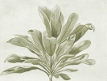

  
[Intangible Textual Heritage](../../index)  [New Thought](../index.md) 
[Index](index)  [Previous](ssbm15)  [Next](ssbm17.md) 

------------------------------------------------------------------------

[Buy this Book at
Amazon.com](https://www.amazon.com/exec/obidos/ASIN/B00260GY16/internetsacredte.md)

------------------------------------------------------------------------

  
*The Secret Science Behind Miracles*, by Max Freedom Long, \[1948\], at
Intangible Textual Heritage

------------------------------------------------------------------------

p. 260

### CHAPTER XV

### THE SECRET KAHUNA METHOD OF TREATING THE COMPLEX

While modern psychoanalysts have never found a simple and effective
method of finding the complex and bringing it to light to be
rationalized and drained off, there is a method to be learned from the
kahuna lore.

The importance of finding such a method cannot be overestimated, for, if
we can learn to use it, the healing art will take its greatest single
stride forward since the discovery of suggestion.

This method is a violent one. It will seem very strange to the civilized
man at first glance, but no stranger than the use of violent insulin
shock on insane patients in modern asylums.

Because this secret method is so new and radically different to us, it
will bear a step-by-step explanation.

Please recall the fact that the kahunas believed that thoughts were
invisible little things—thought forms—and that they were very real and
substantial. The thought form (*aka*) is made when we think. Every
thought is made into a permanent thought form. Thought forms come in
clusters of associated thoughts, thus linking one idea or thought to the
one which came before or after it, and to all similar thoughts.

Recall also the fact that thought form clusters flow on currents of
vital force, which in turn flow along tiny

p. 261

threads of shadowy body material connecting two per, sons, as in
telepathic communication. In giving suggestion there is a flow of vital
force from the operator to the subject, through hands placed on the
subject, through shadowy substance threads connecting the two after the
first physical contact, or through contact established by the line of
sight or even the sound of the voice. (Also through one traveling during
sleep in the shadowy body, or by means of contact made through the
assistance of the spirits of the dead.)

SUGGESTION IS THE IMPLANTING OF A STRONG THOUGHT FORM IN THE LOW SELF OF
THE SUBJECT. The power of the vital force accompanying the implanted
thought form plays a part in its effectiveness, but not nearly as large
a part as is generally supposed by psychologists. I have seen hypnotists
strive to put their "will" into a suggestion to make it effective, their
eyes burning, their faces becoming red, and perspiration standing out on
their foreheads, and still no results were obtained. The "will" or
middle self voltage of vital force is not the hypnotic agent. It only
directs its own low self to plant the thought form of the suggestion in
the shadowy body of the low self of the subject. *The effectiveness of
the suggestion depends on the acceptance of the thought form by the low
self of the subject*.

As already explained, the acceptance of the thought form of a suggestion
is greatly hastened by the *use of a physical stimulus*—something
physically real that may be sensed by the low self of the subject and
which will make it believe that a real something is behind the
suggestion.

p. 262

Now comes the vital secret of dealing with the complex.

It is not necessary to search for the original complex of the patient as
is done through deep analysis in psychoanalysis. It is not necessary to
study the patient's dreams for symbols and hints. No matter whether the
original complex has been translated from one form to another and to
another, it can be treated by suggestion. THE SECRET IS TO MAKE THE LOW
SELF OF THE PATIENT ACCEPT A SUGGESTION CONTRARY TO ITS COMPLEX OF
BELIEF. This is done by an almost violent use of *low voltage vital
force*.

Recall the kahunas who filled throwing sticks with low voltage vital
force by an effort of their wills to accumulate such force and transfer
it to the stick—and the almost human way in which the force obeyed
instruction to leave the stick and knock the enemy senseless or paralyze
him on contact when the stick was thrown.

Recall the American Indian medicine men who accumulated this force
(which they called *orenda* and other names) and discharged it through a
touch of a finger into the body of a strong brave, rendering him
unconscious.

Remember the case of Dr. Brigham and the death prayer directed at one of
his boys while in the mountains of Hawaii on a collecting expedition.
The death prayer was a matter of charging low self spirits with great
charges of low *mana*, then sending them to contact the victim and
discharge into him the full shock force of the charges. This shock force
broke down the resistance of the victim's low self, particularly if it
harbored a guilt thought or complex, and forced it to

p. 263

accept the thought form of death sent by the kahuna. The low self
spirits then attached themselves to the victim and drew from him his
vital force, storing it in their shadowy bodies, and preparing to take
it with them after the death of the victim through exhaustion of vital
force. (The suggestion of death causes the victim's low self to stop
making enough vital force to sustain life. Most illnesses which do not
mend in the normal course, grow worse when for some reason the usual
supply of force is not made.)

THE SECRET OF FORCING THE LOW SELF OF A PATIENT TO ACCEPT A THOUGHT FORM
OF SUGGESTION LIES IN THE USE OF AN OVERPOWERING SHOCK OF A LARGE CHARGE
OF VITAL FORCE—THIS CHARGE ACCOMPANYING THE OFFERING OF THE SUGGESTION.

Dr. Brigham gave me one evening a detailed account of a case of kahuna
healing which had long puzzled him, and which puzzled me in my turn
until I came to understand the methods outlined above.

A kahuna had been treating a native patient for a fugitive set of
symptoms which prevented the patient from crossing the beach to his
canoe to go on his daily round of fishing. At first a paralysis of the
left leg would appear when he tried to cross the beach. This was treated
and seemingly cured, but next there came dizzy spells at the approach to
the beach, and next, complete blindness which lasted until the patient
left the beach and returned to his home.

The final treatment, which Dr. Brigham did not see, but which was
described to him at great length later, consisted of a very impressive
use of a physical

p. 264

stimulus accompanying a suggestion in the form of the repeated assertion
that the treatment was removing all things that prevented the patient
from crossing the beach and going to fish in the usual manner.

The physical stimulus took the form of a large wooden bucket filled with
brackish water. The kahuna, in the presence of the patient, worked for a
long time over the water to make it potent and ready to cure. He stirred
it with green *ti* leaves, added grated yellow ginger root, and placed
the palms of his hands repeatedly on the surface.

When he was satisfied with his preparations he called his patient and
instructed him to sit down before the bucket and thrust in his face,
holding his breath and drinking as much as he could. The patient was
told that the water would enter him and drive out all the things which
had been causing the trouble and that they would never return.

The patient did as instructed and began to drink, the kahuna placed his
hands on his arms and commanded the illness to leave the body. The
patient drank very rapidly for a moment, then sagged and fell over the
bucket as if dazed. He was slightly lifted by the kahuna to clear his
face from the water, but was left huddled in that position for several
minutes, the kahuna quietly repeating his assertion that the ills had
vanished never to return.

The man had recovered from his dazed condition and had immediately been
taken by the kahuna and ordered to cross the beach. He found that he
could do so without a return of the mysterious maladies. He was then
told not to think of his trouble—a usual precaution

p. 265

taken by the kahunas to prevent the recurrence of the complex—and the
work was done. The trouble did not return.

A review of the case, long after Dr. Brigham described it, and in the
light of knowledge gained of the kahuna "Secret," brought out the
undoubted fact that the kahuna had filled the water in the bucket with a
shocking charge of low *mana* or vital force. He had used this force
literally to break down the resistance of the low self of the patient
and make it accept his thought form suggestion of the removal of all
ills which prevented the usual crossing of the beach to the canoe. (One
is reminded of Mesmer's practice of charging a vat of water from which
iron rods protruded to contact his patients and transfer to them the
vital force which he called "animal magnetism.")

It is to be noted that the original complex was never located or drained
off by recognition and rationalizing. THE COMPLEX WAS REPLACED BY
ANOTHER COMPLEX IN THE SHAPE OF A THOUGHT FORM IMPLANTED BY THE
SUGGESTION-SHOCK TREATMENT. The thought form of the suggestion was, of
course, a cluster of many related thought forms. The suggestion had
included rational arguments to show that there was no valid reason why
the beach could not be crossed and the fishing done.

#### Case 26

#### Direct Physical Reaction to Suggestion

*Preliminary Notes:*

While we do not know the limits of the ability of the low self to act on
the body to bring about healing, the

p. 266

evidence accumulates which shows that the power is very great.

*The Case:*

While I was living in Honolulu, a young white man came to sell me
advertising space in a newspaper each week. He became interested in the
Hawaiians and often told me of attending their dinner dances given in
the open.

One day he came to me much upset. He had become acquainted with a
Hawaiian woman at a dinner party, and the woman had admired his
girlishly fine skin. She had asked him thoughtfully if he did not find
it a great chore to shave daily, and had solemnly told him that she
could make his beard stop growing if he wished to be relieved of the
shaving chore. She said that many Hawaiian men had so been relieved of
the necessity of shaving. In a tolerant mood he pretended to accept her
offer gladly, being certain that it was a native superstition of no
consequence.

Taking him aside the woman stroked his right cheek with her fingers for
a short time, saying that the beard would stop growing on his face and
that he would be free of the need of shaving.

He had forgotten the incident when, about two weeks later, he suddenly
noticed that there was a place on his cheek the size of a dime upon
which no beard grew. To his alarm the spot grew larger day by day. When
it became as large as a half dollar, he remembered that I had spoken of
the kahunas and came rushing to me to ask my advice. He was almost
girlish of face and realized that without a shadow of beard he would be
disastrously feminine in appearance.

p. 267

I advised him to inquire among his Hawaiian friends for the woman who
had caused the difficulty, and when he found her, to ask her to reverse
her suggestion. He had some trouble finding the woman, but did
eventually, and she reluctantly stroked his cheek and gave the
suggestion (it was suggestion beyond doubt) that the beard would return
to the bare spot. In a little over a week the beard again began to grow
in the denuded circle. Where I had found the skin bare, I could see the
dark beard stubble reappearing. In a short time the beard was back to
normal.

*Comment:*

Such control is of great interest in as much as it shows how
surprisingly the low self can react to suggestion in making changes in
bodily functions.

Suggestion may get results for any functional control with the possible
exception of invading foreign bodies which normally lie beyond the range
of the control of the low self. Most disease germs can be brought under
control by the low self in due time. The kahunas believed that
contagious diseases were like accidents in that they just happened to
come along. If a person had an accidental injury or contracted a
contagious disease the low self would set to work to heal the injury or
combat the disease. If not afflicted by a complex or weakened in some
way, or of advanced age, the chance for recovery was good.

While nothing has so far been learned of the kahuna attitude toward
cancer or similar growths which seem to be invasion of foreign cells in
the body, it is probable that the low self of the sufferer from these
afflictions may have allowed such an invasion because of a complex,

p. 268

but may not be able to expel the intruding tissues by its own efforts
even after the complex is removed. For the cure of these things there
may be a method of controlling the consciousness behind the invading
cells, whatever that consciousness may be. However, the instant healing
to be had through the High Self is the positive cure.

 

The importance of the kahuna methods of dealing with the complex may be
better grasped if we realize that in the United States we have about
four thousand psychiatrists, and hundreds of thousands of patients
needing their help. We have a very few trained psychoanalysts, and only
a handful of them have learned to use suggestion to help delve for the
complex. None know the method of shock with charges of vital force to
cause the patient to accept suggestion to replace the complex.

Out of the young men found otherwise physically fit for war duty in
World War II, twelve out of every hundred were unfitted for service
because of psycho-neurotic conditions which needed treatment.

The average doctor knows little or nothing of the treatment of these
cases, nor will he take the time to learn to use suggestion. The
professional hypnotists have been allowed no standing by the medical
associations, and practice at their peril where healing is the
objective.

------------------------------------------------------------------------

[Next: Chapter XVI. How the Kahunas Fought the Horrid Things of
Darkness](ssbm17.md)
