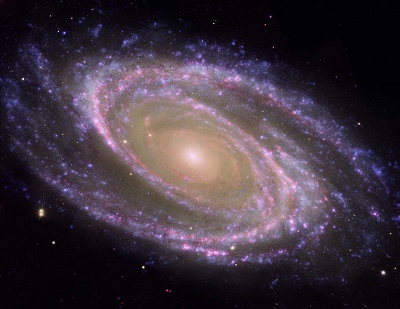

  
[Intangible Textual Heritage](../../index)  [New Thought](../index) 

------------------------------------------------------------------------

<table width="75%">
<colgroup>
<col style="width: 50%" />
<col style="width: 50%" />
</colgroup>
<tbody>
<tr class="odd">
<td width="50%" data-valign="TOP"></td>
<td width="50%" data-valign="CENTER"><h1 id="self-suggestion" data-align="CENTER">Self-Suggestion</h1>
<h5 id="and-the-new-huna-theory-of-mesmerism-and-hypnosis" data-align="CENTER">and the New Huna Theory of Mesmerism and Hypnosis</h5>
<h2 id="by-max-freedom-long" data-align="CENTER">by Max Freedom Long</h2>
<h4 id="section" data-align="CENTER">[1958]</h4></td>
</tr>
</tbody>
</table>

------------------------------------------------------------------------

[Contents](#contents)    [Start Reading](ssug00)    [Page
Index](pageidx)    [Text \[Zipped\]](ssug.txt.gz)

------------------------------------------------------------------------

This is one of Max Freedom Long's latter books. In this we can see the
evolution of his ideas, consistent with the views expressed in [The
Secret Science Behind Miracles](../ssbm/index). One of the highlights of
this book is the review of the self-help scene during the mid-50s,
including a mention of Dianetics, as well as General Semantics and other
belief systems. Mostly though, this is a practical manual of
self-suggestion using the Huna techniques, including detailed
instructions as to how the operation works. An appendix discusses the
larger context of this in the Huna world.--J.B. Hare

------------------------------------------------------------------------

 [Title Page](ssug00)  
[Introduction](ssug01)  
[Chapter 1](ssug02)  
[Chapter 2](ssug03)  
[Chapter 3](ssug04)  
[Chapter 4](ssug05)  
[Chapter 5](ssug06)  
[Chapter 6](ssug07)  
[Chapter 7](ssug08)  
[Chapter 8](ssug09)  
[Appendix](ssug10)  
[Addendum](ssug11)  
