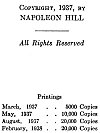

  
[Intangible Textual Heritage](../../index)  [New Thought](../index) 
[Index](index)  [Next](tgr01) 

------------------------------------------------------------------------

[Buy this Book at
Amazon.com](https://www.amazon.com/exec/obidos/ASIN/B00272NJ5W/internetsacredte)

------------------------------------------------------------------------

  
*Think and Grow Rich*, by Napoleon Hill \[1938\], at Intangible Textual
Heritage

------------------------------------------------------------------------

# THINK and

# GROW RICH

###### Teaching, for the first time, the famous Andrew Carnegie formula for money-making, based upon the THIRTEEN PROVEN STEPS TO RICHES.

###### Organized through 25 years of research, in collaboration with more than 500 distinguished men of great wealth, who proved by their own achievements that this philosophy is practical.

###### BY

## NAPOLEON HILL

###### Author of

### THE LAW OF SUCCESS

###### Philosophy

\[© 1937, published 1938, currently public domain in US (see below)\]

#### Published by THE RALSTON SOCIETY, Meriden, Conn.

scanned at Intangible Textual Heritage, July 2006. Proofed and formatted
by John Bruno Hare. This text is in the public domain in the United
States by the terms of the Digital Millennium Copyright Act because it
was published between 1923 and 1964 inclusive, and not renewed at the US
Copyright office in a timely fashion. This electronic edition is not
sponsored or endorsed by, or otherwise affiliated with Napoleon Hill,
his family and heirs, the Napoleon Hill Foundation, the Ralston Society,
or any past or present publishers of this book.

  [  
Click to enlarge](img/title.jpg)  
Title Page  

 
[  
Click to enlarge](img/verso.jpg)  
Verso  

  [  
Click to enlarge](img/report.jpg)  
Independent report on the lack of copyright renewal of this book by the
law firm of Thomson Compumark  

------------------------------------------------------------------------

[Next: What do you Want Most?](tgr01)
