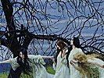

  
[Intangible Textual Heritage](../../index)  [New Thought](../index.md) 
[Index](index)  [Previous](tgr03)  [Next](tgr05.md) 

------------------------------------------------------------------------

[Buy this Book at
Amazon.com](https://www.amazon.com/exec/obidos/ASIN/B00272NJ5W/internetsacredte.md)

------------------------------------------------------------------------

  
*Think and Grow Rich*, by Napoleon Hill \[1938\], at Intangible Textual
Heritage

------------------------------------------------------------------------

p. 6

### PUBLISHER'S PREFACE

THIS book conveys the experience of more than 500 men of great wealth,
who began at scratch, with nothing to give in return for riches except
THOUGHTS, IDEAS and ORGANIZED PLANS.

Here you have the entire philosophy of moneymaking, just as it was
organized from the actual achievements of the most successful men known
to the American people during the past fifty years. It describes WHAT TO
DO, also, HOW TO DO IT!

It presents complete instructions on HOW TO SELL YOUR PERSONAL SERVICES.

It provides you with a perfect system of self-analysis that will readily
disclose what has been standing between you and "the big money" in the
past.

It describes the famous Andrew Carnegie formula of personal achievement
by which he accumulated hundreds of millions of dollars for himself and
made no fewer than a score of millionaires of men to whom he taught his
secret.

Perhaps you do not need all that is to be found in the book--no one of
the 500 men from whose experiences it was written did--but you may need
ONE IDEA, PLAN OR SUGGESTION to start you toward your goal. Somewhere in
the book you will find this needed stimulus.

The book was inspired by Andrew Carnegie, after he had made his millions
and retired. It was written by the man to whom Carnegie disclosed the
astounding secret of his riches--the same man to whom the 500 wealthy
men revealed the source of their riches.

In this volume will be found the thirteen principles of money-making
essential to every person who

p. 7

accumulates sufficient money to guarantee financial independence. It is
estimated that the research which went into the preparation, before the
book was written, or could be written--research covering more than
twenty-five years of continuous effort--could not be duplicated at a
cost of less than $100,000.00.

Moreover, the knowledge contained in the book never can be duplicated,
at any cost, for the reason that more than half of the 500 men who
supplied the information it brings have passed on.

*Riches cannot always be measured in money!*

Money and material things are essential for freedom of body and mind,
but there are some who will feel that the greatest of all riches can be
evaluated only in terms of lasting friendships, harmonious family
relationships, sympathy and understanding between business associates,
and introspective harmony which brings one peace of mind measurable only
in spiritual values!

All who read, understand and apply this philosophy will be better
prepared to attract and enjoy these higher estates which always have
been and always will be denied to all except *those who are ready for
them*.

Be prepared, therefore, when you expose yourself to the influence of
this philosophy, to experience a CHANGED LIFE which may help you not
only to negotiate your way through life with harmony and understanding,
but also to prepare you for the accumulation of material riches in
abundance.

THE PUBLISHER.

------------------------------------------------------------------------

[Next: Author's Preface](tgr05.md)
