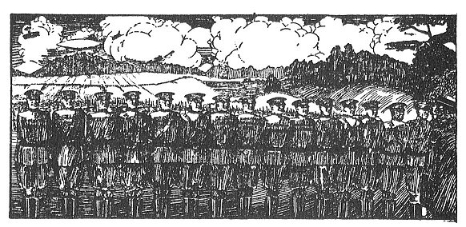

  
[Intangible Textual Heritage](../../index)  [New Thought](../index.md) 
[Index](index)  [Previous](tgr20.md) 

------------------------------------------------------------------------

[Buy this Book at
Amazon.com](https://www.amazon.com/exec/obidos/ASIN/B00272NJ5W/internetsacredte.md)

------------------------------------------------------------------------

  
*Think and Grow Rich*, by Napoleon Hill \[1938\], at Intangible Textual
Heritage

------------------------------------------------------------------------

p. 375

### THIS STANDING ARMY

#### IS AT YOUR SERVICE

 

##### It Will Bring You Fame, Fortune, Peace of Mind or Whatever You Demand of Life!

In this picture you see the most *powerful* army on earth. Observe the
emphasis on the word POWERFUL. This army is standing at attention, ready
to do the bidding of any person who will command it. It is YOUR army if
you will take charge of it.

These soldiers are labelled: DEFINITE CHIEF AIM; HABIT OF SAVING; SELF
CONFIDENCE; IMAGINATION; INITIATIVE; LEADERSHIP; ENTHUSIASM; SELF
CONTROL; DOING MORE THAN PAID FOR; PLEASING PERSONALITY; ACCURATE
THOUGHT; CONCENTRATION; CO-OPERATION; FAILURE; TOLERANCE; GOLDEN RULE;
THE MASTER MIND.

A long, searching study of the lives of 500 great American men and
women--as well as actual endorsement

p. 376

from nationally known leaders--proves that these are the *basic
principles* upon which all true and lasting success is built.

POWER comes from organized effort. You see in this picture--in these
"soldiers"--the forces which enter into all organized effort. Master
these sixteen forces or personal qualities and *you may have whatever
you want in life*.

*A FEW WORDS FROM THE PUBLISHERS*

And it is because we are going to help you TO master these forces that
the publishers of "THINK AND GROW RICH" want to have a little chat with
you. For over fifty years "Ralston" has supplied hundreds of
thousands--yes, probably millions of ambitious men and women with home
study books that bring Health, Wealth, Power and Happiness.

We have many unusual, private, exciting Instruction Books Embracing all
Human Powers. From time to time we will extend an invitation to you to
read these courses. But for the time being, let us concentrate upon the
inspiring message that Napoleon Hill, author of "THINK AND GROW RICH"
has for you. So great a business man and master of success as John
Wanamaker, merchant prince of New York and Philadelphia, said:--

"If I had a young son I would insist that he read every word of the "LAW
OF SUCCESS" by Napoleon Hill, and the books by Dr. . . . . . . . These
two men are, perhaps, the most inspirational writers in the world. I
know your 17 fundamentals of success are sound because I have been
applying them in my business for more than 30 years."

p. 377

*NAPOLEON HILL HAS WRITTEN A POST GRADUATE COURSE FOR YOU*

It is because we sincerely feel that every reader of this book should go
on into this post graduate course, known as THE LAW OF SUCCESS, that we
take the liberty here of giving a few brief side lights upon this
brilliant work.

The LAW OF SUCCESS presents, for the first time in the history of the
world, the true Philosophy upon which all lasting success is built.
Ideas, when translated into intelligent plans of action, are the
beginning of all successful achievement. So the Law of Success proceeds
to show you how to create practical ideas for every human need.

It does it in easy-to-understand lessons.

Napoleon Hill spent the better part of twenty-five years in perfecting
this Philosophy of Success. During the long years he has worked on it,
some parts or the whole of it, have been reviewed and praised by many of
the greatest Americans of our times.

Among them are included four Presidents of the United States, Theodore
Roosevelt, Woodrow Wilson, Warren G. Harding, Wm. H. Taft; Thomas
Edison, Luther Burbank, Wm. J. Wrigley, Alexander Graham Bell, Judge E.
H. Gary, Cyrus H. K. Curtis, Edward Bok, E. M. Statler--dozens of
glowing names in Politics, Finance, Education, Invention.

*ANDREW CARNEGIE STARTED IT*

Over twenty-five years ago, Napoleon Hill, then a young special
investigator for a nationally known

p. 378

business magazine, was sent to interview Andrew Carnegie. During that
interview Carnegie slyly dropped a hint of a certain master power he
used; a magic law of the human mind--a little known psychological
principle--which was amazing in its power.

Carnegie suggested to Hill that upon that principle he could build the
philosophy of all personal success--whether it be measured in terms of
Money, Power, Position, Prestige, Influence, Accumulation of Wealth.

That part of the interview never went into Hill's magazine. But it did
launch the young author upon over twenty years of research. And today we
open to YOU the discovery and methods of using the revolutionary force
which Carnegie quietly hinted at. The thrilling methods of using it are
now taught in eight textbooks known as THE LAW OF SUCCESS.

In the trail of the LAW OF SUCCESS lessons come accomplishments, not
mere entertainment and time-killing diversion. There come larger
businesses, bigger bank accounts, fatter pay envelopes; small,
struggling enterprises given new life and power to grow; low-pay
employees shown how to gain advancement by leaps and bounds.

It is impossible in this small space to give any real idea of the
inspiring, revealing lessons in the eight textbooks of LAW OF SUCCESS.
But, you will realize that a wonderful treat is in store for you when
you read what some American leaders have said, who saw parts of the
philosophy while in process of creation. (also see two pages at front of
book.)

p. 379

"Allow me to express my appreciation of the compliment you have paid me
in sending the original manuscript of the Law of Success. I can see you
have spent a great deal of time and thought in its preparation. Your
philosophy is sound and you are to be congratulated for sticking to your
work over so long a period of years. Your students will be amply
rewarded for their labor."

(World's Greatest Inventor) THOS. A. EDISON

"Your work and mine are peculiarly akin. I am helping the laws of Nature
to create more perfect specimens of vegetation while you are using those
same laws through The Law of Success to build more perfect specimens of
thinkers."

(World Famous Scientist) LUTHER BURBANK

"Certainly I will supply you with the information you request. This I
consider to be not only a duty, but it is a pleasure as well. You are
laboring in behalf of the people who have neither the time nor the
inclination to ferret out the causes of failure and success."

(Former President of the U. S.) THEODORE ROOSEVELT

"Our entire business policy, in the management of our hotels, is based
upon the 17 fundamentals of The Law of Success, of which I am a
student."

(Founder of Great Hotel System) E. M. STATLER

"I feel greatly indebted for the privilege of reading your Law of
Success philosophy. If I had had this fifty years ago, I suppose I could
have accomplished

p. 380

all that I have done in less than half the time. I sincerely hope the
world will discover and reward you."

(Steamship Magnate: The Dollar Lines) ROBERT DOLLAR

"Napoleon Hill has produced what I believe to be the first practical
philosophy of achievement. Its major distinguishing feature is the
simplicity in which it has been presented."

(Leland Stanford University) DAVID STARR JORDAN

"The best evidence of the soundness of the Law of Success, with which I
am personally acquainted is the noteworthy achievement of Mr. Curtis,
who has built one of the greatest publishing businesses in the world by
applying the principles of this philosophy."

(Former Editor: Ladies Home Journal) EDWARD BOK

"You may say for Mr. Rockefeller that he endorses Mr. Hill's 17
fundamental principles of success, and that he recommends them to those
who are seeking the highway to achievement."

Secretary to JOHN D. ROCKEFELLER

*EVIDENCE THAT MONEY COULD NOT BUY*

The foregoing is evidence and praise seldom accorded any course of
education. Money could not buy such letters of endorsement from men who
are, or have been, leaders of our times.

Millions of books have been written to amuse, to entertain, to help you
while away your idle hours.

p. 381

\[paragraph continues\] But here in the
LAW OF SUCCESS are eight vibrating, power-radiating books that shape
your destiny, enrich your future, and turn your hopes and dreams into
solid success-realities,

Don't waste your own precious years blindly searching for the hidden
road to the heights. Profit by the dearly bought experience of America's
leaders. Over 500 great and prominent men of America were minutely
analyzed--their methods, motives, strategy--to find out the secrets that
put them on top.

No matter whether you are rich or poor--you have one asset as great as
the richest man living--and that is TIME. But with each setting sun you
become one day older, and have *one day less* in which to attain the
success and wealth you desire. Thousands of progressive people
throughout the North American continent have realized this mighty truth,
and have sought the help so clearly and inspiringly taught in Napoleon
Hill's "LAW OF SUCCESS."

You cannot afford to let day after day slip into eternity, without
getting possession of this course. You will profit greatly from the
lessons in THINK AND GROW RICH. You will take even more brilliant and
gratifying rewards from the LAW OF SUCCESS. The cost is trifling; the
benefits are tremendous.
