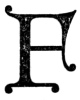

  
[Intangible Textual Heritage](../../index)  [New Thought](../index) 
[Index](index)  [Previous](tsoa07)  [Next](tsoa09) 

------------------------------------------------------------------------

[Buy this Book at
Amazon.com](https://www.amazon.com/exec/obidos/ASIN/1604590467/internetsacredte)

------------------------------------------------------------------------

[Buy this Book on
Kindle](https://www.amazon.com/exec/obidos/ASIN/B0025VL4BQ/internetsacredte)

------------------------------------------------------------------------

  
*The Secret of the Ages*, by Robert Collier, \[1926\], at Intangible
Textual Heritage

------------------------------------------------------------------------

p. 76

"*And the earth was  
 Without form and void;  
 And darkness was upon  
 The face of the deep.  
 And the Spirit of God moved  
 Upon the face of the waters*."

         Genesis 1:2.

p. 77

### III

### The Primal Cause

This city, with all its houses, palaces, steam engines, cathedrals and
huge, immeasurable traffic and tumult, what is it but a Thought, but
millions of Thoughts made into one—a huge immeasurable Spirit of a
Thought, embodied in brick, in iron, smoke, dust, Palaces, Parliaments,
coaches, docks and the rest of it! Not a brick was made but some man had
to *think* of the making of that brick.  
                                 —Carlyle.

|                    |
|--------------------|
|  |

For thousands of years the riddle of the
universe has been the question of causation. Did the egg come first, or
the chicken? "The globe," says an Eastern proverb, "rests upon the
howdah of an elephant. The elephant stands upon a tortoise, swimming in
a sea of milk." But then what?

p. 78

And what is life? As the Persian poet puts it—

"What without asking, hither hurried whence,  
 And without asking whither hurried hence?"

It has been said that every man, consciously or unconsciously, is either
a materialist or an idealist. Certainly throughout the ages the schools
of philosophy as well as individuals have argued and quarrelled, but
always human thought through one or the other of these channels "has
rolled down the hill of speculation into the ocean of doubt."

The materialist, roughly speaking, declares that nothing exists but
matter and the forces inherent therein.

The idealist declares that all is mind or energy, and that matter is
necessarily unreal.

The time has come when people have

p. 79

become dissatisfied with these unceasing theories which get them
nowhere. And today, as the appreciation of a Primal Cause becomes more
clearly defined, the spiritual instinct asserts itself determinedly.

"Give me a base of support," said Archimedes, "and with a lever I will
move the world."

And the base of support is that all started with *mind*. In the
beginning was nothing—a fire mist. Before anything could come of it
there had to be an idea, a model on which to build. *Universal Mind*
supplied that idea, that model. Therefore the primal cause is mind.
Everything must start with an idea. Every event, every condition, every
thing is first an idea in the mind of someone.

Before you start to build a house, you

p. 80

draw up a plan of it. You make an exact blue-print of that plan, and
your house takes shape in accordance with your blue-print. Every
material object takes form in the same way. Mind draws the plan. Thought
forms the blueprint, well drawn or badly done as your thoughts are clear
or vague. It all goes back to the one cause. The creative principle of
the universe is mind, and thought is the eternal energy.

But just as the effect you get from electricity depends upon the
mechanism to which the power is attached, so the effects you get from
mind depend upon the way you use it. We are all of us dynamos. The power
is there—unlimited power. But we've got to connect it up to
something—set it some task—give it work to do—else are we no better off
then the animals.

p. 81

The "Seven Wonders of the World" were built by men with few of the
opportunities or facilities that are available to you. They conceived
these gigantic projects first in their own minds, pictured them so
vividly that their subconscious minds came to their aid and enabled them
to overcome obstacles that most of us would regard as insurmountable.
Imagine building the Pyramids of Gizeh, enormous stone upon enormous
stone, with nothing but bare hands. Imagine the labor, the sweat, the
heartbreaking toil of erecting the Colossus of Rhodes, between whose
legs a ship could pass! Yet men built these wonders, in a day when tools
were of the crudest and machinery was undreamed of, by using the
unlimited power of Mind.

Mind is creative, but it must have a

p. 82

model on which to work. It must have thoughts to supply the power.

There are in Universal Mind ideas for millions of wonders greater far
than the "Seven Wonders of the World." And those ideas are just as
available to you as they were to the artisans of old, as they were to
Michael Angelo when he built St. Peter's in Rome, as they were to the
architect who conceived the Woolworth Building, or the engineer who
planned the Hell Gate bridge.

Every condition, every experience of life is the result of our mental
attitude. We can *do* only what we think we can do. We can *be* only
what we think we can be. We can *have* only what we think we can have.
What we do, what we are, what we have, all depend upon what we think. We
can never express anything that we do not first have in

p. 83

mind. The secret of all power, all success, all riches, is in first
thinking powerful thoughts, successful thoughts, thoughts of wealth, of
supply. We must build them in our own mind first.

William James, the famous psychologist, said that the greatest discovery
in a hundred years was the discovery of the power of the sub-conscious
mind. It is the greatest discovery of all time. It is the discovery that
man has within himself the power to control his surroundings, that he is
not at the mercy of chance or luck, that he is the arbiter of his own
fortunes, that he can carve out his own destiny. He is the master of all
the forces round about him. As James Allen puts it:

“Dream lofty dreams, and as you dream, so shall you become. Your vision
is the promise of what you shall one

p. 84

day be; your Ideal is the prophecy of what you shall at last unveil.”

For matter is in the ultimate but a product of thought. Even the most
material scientists admit that matter is not what it appears to be.
According to physics, matter (be it the human body or a log of wood—it
makes no difference which) is made up of an aggregation of distinct
minute particles called atoms. Considered individually, these atoms are
so small that they can be seen only with the aid of a powerful
microscope, if at all.

Matter—  
*Dream or Reality?*

Until recently these atoms were supposed to be the ultimate theory
regarding matter. We ourselves—and all the material world around us—were
supposed

p. 85

to consist of these infinitesimal particles of matter, so small that
they could not be seen or weighed or smelled or touched individually—but
still particles of matter *and indestructible*.

Now, however, these atoms have been further analyzed, and physics tells
us that they are not indestructible at all—that they are mere positive
and negative buttons of force or energy called protons and electrons,
without hardness, without density, without solidity, without even
positive actuality. In short, they are vortices in the ether—whirling
bits of energy—dynamic, never static, pulsating with life, but the life
is *spiritual!* As one eminent British scientist put it—"Science now
explains matter by *explaining it away!*"

And that, mind you, is what the solid table in front of you is made of,
is what

p. 86

your house, your body, the whole world is made of—*whirling bits of
energy!*

To quote the New York *Herald-Tribune* of March 11, 1926: "We used to
believe that the universe was composed of an unknown number of different
kinds of matter, one kind for each chemical element. The discovery of a
new element had all the interest of the unexpected. It might turn out to
be anything, to have any imaginable set of properties.

"That romantic prospect no longer exists. We know now that instead of
many ultimate kinds of matter there are only two kinds. Both of these
are really kinds of electricity. One is negative electricity, being, in
fact, the tiny particle called the electron, familiar to radio fans as
one of the particles vast swarms of which operate radio vacuum tubes.

p. 87

\[paragraph continues\] The other kind of
electricity is positive electricity. Its ultimate particles are called
protons. From these protons and electrons all of the chemical elements
are built up. Iron and lead and oxygen and gold and all the others
differ from one another merely in the number and arrangement of the
electrons and protons which they contain. That is the modern idea of the
nature of matter. *Matter is really nothing but electricity*."

Can you wonder then that scientists believe the time will come when
mankind *through mind* can control all this energy, can be absolute
master of the winds and the waves, can literally follow the Master's
precept—"If ye have faith as a grain of mustard seed, ye shall say unto
this mountain, Remove hence to yonder place; and it shall remove; and
nothing shall be impossible unto you."

p. 88

For Modern Science is coming more and more to the belief that what we
call *matter is a force subject wholly to the control of mind*.

How tenuous matter really is, is perhaps best illustrated by the fact
that a single violin string, tuned to the proper pitch, could start a
vibration that would shake down the Brooklyn Bridge! Oceans and
mountains, rocks and iron, all can be reduced to a point little short of
the purely spiritual. Your body is 85 per cent water, 15 per cent ash
and phosphorus! And they in turn can be dissipated into gas and vapor.
Where do we go from there?

Is not the answer that, to a great degree at least, and perhaps
altogether, this world round about us is one of our mind's own creating?
And that we can put into it, and get from it, pretty much

p. 89

what we wish? You see this illustrated every day. A panorama is spread
before you. To you it is a beautiful picture; to another it appears a
mere collection of rocks and trees. A girl comes out to meet you. To you
she is the embodiment of loveliness; to another all that grace and
beauty may look drab and homely. A moonlit garden, with its fragrant
odors and dew-drenched grass, may mean all that is charming to you,
while to another it brings only thoughts of asthma or fever or
rheumatism. A color may be green to you that to another is red. A
prospect may be inviting for you that to another is rugged and hard.

To quote "Applied Psychology," by Warren Hilton:

“The same stimulus acting on different organs of sense will produce
different sensations. A blow upon the eye will

p. 90

cause you to 'see stars'; a similar blow upon the ear will cause you to
hear an explosive sound. In other words, the vibratory effect of a touch
on eye or ear is the same as that of light or sound vibrations.

“The notion you may form of any object in the outer world depends solely
upon what part of your brain happens to be connected with that
particular nerve-end that receives an impression from the object.

“You see the sun without being able to hear it because the only
nerve-ends tuned to vibrate in harmony with the ether-waves set in
action by the sun are nerve-ends that are connected with the brain
center devoted to sight. ‘If,’ says Professor James, ‘we could splice
the outer extremities of our optic nerves to our ears, and those of our
auditory

p. 91

nerves to our eyes, we should hear the lightning and see the thunder,
see the symphony and hear the conductor's movements.’

“In other words, the kind of impressions we receive from the world about
us, the sort of mental pictures we form concerning it, in fact, the
character of the outer world, the nature of the environment in which our
lives are cast—all these things depend for each one of us simply upon
how he happens to be put together, upon his individual mental make-up.”

In short, it all comes back to the old fable of the three blind men and
the elephant. To the one who caught hold of his leg, the elephant was
like a tree. To the one who felt of his side, the elephant was like a
wall. To the one who seized his tail, the elephant was like a

p. 92

rope. The world is to each one of us the world of *his individual
perceptions*.

You are like a radio receiving station. Every moment thousands of
impressions are reaching you. You can tune in on whatever ones you
like—on joy or sorrow, on success or failure, on optimism or fear. You
can select the particular impressions that will best serve you, you can
hear only what you want to hear, you can shut out all disagreeable
thoughts and sounds and experiences, or you can tune in on
discouragement and failure and despair.

Yours is the choice. You have within you a force against which the whole
world is powerless. By using it, you can make what you will of life and
of your surroundings.

"But," you will say, "objects themselves do not change. It is merely the

p. 93

difference in the way you look at them." Perhaps. But to a great extent,
at least, we find what we look for; just as, when we turn the dial on
the radio, we tune in on whatever kind of entertainment or instruction
we may wish to hear. And who can say that it is not our thoughts that
put it there? Who, for the matter of that, can prove that our
surroundings in waking hours are not as much the creature of our minds
as are our dreams? You've had dreams many a time where every object
seemed just as real as when you were awake. You've felt of the objects,
you've pinched yourself, yet still you were convinced that you were
actually *living* those dreams. May not your waking existence be largely
the creation of your own mind, just as your dream pictures are?

Many scientists believe that it is, and

p. 94

that in proportion as you try to put into your surroundings the good
things you desire, rather than the evil ones you fear, *you will find
those good things*. Certain it is that you can do this with your own
body. Just as certain that many people are doing it with the good things
of life. They have risen above the conception of life in which matter is
the master.

Just as the most powerful forces in nature are the invisible ones—heat,
light, air, electricity—so the most powerful forces of man are his
invisible forces, his thought forces. And just as electricity can fuse
stone and iron, so can your thought forces control your body, so can
they make or mar your destiny.

*The Philosopher's Charm*

There was once a shrewd necromancer who told a king that he had
discovered

p. 95

a way to make gold out of sand. Naturally the king was interested and
offered him great rewards for his secret. The necromancer explained his
process. It seemed quite easy, except for one thing. Not once during the
operation must the king think of the word Abracadabra. If he did, the
charm was broken and the gold would not come. The king tried and tried
to follow the directions, but he could not keep that word Abracadabra
out of his mind. And he never made the gold.

Dr. Winbigler puts the same idea in another way: "Inspiration, genius,
power, are often interfered with by the conscious mind's interposing, by
man's failing to recognize his power, afraid to assist himself, lacking
the faith in himself necessary to stimulate the subconscious so as to
arouse the genius asleep in each."

p. 96

From childhood on we are assured on every hand—by scientists, by
philosophers, by our religious teachers, that "ours is the earth and the
fullness thereof." Beginning with the first chapter of Genesis, we are
told that "God said, Let us make man in our image, after our likeness;
and let them have dominion over the fish of the sea, and over the fowl
of the air, and over the cattle, and over all the earth—and over every
living thing that moveth upon the earth." All through the Old and the
New Testament, we are repeatedly adjured to use these God-given powers.
"He that believeth on me," said Jesus, "the works that I do shall he do
also; and greater works than these shall he do." "If ye abide in me, and
my words abide in you, ye shall ask what ye will, and it shall be done
unto you." "For verily I say

p. 97

unto you, that whosoever shall say unto this mountain, Be thou removed,
and be thou cast into the sea; and shall not doubt in his heart, but
shall believe that those things which he saith shall come to pass; he
shall have whatsoever he saith." "The kingdom of God is within you."

We hear all this, perhaps we even think we believe, but always, when the
time comes to use these God-given talents, there is the "doubt in our
heart."

Baudouin expressed it clearly: “To be ambitious for wealth and yet
always expecting to be poor; to be always doubting your ability to get
what you long for, is like trying to reach east by travelling west.
There is no philosophy which will help a man to succeed when he is
always doubting his ability to do so, and thus attracting failure.

p. 98

“You will go in the direction in which you face.…

“There is a saying that every time the sheep bleats, it loses a mouthful
of hay. Every time you allow yourself to complain of your lot, to say,
'I am poor; I can never do what others do; I shall never be rich; I have
not the ability that others have; I am a failure; luck is against me;'
you are laying up so much trouble for yourself.

“No matter how hard you may work for success, if your thought is
saturated with the fear of failure, it will kill your efforts,
neutralize your endeavors, and make success impossible.”

And that is responsible for all our failures. We are like the old lady
who decided she wanted the hill behind her house removed. So she got
down on her knees and prayed the good Lord to

p. 99

remove it. The next morning she got up and hurried to the window. The
hill was still in its same old place. "I knew it!" she snapped. "I gave
Him his chance. But I knew all the time there was nothing to this prayer
business."

Neither is there, as it is ordinarily done. Prayer is not a mere asking
of favors. Prayer is not a pæan of praise. Rather prayer is a
realization of the God-power within you—of your right of dominion over
your own body, your environment, your business, your health, your
prosperity. It is an understanding that you are "heir of God and co-heir
with Christ." And that as such, no evil has power over you, whereas you
have all power for good. And "good" means not merely holiness. Good
means happiness—the happiness of everyday people. Good means everything
that is good in

p. 100

this world of ours—comforts and pleasures and prosperity for ourselves,
health and happiness for those dependent upon us. There are no limits to
"Good" except those we put upon it ourselves.

What was it made Napoleon the greatest conqueror of his day? Primarily
his magnificent faith in Napoleon. He had a sublime belief in his
destiny, an absolute confidence that the obstacle was not made which
Napoleon could not find a way through, or over, or around. It was only
when he lost that confidence, when he hesitated and vacillated for weeks
between retreat and advance, that winter caught him in Moscow and ended
his dreams of world empire. Fate gave him every chance first. The winter
snows were a full month late in coming. But Napoleon hesitated—and was
lost. It was not the snows that defeated him. It

p. 101

was not the Russians. It was his loss of faith in himself.

*The Kingdom of Heaven*

"The Kingdom of Heaven is within you." Heaven is not some far-away
state—the reward of years of tribulation here. Heaven is right here—here
and now! When Christ said that Heaven was within us, He meant just what
He said—that the power for happiness, for good, for everything we need
of life, is within each one of us.

That most of us fail to realize this Heaven—that many are sickly and
suffering, that more are ground down by poverty and worry—is no fault of
His. He gave us the power to overcome these evils; He stands ready and
waiting to help us use it. If we fail to find the way, the fault is
ours. To enjoy the Heaven

p. 102

that is within us, to begin here and now to live the life eternal, takes
only a fuller understanding of the Power-that-is-within-us.

Even now, with the limited knowledge at our command, we can control
circumstances to the point of making the world without an expression of
our own world within, where the real thoughts, the real power, resides.
Through this world within you can find the solution of every problem,
the cause for every effect. Discover it—and all power, all possession is
within your control.

For the world without is but a reflection of that world within. Your
thought creates the conditions your mind images. Keep before your mind's
eye the image of all you want to be and you will see it reflected in the
world without. Think abundance, feel abundance, BELIEVE

p. 103

abundance, and you will find that as you think and feel and believe,
abundance will manifest itself in your daily life. But let fear and
worry be your mental companions, thoughts of poverty and limitation
dwell in your mind, and worry and fear, limitation and poverty will be
your constant companions day and night.

Your mental concept is all that matters. Its relation to matter is that
of idea and form. There has got to be an idea before it can take form.
As Dr. Terry Walter says:

“The impressions that enter the subconscious form indelible pictures,
which are never forgotten, and whose power can change the body, mind,
manner, and morals; can, in fact, revolutionize a personality.

“All during our waking hours the conscious mind, through the five
senses, acts

p. 104

as constant feeder to the subconscious; the senses are the temporal
source of supply for the content of the soul mind; therefore it is most
important that we know and realize definitely and explicitly that every
time we think a thought or feel an emotion, we are adding to the content
of this powerful mind, good or bad, as the case may be. Life will be
richer or poorer for the thoughts and deeds of today.”

Your thoughts supply you with limitless energy which will take whatever
form your mind demands. The thoughts are the mold which crystalizes this
energy into good or ill according to the form you impress upon it. You
are free to choose which. But whichever you choose, the result is sure.
Thoughts of wealth, of power, of success, can bring only results
commensurate with your

p. 105

idea of them. Thoughts of poverty and lack can bring only limitation and
trouble.

"A radical doctrine," you'll say, and think me wildly optimistic.
Because the world has been taught for so long to think that some must be
rich and some poor, that trials and tribulations are our lot. That this
is at best a vale of tears.

The history of the race shows that what is considered to be the learning
of one age is ignorance to the next age.

Dr. Edwin E. Slosson, Editor of *Science Service*, speaking of the
popular tendency to fight against new ideas merely because they were
new, said: "All through the history of science, we find that new ideas
have to force their way into the common mind in disguise, as though they
were burglars instead of benefactors of the race."

p. 106

And Emerson wrote: "The virtue in most request is conformity.
Self-reliance is its aversion. It loves not realities and creators, but
names and customs."

In the ages to come man will look back upon the poverty and wretchedness
of so many millions today, and think how foolish we were not to take
advantage of the abundance all about us. Look at Nature; how profuse she
is in everything. Do you suppose the Mind that imaged that profuseness
ever intended you to be limited, to have to scrimp and save in order to
eke out a bare existence?

There are hundreds of millions of stars in the heavens. Do you suppose
the Mind which could bring into being worlds without number in such
prodigality intended to stint you of the few things necessary to your
happiness?

What is money but a mere idea of

p. 107

mind, a token of exchange? The paper money you have in your pockets is
supposed to represent so much gold or silver currency. There are
billions upon billions of this paper money in circulation, yet all the
gold in the world amounts to only about $8,000,000,000. Wealth is in
ideas, not in money or property. You can control those ideas through
mind.

Reduced to the ultimate—to the atom or to the electron—everything in
this world is an idea of mind. All of it has been brought together
through mind. If we can change the things we want back into mental
images, we can multiply them as often as we like, possess all that we
like.

*“To Him That Hath”*—

Take as an example the science of numbers. Suppose all numbers were of

p. 108

metal—that it was against the law to write figures for ourselves. Every
time you wanted to do a sum in arithmetic you'd have to provide yourself
with a supply of numbers, arrange them in their proper order, work out
your problems with them. If your problems were too abstruse you might
run out of numbers, have to borrow some from your neighbor or from the
bank.

"How ridiculous," you say. "Figures are not things; they are mere ideas,
and we can add them or divide them or multiply them or subtract them as
often as we like. Anybody can have all the figures he wants."

To be sure he can. And when you get to look upon money in the same way,
you will have all the money you want.

"To him that hath shall be given, and from him that hath not shall be
taken

p. 109

away even that which he hath." To him that hath the right idea
everything shall be given, and from him who hath not that right idea
shall be taken away everything he hath.

Thought externalizes itself. What we are depends entirely upon the
images we hold before our mind's eye. Every time we think, we start a
chain of causes which will create conditions similar to the thoughts
which originated it. Every thought we hold in our consciousness for any
length of time becomes impressed upon our subconscious mind and creates
a pattern which the mind weaves into our life or environment.

All power is from within and is therefore under our own control. When
you can direct your thought processes, you can consciously apply them to
any condition, for all that comes to us from the

p. 110

world without is what we've already imaged in the world within.

Do you want more money? Sit you down now quietly and realize that money
is merely an idea. That your mind is possessed of unlimited ideas. That
being part of Universal Mind, there is no such thing as limitation or
lack. That somewhere, somehow, the ideas that shall bring you all the
money you need for any right purpose are available for you. That you
have but to put it up to your subconscious mind to find these ideas.

Realize that—*believe* it—and your need will be met. "What things soever
ye desire, when ye pray, believe that ye receive it and ye shall have
it." Don't forget that "*believe that ye receive it*." This it is that
images the thing you want on your subconscious mind. And this it is that
brings it to you. Once you can

p. 111

image the belief clearly on your subconscious mind, "whatsoever it is
that ye ask for…ye shall have it."

For the source of all good, of everything you wish for, is the Universal
Mind, and you can reach it only through the subconscious.

And Universal Mind will be to you whatever you believe it to be—the kind
and loving Father whom Jesus pictured, always looking out for the
well-being of his children—or the dread Judge that so many dogmatists
would have us think.

When a man realizes that his mind is part of Universal Mind, when he
realizes that he has only to take any right aspiration to this Universal
Mind to see it realized, he loses all sense of worry and fear. He learns
to dominate instead of to cringe. He rises to meet every situation,
secure in the knowledge that

p. 112

everything necessary to the solution of any problem is in Mind, and that
he has but to take his problem to Universal Mind to have it correctly
answered.

For if you take a drop of water from the ocean, you know that it has the
same properties as all the rest of the water in the ocean, the same
percentage of sodium chloride. The only difference between it and the
ocean is in volume. If you take a spark of electricity, you know that it
has the same properties as the thunderbolt, the same power that moves
trains or runs giant machines in factories. Again the only difference is
in volume. It is the same with your mind and Universal Mind. The only
difference between them is in volume. Your mind has the same properties
as the Universal Mind, the same creative genius, the same power over all
the earth, the same access to all

p. 113

knowledge. Know this, believe it, use it, and "yours is the earth and
the fulness thereof." In the exact proportion that you believe yourself
to be part of Universal Mind, sharing in Its all-power, in that
proportion can you demonstrate the mastery over your own body and over
the world about you.

All growth, all supply is from the world-within. If you would have
power, if you would have wealth, you have but to image it on this world
within, on your subconscious mind, through belief and understanding.

If you would remove discord, you have but to remove the wrong
images—images of ill health, of worry and trouble from within. The
trouble with most of us is that we live entirely in the world without.
We have no knowledge of that inner world which is responsible for all

p. 114

the conditions we meet and all the experiences we have. We have no
conception of "the Father that is within us."

The inner world promises us life and health, prosperity and
happiness—dominion over all the earth. It promises peace and perfection
for all its offspring. It gives you the right way and the adequate way
to accomplish any normal purpose. Business, labor, professions, exist
primarily in thought. And the outcome of your labors in them is
regulated by thought. Consider the difference, then, in this outcome if
you have at your command only the limited capacity of your conscious
mind, compared with the boundless energy of the subconscious and the
Universal Mind. "Thought, not money, is the real business capital," says
Harvey S. Firestone, "and if you know absolutely that what you are doing
is

p. 115

right, then you are bound to accomplish it in due season."

Thought is a dynamic energy with the .power to bring its object out from
the invisible substance all about us. Matter is inert, unintelligent.
Thought can shape and control. Every form in which matter is today is
but the expression of some thought, some desire, some idea.

You have a mind. You can originate thought. And thoughts are creative.
Therefore you can create for yourself that which you desire. Once you
realize this you are taking a long step toward success in whatever
undertaking you have in mind.

More than half the prophecies in the Scriptures refer to the time when
man shall possess the earth, when tears and sorrow shall be unknown, and
peace and plenty shall be everywhere. That time

p. 116

will come. It is nearer than most people think possible. You are helping
it along. Every man who is honestly trying to use the power of mind in
the right way is doing his part in the great cause. For it is only
through Mind that peace and plenty can be gained. The earth is laden
with treasures as yet undiscovered. But they are every one of them known
to Universal Mind, for it was Universal Mind that first imaged them
there. And as part of Universal Mind, they can be known to you.

How else did the Prophets of old foretell, thousands of years ago, the
aeroplane, the cannon, the radio? What was the genius that enabled
Ezekiel to argue from his potter's wheel, his water wheel and the stroke
of the lightning to an airplane, with its wheels within wheels, driven
by electricity and guided

p. 117

by man? How are we to explain the descriptions of artillery in the
Apocalypse and the astonishing declaration in the Gospels that the
utterances of the chamber would be broadcast from the housetops?

*“To the Manner Born”*

Few of us have any idea of our mental powers. The old idea was that man
must take this world as he found it. He'd been born into a certain
position in life, and to try to rise above his fellows was not only the
height of bad taste, but sacrilegious as well. An All wise Providence
had decreed by birth the position a child should occupy in the web of
organized society. For him to be discontented with his lot, for him to
attempt to raise himself to a higher level, was tantamount to tempting
Providence. The gates of Hell

p. 118

yawned wide for such scatterbrains, who were lucky if in this life they
incurred nothing worse than the ribald scorn of their associates.

That is the system that produced aristocracy and feudalism. That is the
system that feudalism and aristocracy strove to perpetuate.

The new idea—the basis of all democracies—is that man is not bound by
any system, that he need not accept the world as he finds it. He can
remake the world to his own ideas. It is merely the raw material. He can
make what he wills of it.

It is this new idea that is responsible for all our inventions, all our
progress. Man is satisfied with nothing. He is constantly remaking his
world. And now more than ever will this be true, for psychology teaches
us that each one has

p. 119

within himself the power to become what he wills.

*Learn to control your thought*. Learn to image upon your mind only the
things you want to see reflected there.

You will never improve yourself by dwelling upon the drawbacks of your
neighbors. You will never attain perfect health and strength by thinking
of weakness or disease. No man ever made a perfect score by watching his
rival's target. You have got to think strength, think health, think
riches. To paraphrase Pascal—"Our achievements today are but the sum of
our thoughts of yesterday."

For thought is energy. Mental images are concentrated energy. And energy
concentrated on any definite purpose becomes power. To those who
perceive the nature and transcendency of this

p. 120

force, all physical power sinks into insignificance.

What is imagination but a form of thought? Yet it is the instrument by
which all the inventors and discoverers have opened the way to new
worlds. Those who grasp this force, be their state ever so humble, their
natural gifts ever so insignificant, become our leading men. They are
our governors and supreme law-givers, the guides of the drifting host
which follows them as by an irrevocable decree. To quote Glenn Clark in
the *Atlantic Monthly*, “Whatever we have of civilization is their work,
theirs alone. If progress was made they made it. If spiritual facts were
discerned, they discerned them. If justice and order were put in place
of insolence and chaos, they wrought the change. Never is progress
achieved by

p. 121

the masses. Creation ever remains the task of the individual.”

Our railroads, our telephones, our automobiles, our libraries, our
newspapers, our thousands of other conveniences, comforts and
necessities are due to the creative genius of but two per cent of our
population.

And the same two per cent own a great percentage of the wealth of the
country.

The question arises, Who are they? What are they? The sons of the rich?
College men? No—few of them had any early advantages. Many of them have
never seen the inside of a college. It was grim necessity that drove
them, and somehow, some way, they found a method of drawing upon their
Genie-of-the-Mind, and through that inner force they have reached
success.

p. 122

*You* don't need to stumble and grope. You can call upon your inner
forces at will. There are three steps necessary:

First, to realize that you have the power;

Second, to know what you want.

Third, to center your thought upon it with singleness of purpose.

To accomplish these steps takes only a fuller understanding of the
Power-that-is-within-you.

But what is this power? Where should you go to locate it? Is it a thing,
a place, an object? Has it bounds, form or material shape? No! Then how
shall you go about finding it?

If you have begun to *realize* that there is a power within you, if you
have begun to arouse in your conscious mind the ambition and desire to
use this power—you have started in the pathway of Wisdom.

p. 123

\[paragraph continues\] If you are willing
to go forward, to endure the mental discipline of mastering this method,
nothing in the world can hinder you or keep you from overcoming every
obstacle.

Begin at once, today, to use what you have learned. All growth comes
from practice. All the forces of life are active—peace—joy—power. The
unused talent decays. Open the door

"Behold I stand at the door and knock; if ANY MAN hear my voice and open
the door, I will come in to him, and will sup with him and he with me."

So let us make use of this dynamo, which is *you*. What is going to
start it working? Your *Faith*, the faith that is begotten of
understanding. Faith is the impulsion, the propulsion of this power
within. Faith is the confidence, the assurance,

p. 124

the enforcing truth, the knowing that the right idea of life will bring
you into the reality of existence and the manifestation of the All
power.

All cause is in Mind—and Mind is everywhere. All the knowledge there is,
all the wisdom there is, all the power there is, is all about you—no
matter where you may be. Your Mind is part of it. You have access to it.
If you fail to avail yourself of it, you have no one to blame but
yourself. For, as the drop of water in the ocean shares in all the
properties of the rest of the ocean water so you share in that
all-power, all-wisdom of Mind. If you have been sick and ailing, if
poverty and hardship have been your lot, don't blame it on "fate." Blame
yourself. "Yours is the earth and everything that's in it." But you've
got to *take* it. The power is there—but *you* 

p. 125

must use it. It is round about you like the air you breathe. You don't
expect others to do your breathing for you. Neither can you expect them
to use your Mind for you. Universal Intelligence is not only the mind of
the Creator of the universe, but it is also the mind of MAN, *your*
intelligence, *your* mind. "Let this mind be in you, which was also in
Christ Jesus!"

So start today by KNOWING that you can do anything you wish to do, have
anything you wish to have, be anything you wish to be. The rest will
follow.

"Ye shall ask what ye will and it shall be done unto you."

------------------------------------------------------------------------

[Next: IV. Desire—The First Law of Gain](tsoa09)
