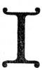

  
[Intangible Textual Heritage](../../index)  [New Thought](../index.md) 
[Index](index)  [Previous](tsoa08)  [Next](tsoa10.md) 

------------------------------------------------------------------------

[Buy this Book at
Amazon.com](https://www.amazon.com/exec/obidos/ASIN/1604590467/internetsacredte.md)

------------------------------------------------------------------------

[Buy this Book on
Kindle](https://www.amazon.com/exec/obidos/ASIN/B0025VL4BQ/internetsacredte.md)

------------------------------------------------------------------------

  
*The Secret of the Ages*, by Robert Collier, \[1926\], at Intangible
Textual Heritage

------------------------------------------------------------------------

p. 126 p. 127

### Desire—The First Law of Gain

"Ah, Love! Could Thou and I with Fate conspire  
   To grasp this sorry Scheme of Things entire,  
 Would we not shatter it to bits—and then  
   Re-mold it nearer to the Heart's Desire!"  
               —*The Rubaiyat of Omar Khayyam*.

|                    |
|--------------------|
|  |

If you had a fairy wishing ring, what one
thing would you wish for? Wealth? Honor? Fame? Love? What one thing do
you desire above everything else in life?

Whatever it is, you can have it. Whatever you desire, wholeheartedly,
with singleness of purpose—you can have. But the first and all-important
essential is to know what this one thing is. Before you can win your
heart's desire, you've got to get clearly fixed in your mind's eye what
it is that you want.

p. 128

It may sound paradoxical, but few people do know what they want. Most of
them struggle along in a vague sort of way, hoping—like Micawber—for
something to turn up. They are so taken up with the struggle that they
have forgotten—if they ever knew—what it is they are struggling for.
They are like a drowning man—they use up many times the energy it would
take to get them somewhere, but they fritter it away in aimless
struggles—without thought, without direction, exhausting themselves,
while getting nowhere.

You've got to know what you want before you stand much chance of getting
it. You have an unfailing "Messenger to Garcia" in that
Genie-of-your-Mind—but YOU have got to formulate the message. Aladdin
would have stood a poor chance of getting anything from

p. 129

his Genie if he had not had clearly in mind the things he wanted the
Genie to get.

In the realm of mind, the realm in which is all practical power, you can
possess what you want at once. You have but to claim it, to visualize
it, to bring it into actuality—and it is yours for the taking. For the
Genie-of-your-Mind can give you power over circumstances. Health,
happiness and prosperity. And all you need to put it to work is an
earnest, intense desire.

Sounds too good to be true? Well, let us go back for a moment to the
start. You are infected with that "divine dissatisfaction with things as
they are" which has been responsible for all the great accomplishments
of this world—else you would not have gotten thus far in this book. Your
heart is hungering

p. 130

for something better. "Blessed are they which do hunger and thirst after
righteousness (right-wiseness) for they shall be filled." You are tired
of the worry and grind, tired of the deadly dull routine and daily tasks
that lead nowhere. Tired of all the petty little ills and ailments that
have come to seem the lot of man here on earth.

Always there is something within you urging you on to bigger things,
giving you no peace, no rest, no chance to be lazy. It is the same
"something" that drove Columbus across the ocean; that drove Hannibal
across the Alps; that drove Edison onward and upward from a train boy to
the inventive wizard of the century; that drove Henry Ford from a poor
mechanic at forty to probably the richest man in the world at sixty.

p. 131

This "something" within you keeps telling you that you can do anything
you want to do, be anything you want to be, have anything you want to
have—and you have a sneaking suspicion that it may be right.

That "something" within you is your 'subconscious self, your part of
Universal Mind, your Genie-of-the-brain. Men call it ambition, and
“Lucky is the man,” says Arthur Brisbane, “whom the Demon of Ambition
harnesses and drives through life. This wonderful little coachman is the
champion driver of all the world and of all history.

“Lucky you, if he is *your* driver.

“He will keep you going until you do something worth while—working,
running and moving ahead.

“*And that is how a real man ought to be driven*.

p. 132

“This is the little Demon that works in men's brains, that makes the
blood tingle at the thought of achievement and that makes the face flush
and grow white at the thought of failure.

“Every one of us has this Demon for a driver, IN YOUTH AT LEAST.

“Unfortunately the majority of us he gives up as very poor, hopeless
things, not worth driving, by the time we reach twenty-five or thirty.

“How many men look back to their teens, when they were harnessed to the
wagon of life with Ambition for a driver? When they could not wait for
the years to pass and for opportunity to come?

“It is the duty of ambition to drive, and it is your duty to keep
Ambition alive and driving.

“If you are doing nothing, if there is

p. 133

no driving, no hurrying, no working, *you may count upon it that there
will be no results. Nothing much worth while in the years to come*.

“Those that are destined to be the big men twenty years from now, when
the majority of us will be nobodies, *are those whom this demon is
driving relentlessly, remorselessly, through the hot weather and the
cold weather, through early hours and late hours*.

“Lucky YOU if you are in harness and driven by the Demon of Ambition.”

Suppose you *have* had disappointments, disillusionments along the way.
Suppose the fine point of your ambition has become blunted. Remember,
there is no obstacle that there is not some way around, or over, or
through—and if you will depend less upon the 10 per cent of your
abilities that reside in your conscious

p. 134

mind, and leave more to the 90 per cent that constitute your
subconscious, you can overcome all obstacles. Remember this—there is no
condition so hopeless, no life so far gone, that mind cannot redeem it.

Every untoward condition is merely *a lack* of something. Darkness, you
know, is not real. It is merely a lack of light. Turn on the light and
the darkness will be seen to be nothing. It vanishes instantly. In the
same way poverty is simply a lack of necessary supply. Find the avenue
of supply and your poverty vanishes. Sickness is merely the absence of
health. If you are in perfect health, sickness cannot hurt you. Doctors
and nurses go about at will among the sick without fear—and suffer as a
rule far less from sickness than does the average man or woman.

p. 135

So there is nothing you have to *overcome*. You merely have to *acquire*
something. And always Mind can show you the way. You can obtain from
Mind anything you want, if you will learn how to do it. "I think we can
rest assured that one can do and be practically what he desires to be,"
says Farnsworth in "Practical Psychology." And psychologists all over
the world have put the same thought in a thousand different ways.

"It is not will, but desire," says Charles W. Mears, "that rules the
world." "But," you will say, "I have had plenty of desires all my life.
I've always wanted to be rich. How do you account for the difference
between my wealth and position and power and that of the rich men all
around me?"

p. 136

*The Magic Secret*

The answer is simply that you have never focused your desires into one
great dominating desire. You have a host of mild desires. You mildly
wish you were rich, you wish you had a position of responsibility and
influence, you wish you could travel at will. The wishes are so many and
varied that they conflict with each other and you get nowhere in
particular. You lack one *intense* desire, to the accomplishment of
which you are willing to subordinate everything else.

Do you know how Napoleon so frequently won battles in the face of a
numerically superior foe? By concentrating his men at the actual *point
of contact!* His artillery was often greatly outnumbered, but it
accomplished far

p. 137

more than the enemy's because instead of scattering his fire, he
*concentrated it all on the point of attack!*

The time you put in aimlessly dreaming and wishing would accomplish
marvels if it were concentrated on one definite object. If you have ever
taken a magnifying glass and let the sun's rays play through it on some
object, you know that as long as the rays were scattered they
accomplished nothing. But focus them on one tiny spot and see. how
quickly they start something.

It is the same way with your mind. You've got to concentrate *on one
idea at a time*.

"But how can I learn to concentrate?" many people write me.
Concentration is not a thing to be learned. It is merely a thing to do.
You concentrate whenever you become sufficiently interested in

p. 138

anything. Get so interested in a ball game that you jump up and down on
your hat, slap a man you have never seen before on the back, embrace
your nearest neighbor—*that* is concentration. Become so absorbed in a
thrilling play or movie that you no longer realize the orchestra is
playing or there are people around you—*that* is concentration.

And that is all concentration ever is—getting so interested in some one
thing that you pay no attention to anything else that is going on around
you.

If you want a thing badly enough, you need have no worry about your
ability to concentrate on it. Your thoughts will just naturally center
on it like bees on honey.

Hold in your mind the thing you most desire. Affirm it. Believe it to be
an existing fact. Let me quote again the

p. 139

words of the Master, because there's nothing more important to remember
in this whole book. "Therefore I say unto you, what things soever ye
desire, when ye pray, *believe that ye receive them* and ye shall have
them."

And again I say, the most important part is the "*believe that ye
receive them*." Your subconscious mind is exceedingly amenable to
suggestion. If you can truly believe that you have received something,
can impress that belief upon your subconscious mind, depend upon it, it
will see that you have it. For being a part of Universal Mind, it shares
that Universal Mind's all-power. "The Father that is within me, He doeth
the works." Your mind will respond to your desire in the exact
proportion in which you believe. "As thy faith is, so be it unto thee."

p. 140

The people who live in beautiful homes, who have plenty to spend, who
travel about in yachts and fine cars, are for the most part people who
started out to accomplish *some one definite thing*. They had one clear
goal in mind, and everything they did centered on that goal.

Most men just jog along in a rut, going through the same old routine day
after day, ekeing out a bare livelihood, with no definite desire other
than the vague hope that fortune will some day drop in their lap.
Fortune doesn't often play such pranks. And a rut, you know, differs
from a grave only in depth. A life such as that is no better than the
animals live. Work all day for money to buy bread, to give you strength
to work all the next day to buy more bread. There is nothing to it but
the daily search

p. 141

for food and sustenance. No time for aught but worry and struggle. No
hope of anything but the surcease of sorrow in death.

You can have anything you want—if you want it badly enough. You can be
anything you want to be, have anything you desire, accomplish anything
you set out to accomplish—if you will hold to that desire with
singleness of purpose; if you will understand and BELIEVE in your own
powers to accomplish.

What is it that you wish in life? Is it health? In the chapter on health
I will show you that you can be radiantly well—without drugs, without
tedious exercises. It matters not if you are crippled or bedridden or
infirm. Your body rebuilds itself entirely every eleven months. You can
start now rebuilding along perfect lines.

p. 142

Is it wealth you wish? In the chapter on success I will show you how you
can increase your income, how you can forge rapidly ahead in your chosen
business or profession.

Is it happiness you ask for? Follow the rules herein laid down and you
will change your whole outlook on life. Doubts and uncertainty will
vanish, to be followed by calm assurance and abiding peace. You will
possess the things your heart desires. You will have love and
companionship. You will win to contentment and happiness.

But desire must be impressed upon the subconscious before it can be
accomplished. Merely conscious desire seldom gets you anything. It is
like the day-dreams that pass through your mind. Your desire must be
visualized, must be persisted in, must be concentrated

p. 143

upon, must be impressed upon your subconscious mind. Don't bother about
the means for accomplishing your desire—you can safely leave that to
your subconscious mind. It knows how to do a great many things besides
building and repairing your body. If you can visualize the thing you
want, if you can impress upon your subconscious mind the *belief that
you have it*, you can safely leave to it the finding of the means of
getting it. Trust the Universal Mind to show the way. The mind that
provided everything in such profusion must joy in seeing us take
advantage of that profusion. "For herein is the Father glorified—that ye
bear much fruit."

You do not have to wait until tomorrow, or next year, or the next world,
for happiness. You do not have to die

p. 144

to be saved. "The Kingdom of Heaven is within you." That does not mean
that it is up in the heavens or on some star or in the next world. It
means *here* and *now!* All the possibilities of happiness are always
here and always available. At the open door of every man's life there
lies this pearl of great price—the understanding of man's dominion over
the earth. With that understanding and conviction you can do everything
which lies before you to do and you can do it to the satisfaction of
everyone and the well-being of yourself. God and good are synonymous.
And God—good—is absent only to those who believe He is absent.

Find your desire, impress it upon your thought, and you have opened the
door for opportunity. And remember, in this new heaven and new earth
which

p. 145

\[paragraph continues\] I am trying to
show you, *the door of opportunity is never closed*. As a matter of
fact, you constantly have *all that you will take*. So keep yourself in
a state of receptivity. It is your business to receive abundantly and
perpetually. The law of opportunity enforces its continuance and
availability. "Every good gift and every perfect gift is from above and
cometh down from the Father of light, with whom is *no variableness,
neither shadow of turning*."

Infinite Mind saith to every man, "Come ye to the open fountain." The
understanding of the law of life will remedy every discord, giving
"Beauty for ashes, the oil of joy for mourning, the garment of praise
for the spirit of heaviness."

Believe that you share in that goodness and bounty. Act the part you
wish

p. 146

to play in this life. Act healthy, act prosperous, act happy. Make such
a showing with what you have that you will carry the conviction to your
subconscious mind that all good and perfect gifts ARE yours. Register
health, prosperity and happiness on your inner mind and some fine
morning soon you will wake to find that *you are* healthy, prosperous
and happy, that you *have* your dearest wish in life.

*“The Soul's Sincere Desire”*

Do you know what prayer is? Just an earnest desire that we take to
God—to Universal Mind—for fulfillment. As Montgomery puts it—"Prayer is
the soul's *sincere desire*, uttered or unexpressed." It is our Heart's
Desire. At least, the only prayer that is worth anything is the prayer
that asks for our real

p. 147

desires. That kind of prayer is heard. That kind of prayer is answered.

Mere lip prayers get you nowhere. It doesn't matter what your lips may
say. The thing that counts is what your heart desires, what your mind
images on your subconscious thought, and through it on Universal Mind.
"Thou, when thou prayest, be not as the hypocrites are; for they love to
pray standing in the synagogue and at the corners of the streets, that
they may be seen of men. Verily I say unto you, they have their reward."

What was it these hypocrites that Jesus speaks of really wanted? "To be
seen of men." And their prayers were answered. Their sincere desire was
granted. They were seen of men. "They have their reward." But as for
what their lips were saying, neither

p. 148

\[paragraph continues\] God nor they paid
any attention to it.

"Thou, when thou prayest enter into thy closet, and when thou hast shut
the door, pray to thy Father which is in secret, and thy Father which
seeth in secret, shall reward thee openly." Go where you can be alone,
where you can concentrate your thoughts on your one innermost sincere
desire, where you can impress that desire upon your subconscious mind
without distraction, and so reach the Universal Mind (the Father of all
things) .

But even sincere desire is not enough by itself. There must be BELIEF,
too. "What things soever ye desire, when ye pray, believe that ye
receive them and ye shall have them." You must realize God's ability to
give you every good thing. You must believe in his readiness to do it.
Model your thoughts after

p. 149

the Psalmists of old. They first asked for that which they wanted, then
killed all doubts and fears by affirming God's power and His willingness
to grant their prayers. Read any of the Psalms and you will see what I
mean. So when you pray, ask for the things that you want. Then affirm
God's readiness and His Power to grant your prayer.

Glenn Frank, in "The Soul's Sincere Desire," gives some wonderfully
helpful suggestions along these lines. To quote him:

“For money troubles, realize: There is no want in Heaven, and affirm:

“Our Heavenly Father, we know that thy Love is as infinite as the sky is
infinite, and Thy Ways of manifesting that love are as unaccountable as
the stars of the heavens.

“Thy Power is greater than man's horizon, and Thy Ways of manifesting
that Power are more numerous than the sands of the sea.

p. 150

“As Thou keepest the stars in their courses, so shalt Thou guide our
steps in perfect harmony, without clash or discord of any kind, if we
keep our trust in Thee. For we know Thou wilt keep him in perfect peace
whose mind is stayed on Thee, because he trusteth in Thee. We know that,
if we acknowledge Thee in all our ways, Thou wilt direct our paths. For
Thou art the God of Love, Giver of every good and perfect gift, and
there is none beside Thee. Thou art omnipotent, omniscient, and
omnipresent, in all, through all, and over all, the only God. And Thine
is the Kingdom, and the Power, and the Glory, forever, Amen.

“For aid in thinking or writing, realize: There is no lack of ideas, and
affirm:

“Thy wisdom is greater than all hidden treasures, and yet as instantly
available for our needs as the very ground beneath our feet.“

“For happiness: There is no unhappiness in Heaven, so affirm:

“Thy joy is brighter than the sun at noonday and Thy Ways of expressing
that Joy as countless as the sunbeams that shine upon our path.”

p. 151

This is the kind of prayer the Psalmists of old had recourse to in their
hours of trouble—this is the kind of prayer that will bring you every
good and perfect gift.

Make no mistake about this—*prayer is effective*. It can do anything. It
doesn't matter how trivial your desires may be—if it is RIGHT for you to
have them, it is RIGHT for you to pray for them.

According to a United Press dispatch of May 3, 1926:

“Prayer belongs to the football field as much as to the pulpit, and a
praying team stands a good chance of 'getting there,' Tim Lowry,
Northwestern University football star, told a large church audience
here.

“‘Just before the Indiana-Northwestern game last year,’ Tim said. ‘we
worried

p. 152

a great deal about the outcome. Then we saw that bunch of big husky
Indiana players coming toward us and we knew something had to be done
quick.

“‘Fellows,’ I said, ‘I believe in prayer and we better pray.’ We did and
won a great victory.

“When the next game came, every fellow prayed again.

“You don't need to think that churches have a copyright on prayer."

In "Prayer as a Force," A. Maude Royden compares the man who trusts his
desires to prayer with the swimmer who trusts himself to the water:

“Let me give you a very simple figure which I think may perhaps convey
my meaning. If you are trying to swim you must believe that the sea is
going to keep you afloat. You must give yourself

p. 153

to the sea. There is the ocean and there are you in it, and I say to
you, 'According to your faith you will be able to swim!' I know
perfectly well that it is literally according to your faith. A person
who has just enough confidence in the sea and in himself to give one
little hop from the ground will certainly find that the water will lift
him but not very much; he will come down again. Persons who have enough
confidence really to start swimming but no more, will not swim very far,
because their confidence is so very small and they swim with such rapid
strokes, and they hold their breath to such an extent, that by and by
they collapse; they swim five or six, or twelve or fourteen strokes, but
they do not get very far, through lack of confidence.

“Persons who know with assurance

p. 154

that the sea will carry them if they do certain things, will swim quite
calmly, serenely, happily, and will not mind if the water goes right
over them. 'Oh,' you say, 'that person is doing the whole thing!' *He
can't do it without the sea!* You might hypnotize people into faith; you
might say, 'You are now in the ocean; swim off the edge of this
precipice' (which is really a cliff). You might make them do it, they
might have implicit faith in you, you might hypnotize them into thinking
they were swimming; but if they swam off the edge of the cliff they
would fall. You can't swim without the sea! I might say to you, 'It lies
with you whether you swim or not, according to your faith be it unto
you'; but if the sea is not there you can't swim. That is exactly what I
feel about God. 'According to your faith

p. 155

be it unto you.' Yes, certainly, if you try to swim in that ocean which
is the love of God your faith will be rewarded, and according to your
faith it will be to you. In exact proportion to your faith you will find
the answer, like a scientific law. There is not one atom of faith you
put in God that will not receive its answer.”

But remember: you would not plant a valuable seed in your garden, and
then, a day or a week later, go out and dig it up to see if it were
sprouting. On the contrary, you would nourish it each morning with
water. It is the same with your prayers. Don't plant the seed of your
desire in your subconscious mind and then go out the next morning and
tear it up with doubts and fears. Nourish it by holding in thought the
thing you desire, by believing in it, visualizing

p. 156

it, SEEING it as an accomplished fact.

If you ask for my own formula for successful prayer, I would say—

1st. Center your thoughts on the thing that you want. Visualize it. Make
a mental image of it. You are planting the seed of Desire. But don't be
content with that. Planting alone will not make a seed of corn grow. It
has to be warmed by sunshine, nurtured by rain. So with the seed of your
Desire. It must be warmed by Faith, nurtured by constant Belief. So—

2nd. Read the 91st and the 23rd Psalms, just as a reminder of God's
power and His readiness to help you in all your needs.

3rd. Don't forget to be thankful, not merely for past favors, *but for
the granting of this favor you are now asking!* 

p. 157

\[paragraph continues\] To be able to
thank God for it sincerely, in advance of its actual material
manifestation, is the finest evidence of belief.

4th. BELIEVE! Picture the thing that you want so clearly, see it in your
imagination so vividly, that for the moment, at least, you will actually
BELIEVE THAT YOU HAVE IT!

It is this sincere conviction, registered upon your subconscious mind,
and through it upon Universal Mind, that brings the answer to your
prayers. Once convince your subconscious mind that you HAVE the thing
you want, and you can forget it and go on to your next problem. Mind
will attend to the bringing of it into being.

------------------------------------------------------------------------

[Next: Title Page](tsoa10.md)
