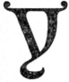

  
[Intangible Textual Heritage](../../index)  [New Thought](../index.md) 
[Index](index)  [Previous](tsoa12)  [Next](tsoa14.md) 

------------------------------------------------------------------------

[Buy this Book at
Amazon.com](https://www.amazon.com/exec/obidos/ASIN/1604590467/internetsacredte.md)

------------------------------------------------------------------------

[Buy this Book on
Kindle](https://www.amazon.com/exec/obidos/ASIN/B0025VL4BQ/internetsacredte.md)

------------------------------------------------------------------------

  
*The Secret of the Ages*, by Robert Collier, \[1926\], at Intangible
Textual Heritage

------------------------------------------------------------------------

p. 191

### VI

### See Yourself Doing It

You say big corporations scheme  
To keep a fellow down;  
They drive him, shame him, starve him, too,  
If he so much as frown.  
God knows I hold no brief for them;  
Still, come with me to-day  
And watch those fat directors meet,  
For this is what they say:  
   "In all our force not one to take  
   The new work that we plan!  
   In all the thousand men we've hired  
   Where shall we find a man?"  
                       —St. Clair
Adams. [\*](#fn_1.md)

|                    |
|--------------------|
|  |

You've often heard it said that a man is
worth $2 a day from the neck down. How much he's worth from the neck up
depends upon how much he is able to SEE.

"Without vision the people perish" did not refer to good eyesight. It
was

p. 192

the eyes of the mind that counted in days of old just as they do today.
Without them you are just so much power "on the hoof," to be driven as a
horse or an ox is driven. And you are worth only a little more than
they.

But given vision—imagination—the ability to visualize conditions and
things a month or a year ahead; given the eyes of the mind—there's no
limit to your value or to your capabilities.

The locomotive, the steamboat, the automobile, the aeroplane—all existed
complete in the imagination of some man before ever they became facts.
The wealthy men, the big men, the successful men, visioned their
successes in their minds’ eyes before ever they won them from the world.

From the beginning of time, nothing has ever taken on material shape
without

p. 193

first being visualized in mind. The only difference between the sculptor
and the mason is in the mental image behind their work. Rodin employed
masons to hew his blocks of marble into the general shape of the figure
he was about to form. *That was mere mechanical labor*. Then Rodin took
it in hand and from that rough hewn piece of stone there sprang the
wondrous figure of "The Thinker." *That was art!*

The difference was all in the imagination behind the hands that wielded
mallet and chisel. After Rodin had formed his masterpiece, ordinary
workmen copied it by the thousands. Rodin's work brought fabulous sums.
The copies brought day wages. Conceiving ideas—*creating something*—is
what pays, in sculpture as in all else. Mere hand-work is worth only
hand wages.

p. 194

“The imagination,” says Glenn Clark in “The Soul's Sincere Desire,” “is
of all qualities in man the most God-like—that which associates him most
closely with God. The first mention we read of man in the Bible is where
he is spoken of as an 'image.' 'Let us make man in our image, after our
likeness.' The only place where an image can be conceived is in the
imagination. Thus man, the highest creation of God, was a creation of
God's imagination.

“The source and center of all man's creative power—the power that above
all others lifts him above the level of brute creation, and that gives
him dominion, is his power of making images, or the power of the
imagination. There are some who have always thought that the imagination
was something which makes-believe that which is not. This is fancy

p. 195

\[paragraph continues\] —not imagination.
Fancy would convert that which is real into pretense and sham;
imagination enables one to see through the appearance of a thing to what
it really *is*.”

There is a very real law of cause and effect which makes the dream of
the dreamer come true. It is the law of visualization—the law that calls
into being in this outer material world everything that is real in the
inner world. Imagination pictures the thing you desire. VISION idealizes
it. It reaches beyond the thing that is, into the conception of what can
be. Imagination gives you the picture. Vision gives you the impulse to
make the picture your own.

Make your mental image clear enough, picture it vividly in every detail,
and the Genie-of-your-Mind will speedily bring it into being as an
everyday reality.

p. 196

That law holds true of everything in life. There is nothing you can
rightfully desire that cannot be brought into being through
visualization.

Suppose there's a position you want the general managership of your
Company. See yourself—just as you are now—sitting in the general
manager's chair. See your name on his door. See yourself handling his
affairs as you would handle them. Get that picture impressed upon your
subconscious mind. See it! *Believe it!* The Genie-of-your-Mind will
find the way to make it come true.

The keynote of successful visualization is this: See things as you would
have them be instead of as they are. Close your eyes and make clear
mental pictures. Make them look and act just as they would in real life.
In short, day dream—but day dream with a purpose. Concentrate

p. 197

on the one idea to the exclusion of all others, and continue to
concentrate on that one idea until it has been accomplished.

Do you want an automobile? A home? A factory? They can all be won in the
same way. They are in their essence all of them ideas of mind, and if
you will but build them up in your own mind first, stone by stone,
complete in every detail, you will find that the Genie-of-your-Mind can
build them up similarly in the material world.

“The building of a trans-continental railroad from a mental picture,”
says C. W. Chamberlain in “The Uncommon Sense of Applied Psychology,”
“gives the average individual an idea that it is a big job. The fact of
the matter is, the achievement, as well as the perfect mental picture,
is made up of millions of little

p. 198

jobs, each fitting in its proper place and helping to make up the whole.

“A skyscraper is built from individual bricks, the laying of each brick
being a single job which must be completed before the next brick can be
laid.”

It is the same with any work, any study. To quote Professor James:

"As we become permanent drunkards by so many separate drinks, so we
become saints in the moral, and authorities and experts in the practical
and scientific spheres, by so many separate acts and hours of working.
Let no youth have any anxiety about the upshot of his education whatever
the line of it may be. If he keep faithfully busy each hour of the
working day he may safely leave the final result to itself. He can with
perfect certainty count on waking some fine morning, to find himself one
of the competent

p. 199

ones of his generation, in whatever pursuit he may have singled
out.…Young people should know this truth in advance. The ignorance of it
has probably engendered more discouragement and faintheartedness in
youths embarking on arduous careers than all other causes taken
together."

Remember that the only limit to your capabilities is the one you place
upon them. There is no law of limitation. The only law is of supply.
Through your subconscious mind you can draw upon universal supply for
anything you wish. The ideas of Universal Mind are as countless as the
sands on the seashore. Use them. And use them lavishly, just as they are
given. There is a little poem by Jessie B. Rittenhouse [\*](#fn_2.md) that so well describes

p. 200

the limitations that most of us put upon ourselves that I quote it here:

"I bargained with Life for a penny,  
 And Life would pay no more,  
 However I begged at evening  
 When I counted my scanty store.

   .      .      .      .      .      .

"For Life is a just employer;  
 He gives you what you ask,  
 But once you have set the wages,  
 Why, you must bear the task.

"I worked for a menial's hire,  
 Only to learn, dismayed,  
 That any wage I had asked of Life,  
 Life would have paid."

Aim high! If you miss the moon, you may hit a star. Everyone admits that
this world and all the vast firmament must have been thought into shape
from the formless void by some Universal Mind. That same Universal Mind
rules today, and it has given to each form of life power

p. 201

to attract to itself whatever it needs for its perfect growth. The tree,
the plant, the animal—each one finds its need.

You are an intelligent, reasoning creature. Your mind is part of
Universal Mind. And you have power to *say* what you require for perfect
growth. Don't be a niggard with yourself. Don't sell yourself for a
penny. Whatever price you set upon yourself, life will give. So aim
high. Demand much! Make a clear, distinct mental image of what it is you
want. Hold it in your thought. Visualize it, see it, *believe it!* The
ways and means of satisfying that desire will follow. For supply always
comes on the heels of demand.

It is by doing this that you take your fate out of the hands of chance.
It is in this way that you control the experiences you are to have in
life. But be sure to

p. 202

visualize *only what you want*. The law works both ways. If you
visualize your worries and your fears, you will make them real. Control
your thought and you will control circumstances. Conditions will be what
you make them.

Most of us are like factories where two-thirds of the machines are idle,
where the workmen move around in a listless, dispirited sort of way,
doing only the tenth part of what they could do if the head of the plant
were watching and directing them. Instead of that, he is off idly
dreaming or waiting for something to turn up. What he needs is someone
to point out to him his listless workmen and idle machines, and show him
how to put each one to working full time and overtime.

And that is what YOU need, too. You are working at only a tenth of
*your* 

p. 203

capacity. You are doing only a tenth of what *you* are capable of. The
time you spend idly wishing or worrying can be used in so directing your
subconscious mind that it will bring you anything of good you may
desire.

Philip of Macedon, Alexander's father, perfected the "phalanx"—a
triangular formation which enabled him to center the whole weight of his
attack on one point in the opposing line. It drove through everything
opposed to it. In that day and age it was invincible. And the idea is
just as invincible today.

Keep the one thought in mind, SEE it being carried out step by step, and
you can knit any group of workers into one homogeneous whole, all
centered on the one idea. You can accomplish any one thing. You can put
across any definite idea. Keep that mental picture ever in

p. 204

mind and you will make it as invincible as was Alexander's phalanx of
old.

"It is not the guns or armament  
 Or the money they can pay,  
 It's the close cooperation  
 That makes them win the day.  
 It is not the individual  
 Or the army as a whole  
 But the everlasting team work  
      of every bloomin’ soul."  
                     —J. Mason Knox.

The error of the ages is the tendency mankind has always shown to limit
the power of Mind, or its willingness to help in time of need.

"Know ye not," said Paul, "that ye are the temples of the Living God?"

No—most of us do not know it. Or at least, if we do, we are like the
Indian family out on the Cherokee reservation. Oil had been found on
their land and money poured in upon them. More money

p. 205

than they had ever known was in the world. Someone persuaded them to
build a great house, to have it beautifully furnished, richly decorated.
The house when finished was one of the show places of that locality. But
the Indians, while very proud of their showy house, continued to *live
in their old sod shack!*

So it is with many of us. We may know that we are "temples of the Living
God." We may even be proud of that fact. But we never take advantage of
it to dwell in that temple, to proclaim our dominion over things and
conditions. We never avail ourselves of the power that is ours.

The great Prophets of old had the forward look. Theirs was the era of
hope and expectation. They looked for the time when the revelation
should come that was to make men "sons of God."

p. 206

\[paragraph continues\] "They shall obtain
joy and gladness, and sorrow and sighing shall flee away."

Jesus came to fulfill that revelation. "Ask and ye shall receive, that
your joy may be full."

The world has turned in vain to matter and materialistic philosophy for
deliverance from its woes. In the future the only march of actual
progress will be in the mental realm, and this progress will not be in
the way of human speculation and theorizing, but in the *actual
demonstration* of the Universal, Infinite Mind.

The world stands today within the vestibule of the vast realm of divine
intelligence, wherein is found the transcendent, practical power of Mind
over all things.

"What eye never saw, nor ear ever heard,  
 What never entered the mind of man—  
 Even all that God has prepared for those who love Him."

------------------------------------------------------------------------

### Footnotes

[191:\*](tsoa13.htm#fr_1.md) From "It Can Be Done."
Copyright 1921, George Sully & Company.

[199:\*](tsoa13.htm#fr_2.md) From "The Door of
Dreams," Houghten, Mifflin & Co., Boston.

------------------------------------------------------------------------

[Next: VII. “As A Man Thinketh”](tsoa14.md)
