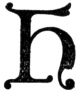

  
[Intangible Textual Heritage](../../index)  [New Thought](../index.md) 
[Index](index)  [Previous](tsoa14)  [Next](tsoa16.md) 

------------------------------------------------------------------------

[Buy this Book at
Amazon.com](https://www.amazon.com/exec/obidos/ASIN/1604590467/internetsacredte.md)

------------------------------------------------------------------------

[Buy this Book on
Kindle](https://www.amazon.com/exec/obidos/ASIN/B0025VL4BQ/internetsacredte.md)

------------------------------------------------------------------------

  
*The Secret of the Ages*, by Robert Collier, \[1926\], at Intangible
Textual Heritage

------------------------------------------------------------------------

p. 225

### VIII

### The Law of Supply

"They do me wrong who say I come no more  
   When once I knock and fail to find you in;  
 For every day I stand outside your door,  
   And bid you wake, and rise to fight and win.

"Wail not for precious chances passed away,  
   Weep not for golden ages on the wane!  
 Each night I burn the records of the day—  
   At sunrise every soul is born again!"  
                          —WALTER MALONE. [\*](#fn_3.md)

|                    |
|--------------------|
|  |

Have you ever run a race, or worked at
utmost capacity for a protracted period, or swum a great distance?
Remember how, soon after starting, you began to feel tired? Remember
how, before you had gone any great distance, you thought you had reached
your limit? But remember, too,

p. 226

how, when you kept on going, you got your second wind, your tiredness
vanished, your muscles throbbed with energy, you felt literally charged
with speed and endurance?

Stored in every human being are great reserves of energy of which the
average individual knows nothing. Most people are like a man who drives
a car in low gear, not knowing that by the simple shift of a lever he
can set it in high and not merely speed up the car, but do it with far
less expenditure of power.

The law of the universe is the law of supply. You see it on every hand.
Nature is lavish in everything she does.

Look at the heavens at night. There are millions of stars there—millions
of worlds—millions of suns among them. Surely there is no lack of wealth
or profusion in the Mind that could image all

p. 227

of these; no place for limitation there! Look at the vegetation in the
country round about you. Nature supplies all that the shrubs or trees
may need for their growth and sustenance! Look at the lower forms of
animal life—the birds and the wild animals, the reptiles and the
insects, the fish in the sea. Nature supplies them bountifully with
everything they need. They have but to help themselves to what she holds
out to them with such lavish hand. Look at all the natural resources of
the world—coal and iron and oil and all metals. There is plenty for
everyone. We hear a lot about the exhaustion of our resources of coal
and oil, but there is available coal enough to last mankind for
thousands of years. There are vast oil fields practically untouched,
probably others bigger still yet w be discovered, and when all these are

p. 228

exhausted, the extraction of oil from shales will keep the world
supplied for countless more years.

There is abundance for everyone. But just as you must strain and labor
to reach the resources of your "second wind," just so you must strive
before you can make manifest the law of supply in nature.

*The World Belongs to You*

It is your estate. It owes you not merely a living, but everything of
good you may desire. You've got to *demand* these things of it, though.
You've got to fear naught, dread naught, stop at naught. You've got to
have the faith of a Columbus, crossing an unknown sea, holding a
mutinous crew to the task long after they had ceased to believe in
themselves or in him—*and giving to the world a new hemisphere*. You've
got

p. 229

to have the faith of a Washington—defeated, discredited, almost wholly
deserted by his followers, yet holding steadfast in spite of all—*and
giving to America a new liberty*. You've got to *dominate*—not to
cringe. *You've* got to make the application of the law of supply.

"Consider the lilies how they grow." The flowers, the birds, all of
creation, are incessantly active. The trees and flowers in their growth,
the birds and wild creatures in building their nests and finding
sustenance, are always working—*but never worrying*. "Your Father
knoweth that ye have need of these things." "And all these things shall
be added unto you."

If all would agree to give up worrying—to be industrious, but never
anxious about the outcome—it would mean the beginning of a new era in
human progress, an age of liberty, of freedom from

p. 230

bondage. Jesus set forth the universal law of supply when he
said—"Therefore I say unto you, be not anxious for the morrow, what ye
shall eat, or wherewithal ye shall be clothed—but seek first the kingdom
of God, *and all those things shall be added unto you*."

What is this "Kingdom of God?"

Jesus tells us—"The Kingdom of God is within you." It is the "Father
within you" to which He so frequently referred. It is Mind—your part of
Universal Mind. "Seek first the Kingdom of God." Seek first an
understanding of this Power within you—learn to contact with it—to use
it—"and all those things shall be added unto you."

All riches have their origin in Mind. Wealth is in ideas—not money.
Money is merely the material medium of ex-change for ideas. The paper
money in

p. 231

your pockets is in itself worth no more than so many Russian rubles. It
is the idea behind it that gives it value. Factory buildings, machinery,
materials, are in themselves worthless without a manufacturing or a
selling idea behind them. How often you see a factory fall to pieces,
the machinery rust away, after the idea behind them gave out. Factories,
machines, are simply the tools of trade. It is the idea behind them that
makes them go.

So don't go out a-seeking of wealth. Look within you for ideas! "The
Kingdom of God is within you." Use it—*purposefully!* Use it to THINK
constructively. Don't say you are *thinking* when all you are doing is
exercising your faculty of memory. As Dumont says in "The Master
Mind"—"They are simply allowing the stream of memory to flow

p. 232

through their field of consciousness, while the Ego stands on the banks
and idly watches the passing waters of memory flow by. They call this
'thinking', while in reality there is no process of Thought under way."

They are like the old mountaineer sitting in the shade alongside his
cabin. Asked what he did to pass the long hours away, he said—"Waal,
sometimes I set and think; and sometimes I just set."

Dumont goes on to say, in quoting another writer: "When I use the word
'thinking,' I mean *thinking with a purpose, with an end in view,
thinking to solve a problem*. I mean the kind of thinking that is forced
on us when we are deciding on a course to pursue, on a life work to take
up perhaps; the kind of thinking that was forced upon us in our younger
days when we had to find a solution

p. 233

to a problem in mathematics; or when we tackled psychology in college. I
do not mean 'thinking' in snatches, or holding petty opinions on this
subject and on that. I mean thought on significant questions which lie
outside the bounds of your narrow personal welfare. This is the kind of
thinking which is now so rare—so sadly needed!"

The Kingdom of God is the Kingdom of Thought, of Achievement, of Health,
of Happiness and Prosperity. "I came that ye might have life and have it
more abundantly."

But you have got to *seek* it. You have got to do more than ponder. You
have got to *think*—to think constructively—to seek how you may discover
new worlds, new methods, new needs. The greatest discoveries, you know,
have arisen out of things which everybody had *seen*, but

p. 234

only one man had NOTICED. The biggest fortunes have been made out of the
opportunities which many men *had*, but only one man GRASPED.

Why is it that so many millions of men and women go through life in
poverty and misery, in sickness and despair? Why? Primarily because they
make a reality of poverty through their fear of it. They visualize
poverty, misery and disease, and thus bring them into being. And
secondly, they cannot demonstrate the law of supply for the same reason
that so many millions cannot solve the first problem in algebra. The
solution is simple—but they have never been shown the method. They do
not understand the law.

The essence of this law is that you must *think* abundance, *see*
abundance, *feel* abundance, *believe* abundance. Let no

p. 235

thought of limitation enter your mind. There is no lawful desire of
yours for which, as far as mind is concerned, there is not abundant
satisfaction. And if you can visualize it in mind, you can realize it in
your daily world.

"Blessed is the man whose delight is in the *law* of the Lord: And he
shall be like a tree planted by the rivers of water, that bringeth forth
his fruit in his season: his leaf also shall not wither; and whatsoever
he doeth shall prosper."

Don't worry. Don't doubt. Don't dig up the seeds of prosperity and
success to see whether they have sprouted. Have faith! Nourish your
seeds with renewed desire. Keep before your mind's eye the picture of
the thing you want. BELIEVE IN IT! No matter if you seem to be in the
clutch of misfortune, no matter if the future looks black and dreary—

p. 236

\[paragraph continues\] FORGET YOUR FEARS!
Realize that the future is of your own making. There is no power that
can keep you down but yourself. Set your goal. Forget the obstacles
between. Forget the difficulties in the way. Keep only the goal before
your mind's eye—*and you'll win it!*

Judge Troward, in his Edinburgh Lectures on Mental Science, shows the
way:

"The initial step, then, consists in determining to picture the
Universal Mind as the ideal of all we could wish it to be, both to
ourselves and to others, together with the endeavor to reproduce this
ideal, however imperfectly, in our own life; and this step having been
taken, we can then cheerfully look upon it as our ever-present Friend,
providing all good, guarding from all danger, and guiding us with all
counsel. Similarly if we think of it as a

p. 237

great power devoted to supplying all our needs, we shall impress this
character also upon it, and by the law of subjective mind, it will
proceed to enact the part of that special providence which we have
credited it with being; and if, beyond general care of our concerns, we
would draw to ourselves some particular benefit, the same rule holds
good of impressing our desire upon the universal subjective mind. And
thus the deepest problems of philosophy bring us back to the old
statement of the law: 'Ask and ye shall receive; seek and ye shall find;
knock and it shall be opened unto you.' This is the summing-up of the
natural law of the relation between us and the Divine Mind. It is thus
no vain boast that mental science can enable us to makes our lives what
we will. And to this law there is no limit. What it can do for us today

p. 238

it can do tomorrow, and through all that procession of tomorrows that
loses itself in the dim vistas of eternity. *Belief in limitation is the
one and only thing that causes limitation*, because we thus impress
limitation upon the creative principle; and in proportion as we lay that
belief aside, our boundaries will expand, and increasing life and more
abundant blessing will be ours."

You are not working for some firm merely for the pittance they pay you.
You are part of the great scheme of things. And what you do has its
bearing on the ultimate result. That being the case, you are working for
Universal Mind, and Universal Mind is the most generous paymaster there
is. Just remember that you can look to it for all good things. Supply is
*where* you are and what you need.

p. 239

Do you want a situation? Close your eyes and realize that somewhere is
the position for which you of all people are best fitted, and which is
best fitted to your ability. The position where you can do the utmost of
good, and where life, in turn, offers the most to you. Realize that
Universal Mind knows exactly where this position is, and that through
your subconscious mind you, too, can know it. Realize that this is YOUR
position, that it NEEDS you, that it belongs to you, that it is right
for you to have it, that you are entitled to it. Hold this thought in
mind every night for just a moment, then go to sleep knowing that your
subconscious mind HAS the necessary information as to where this
position is and how to get in touch with it. Mind you—not WILL have, but
HAS. The earnest realization of this will bring that

p. 240

position to you, and you to it, as surely as the morrow will bring the
sun. Make the law of supply operative and you find that the things you
seek are seeking you.

Get firmly fixed in your own mind the definite conviction that you can
do anything you greatly want to do. There is no such thing as lack of
opportunity. There is no such thing as only one opportunity. You are
subject w a law of boundless and perpetual opportunity, and you can
enforce that law in your behalf just as widely as you need. Opportunity
is infinite and ever present.

Berton Braley has it well expressed in his poem on "Opportunity" [\*](#fn_4.md):

"For the best verse hasn't been rhymed yet,  
   The best house hasn't been planned,  
 The highest peak hasn't been climbed yet,  
   The mightiest rivers aren't spanned;

p. 241

 Don't worry and fret, faint hearted,  
   The chances have just begun,  
 For the Best jobs haven't been started,  
   The Best work hasn't been done."

Nothing stands in the way of a will which wants—an intelligence which
knows. The great thing is to start. "Begin your work," says Ausonius.
"To begin is to complete the first half. The second half remains. Begin
again and the work is done." It matters not how small or unimportant
your task may seem to be. It may loom bigger in Universal Mind than that
of your neighbor, whose position is so much greater in the eyes of the
world. Do it well—and Universal Mind will work with you.

But don't feel limited to any one job or any one line of work. Man was
given dominion over all the earth. "And God said, Let us make man in our
image, after

p. 242

our likeness: and let them have dominion over the fish of the sea, and
over the fowl of the air, and over the cattle, and over all the earth,
and over every creeping thing that creepeth upon the earth."

All of energy, all of power, all that can exercise any influence over
your life, is in your hands through the power of thought. God—good—is
the only power there is. Your mind is part of His mind. He is "the
Father that is within you that doeth the works."

So don't put any limit upon His power by trying to limit your
capabilities. You are not in bondage to anything. All your hopes and
dreams can come true. Were you not given dominion over all the earth?
And can anyone else take this dominion from you?

All the mysterious psychic powers

p. 243

about which you hear so much today are perfectly natural. I have them.
You have them. They only await the time when they shall be allowed to
assert their vigor and prove themselves your faithful servitors.

"Be not afraid!" Claim your inheritance. The Universal Mind that
supplies all wisdom and power is your mind. And to the extent that you
are governed by your understanding of its infinite law of supply you
will be able to demonstrate plenty. "According to your faith, be it unto
you."

"Analyze most of the great American fortunes of the past generation,"
says *Advertising and Selling Fortnightly*, "and you will find that they
were founded on great faiths. One man's faith was in oil, another's in
land, another's in minerals.

p. 244

"The fortunes that are being built today are just as surely being built
on great faiths, but there is this difference: the emphasis of the faith
has been shifted. Today it takes faith in a product or an opportunity,
as it always did, but it takes faith in the public, in addition. Those
who have the greatest faith in the public—the kind of faith possessed by
Henry Ford and H. J. Heinz—*and make that faith articulate*—build the
biggest fortunes."

*“Wanted”*

There is one question that bothers many a man. Should he stick to the
job he has, or cast about at once for a better one. The answer depends
entirely upon what you are striving for. The first thing is to set your
goal. What is it you want? A profession? A political appointment?

p. 245

An important executive position? A business of your own?

Every position should yield you three things:

1\. Reasonable pay for the present.

2\. Knowledge, training, or experience that will be worth money to you
in the future.

3\. Prestige or acquaintances that will be of assistance to you in
attaining your goal.

Judge every opening by those three standards. But don't overlook chances
for valuable training, merely because the pay is small. Though it is a
pretty safe rule that the concern with up-to-the-minute methods that it
would profit you to learn, also pays up-to-the-minute salaries.

Hold each job long enough to get from

p. 246

it every speck of information there is in it. Hold it long enough to
learn the job ahead. Then if there seems no likelihood of a vacancy soon
in that job ahead, find one that corresponds to it somewhere else.

*Progress!* Keep going ahead! Don't be satisfied merely because your
salary is being boosted occasionally. Learn something every day. When
you reach the point in your work that you are no longer adding to your
store of knowledge or abilities, you are going backward, and it's time
for you to move. Move upward in the organization you are with if you
can—but MOVE!

Your actual salary is of slight importance compared with the knowledge
and ability you add to your mind. Given a full storehouse there, the
salary or the riches will speedily follow. But the biggest

p. 247

salary won't do you much good for long unless you've got the knowledge
inside you to back it up.

It's like a girl picking her husband. She can pick one with a lot of
money and no brains, or she can pick one with no money but a lot of
ability. In the former case, she'll have a high time for a little while,
ending in a divorce court or in her having a worthless young "rounder"
on her hands and no money to pay the bills. In the other, the start will
be hard, but she is likely to end up with a happy home she has helped to
build, an earnest, hardworking husband who has "arrived"—*and
happiness*.

Money ought to be a consideration in marriage—but never *the*
consideration. Of course it's an easy matter to pick a man h with
neither money nor brains. But when it's a choice of money *or*
brains—take the

p. 248

brains every time. Possessions are of slight importance compared to
mind. Given the inquiring, alert type of mindyou can get any amount of
possessions. But the possessions without the mind are nothing. Nine
times out of ten the best thing that can happen to any young couple is
to have to start out with little or nothing and work out their salvation
together.

What is it *you* want most from life? Is it riches?

Picture yourself with all the riches you could use, with all the
abundance that Nature holds out with such lavish hand everywhere. What
would you do with it?

Day-dream for a while. Believe that you *have* that abundance *now*.
Practice being rich in your own mind. See yourself driving that
expensive car you have

p. 249

always longed for, living in the sort of house you have often pictured,
well-dressed, surrounded by everything to make life worth while. Picture
yourself spending this money that is yours, lavishly, without a worry as
to where more is coming from, knowing that there is no limit to the
riches of Mind. Picture yourself doing all those things you would like
to do, living the life you would like to live, providing for your loved
ones as you would like to see them provided for. *See* all this in your
mind's eye. *Believe* it to be true for the moment. *Know* that it will
all be true in the not-very-distant future. Get from it all the pleasure
and enjoyment you can.

It is the *first step* in making your dreams come true. You are creating
the model in mind. And if you don't allow fear or worry to tear it down,
Mind will

p. 250

re-create that model for you in your every-day life.

"All that the Father hath is yours," said Jesus. And a single glance at
the heavens and the earth will show you that He has all riches in
abundance. Reach out mentally and appropriate to yourself some of these
good gifts. You've got to do it mentally before you can enjoy it
physically. "’Tis mind that makes the body rich," as Shakespeare tells
us.

See the things that you want as *already yours*. Know that they will
come to you at need. Then LET them come. Don't fret and worry about
them. Don't think about your LACK of them. Think of them as YOURS, as
*belonging* to you, as already in your possession.

Look upon money as water that runs the mill of your mind. You are
constantly grinding out ideas that the world needs.

p. 251

\[paragraph continues\] Your thoughts,
your plans, are necessary to the great scheme of things. Money provides
the power. But *it* needs YOU, it needs your ideas, before it can be of
any use to the world. The Falls of Niagara would be of no use without
the power plants that line the banks. The Falls need these plants to
turn their power to account. In the same way, money needs your ideas to
become of use to the world.

So instead of thinking that you need money, realize that money needs
YOU. Money is just so much wasted energy without work to do. Your ideas
provide the outlet for it, the means by which money can do things.
Develop your ideas, secure in the knowledge that money is always looking
for such an outlet. When the ideas are perfected, money will gravitate
your way without conscious effort on

p. 252

your part, if only you don't dam up the channels with doubts and fears.

"First have something good—then advertise!" said Horace Greeley. First
have something that the world needs, even if it be only faithful,
interested service—then open up your channels of desire, and dollars
will flow to you.

And remember that the more you have to offer—the more of riches will
flow to you. Dollars are of no value except as they are used.

You have seen the rich attacked time and again in newspapers and
magazines. You have read numberless articles and editorials against
them. You have heard agitators declaim against them by the hour. But
have you ever heard one of them say a single word against the richest
man of them all—Henry Ford? I haven't. And why? Because Henry

p. 253

\[paragraph continues\] Ford's idea of
money is that it is something to be *used*—something to provide more
jobs, something to bring more comfort, more enjoyment, into an
increasingly greater number of lives.

That is why money flows to him so freely. That is why he gets so much
out of life. And that is how you, too, can get in touch with Infinite
Supply. Realize that it is not money you have to seek, but a way to use
money for the world's advantage. *Find the need!* Look at everything
with the question—How could that be improved? To what new uses could
this be put? Then set about supplying that need, in the absolute
confidence that when you have found the way, money will flow freely to
and through you. Do your part—and you can confidently look to Universal
Mind to provide the means.

p. 254

Get firmly in mind the definite conviction that YOU CAN DO ANYTHING
RIGHT THAT YOU MAY WISH TO DO. Then set your goal and let everything you
do, all your work, all your study, all your associations, be a step
towards that goal. To quote Berton Braley [\*](#fn_5.md) again—

"If you want a thing bad enough  
 To go out and fight for it,  
 Work day and night for it,  
 Give up your time and your peace and your sleep for it,  
 If only desire of it  
 Makes you quite mad enough  
 Never to tire of it,  
 Makes you hold all other things tawdry and cheap for it,  
 If life seems all empty and useless without it  
 And all that you scheme and you dream is about it,  
 If gladly you'll sweat for it,  
 Fret for it,

p. 255

 Plan for it,  
 Lose all your terror of God or man for it,  
 If you'll simply go after that thing that you want,  
 With all your capacity,  
 Strength and sagacity,  
 Faith, hope and confidence, stern pertinacity,  
 If neither cold poverty, famished and gaunt,  
 Nor sickness nor pain  
 Of body or brain  
 Can turn you away from the thing that you want,  
 If dogged and grim you besiege and beset it,  
                   *You'll get it!*"

------------------------------------------------------------------------

### Footnotes

[225:\*](tsoa15.htm#fr_3.md) Courtesy of Mrs. Ella
Malone Watson.

[240:\*](tsoa15.htm#fr_4.md) From "A Banjo at
Armageddon." Copyright 1917, George H. Doran Company.

[254:\*](tsoa15.htm#fr_5.md) From "Things As They
Are." Copyright 1916, George H. Doran Company, New York.

------------------------------------------------------------------------

[Next: Title Page](tsoa16.md)
