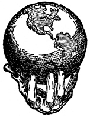

  
[Intangible Textual Heritage](../../index)  [New Thought](../index) 
[Index](index)  [Previous](tsoa22)  [Next](tsoa24) 

------------------------------------------------------------------------

[Buy this Book at
Amazon.com](https://www.amazon.com/exec/obidos/ASIN/1604590467/internetsacredte)

------------------------------------------------------------------------

[Buy this Book on
Kindle](https://www.amazon.com/exec/obidos/ASIN/B0025VL4BQ/internetsacredte)

------------------------------------------------------------------------

  
*The Secret of the Ages*, by Robert Collier, \[1926\], at Intangible
Textual Heritage

------------------------------------------------------------------------

------------------------------------------------------------------------

The Secret of the Ages  
*In Seven Volumes*  
VOLUME FIVE

------------------------------------------------------------------------

# The

# SECRET

# of

# THE AGES

 

## ROBERT COLLIER

### VOLUME FIVE

#### ROBERT COLLIER, Publisher 599 Fifth Avenue New York

##### No connection with P. F. Collier & Son Co., Inc.

#### \[1926\]

  [  
Click to enlarge](img/t5.jpg)  
Title Page: Volume 5  

  [  
Click to enlarge](img/v5.jpg)  
Verso: Volume 5  

Scanned, proofed and formatted by John Bruno Hare at Intangible Textual
Heritage, August 2008. This text is in the public domain in the US
because its copyright was not renewed in a timely fashion.

------------------------------------------------------------------------

[Next: Contents](tsoa24)
